# 04.Nginx代理服务

# 04.Nginx代理服务

# 1.Nginx代理服务概述

1.1Nginx代理配置语法

1.2Nginx正向代理示例

1.3Nginx反向代理示例

# 2.Nginx负载均衡

2.1Nginx负载均衡配置场景

2.2Nginx负载均衡状态配置

2.3Nginx负载均衡调度策略

2.4Nginx负载均衡TCP配置

# 3.Nginx动静分离

3.1Nginx动静分离应⽤案例

3.2Nginx⼿机电脑应⽤案例

徐亮伟, 江湖⼈称标杆徐。多年互联⽹运维⼯作经验，曾负责过⼤规模集群架构⾃动化运维管理⼯作。擅⻓Web集群架构与⾃动化运维，曾负责国内某⼤型电商运维⼯作。

个⼈博客"徐亮伟架构师之路"累计受益数万⼈。

笔者Q:552408925、572891887

架构师群:471443208

# 1.Nginx代理服务概述

代理我们往往并不陌⽣, 该服务我们常常⽤到如(代理租房、代理收货等等)

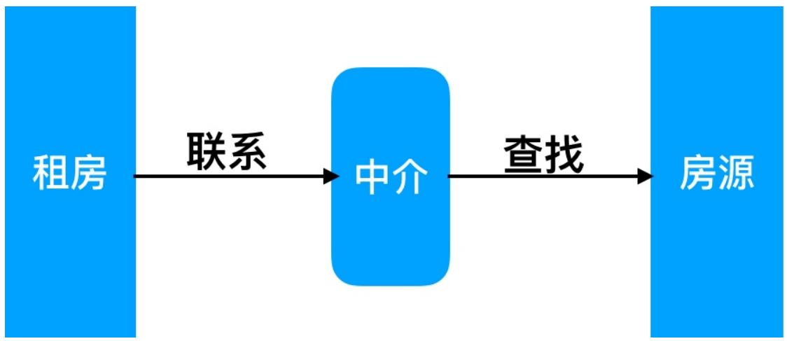


那么在互联⽹请求⾥⾯, 客户端⽆法直接向服务端发起请求, 那么就需要⽤到代理服务, 来实现客


户端和服务通信


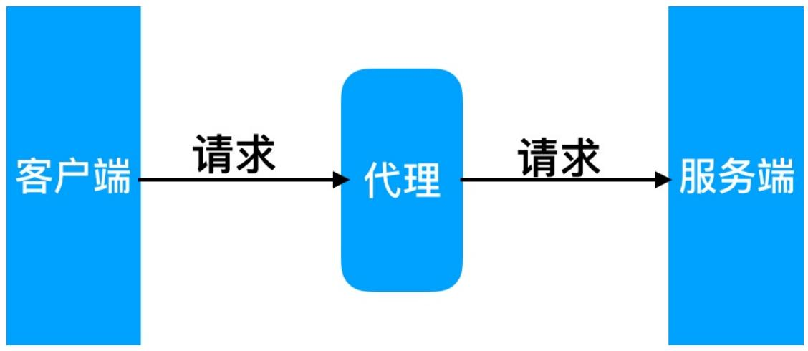


Nginx 作为代理服务可以实现很多的协议代理, 我们主要以 http 代理为主


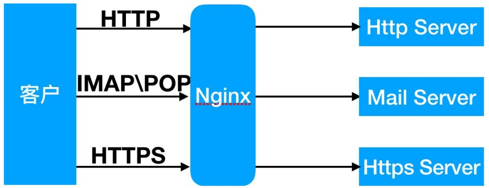


正向代理(内部上⽹) 客户端<-->代理->服务端


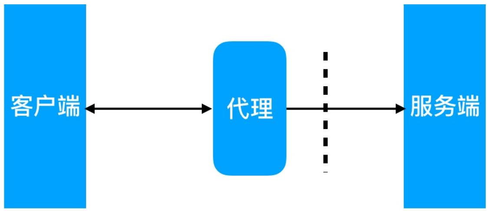


反向代理 客户端->代理<-->服务端


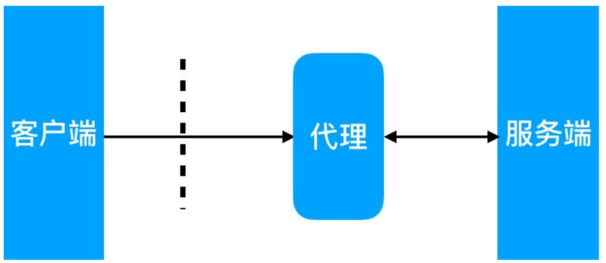


# 代理区别

区别在于代理的对象不⼀样正向代理代理的对象是客户端反向代理代理的对象是服务端

# 1.1Nginx代理配置语法

# 1. Nginx 代理配置语法

```yaml
Syntax: proxy_pass URL;
Default: -
Context: location, if in location, limit_except
http://localhost:8000/uri/
http://192.168.56.11:8000/uri/
http://unix:/tmp/backend.socket:/uri/ 
```

# 2.类似于 nopush 缓冲区

```txt
// 尽可能收集所有头请求,
Syntax: proxy_buffering on | off;
Default:
proxy_buffering on;
Context: http, server, location
```

```txt
//扩展:
proxy_buffer_size
proxy_buffers
proxy_busy_buffer_size
```

# 3.跳转重定向

```txt
Syntax: proxy_redirect default;
proxy_redirect off; proxy_redirect redirect replacement;
Default: proxy_redirect default;
Context: http, server, location 
```


4.头信息


```txt
Syntax: proxy_set_header field value;
Default: proxy_set_header Host $proxy_host;
proxy_set_header Connection close;
Context: http, server, location 
```

```txt
//扩展:
proxy_hide_header
proxy_set_body
```


5.代理到后端的 TCP 连接超时


```txt
Syntax: proxy_connect_timeout time;
Default: proxy_connect_timeout 60s;
Context: http, server, location 
```

```txt
//扩展
proxy_read_timeout //以及建立
proxy_send_timeout //服务端请求完，发送给客户端时间
```


6. Proxy 常⻅配置项具体配置如下:


```tcl
[root@Nginx ~]# vim /etc/nginx/proxy_params
proxy_redirect default;
proxy_set_header Host $http_host;
proxy_set_header X-Real-IP $remote_addr;
proxy_set_header X-Forwarded-For $proxy_add_x_forwarded_for;

proxy_connect_timeout 30;
proxy_send_timeout 60;
proxy_read_timeout 60;

proxy_buffer_size 32k;
proxy_buffering on;
proxy_buffers 4 128k;
proxy_busy_buffers_size 256k;
proxy_max_temp_file_size 256k; 
```

```txt
//具体location实现
location / {
    proxy_pass http://127.0.0.1:8080;
    include proxy_params;
}
```

# 1.2Nginx正向代理示例

Nginx 正向代理配置实例

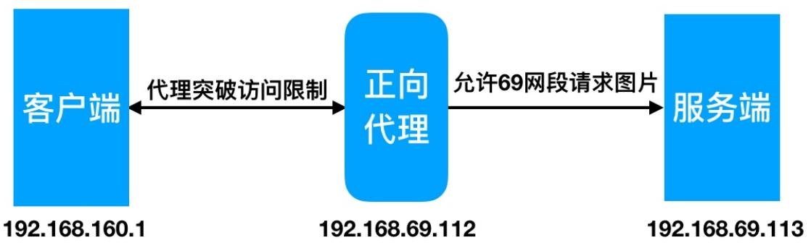


//配置69.113访问限制,仅允许同⽹段访问

```txt
location ~ .*\. (jpg|gif|png) $ {
    allow 192.168.69.0/24;
    deny all;
    root /soft/code/images; 
```

//配置正向代理

```scss
[root@Nginx ~]# cat /etc/nginx/conf.d/zy_proxy.conf
server {
    listen 80;

    resolver 233.5.5.5;
    location / {
    proxy_pass http://$http_host$request_uri;
    proxy_set_header Host $http_host;
    proxy_set_header X-Real-IP $remote_addr;
    proxy_set_header X-Forwarded-For $proxy_add_x_forwarded_for;
    }
} 
```

//客户端使⽤SwitchySharp浏览器插件配置正向代理

没有连接正向代理访问

# 403 Forbidden

nginx/1.12.2 


配置正向代理连接


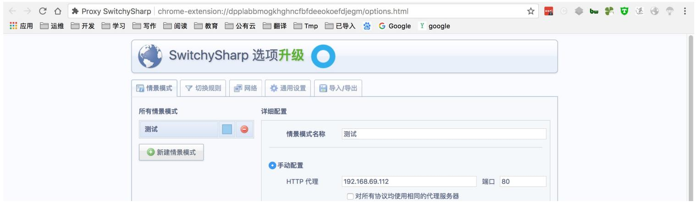


启⽤正向代理后可以突破访问限制


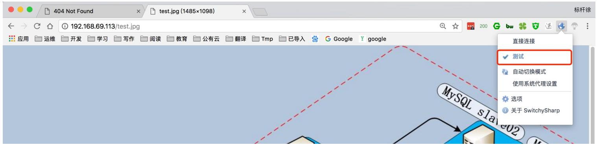


# 1.3Nginx反向代理示例


Nginx 反向代理配置实例


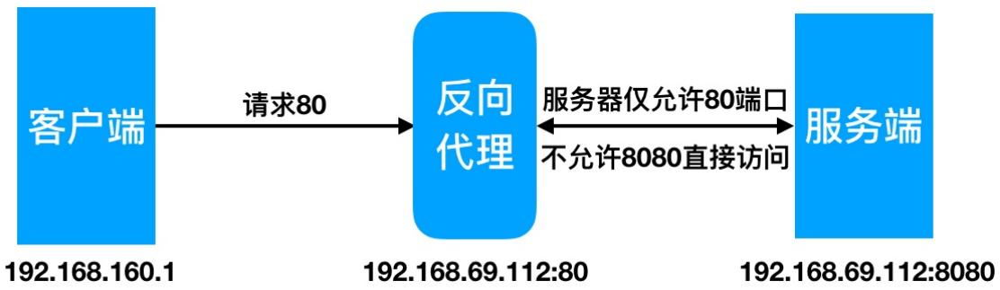


```txt
/proxy代理
[root@proxy ~]# cat /etc/nginx/conf.d/proxy.conf
server {
    listen 80;
```

server_name nginx.bjstack.com;
index index.html;

location / {
proxy_pass http://192.168.56.100;
include proxy_params;
}
}

//WEB站点
[root@Nginx ~]# cat /etc/nginx/conf.d/images.conf
server {
listen 80;
server_name nginx.bjstack.com;
root /soft/code;

location / {
root /soft/code;
index index.html;
}

location ~.* $(png|jpg|gif)$ {
gzip on;
root /soft/code/images;
}
}

# 2.Nginx负载均衡

提升吞吐率, 提升请求性能, 提⾼容灾

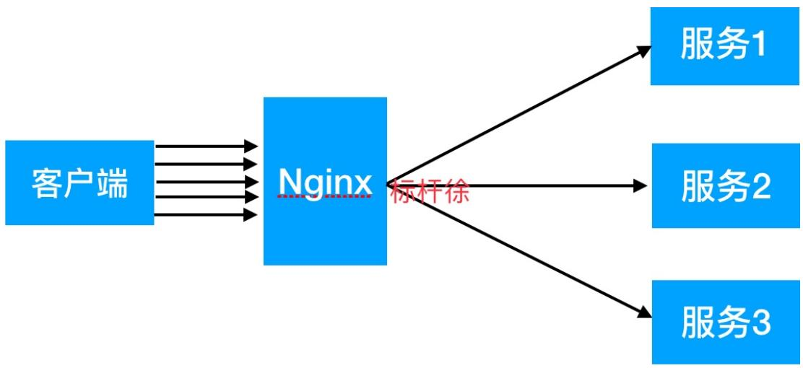


负载均衡按范围划分:GSLB全局负载均衡、SLB


GSLB


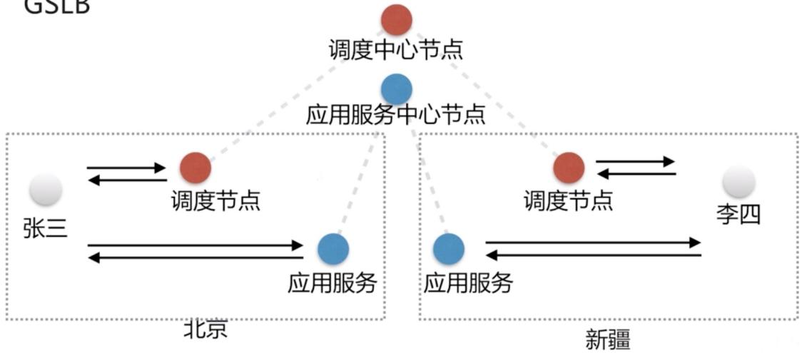


Nginx 是⼀个典型的 SLB


负载均衡按层级划分: 分为四层负载均衡和七层负载均衡


Nginx 是⼀个典型的七层 SLB


# 2.1Nginx负载均衡配置场景

Nginx 实现负载均衡⽤到了 proxy_pass 代理模块核⼼配置, 将客户端请求代理转发⾄⼀组 upstream 虚拟服务池

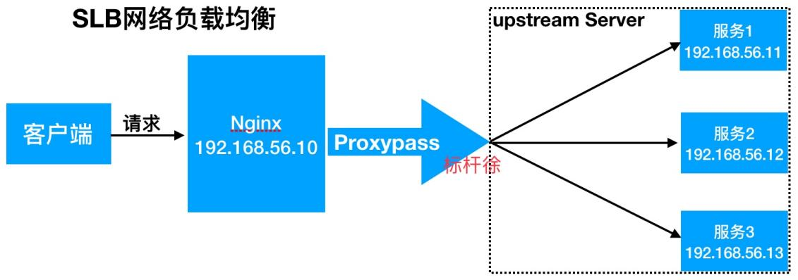


Nginx	upstream 虚拟配置语法

```txt
Syntax: upstream name { ... }
Default: -
Context: http
//upstream例子
upstream backend {
    server backend1.example.com weight=5;
    server backend2.example.com:8080;
    server unix:/tmp/backend3;
    server backup1.example.com:8080 backup;
}
server {
    location / {
    proxy_pass http://backend;
    }
}
```


1.创建对应 html ⽂件


```txt
[root@Nginx ~]# mkdir /soft/{code1,code2,code3} -p
[root@Nginx ~]# cat /soft/code1/index.html
<html>
    <title> Code1</title>
    <body bgcolor="red">
    <h1> Code1-8081 </h1>
    </body>
</html>

[root@Nginx ~]# cat /soft/code2/index.html
<html>
    <title> Coder2</title>
    <body bgcolor="blue">
    <h1> Code1-8082</h1>
    </body>
</html>

[root@Nginx ~]# cat /soft/code3/index.html
<html>
    <title> Coder3</title>
    <body bgcolor="green">
    <h1> Code1-8083</h1>
    </body>
</html> 
```


2.建⽴对应的 releserver.conf 配置⽂件


```txt
[root@Nginx ~]# cat /etc/nginx/conf.d/releserver.conf
server {
    listen 8081;
    root /soft/code1;
    index index.html;
}
server {
    listen 8082;
    root /soft/code2;
    index index.html;
}
server {
    listen 8083;
    root /soft/code3;
    index index.html; 
```

```txt
} 
```


3.配置 Nginx 反向代理


```txt
[root@Nginx ~]# cat /etc/nginx/conf.d/proxy.conf
upstream node {
    server 192.168.69.113:8081;
    server 192.168.69.113:8082;
    server 192.168.69.113:8083;
}
server {
    server_name 192.168.69.113;
    listen 80;
    location / {
    proxy_pass http://node;
    include proxy_params;
    }
} 
```


4.使⽤浏览器验证


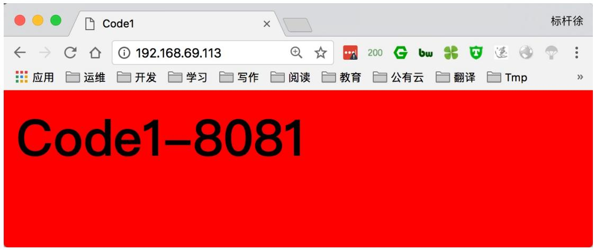


# 2.2Nginx负载均衡状态配置

后端服务器在负载均衡调度中的状态

<table><tr><td>状态</td><td>概述</td></tr><tr><td>down</td><td>当前的server暂时不参与负载均衡</td></tr><tr><td>backup</td><td>预留的备份服务器</td></tr><tr><td>max_fails</td><td>允许请求失败的次数</td></tr><tr><td>fail_timeout</td><td>经过max_fails失败后,服务暂停时间</td></tr><tr><td>max_conns</td><td>限制最大的接收连接数</td></tr></table>

测试 backup 以及 down 状态

```txt
upstream load_pass {
    server 192.168.56.11:8001 down;
    server 192.168.56.12:8002 backup;
    server 192.168.56.13:8003 max_fails=1 fail_timeout=10s;
}

location / {
    proxy_pass http://load_pass;
    include proxy_params;
}

//关闭8003测试
```

# 2.3Nginx负载均衡调度策略

<table><tr><td>调度算法</td><td>概述</td></tr><tr><td>轮询</td><td>按时间顺序逐一分配到不同的后端服务器(默认)</td></tr><tr><td>weight</td><td>加权轮询,weight值越大,分配到的访问几率越高</td></tr><tr><td>ip_hash</td><td>每个请求按访问IP的hash结果分配,这样来自同一IP的固定访问一个后端服务器</td></tr><tr><td>url_hash</td><td>按照访问URL的hash结果来分配请求,是每个URL定向到同一个后端服务器</td></tr><tr><td>least_conn</td><td>最少链接数,那个机器链接数少就分发</td></tr><tr><td>hash关键数值</td><td>hash自定义的key</td></tr></table>


Nginx负载均衡权重轮询具体配置


```css
upstream load_pass {
    server 192.168.56.11:8001;
    server 192.168.56.12:8002 weight=5;
    server 192.168.56.13:8003;
} 
```


Nginx负载均衡 ip_hash 具体配置


```txt
//如果客户端都走相同代理，会导致某一台服务器连接过多
upstream load_pass {
    ip_hash;
    server 192.168.56.11:8001;
    server 192.168.56.12:8002;
    server 192.168.56.13:8003;
}
//如果出现通过代理访问会影响后端节点接收状态均衡
```


Nginx负载均衡url_hash具体配置


```txt
upstream load_pass {
    hash $request_uri;
    server 192.168.56.11:8001;
    server 192.168.56.12:8002;
    server 192.168.56.13:8003;
} 
```

```html
/soft/code1/url1.html url2.html url3.html
/soft/code2/url1.html url2.html url3.html
/soft/code3/url1.html url2.html url3.html 
```

# 2.4Nginx负载均衡TCP配置


Nginx 四层代理仅能存在于 main 段


```txt
stream {
    upstream ssh_proxy {
    hash $remote_addr consistent;
    server 192.168.56.103:22;
    }
    upstream mysql_proxy {
    hash $remote_addr consistent;
    server 192.168.56.103:3306;
    }
    server {
    listen 6666;
    proxy_connect_timeout 1s;
    proxy_timeout 300s;
    proxy_pass ssh_proxy;
    }
    server {
    listen 5555;
    proxy_connect_timeout 1s;
    proxy_timeout 300s;
    proxy_pass mysql_proxy;
    }
} 
```

# 3.Nginx动静分离

动静分离,通过中间件将动态请求和静态请求进⾏分离, 分离资源, 减少不必要的请求消耗, 减少请求延时。

好处: 动静分离后, 即使动态服务不可⽤, 但静态资源不会受到影响

通过中间件将动态请求和静态请求分离


3.1Nginx动静分离应⽤案例


0.环境准备


<table><tr><td>系统</td><td>服务</td><td>地址</td></tr><tr><td>CentOS7.4</td><td>proxy</td><td>192.168.69.112</td></tr><tr><td>CentOS7.4</td><td>Nginx</td><td>192.168.69.113</td></tr><tr><td>CentOS7.4</td><td>TOmcat</td><td>192.168.69.113</td></tr></table>


1.在 192.168.69.113 静态资源


```txt
server{
    listen 80;
    root /soft/code;
    index index.html;

    location ~.*\. (png|jpg|gif)$ {
    gzip on;
    root /soft/code/images;
    }
} 
```

```txt
[root@Nginx ~]# wget -0 /soft/code/images/nginx.png http://nginx.org/nginx.png 
```


2.在 192.168.69.113 准备动态资源


```erb
[root@Nginx ~]# wget -0 /soft/package/tomcat9.tar.gz \
http://mirror.bit.edu.cn/apache/tomcat/tomcat-9/v9.0.7/bin/apache-tomcat-9.0.7.tar.gz
[root@Nginx ~]# mkdir /soft/app
[root@Nginx ~]# tar xf /soft/package/tomcat9.tar.gz -C /soft/app/
[root@Nginx ~]# vim /soft/app/apache-tomcat-9.0.7/webapps/ROOT/java_test.jsp
<%@ page language="java" import="java.util.*" pageEncoding="utf-8"%>
<HTML>
    <HEAD>
    <TITLE>JSP Test Page</TITLE>
    </HEAD>
    <BODY>
    <% Random rand = new Random();
    out.println("<h1>Random number:</h1>");
    out.println(rand.nextInt(99)+100);
    %>
    </BODY>
</HTML> 
```

# Random number:

134 

4.在 192.168.69.112 配置负载均衡代理调度, 实现访问 jsp 和 png

upstream static {
    server 192.168.69.113:80;
}

upstream java {
    server 192.168.69.113:8080;
}

server {
    listen 80;
    server_name 192.168.69.112;

    location / {
    root /soft/code;
    index index.html;
    }
    
    location ~.* $(png|jpg|gif)$ { proxy_pass http://static; include proxy_params;
    }
    
    location ~.* $.jsp$ {
    proxy_pass http://java; include proxy_params;
    }

} 


测试访问动态资源


# Random number:

150 

3.在 192.168.69.112	proxy 代理上编写动静整合 html ⽂件

```html
[root@Nginx ~]# cat /soft/code/mysite.html
<html lang="en">
<head>
    <meta charset="UTF-8" />
    <title>测试ajax和跨域访问</title>
    <script src="http://libs.baidu.com/jquery/2.1.4/jquery.min.js"></script>
</head>
<script type="text/javascript">
$(document).ready(function(){
</head>
</body>
</html>
```

```html
$.ajax({
    type: "GET",
    url: "http://192.168.69.112/java_test.jsp",
    success: function(data) {
    $("#get_data").html(data)
    },
    error: function() {
    alert("fail!!,请刷新再试!");
    }
});
</script>
<body>
<h1>测试动静分离</h1>

<div id="get_data"></div>
</body>
</html>
```


测试动静分离整合


# 测试动静分离

# NGiNX

# Random number:

188 

当停⽌ Nginx 后, 强制刷新⻚⾯会发现静态内容⽆法访问, 动态内容依旧运⾏正常


# 测试动静分离


# Random number:

145 

当停⽌ tomcat 后, 静态内容依旧能正常访问, 动态内容将不会被请求到

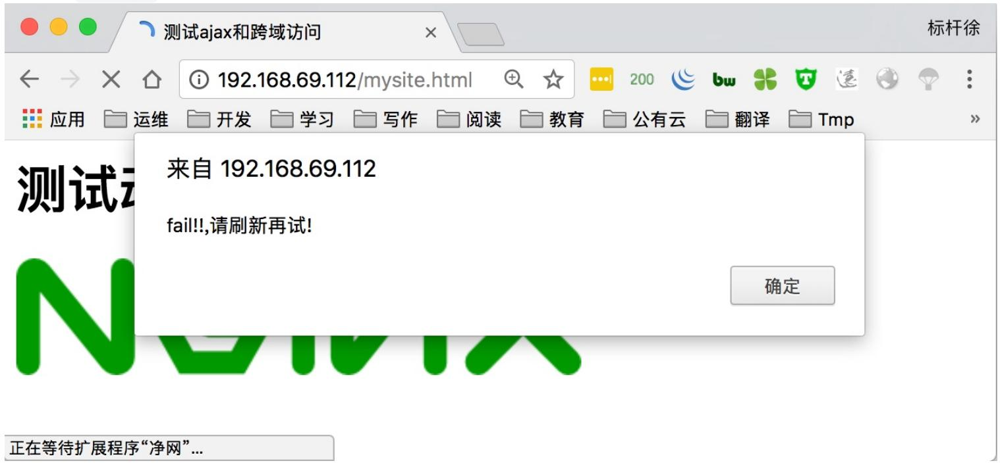


# 3.2Nginx⼿机电脑应⽤案例

2.根据不同的浏览器, 以及不同的⼿机, 访问的效果都将不⼀样。

http	{ 

... 

upstream	firefox	{ server	172.31.57.133:80; 

```txt
}
upstream chrome {
    server 172.31.57.133:8080;
}
upstream iphone {
    server 172.31.57.134:8080;
}
upstream android {
    server 172.31.57.134:8081;
}
upstream default {
    server 172.31.57.134:80;
}
...
} 
```


//server


```txt
server {
    listen 80;
    server_name www.xuliangwei.com;

    #safari浏览器访问的效果
    location / {
    if ($http_user_agent ~* "Safari") {
    proxy_pass http://dynamic_pools;
    }

    #firefox浏览器访问效果
    if ($http_user_agent ~* "Firefox") {
    proxy_pass http://static_pools;
    }

    #chrome浏览器访问效果
    if ($http_user_agent ~* "Chrome") {
    proxy_pass http://chrome;
    }

    #iphone手机访问效果
    if ($http_user_agent ~* "iphone") {
    proxy_pass http://iphone;
    }

    #android手机访问效果
    if ($http_user_agent ~* "android") {
    proxy_pass http://and;
    }

    #其他浏览器访问默认规则
    proxy_pass http://dynamic_pools;
    include proxy.conf;
```

```txt
}
} 
```


# 3.根据访问不同⽬录, 代理不同的服务器


// static upload


```txt
upstream static_pools {
    server 10.0.0.9:80 weight=1;
}
upstream upload_pools {
    server 10.0.0.10:80 weight=1;
}
upstream default_pools {
    server 10.0.0.9:8080 weight=1;
}

server {
    listen 80;
    server_name www.xuliangwei.com;

#url: http://www.xuliangwei.com/
location / {
    proxy_pass http://default_pools;
    include proxy.conf;
}

#url: http://www.xuliangwei.com/static/location/static/{
    proxy_pass http://static_pools;
    include proxy.conf;
}

#url: http://www.xuliangwei.com/upload/location/upload/{
    proxy_pass http://upload_pools;
    include proxy.conf;
} 
```


// 2 if


```shell
if ($request_uri ~* "^/static/(.*)$")
{
    proxy_pass http://static_pools/$1;
}
if ($request_uri ~* "^/upload/(.*)$")
{
    proxy_pass http://upload_pools/$1;
}
location / {
    proxy_pass http://default_pools;
    include proxy.conf;
} 
```