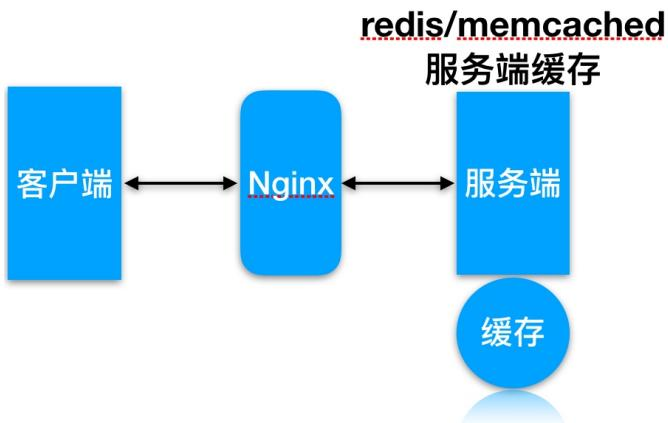
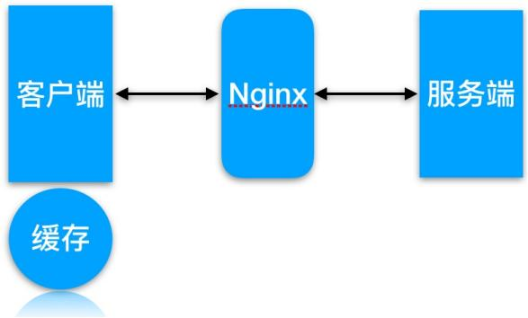
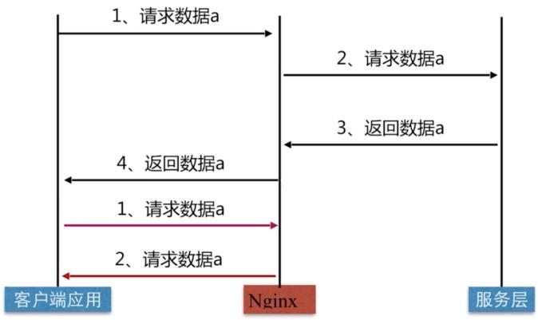

# 05.Nginx缓存服务

# 05.Nginx缓存服务

1.缓存常⻅类型

2.缓存配置语法

3.缓存配置实践

4.缓存清理实践

5.部分⻚⾯不缓存

6.缓存⽇志记录统计

徐亮伟, 江湖⼈称标杆徐。多年互联⽹运维⼯作经验，曾负责过⼤规模集群架构⾃动化运维管理⼯作。擅⻓Web集群架构与⾃动化运维，曾负责国内某⼤型电商运维⼯作。

个⼈博客"徐亮伟架构师之路"累计受益数万⼈。

笔者Q:552408925、572891887

架构师群:471443208

通常情况下缓存是⽤来减少后端压⼒, 将压⼒尽可能的往前推, 减少后端压⼒,提⾼⽹站并发延时


# 1.缓存常⻅类型

服务端缓存




代理缓存, 获取服务端内容进⾏缓存


客户端浏览器缓存


客户端浏览器缓存





Nginx 代理缓存原理




# 2.缓存配置语法

proxy_cache 配置语法

```txt
Syntax: proxy_cache zone | off;
Default: proxy_cache off;
Context: http, server, location 
```

//缓存路径

```ini
Syntax: proxy_cache_path path [levels=levels]
[use_temp_path=on|off] keys_zone=name:size [inactive=time]
[max_size=size] [manager_files=number] [manager_sleep=time][manager_threshold=time]
[loader_files=number] [loader_sleep=time] [loader_threshold=time] [purger=on|off]
[purger_files=number] [purger_sleep=time] [purger_threshold=time];
Default: -
Context: http 
```

# 缓存过期周期

```txt
Syntax: proxy_cache_valid [code ...] time;
Default: -
Context: http, server, location 
```

//示例

```txt
proxy_cache_valid 200 302 10m;
proxy_cache_valid 404 1m; 
```

# 缓存的维度

```perl
Syntax: proxy_cache_key string;
Default: proxy_cache_key $scheme$proxy_host$request_uri;
Context: http, server, location 
```

//示例

```perl
proxy_cache_key "$host$request_uri $cookie_user";
proxy_cache_key $scheme$proxy_host$uri$is_args$args; 
```

# 3.缓存配置实践

# 1.缓存准备

<table><tr><td>系统</td><td>服务</td><td>地址</td></tr><tr><td>CentOS7.4</td><td>Nginx Proxy</td><td>192.168.69.112</td></tr><tr><td>CentOS7.4</td><td>Nginx Web</td><td>192.168.69.113</td></tr></table>

# 2.web节点准备

//建⽴相关⽬录

```txt
[root@nginx ~]# mkdir -p /soft/code{1..3} 
```


//建⽴相关html⽂件


```txt
[root@nginx ~]# for i in {1..3};do echo Code1-Url$i > /soft/code1/url$i.html;done
[root@nginx ~]# for i in {1..3};do echo Code2-Url$i > /soft/code2/url$i.html;done
[root@nginx ~]# for i in {1..3};do echo Code3-Url$i > /soft/code3/url$i.html;done 
```


//配置Nginx


```txt
[root@nginx ~]# cat /etc/nginx/conf.d/web_node.conf
server {
    listen 8081;
    root /soft/code1;
    index index.html;
}
server {
    listen 8082;
    root /soft/code2;
    index index.html;
}
server {
    listen 8083;
    root /soft/code3;
    index index.html;
} 
```


//检查监听端⼝


```ini
[root@nginx ~]# netstat -lntp|grep 80
tcp 0 0 0.0.0.0:8081 0.0.0.0:* LISTEN 509
22/nginx: master
tcp 0 0 0.0.0.0:8082 0.0.0.0:* LISTEN 509
22/nginx: master
tcp 0 0 0.0.0.0:8083 0.0.0.0:* LISTEN 509
22/nginx: master 
```


2.代理配置缓存


```txt
[root@proxy ~]# mkdir /soft/cache
[root@proxy ~]# cat /etc/nginx/conf.d/proxy_cache.conf
upstream cache {
    server 192.168.69.113:8081;
    server 192.168.69.113:8082;
    server 192.168.69.113:8083;
} 
```


#proxy_cache存放缓存临时⽂件


```txt
#levels 按照两层目录分级
#keys_zone 开辟空间名，10m:开辟空间大小，1m可存放8000key
#max_size 控制最大大小，超过后Nginx会启用淘汰规则
```

```txt
#inactive 60分钟没有被访问缓存会被清理
#use_temp_path 临时文件，会影响性能，建议关闭
proxy_cache_path /soft/cache levels=1:2 keys_zone=code_cache:10m max_size=10g inactive=60m use_temp_path=off;

server {
    listen 80;
    server_name 192.168.69.12;

#proxy_cache 开启缓存
#proxy_cache_valid 状态码200|304的过期为12h，其余状态码10分钟过期
#proxy_cache_key 缓存key
#add_header 增加头信息，观察客户端respoce是否命中
#proxy_next_upstream 出现502-504或错误，会跳过此台服务器访问下台
location / {
    proxy_pass http://cache;
    proxy_cache code_cache;
    proxy_cache_valid 200 304 12h;
    proxy_cache_valid any 10m;
    add_header Nginx-Cache "$upstream_cache_status";
    proxy_next_upstream error timeout invalid_header http_500 http_502 http_503 http_504;
    include proxy_params;
    }
}
```

# 3.客户端测试

```txt
//
[root@nginx ~]# curl -s -I http://192.168.56.11/url3.html|grep "Nginx-Cache"
Nginx-Cache: MISS
//命中
[root@nginx ~]# curl -s -I http://192.168.56.11/url3.html|grep "Nginx-Cache"
Nginx-Cache: HIT
```

# 4.缓存清理实践

如何清理 proxy_cache 代理缓存

# 1. rm 删除已缓存数据

```txt
[root@proxy ~]# rm -rf /soft/cache/*
[root@proxy ~]# curl -s -I http://192.168.56.11/url3.html|grep "Nginx-Cache" 
```

```txt
Nginx-Cache: MISS 
```


1.通过 ngx_cache_purge 扩展模块清理, 需要编译安装 Nginx


//建⽴对应⽬录


```txt
[root@proxy ~]# mkdir /soft/src
[root@proxy ~]# cd /soft/src

// 下载Nginx包
[root@proxy ~]# wget http://nginx.org/download/nginx-1.12.2.tar.gz
[root@proxy ~]# tar xf nginx-1.12.2.tar.gz

// 下载ngx_cache_purge
[root@proxy ~]# wget http://labs.frickle.com/files/ngx_cache_purge-2.3.tar.gz
[root@proxy ~]# tar xf ngx_cache_purge-2.3.tar.gz
```


//编译Nginx


```shell
[root@nginx src]# cd nginx-1.12.2/ && ./configure \
--prefix=/server/nginx --add-module=../ngx_cache_purge-2.3 \
--with-http_stub_status_module --with-http_ssl_module
[root@nginx src]# make && make install 
```


//需要将上⽂的缓存proxy_cache.conf⽂件拷⻉⾄源码包中,	并增加如下内容


```perl
location ~ /purge(/.*) {
    allow 127.0.0.1;
    allow 192.168.69.0/24;
    deny all;
    proxy_cache_purge code_cache $host$1$is_args$args;
} 
```


//检测配置重新加载


```txt
[root@nginx conf.d]# /server/nginx/sbin/nginx -t
[root@nginx conf.d]# /server/nginx/sbin/nginx -s reload 
```


使⽤浏览器访问建⽴缓存


# Code2-Url2


# Successful purge

Key : 192.168.0 " *//url2.html Path: /soft/cache/f/f1/2bb37023b10786ff6a8ff18798b63f1f 

nginx/1.12.2 

再次刷新就会 404 因为缓存内容已清理


# 404 Not Found

nginx/1.12.2 

# 5.部分⻚⾯不缓存

指定部分⻚⾯不进⾏ proxy_Cache 缓存

```txt
cat proxy_cache.conf
upstream cache{
    server 192.168.69.113:8081;
    server 192.168.69.113:8082;
    server 192.168.69.113:8083;
}

proxy_cache_path /soft/cache levels=1:2 keys_zone=code_cache:10m max_size=10g inactive=60m use_temp_path=off; 
```

```txt
server {
    listen 80;
    server_name 192.168.69.112;
    if ($request_uri ~ ^/(url3|login|register|password)) {
    set $cookie_nocache 1;
    }

    location / {
    proxy_pass http://cache;
    proxy_cache code_cache;
    proxy_cache_valid 200 304 12h;
    proxy_cache_valid any 10m;
    proxy_cache_key $host$uri$is_argsisease;
    'proxy_no_cache $cookie_nocache $arg_nocache $arg_comment;
    proxy_no_cache $http_pargma $http_authorization;'
    add_header Nginx-Cache "$upstream_cache_status";
    proxy_next_upstream error timeout invalid_header http_500 http_502
    http_503 http_504;
    include proxy_params;
    }
} 
```

//清理缓存

```txt
[root@nginx ~]# rm -rf /soft/cache/* 
```

//请求测试

```powershell
[root@nginx ~]# curl -s -I http://192.168.69.112/url3.html|grep "Nginx-Cache"
Nginx-Cache: MISS
[root@nginx ~]# curl -s -I http://192.168.69.112/url3.html|grep "Nginx-Cache"
Nginx-Cache: MISS
[root@nginx ~]# curl -s -I http://192.168.69.112/url3.html|grep "Nginx-Cache"
Nginx-Cache: MISS 
```

# 6.缓存⽇志记录统计

通过⽇志记录 proxy_cache 命中情况与对应 url

```shell
//修改/etc/nginx/nginx.conf中log_format格式
log_format main '$http_user_agent' '$request_uri' '$remote_addr - $remote_user [$time_local] "$request" '
    '$status $body_bytes_sent "$http_referer" '
    '"$http_user_agent" "$http_x_forwarded_for"' "$upstream_cache_status'";
//修改proxy_cache.conf，在server标签新增access日志
```

```txt
access_log /var/log/nginx/proxy_cache.log main; 
```


//使⽤curl访问,	最后检查⽇志命令情况


```batch
curl/7.29.0/url3.html192.168.56.183 - - [19/Apr/2018:11:48:43 -0400] "HEAD /url3.ht
ml HTTP/1.1" 200 0 "-" "curl/7.29.0" "-" "MISS"
curl/7.29.0/url2.html192.168.56.183 - - [19/Apr/2018:11:48:45 -0400] "HEAD /url2.ht
ml HTTP/1.1" 200 0 "-" "curl/7.29.0" "-" "HIT"
curl/7.29.0/url2.html192.168.56.183 - - [19/Apr/2018:11:48:46 -0400] "HEAD /url2.ht
ml HTTP/1.1" 200 0 "-" "curl/7.29.0" "-" "HIT" 
```

# Nginx查看命中率