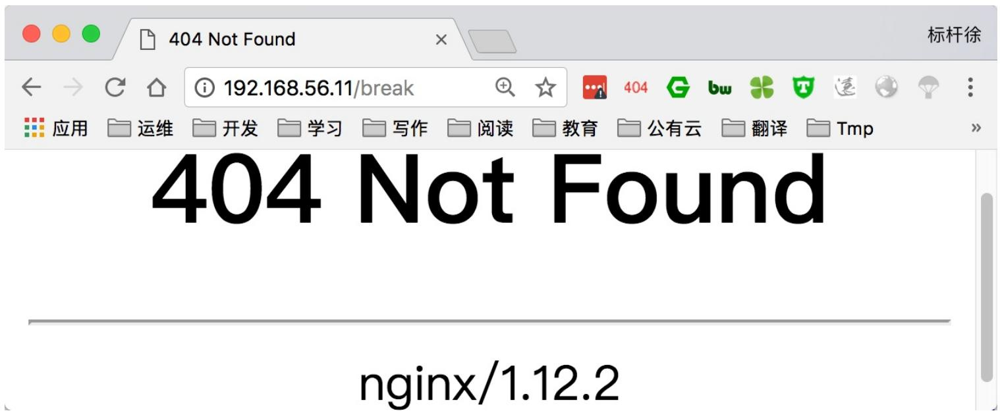
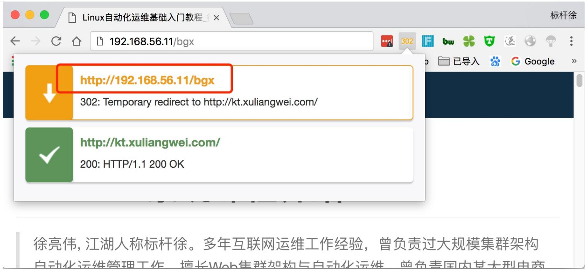
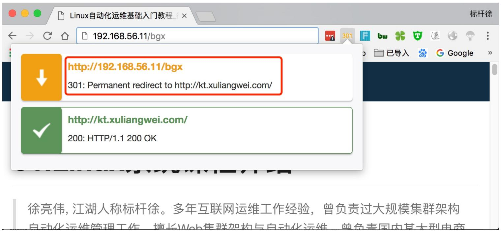
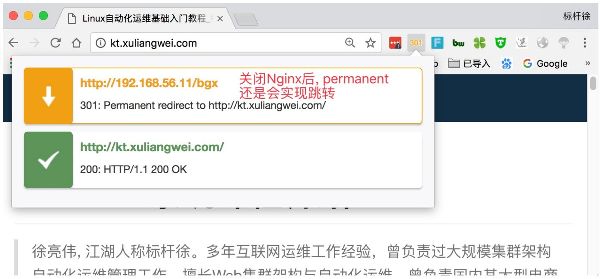

# 06.Nginx rewrite

# 06.Nginx rewrite

1.Rewrite基本概述

2.Rewrite配置语法

3.Rewrite标记Flag

4.Rewrite使⽤场景

5.Rewrite额外补充

徐亮伟, 江湖⼈称标杆徐。多年互联⽹运维⼯作经验，曾负责过⼤规模集群架构⾃动化运维管理⼯作。擅⻓Web集群架构与⾃动化运维，曾负责国内某⼤型电商运维⼯作。

个⼈博客"徐亮伟架构师之路"累计受益数万⼈。

笔者Q:552408925、572891887

架构师群:471443208

# 1.Rewrite基本概述

rewrite 主要实现 url 地址重写, 以及重定向.

# Rewrite使⽤场景

1.URL访问跳转: ⽀持开发设计, ⻚⾯跳转, 兼容性⽀持, 展示效果

2.SEO优化: 依赖于url路径,以便⽀持搜索引擎录⼊

3.维护: 后台维护, 流量转发等

4.安全: 伪静态,真实动态⻚⾯进⾏伪装

# 2.Rewrite配置语法

```txt
Syntax: rewrite regex replacement [flag];
Default: --
Context: server, location, if 
```

```javascript
//所有请求转发至/pages/maintain.html
rewrite^(.*)$ /pages/maintain.html break;
```

正则表达式

<table><tr><td>表达式</td><td></td></tr><tr><td>.</td><td>匹配除换行符以外的任意字符</td></tr><tr><td>?</td><td>重复0次或1次</td></tr><tr><td>+</td><td>重复1次或更多次</td></tr><tr><td>*</td><td>最少连接数,那个机器连接数少就分发</td></tr><tr><td>\d</td><td>匹配数字</td></tr><tr><td>^</td><td>匹配字符串的开始</td></tr><tr><td>$</td><td>匹配字符串的结尾</td></tr><tr><td>{n}</td><td>重复n次</td></tr><tr><td>{n,}</td><td>重复n此或更多次</td></tr><tr><td>[c]</td><td>匹配单个字符c</td></tr><tr><td>[a-z]</td><td>匹配a-z小写字母的任意一个</td></tr></table>

# 正则表达式中特殊字符

```txt
\ 转义字符
rewrite index\.php$ /pages/maintain.html break;
() 用于匹配括号之间的内容，通过$1,$2调用
if ($http_user_agent ~ Chrome){
    rewrite ^(.*)$ /chrome/$1 break;
}
```

# 正则表达式终端测试⼯具

```txt
[root@Nginx ~]# yum install -y pcre-tools
[root@Nginx ~]# pcretest
PCRE version 8.32 2012-11-30
re> /(\d+)\.(\d+)\.(\d+)\.(\d+)/data> 192.168.56.11
0: 192.168.56.11
1: 192
2: 168
3: 56
4: 11 
```

# 3.Rewrite标记Flag

<table><tr><td>flag</td><td></td></tr><tr><td>last</td><td>停止rewrite检测</td></tr><tr><td>break</td><td>停止rewrite检测</td></tr><tr><td>redirect</td><td>返回302临时重定向,地址栏会显示跳转后的地址</td></tr><tr><td>permanent</td><td>返回301永久重定向,地址栏会显示跳转后的地址</td></tr></table>

对⽐flag中 break 与 last

```txt
[root@Nginx ~]# cat /etc/nginx/conf.d/rewrite.conf
server {
    listen 80;
    server_name localhost;
    root /soft/code;
    location ~ ^/break{
    rewrite ^/break /test/ break;
    }

    location ~ ^/last{
    rewrite ^/last /test/ last;
    }

    location /test/{default_type application/json;
    return 200 '{"status":"success"}';
    }
} 
```

测试 break




测试 last


{"status":"success"} 

last 与 break 对⽐总结:

last会新建⽴⼀个请求, 请求域名+/test

break匹配后不会进⾏匹配, 会查找对应root站点⽬录下包含/test⽬录

对⽐flag中 redirect 与 permanent

```txt
[root@Nginx ~]# cat /etc/nginx/conf.d/rewrite.conf
server {
    listen 80;
    server_name localhost;
    root /soft/code;

    location ~ ^/bgx {
    rewrite ^/bgx http://kt.xuliangwei.com redirect;
    rewrite ^/bgx http://kt.xuliangwei.com permanent; 
```

# 测试 Nginx 中 redirect




# nginx	-s	stop 停⽌ Nginx 服务


# 关闭Nginx服务后，redirect已经无法实现跳转

测试 Nginx 中 permanent




nginx	-s	stop 停⽌ Nginx 服务




# 4.Rewrite使⽤场景

```txt
ls /soft/code/course/11/22/course_33.html
location / {
    rewrite ^/course-(\d+)-(\\d+)-(\\d+)\.html /course/$1/$2/course_$3.html break;
} 
```

# 第⼆种场景

```scss
if ($http_user_agent ~* Chrome){
    rewrite ~/nginx http://kt.xuliangwei.com/index.html redirect;
} 
```

# 5.Rewrite额外补充

# Rewrite 匹配优先级

1.执⾏server块的rewrite指令

2.执⾏location匹配

3.执⾏选定的location中的rewrite

# Rewrite 优雅书写

```hcl
server {
    listen 80;
    server_name www.bgx.com bgx.com;
    if ($http_host = nginx.org){
    rewrite (.*) http://www.bgx.com$1;
    }
}

//改良版
server {
    listen 80;
    server_name bgx.com;
    rewrite ^ http://www.bgx.com$request_uri?;
}

server {
    listen 80;
    server_name www.bgx.com;
}
```