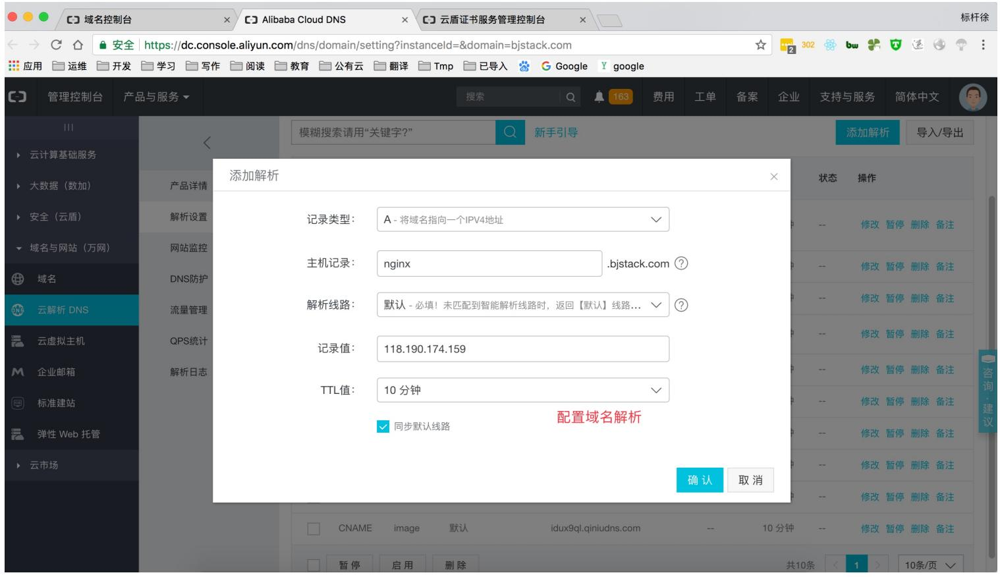
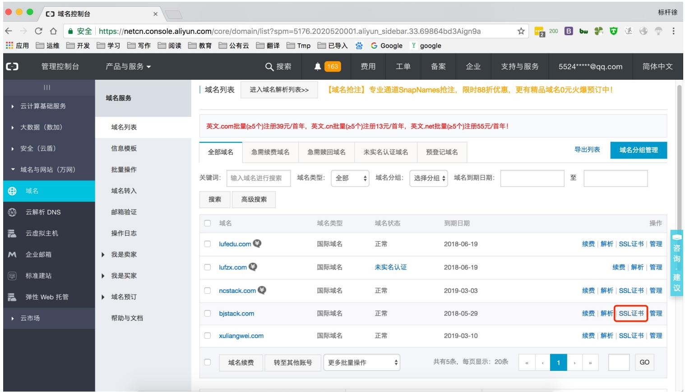
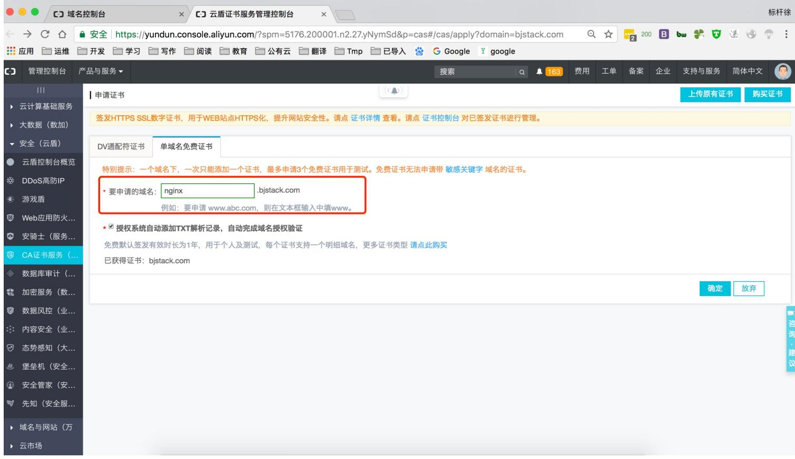
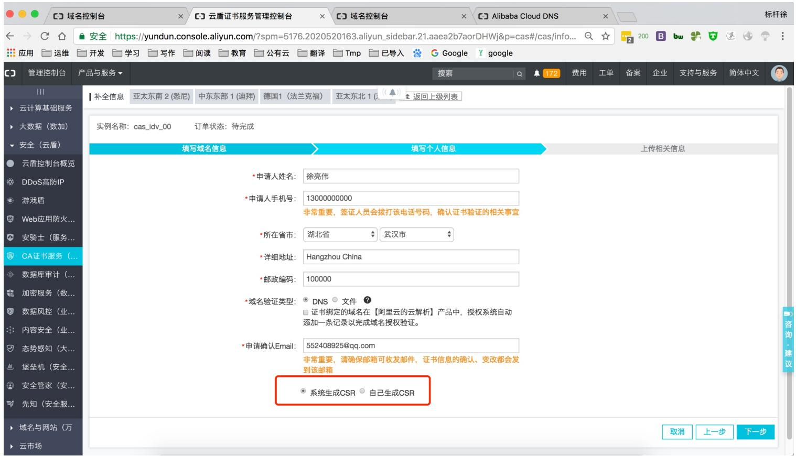
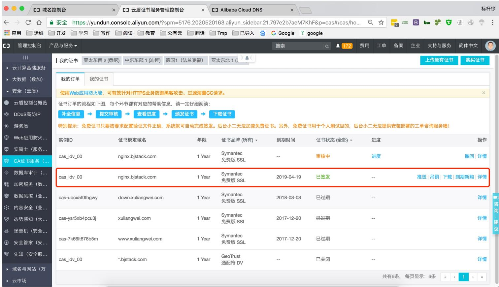
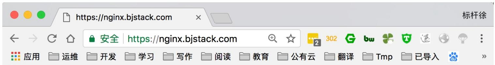
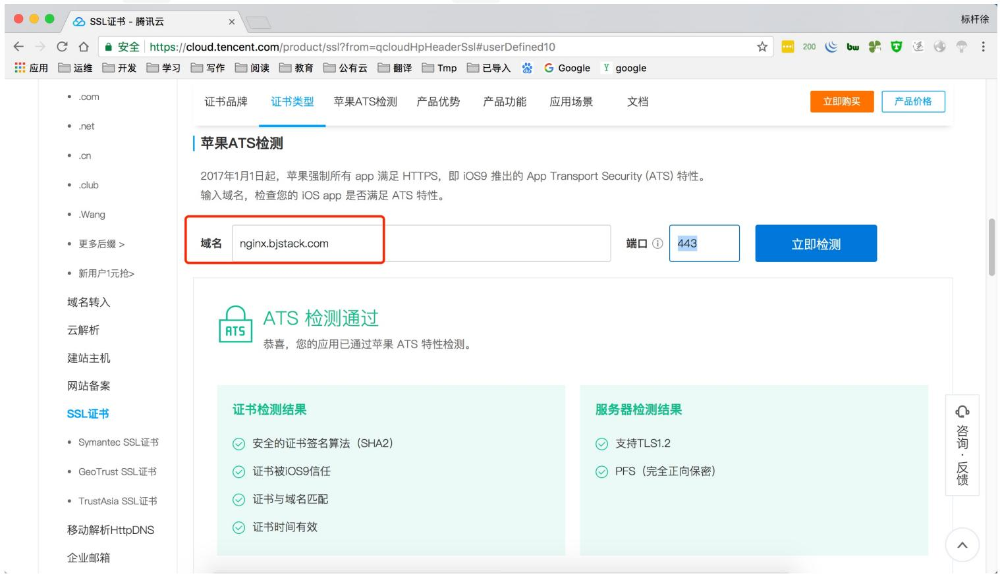

# 07.Nginx HTTPS

# 07.Nginx HTTPS

1.HTTPS基本概述

2.HTTPS配置语法

3.HTTPS配置场景

4.Https公有云实践

徐亮伟, 江湖⼈称标杆徐。多年互联⽹运维⼯作经验，曾负责过⼤规模集群架构⾃动化运维管理⼯作。擅⻓Web集群架构与⾃动化运维，曾负责国内某⼤型电商运维⼯作。

个⼈博客"徐亮伟架构师之路"累计受益数万⼈。

笔者Q:552408925、572891887

架构师群:471443208

实战构建⼀个满⾜苹果要求的HTTPS后台服务

# 1.HTTPS基本概述

为什么需要使⽤HTTPS, 因为HTTP不安全

1.传输数据被中间⼈盗⽤, 信息泄露

2.数据内容劫持, 篡改

# 2.HTTPS配置语法

```txt
Syntax: ssl on | off;
Default: ssl off;
Context: http, server
Syntax: ssl_certificate file;
Default: -
Context: http, server
Syntax: ssl_certificate_key file;
Default: -
Context: http, server 
```

# 3.HTTPS配置场景

# 配置苹果要求的证书

1.服务器所有连接使⽤TLS1.2以上版本(openssl 1.0.2)

2.HTTPS证书必须使⽤SHA256以上哈希算法签名

3.HTTPS证书必须使⽤RSA 2048位或ECC256位以上公钥算法

4.使⽤前向加密技术

# 秘钥⽣成操作步骤

1.⽣成key密钥

2.⽣成证书签名请求⽂件(csr⽂件)

3.⽣成证书签名⽂件(CA⽂件)

# 1.检查当前环境

```txt
//openssl必须是1.0.2
[root@Nginx ~]# openssl version
OpenSSL 1.0.2k-fips 26 Jan 2017

//nginx必须有ssl模块
[root@Nginx ~]# nginx -V
--with-http_ssl_module

[root@Nginx ~]# mkdir /etc/nginx/ssl_key -p
[root@Nginx ~]# cd /etc/nginx/ssl_key
```

# 2.创建私钥

```txt
[root@Nginx ssh_key]# openssl genrsa -idea -out server.key 2048
Generating RSA private key, 2048 bit long modulus
....+++  
//记住配置密码，我这里是1234
Enter pass phrase for server.key:
Verifying - Enter pass phrase for server.key:
```

# 3.⽣成使⽤签名请求证书和私钥⽣成⾃签证书

```txt
[root@Nginx ssl_key]# openssl req -days 36500 -x509 \
-sha256 -nodes -newkey rsa:2048 -keyout server.key -out server.crt
Country Name (2 letter code) [XX]:CN
State or Province Name (full name) []:WH 
```

```txt
Locality Name (eg, city) [Default City]:WH
Organization Name (eg, company) [Default Company Ltd]:edu
Organizational Unit Name (eg, section) []:SA
Common Name (eg, your name or your server's hostname) []:bgx
Email Address []:bgx@foxmail.com 
```


4.配置 Nginx


```jinja
[root@Nginx ~]# cat /etc/nginx/conf.d/ssl.conf
server {
    listen 443;
    server_name localhost;
    ssl on;
    index index.html index.htm;
    #ssl_session_cache share:SSL:10m;
    ssl_session_timeout 10m;
    ssl_certificate ssl_key/server.crt;
    ssl_certificate_key ssl_key/server.key;
    ssl_ciphers ECDHE-RSA-AES128-GCM-SHA256:ECDHE:ECDH:AES:HIGH:!NULL:!aNULL:!MD5:!ADH:!RC4;
    ssl_protocols TLSv1 TLSv1.1 TLSv1.2;
    ssl_prefer_server_ciphers on;

    location / {
    root /soft/code;
    access_log /logs/ssl.log main;
    }
} 
```

5.测试访问, 由于该证书⾮第三⽅权威机构颁发，⽽是我们⾃⼰签发的，所以浏览器会警告


6.以上配置如果⽤户忘记在浏览器地址栏输⼊ https:// 那么将不会跳转⾄ https , 需要将访问 http 强制跳转 https

```perl
[root@Nginx ~]# cat /etc/nginx/conf.d/ssl.conf
server {
    listen 443;
    server_name localhost;
    ssl on;
    index index.html index.htm;
    #ssl_session_cache share:SSL:10m;
    ssl_session_timeout 10m;
    ssl_certificate ssl_key/server.crt;
    ssl_certificate_key ssl_key/server.key; 
```

```txt
ssl_ciphers ECDHE-RSA-AES128-GCM-SHA256:ECDHE:ECDH:AES:HIGH:!NULL:!aNULL:!MD5:!ADH:!RC4;
ssl_protocols TLSv1 TLSv1.1 TLSv1.2;
ssl_prefer_server_ciphers on;

location / {
root /soft/code;
}
server {
listen 80;
server_name localhost;
rewrite^(.*) https://$server_name$1 redirect;
} 
```

# 7.检查是否⽀持苹果要求 ATS 协议

//仅能在苹果终端上使⽤

```powershell
$ nscurl --ats-diagnostics --verbose https://192.168.69.113 
```

# 4.Https公有云实践

在云上签发各品牌数字证书，实现⽹站 HTTPS 化，使⽹站可信，防劫持、防篡改、防监听。并进⾏统⼀⽣命周期管理，简化证书部署，⼀键分发到云上产品。
















# 上传阿⾥云证书, 并解压

[root@Nginx	ssl_key]#	rz rz	waiting	to	receive. Starting	zmodem	transfer.		Press	Ctrl+C	to	cancel. Transferring	1524377920931.zip... 

100% 

3	KB 

3	KB/sec 

00:00:01 

0 Errors 

//解压

```txt
[root@Nginx ssl_key]# unzip 1524377920931.zip 
```


配置 nginx	https


```txt
[root@Nginx conf.d]# cat ssl.nginx.bjstack.com.conf
server {
    listen 443;
    server_name nginx.bjstack.com;
    index index.html index.htm;
    ssl on;
    ssl_session_timeout 10m;
    ssl_certificate ssl_key/1524377920931.pem;
    ssl_certificate_key ssl_key/1524377920931.key;
    ssl_ciphers ECDHE-RSA-AES128-GCM-SHA256:ECDHE:ECDH:AES:HIGH:!NULL:!aNULL:!MD5:!ADH:!RC4;
    ssl_protocols TLSv1 TLSv1.1 TLSv1.2;
    ssl_prefer_server_ciphers on;

    location / {
    root /soft/code;
    }
}

server {
    listen 80;
    server_name nginx.bjstack.com;
    rewrite^(.*) https://$server_name$1 redirect;
} 
```


测试访问





# Https


使⽤腾讯云 ATS 检测⼯具检查是否满⾜苹果 IOS 要求





苹果ATS - 证书选择及配置