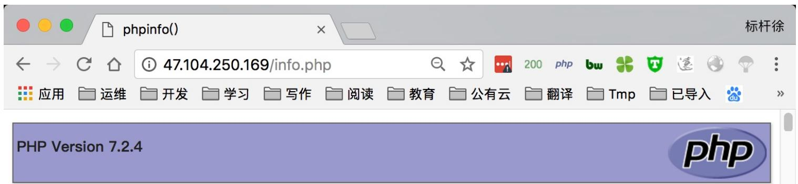
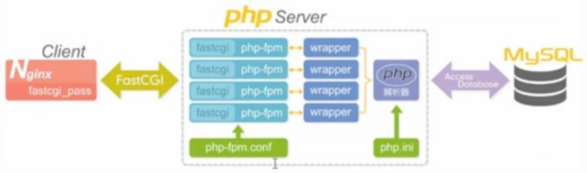

# 08.LNMP动态⽹站

# 08.LNMP动态⽹站

安装LNMP架构

。 配置LNMP架构

检测LNMP架构

Nginx与PHP原理

PHP配置⽂件优化

php-ini优化

php-fpm优化

徐亮伟, 江湖⼈称标杆徐。多年互联⽹运维⼯作经验，曾负责过⼤规模集群架构⾃动化运维管理⼯作。擅⻓Web集群架构与⾃动化运维，曾负责国内某⼤型电商运维⼯作。

个⼈博客"徐亮伟架构师之路"累计受益数万⼈。

笔者Q:552408925、572891887

架构师群:471443208

# 安装LNMP架构

yum安装 nginx1.12 php7.2 Mriadb5.7

# 1.安装 Nginx

```ini
//1.使用Nginx官方提供的rpm包
[root@nginx ~]# cat /etc/yum.repos.d/nginx.repo
[nginx]
name=nginx repo
baseurl=http://nginx.org/packages/centos/7/$basearch/
gpgcheck=0
enabled=1

//2.执行yum安装
[root@nginx ~]# yum install nginx -y
[root@nginx ~]# systemctl start nginx
[root@nginx ~]# systemctl enable nginx
```

# 2.使⽤第三⽅扩展epel源安装php7.2

//移除旧版php

```txt
[root@nginx ~]# yum remove php-mysql-5.4 php php-fpm php-common 
```

//安装扩展源

```txt
[root@nginx ~]# rpm -Uvh https://dl.fedoraproject.org/pub/epel/epel-release-latest-7.noarch.rpm
[root@nginx ~]# rpm -Uvh https://mirror.webtatic.com/yum/el7/webtatic-release.rpm 
```

//安装php72版本

```txt
[root@nginx ~]# yum -y install php72w php72w-cli php72w-common php72w-devel php72w-embedded php72w-gd php72w-mbstring php72w-pdo php72w-xml php72w-fpm php72w-mysqlnd php72w-opcache 
```

//启动php

```txt
[root@nginx ~]# systemctl start php-fpm
[root@nginx ~]# systemctl enable php-fpm 
```

# 3.安装 Mariadb

//下载官⽅扩展源,	扩展源集成mysql5.6、5.7、8.0,仅5.7仓库是开启

```txt
[root@nginx ~]# rpm -ivh http://repo.mysql.com/yum/mysql-5.7-community/el/7/x86_64/mysql57-community-release-el7-10.noarch.rpm
[root@nginx ~]# yum install mysql-community-server -y
[root@nginx ~]# systemctl start mysqld
[root@nginx ~]# systemctl enable mysqld 
```

//如果mysql登陆需要密码,请查看该⽂件

```txt
[root@nginx ~]# grep 'temporary password' /var/log/mysqld.log 
```

//登陆mysql重新配置密码

```sql
[root@nginx ~]# mysql -uroot -p'password'
mysql> ALTER USER 'root'@'localhost' IDENTIFIED BY 'MyNewPass4!'; 
```

# 配置LNMP架构

1.配置 Nginx 实现动态请求转发⾄ php

```txt
[root@nginx ~]# cat /etc/nginx/conf.d/php.conf
server {
    server_name_;
    listen 80;
    root /soft/code;
    index index.php index.html; 
```

```txt
location ~ \.php$ {
    fastcgi_pass 127.0.0.1:9000;
    fastcgi_index index.php;
    fastcgi_param SCRIPT_FILENAME /soft/code$fastcgi_script_name;
    include fastcgi_params;
}
} 
```


2.添加 php 测试⻚⾯


```php
//测试phpinfo
[root@nginx ~]# cat /soft/code/info.php
<?php
phpinfo();
?>
```


//使⽤mysqli模块测试连接mysql


```php
[root@nginx ~]# cat /soft/code/mysql.php
<?php
$servername = "localhost";
$username = "root";
$password = "";
// 创建连接
$conn = mysql_connect($servername, $username, $password);
// 检测连接
if (!$conn) {
    die("Connection failed: " . mysql_connect_error());
}
echo "连接成功";
?>
```


//使⽤pdo模块测试连接mysql


```php
[root@nginx ~]# cat /soft/code/mysqlpdo.php
<?php
    $servername = "localhost";
    $username = "root";
    $password = "";
    try {
    $conn = new PDO("mysql:host=$servername;dbname=test", $username, $password);
    echo "连接成功";
    }
```

```php
catch(PDOException $e)
{
    echo $e->getMessage();
}
?> 
```

# 检测LNMP架构




<table><tr><td>System</td><td>Linux nginx 3.10.0–693.2.2.el7.x86_64 #1 SMP Tue Sep 12 22:26:13 UTC 2017 x86_64</td></tr><tr><td>Build Date</td><td>Mar 30 2018 08:51:30</td></tr><tr><td>Server API</td><td>FPM/FastCGI</td></tr><tr><td>Virtual Directory Support</td><td>disabled</td></tr><tr><td>Configuration File (php.ini) Path</td><td>/etc</td></tr><tr><td>Loaded Configuration File</td><td>/etc/php.ini</td></tr><tr><td>Scan this dir for additional .ini files</td><td>/etc/php.d</td></tr><tr><td>Additional .ini files parsed</td><td>/etc/php.d/bz2.ini, /etc/php.d/calendar.ini, /etc/php.d/ctype.ini, /etc/php.d/curl.ini, /etc/php.d/dom.ini, /etc/php.d/exif.ini, /etc/php.d/fileinfo.ini, /etc/php.d/ftp.ini, /etc/php.d/gd.ini, /etc/php.d/gettext.ini, /etc/php.d/gmp.ini, /etc/php.d/iconv.ini, /etc/php.d/json.ini, /etc/php.d/mbstring.ini, /etc/php.d/mysqlnd.ini, /etc/php.d/mysqlnd_mysqlqi.ini, /etc/php.d/opcache.ini, /etc/php.d/pdo.ini, /etc/php.d/pdo_mysqlqnd.ini, /etc/php.d/pdo_sqlite.ini, /etc/php.d/phar.ini, /etc/php.d/shmop.ini, /etc/php.d/simplexml.ini, /etc/php.d/sockets.ini, /etc/php.d/sqlite3.ini, /etc/php.d/tokenizer.ini, /etc/php.d/xml.ini, /etc/php.d/xml_wddx.ini, /etc/php.d/xmlreader.ini, /etc/php.d/xmlwriter.ini, /etc/php.d/xsl.ini, /etc/php.d/zip.ini</td></tr><tr><td>PHP API</td><td>20170718</td></tr><tr><td>PHP Extension</td><td>20170718</td></tr><tr><td>Zend Extension</td><td>320170718</td></tr><tr><td>Zend Extension Build</td><td>API320170718,NTS</td></tr><tr><td>PHP Extension Build</td><td>API20170718,NTS</td></tr><tr><td>Debug Build</td><td>no</td></tr><tr><td>Thread Safety</td><td>disabled</td></tr><tr><td>Zend Signal Handling</td><td>enabled</td></tr></table>


# 连接成功


# 连接成功 pdo连接方式

# Nginx与PHP原理

Nginx FastCGI的运⾏原理




图6-3Nginx结合PHPFastCGI运行原理图


nginx	fastcgi 访问 php

1.⽤户发送http请求报⽂给nginx服务器

2.nginx会根据⽂件url和后缀来判断请求

3.如果请求的是静态内容,nginx会将结果直接返回给⽤户

4.如果请求的是动态内容,nginx会将请求交给fastcgi客户端,通过fastcgi_pass将这个请求发送给php-fpm

5.php-fpm收到请求后会通过本地监听的socket交给wrapper

6.wrapper收到请求会⽣成新的线程调⽤php动态程序解析服务器

7.如果⽤户请求的是博⽂、或者内容、PHP会请求MySQL查询结果

8.如果⽤户请求的是图⽚、附件、PHP会请求nfs存储查询结果

# PHP配置⽂件优化

# php-ini优化

```txt
//打开php的安全模式, 控制php执行危险函数, 默认是Off, 改为On
sql.safe_mode = Off

//关闭php头部信息，隐藏版本号，默认是On, 该为Off
expose_php = On

//错误信息输出控制
display_error = Off

error_reporting = E_WARNING & E_ERROR

//记录错误日志至后台，方便追溯
log_errors = On

error_log = /var/log/php_error.log

//每个脚本时间最大内存
memory_limit = 128M

//上传文件最大许可，默认2M，建议调整为16,32M
upload_max_filesize = 2M

//禁止远程执行phpshell，默认On，建议Off
allow_url_fopen = On

//时区调整，默认PRC，建议调整为Asia/Shanghai
date.timezone = PRC
```


//整体优化后配置⽂件


```ini
sql.safe_mode = Off
expose_php = Off
display_error = Off
error_reporting = E_WARNING & E_ERROR
log_errors = On
error_log = /var/log/php_error.log
upload_max_filesize = 50M
allow_url_fopen = Off
date.timezone = Asia/Shanghai 
```

# php-fpm优化

PHP-FPM配置⽂件 4核16G、8核16G

```ini
[root@nginx ~]# cat /etc/php-fpm.d/www.conf
[global]
pid = /var/run/php-fpm.pid
#php-fpm程序错误日志
error_log = /var/log/php/php-fpm.log
log_level = warning
rlimit_files = 655350
events.mechanism = epoll
```

```ini
[www]
user = nginx
group = nginx
listen = 127.0.0.1:9000
listen.owner = www
listen.group = www
listen.mode = 0660 
```

```txt
listen.allowed_clients = 127.0.0.1
pm = dynamic
pm.max_children = 512
pm.start_servers = 10
pm.min_spare_servers = 10
pm.max_spare_servers = 30
pm.process_idle_timeout = 15s;
pm.max_requests = 2048 
```


#php-www模块错误⽇志


```ini
php_flag[display_errors] = off
php_admin_value[error_log] = /var/log/php/php-www.log
php_admin_flag[log_errors] = on 
```


#php慢查询⽇志


```ini
request_slowlog_timeout = 5s
slowlog = /var/log/php/php-slow.log 
```

# PHP5-FPM配置详解释


[global]


```txt
#pid设置，记录程序启动后pid
pid = /var/run/php-fpm.pid
#php-fpm程序启动错误日志路径
error_log = /soft/log/php/php-fpm_error.log
# 错误级别。可用级别为：alert（必须立即处理），error（错误情况），warning（警告情况），notice（一般重要信息），debug（调试信息）。默认：notice.
log_level = warning
```

#设置⽂件打开描述符的rlimit限制.

```python
rlimit_files = 65535
events.mechanism = epoll 
```

#启动进程的⽤户和组

```ini
[www]
user = www
group = www 
```

#	fpm监听端⼝

```txt
listen = 127.0.0.1:9000
# unix socket设置选项，如果使用tcp方式访问，这里注释即可。
```

```ini
listen.owner = www
listen.group = www 
```

```txt
允许访问FastCGI进程的IP，any不限制
listen.allowed_clients = 127.0.0.1
```

#	pm设置动态调度

```python
pm = dynamic
# 同一时刻最大的php-fpm子进程数量
pm.max_children = 200
# 动态方式下的起始php-fpm进程数量
pm.start_servers = 20
# 动态方式下服务器空闲时最小php-fpm进程数量
pm.min_spare_servers = 10
# 动态方式下服务器空闲时最大php-fpm进程数量
pm.max_spare_servers = 30
# 最大请求
pm.max_requests = 1024
pm.process_idle_timeout = 15s;
```

#	FPM状态⻚⾯,⽤于监控php-fpm状态使⽤

```txt
pm.status_path = /status
# 错误日志
```

```ini
php_flag[display_errors] = off
php_admin_value[error_log] = /soft/log/php/php-www_error.log
php_admin_flag[log_errors] = on 
```

#	配置php慢查询,	以及慢查询记录⽇志位置

```ini
request_slowlog_timeout = 5s
slowlog = /soft/log/php/php-slow.log 
```