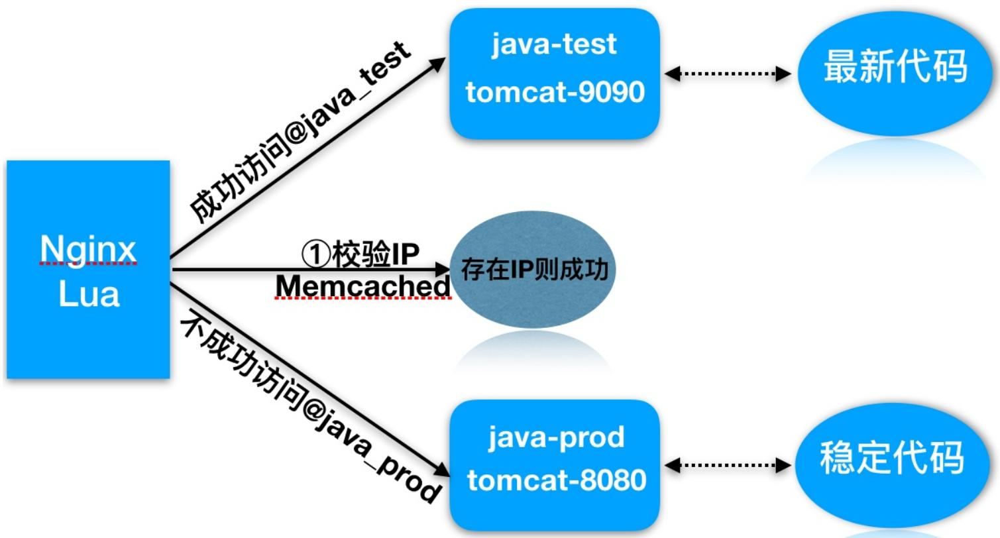
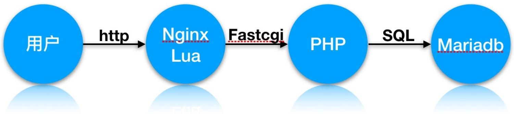
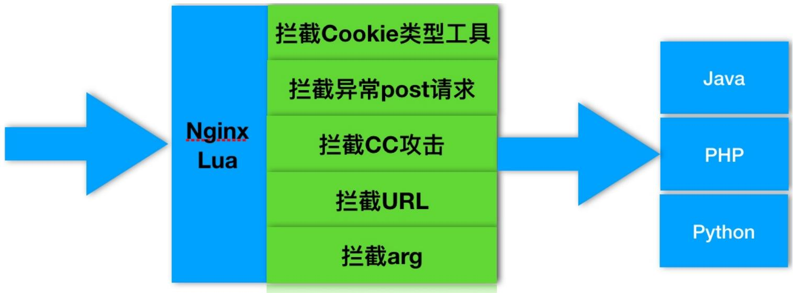

# 10.Nginx+Lua实战

# 10.Nginx+Lua实战

1.Lua脚本基础语法

2.Nginx加载Lua环境

3.Nginx调⽤Lua指令

4.Nginx+Lua实现代码灰度发布

5.Nginx+Lua实现WAF应⽤防⽕墙

徐亮伟, 江湖⼈称标杆徐。多年互联⽹运维⼯作经验，曾负责过⼤规模集群架构⾃动化运维管理⼯作。擅⻓Web集群架构与⾃动化运维，曾负责国内某⼤型电商运维⼯作。

个⼈博客"徐亮伟架构师之路"累计受益数万⼈。

笔者Q:552408925、572891887

架构师群:471443208

# 1.Lua脚本基础语法

Lua 是⼀个简洁、轻量、可扩展的脚本语⾔Nginx+Lua优势

充分的结合Nginx的并发处理epool优势和Lua的轻量实现简单的功能且⾼并发的场景统计IP

统计⽤户信息

安全WAF

# 1.安装 lua

```txt
[root@Nginx-Lua ~]# yum install lua -y 
```

# 2. lua 的运⾏⽅式

// , 

```txt
[root@Nginx-Lua ~]# lua
Lua 5.1.4 Copyright (C) 1994-2008 Lua.org, PUC-Rio
> print("Hello,World")
Hello,World 
```

```txt
[root@Nginx-Lua ~]# cat test.lua
#!/usr/bin/lua
print("Hi is Bgx!")

[root@Nginx-Lua ~]# lua ./test.lua
Hi is Bgx! 
```


3.Lua的注释语法


```lua
// --行注释
#!/usr/bin/lua
--print("Hi is Bgx!")
//块注释
--[[ 
    注释代码
--]]
```


4.Lua的基础语法


变量定义


```txt
a = 123
//布尔类型只有mil和false
//数字0, 空字符串都是true
//Lua中的变量如果没有特殊说明，全是全局变量
```


while 循环语句


```txt
[root@nginx ~]# cat while.lua
#!/usr/bin/lua
sum = 0
num = 1
while num <= 100 do
    sum = sum + num
    num = num + 1
end
print("sum=",sum)
//执行结果
[root@nginx ~]# lua while.lua
sum= 5050
//Lua没有++或是+=这样的操作
```


for 循环语句


```txt
[root@nginx ~]# cat for.lua
#!/usr/bin/lua
sum = 0
for i = 1,100 do
    sum = sum + 1
end
print("sum=", sum) 
```

```ini
[root@nginx ~]# lua for.lua
sum= 100 
```


if 判断语句


```lua
[root@nginx ~]# cat if.lua
#!/usr/bin/lua
if age == 40 and sex == "Man" then
    print("男人大于40")
    elseif age > 60 and sex ~= "Woman" then
    print("非女人而且大于60")
    else
    local age = io.read()
    print("Your age is",age)
end
```


//~=是不等于


//字符串的拼接操作符".."


//io库的分别从stdin和stdout读写，read和write函数


# 2.Nginx加载Lua环境

默认情况下 Nginx 不⽀持 Lua 模块, 需要安装 LuaJIT 解释器, 并且需要重新编译 Nginx , 建议使⽤ openrestry

LuaJIT 

Ngx_devel_kit和lua-nginx-module

# 1.环境准备

```txt
[root@nginx ~]# yum -y install gcc gcc-c++ make pcre-devel zlib-devel openssl-devel 
```


2.下载最新的 luajit 和 ngx_devel_kit 以及 lua-nginx-module


```ini
[root@nginx ~]# mkdir -p /soft/src && cd /soft/src
[root@nginx ~]# wget http://luajit.org/download/LuaJIT-2.0.4.tar.gz
[root@nginx ~]# wget https://github.com/simpl/ngx_devel_kit/archive/v0.2.19.tar.gz
[root@nginx ~]# wget https://github.com/openresty/lua-nginx-module/archive/v0.10.13.tar.gz 
```


3.解压 ngx_devel_kit 和 lua-nginx-module


```txt
//解压后为ngx_devel_kit-0.2.19
[root@nginx ~]# tar xf v0.2.19.tar.gz
//解压后为lua-nginx-module-0.9.16
[root@nginx ~]# tar xf v0.10.13.tar.gz
```


4.安装 LuaJIT	Luajit 是 Lua 即时编译器。


```txt
[root@nginx ~]# tar zxvf LuaJIT-2.0.3.tar.gz
[root@nginx ~]# cd LuaJIT-2.0.3
[root@nginx ~]# make && make install 
```


5.安装 Nginx 并加载模块


```shell
[root@nginx ~]# cd /soft/src
[root@nginx ~]# wget http://nginx.org/download/nginx-1.12.2.tar.gz
[root@nginx ~]# tar xf nginx-1.12.2.tar.gz
[root@nginx ~]# cd nginx-1.12.2
./configure --prefix=/etc/nginx --with-http_ssl_module \
--with-http_stub_status_module --with-http_dav_module \
--add-module=../ngx_devel_kit-0.2.19/ \
--add-module=../lua-nginx-module-0.10.13
[root@nginx ~]# make -j2 && make install 
```

```txt
//建立软链接，不建立会出现share object错误
ln -s /usr/local/lib/libluajit-5.1.so.2 /lib64/libluajit-5.1.so.2
```

```txt
//4. 加载lua库，加入到ld.so.conf文件
echo "/usr/local/LuaJIT/lib" >> /etc/ld.so.conf
ldconfig
```

```shell
# yum install -y readline-devel pcre-devel openssl-devel
# cd /soft/src
下载并编译安装openresty
# wget https://openresty.org/download/ngx_openresty-1.9.3.2.tar.gz
# tar zxf ngx_openresty-1.9.3.2.tar.gz
# cd ngx_openresty-1.9.3.2
# ./configure --prefix=/soft/openresty-1.9.3.2 \
--with-luajit --with-http_stub_status_module \
--with-pcre --with-pcre-jit
# gmake && gmake install
# ln -s /soft/openresty-1.9.3.2/ /soft/openresty
```


// openresty


```hcl
# vim /soft/openresty/nginx/conf/nginx.conf
server {
    location /hello {
    default_type text/html;
    content_by_lua_block {
    ngx.say("HelloWorld")
    }
    }
} 
```

# 3.Nginx调⽤Lua指令

Nginx 调⽤ Lua 模块指令, Nginx的可插拔模块加载执⾏, 共11个处理阶段

<table><tr><td>语法</td><td></td></tr><tr><td>set_by_lua set_by_lua_file</td><td>设置Nginx变量,可以实现负载的赋值逻辑</td></tr><tr><td>access_by_lua access_by_lua_file</td><td>请求访问阶段处理,用于访问控制</td></tr><tr><td>content_by_lua content_by_lua_file</td><td>内容处理器,接受请求处理并输出响应</td></tr></table>

Nginx 调⽤ Lua	API

<table><tr><td>变量</td><td></td></tr><tr><td>ngx.var</td><td>nginx变量</td></tr><tr><td>ngx.req.get_headers</td><td>获取请求头</td></tr><tr><td>ngx.req.get_uri_args</td><td>获取url请求参数</td></tr><tr><td>ngx.redirect</td><td>重定向</td></tr><tr><td>ngx.print</td><td>输出响应内容体</td></tr><tr><td>ngx.say</td><td>输出响应内容体,最后输出一个换行符</td></tr><tr><td>ngx.header</td><td>输出响应头</td></tr></table>

# 4.Nginx+Lua实现代码灰度发布

使⽤ Nginx 结合 lua 实现代码灰度发布

按照⼀定的关系区别，分不分的代码进⾏上线，使代码的发布能平滑过渡上线

1.⽤户的信息cookie等信息区别

2.根据⽤户的ip地址, 颗粒度更⼴


实践架构图





执⾏过程：


1.⽤户请求到达前端代理Nginx, 内嵌的lua模块会解析Nginx配置⽂件中Lua脚本

2.Lua脚本会获取客户端IP地址,查看Memcached缓存中是否存在该键值

3.如果存在则执⾏@java_test,否则执⾏@java_prod

4.如果是@java_test, 那么location会将请求转发⾄新版代码的集群组

5.如果是@java_prod, 那么location会将请求转发⾄原始版代码集群组

6.最后整个过程执⾏后结束


实践环境准备:


<table><tr><td>系统</td><td>服务</td><td>地址</td></tr><tr><td>CentOS7</td><td>Nginx+Lua+Memached</td><td>192.168.56.11</td></tr><tr><td>CentOS7</td><td>Tomcat集群8080_Prod</td><td>192.168.56.12</td></tr><tr><td>CentOS7</td><td>Tomcat集群9090_Test</td><td>192.168.56.13</td></tr></table>


1.安装两台服务器 Tomcat ,分别启动 8080 和 9090 端⼝


```txt
[root@tomcat-node1-20 ~]# yum install java -y
[root@tomcat-node1-20 ~]# mkdir /soft/src -p
[root@tomcat-node1-20 ~]# cd /soft/src
[root@nginx ~]# wget http://mirrors.tuna.tsinghua.edu.cn/apache/tomcat/tomcat-9/v9.0.7/bin/apache-tomcat-9.0.7.tar.gz
[root@tomcat-node1-20 src]# tar xf apache-tomcat-9.0.7.tar.gz -C /soft
[root@tomcat-node1-20 soft]# cp -r apache-tomcat-9.0.7/ tomcat-8080
[root@tomcat-node1-20 bin]# /soft/tomcat-8080/bin/startup.sh 
```


2.配置 Memcached 并让其⽀持 Lua 调⽤


```txt
//安装memcached服务
[root@Nginx-Lua ~]# yum install memcached -y

//配置memcached支持lua
[root@Nginx-Lua ~]# cd /soft/src
[root@Nginx-Lua ~]# wget https://github.com/agentzh/lua-resty-memcached/archive/v0.11.tar.gz
[root@Nginx-Lua ~]# tar xf v0.11.tar.gz
[root@Nginx-Lua ~]# cp -r lua-resty-memcached-0.11/lib/resty/memcached.lua /etc/nginx/Lua/
```

```txt
//启动memcached
[root@Nginx-Lua ~]# systemctl start memcached
[root@Nginx-Lua ~]# systemctl enable memcached
```


3.配置负载均衡调度


```txt
#必须在http层
lua_package_path "/etc/nginx/lua/memcached.lua";
upstream java_prod {
    server 192.168.56.12:8080;
}

upstream java_test {
    server 192.168.56.13:9090;
}

server {
    listen 80;
    server_name 47.104.250.169;

    location /hello {
    default_type 'text/plain';
    content_by_lua 'ngx.say("hello ,lua scripts")';
    }

    location /myip {
    default_type 'text/plain';
    content_by_lua '
    clientIP = ngx.req.get_headers Mos["x_forwarded_for"]
    ngx.say("Forwarded_IP:",clientIP)
    if clientIP == nli then 
    clientIP = ngx.var.remote_addr
    ngx.say("Remote_IP:",clientIP)
    end 
    };

    }
    location / {
    default_type 'text/plain';
    content_by_lua_file /etc/nginx/lua/dep.lua;
    }
    location @java_prod {
    proxy_pass http://java_prod;
    include proxy_params;
    }

    location @java_test {
```

```perl
proxy_pass http://java_test;
include proxy_params;
}
//nginx反向代理tomcat,必须配置头部信息否则返回400错误
[root@nginx-lua conf.d]# cat ../proxy_params
proxy_redirect default;
proxy_set_header Host $http_host;
proxy_set_header X-Real-IP $remote_addr;
proxy_set_header X-Forwarded-For $proxy_add_x_forwarded_for;

proxy_connect_timeout 30;
proxy_send_timeout 60;
proxy_read_timeout 60;

proxy_buffer_size 32k;
proxy_buffering on;
proxy_buffers 4 128k;
proxy_busy_buffers_size 256k;
proxy_max_temp_file_size 256k;
```


4.编写 Nginx 调⽤灰度发布 Lua 脚本


```lua
[root@nginx ~]# cat /etc/nginx/lua/dep.lua
--获取x-real-ip
clientIP = ngx.req.get_headers(["X-Real-IP"]

--如果IP为空-取x_forwarded_for
if clientIP == nil then
    clientIP = ngx.req.get_headers(["x_forwarded_for"]
end

--如果IP为空-取remote_addr
if clientIP == nil then
    clientIP = ngx.var.remote_addr
end

--定义本地,加载memcached
    local memcached = require "resty.memcached"
--实例化对象
    local memc, err = memcached:new()
--判断连接是否存在错误
    if not memc then
    ngx.say("failed to instantiate memc: ", err)
    return
```

```lua
end
--建立memcache连接
    local ok, err = memc:connect("127.0.0.1", 11211)
--无法连接往前端抛出错误信息
    if not ok then
    ngx.say("failed to connect: ", err)
    return
    end
--获取对象中的ip-存在值赋给res
    local res, flags, err = memc:get(clientIP)
--
--ngx.say("value key: ",res,clientIP)
    if err then
    ngx.say("failed to get clientIP ", err)
    return
    end
--如果值为1则调用local-@java_test
    if res == "1" then
    ngx.exec("@java_test")
    return
    end
--否则调用local-@java_prod
    ngx.exec("@java_prod")
    return
```


5.使⽤ Memcache	set	IP , 测试灰度发布


```txt
//telnet传入值
[root@nginx conf.d]# telnet 127.0.0.1 11211
# set对应IP
set 211.161.160.201 0 0 1
# 输入1
1
```

# 5.Nginx+Lua实现WAF应⽤防⽕墙

1.常⻅的恶意⾏为

爬⾍⾏为和恶意抓取，资源盗取

防护⼿段

1.基础防盗链功能不让恶意⽤户能够轻易的爬取⽹站对外数据

access_moudle->对后台，部分⽤户服务的数据提供IP防护

解决⽅法

```txt
server {
    listen 80;
    server_name localhost;

    set $ip 0;
    if ($http_x_forward_for ~ 211.161.160.201){
    set $ip 1;
    }
    if ($remote_addr ~ 211.161.160.201){
    set $ip 1;
    }
    # 如果$ip值为0,则返回403,否则允许访问
    location /hello {
    if ($ip = "0") {
    return 403;
    }
    default_type application/json;
    return 200 '{"status":"success"}';
    }
}
```

# 2.常⻅的攻击⼿段

后台密码撞库，通过猜测密码字典不断对后台系统登陆性尝试，获取后台登陆密码

防护⼿段

1.后台登陆密码复杂度

2.使⽤access_module-对后台提供IP防控

3.预警机制

⽂件上传漏洞,利⽤上传接⼝将恶意代码植⼊到服务器中，再通过url去访问执⾏代码

执⾏⽅式bgx.com/1.jpg/1.php

# 解决办法

```scss
location ^~ /upload {
    root /soft/code/upload;
    if ($request_filename ~* (.*)\.php){
    return 403;
    }
} 
```

# 3.常⻅的攻击⼿段

利⽤未过滤/未审核的⽤户输⼊进⾏Sql注⼊的攻击⽅法, 让应⽤运⾏本不应该运⾏的SQL代码

防护⼿段

1.php配置开启安全相关限制

2.开发⼈员对sql提交进⾏审核,屏蔽常⻅的注⼊⼿段

3.Nginx+Lua构建WAF应⽤层防⽕墙, 防⽌Sql注⼊




1.快速安装 lnmp 架构

```txt
[root@nginx ~]# yum install mariadb mariadb-server php php-fpm php-mysql -y 
```

2.配置 Nginx	+	php

```txt
[root@nginx conf.d]# cat phpserver.conf
server {
    server_name 47.104.250.169;
    root /soft/code;
    index index.html index.php;

location ~ \.php$ {
    fastcgi_pass 127.0.0.1:9000;
    fastcgi_index index.php;
    fastcgi_param SCRIPT_FILENAME /soft/code/$fastcgi_script_name;
    include fastcgi_params;
    }
} 
```

3.配置 MySQL

```txt
[root@nginx ~]# systemctl start mariadb
MariaDB [(none)]> create database info;
MariaDB [(none)]> use info;
MariaDB [info]> create table user(id int(11), username varchar(64), password varchar(64), email varchar(64));
MariaDB [info]> desc user; 
```

<table><tr><td>Field</td><td>Type</td><td>Null</td><td>Key</td><td>Default</td><td>Extra</td></tr><tr><td>id</td><td>int(11)</td><td>YES</td><td></td><td>NULL</td><td></td></tr><tr><td>username</td><td>varchar(64)</td><td>YES</td><td></td><td>NULL</td><td></td></tr><tr><td>password</td><td>varchar(64)</td><td>YES</td><td></td><td>NULL</td><td></td></tr><tr><td>email</td><td>varchar(64)</td><td>YES</td><td></td><td>NULL</td><td></td></tr></table>


//插⼊数据


```sql
MariaDB [info]> insert into user (id, username, password, email) values(1, 'bgx', ('123'), 'bgx@foxmail.com');
MariaDB [info]> select * from info.user;
+----+----+----+----+
| id    | username  | password    | email    |
+----+----+----+----+
|    1   | bgx    | 123    | bgx@foxmail.com |
+----+----+----+----+
1 row in set (0.00 sec) 
```


5.配置php代码


```html
[root@nginx conf.d]# cat /soft/code/login.html
<html>
<head>
    <title> Sql注入演示场景 </title>
    <meta http-equiv="content-type" content="text/html;charset=utf-8">
</head>
<body>
<form action="sql.php" method="post">
<table>
    <tr>
    <td> 用户： </td>
    <td><input type="text" name="username"></td>
    </tr>
    <tr>
    <td> 密码： </td>
    <td><input type="text" name="password"></td>
    </tr>
    <tr>
    <td><input type="submit" value="提交"></td>
    <td><input type="reset" value="重置"></td>
    </tr>
    </table>
</form>
</body>
</html>
```

```php
//被html调用的sql.php文件
[root@nginx conf.d]# cat /soft/code/sql.php
<?php
$conn = mysql_connect("localhost','root','') or die("数据库连接失败！");
mysql_select_db("info",$conn) or die ("您选择的数据库不存在");
$name=$_POST['username'];
$pwd=$_POST['password'];
$sql="select * from user where username='$name' and password='$pwd'";
echo $sql."<br/B>";
$query=mysql_query($sql);
$arr=mysql_fetch_array($query);
if($arr){
    echo "login success!<br/B>";
    echo $arr[1];
    echo $arr[3]."<br/B>";
}else{
    echo "login failed!";
}
?>
```

# 5.使⽤lua解决此类安全问题




# 6.部署 Waf 相关防护代码

```txt
[root@nginx ~]# cd /soft/src/
[root@nginx ~]# git clone https://github.com/loveshell/ngxLua_waf.git 
```

```txt
//把ngxLua_waf复制到nginx的目录下,解压命名为waf[root@nginx ~]# cp -r ngx_lua_waf /etc/nginx/waf
```

```txt
//在nginx.conf的http段添加
lua_package_path "/etc/waf/?.lua";
lua_shared_dict limit 10m;
```

```rust
init_by_lua_file /etc/waf/init.lua; 
```

```txt
access_by_lua_file /etc/waf/waf.lua; 
```

```txt
//配置config.lua里的waf规则目录(一般在waf/conf/目录下)
```

```txt
RulePath = "/etc/nginx/waf/wafconf/" 
```

#绝对路径如有变动，需对应修改,	然后重启nginx即可


5. Nginx	+	lua 防⽌ Sql 注⼊


```txt
[root@nginx ~]# vim /etc/nginx/waf/wafconf/post
\sor\s+ 
```

←→C ① 47.104.250.169/sql.php 

应用运维开发 学习写作阅读 教育公有云翻译Tmp 已导入GGgle Y gol

# 网站防火墙

您的请求带有不合法参数，已被网站管理员设置拦截！

可能原因：您提交的内容包含危险的攻击请求

如何解决：

1）检查提交内容；

2）如网站托管，请联系空间提供商；

3）普通网站访客，请联系网站管理员；


6.防⽌ CC 攻击


```txt
[root@nginx ~]# vim /etc/nginx/waf/config.lua 
```

```txt
CCrate="100/60" 
```