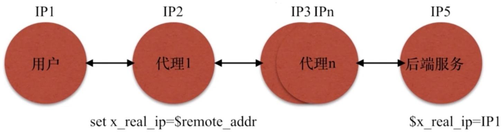

# 12.Nginx常⻅问题

# 12.Nginx常⻅问题

Server优先级

location优先级

try_files的使⽤

。 alias与root区别

。 获取⽤户真实IP

C 常⻅HTTP状态码

⽹站相关术语

⽹站访问原理

Nginx优化⽅案

Nginx架构总结

徐亮伟, 江湖⼈称标杆徐。多年互联⽹运维⼯作经验，曾负责过⼤规模集群架构⾃动化运维管理⼯作。擅⻓Web集群架构与⾃动化运维，曾负责国内某⼤型电商运维⼯作。

个⼈博客"徐亮伟架构师之路"累计受益数万⼈。

笔者Q:552408925、572891887

架构师群:471443208

# Nginx常⻅问题

1. Nginx 多个相同 Server_name 优先级

2.location 匹配优先级

3.try_files使⽤

4.Ngnx的alias和root区别

# Server优先级

Nginx 多个相同 Server_name 优先级

# 1.环境准备

```txt
[root@nginx ~]# mkdir /soft/code{1..3} -p
[root@nginx ~]# for i in {1..3};do echo "<h1>Code $i</h1>" > /soft/code"$i"/index.html;done 
```

# 2.准备多份相同 Nginx 配置⽂件


[root@Nginx	conf.d]#	ll


总⽤量 12


```txt
-rw-r--r-- 1 root root 123 4月 19 19:08 testserver1.conf
-rw-r--r-- 1 root root 123 4月 19 19:09 testserver2.conf
-rw-r--r-- 1 root root 123 4月 19 19:09 testserver3.conf
```


//内容如下


```txt
[root@Nginx conf.d]# cat testserver{1..3}.conf
server {
    listen 80;
    server_name testserver1 192.168.69.113;

    location / {
    root /soft/code1;
    index index.html;
    }
}
server {
    listen 80;
    server_name testserver2 192.168.69.113;

    location / {
    root /soft/code2;
    index index.html;
    }
}
server {
    listen 80;
    server_name testserver3 192.168.69.113;

    location / {
    root /soft/code3;
    index index.html;
    }
} 
```


//检测语法


```txt
[root@Nginx conf.d]# nginx -t
nginx: [warn] conflicting server name "192.168.69.113" on 0.0.0.0:80, ignored
nginx: [warn] conflicting server name "192.168.69.113" on 0.0.0.0:80, ignored
nginx: the configuration file /etc/nginx/nginx.conf syntax is ok
nginx: configuration file /etc/nginx/nginx.conf test is successful 
```


//重启Nginx


```batch
[root@Nginx conf.d]# nginx -t 
```

# 3.测试访问效果

```txt
[root@Nginx conf.d]# curl 192.168.69.113
<h1>Code 1</h1>
[root@Nginx conf.d]# mv testserver1.conf testserver5.conf
[root@Nginx conf.d]# nginx -s reload
[root@Nginx conf.d]# curl 192.168.69.113
<h1>Code 2</h1> 
```

# location优先级

⼀个 server 出现多个 location

<table><tr><td>完整匹配</td><td>优先级高</td></tr><tr><td>=</td><td>进行普通字符精确匹配,完全匹配</td></tr><tr><td>^~</td><td>表示普通字符匹配,使用前缀匹配</td></tr><tr><td>正则匹配</td><td>匹配后会继续查找更精确匹配的location</td></tr><tr><td>~</td><td>区分大小写匹配</td></tr><tr><td>~*</td><td>不区分大小写</td></tr></table>

# 1.实例准备

```txt
[root@Nginx conf.d]# cat testserver.conf
server {
    listen 80;
    server_name 192.168.69.113;
    root /soft;
    index index.html;

    location = /code1/ {
    rewrite^(.*)$ /code1/index.html break;
    }

    location ~ /code* {
    rewrite^(.*)$ /code3/index.html break;
    }
    location ^~ /code {
    rewrite^(.*)$ /code2/index.html break;
    }
} 
```


2.测试效果


```txt
[root@Nginx conf.d]# curl http://192.168.69.113/code1/
<h1>Code 1</h1>

//注释掉精确匹配=，重启Nginx
[root@Nginx ~]# curl http://192.168.69.113/code1/
<h1>Code 2</h1>

//注释掉^~，重启Nginx
[root@Nginx ~]# curl http://192.168.69.113/code1/
<h1>Code 3</h1>
```

# try_files的使⽤

nginx 的 try_files 按顺序检查⽂件是否存在

```scss
location /{
try_files $uri $uri/ /index.php;
} 
```

#1.检查⽤户请求的uri内容是否存在本地,存在则解析

#2.将请求加/,	类似于重定向处理

#3.最后交给index.php处理


1.演示环境准备


```txt
[root@Nginx ~]# echo "Try-Page" > /soft/code/index.html
[root@Nginx ~]# echo "Tomcat-Page" > /soft/app/apache-tomcat-9.0.7/webapps/ROOT/index.html

//启动tomcat
[root@Nginx ~]# sh /soft/app/apache-tomcat-9.0.7/bin/startup.sh
//检查tomcat端口
[root@Nginx ~]# netstat -lntp|grep 8080
tcp6 0 0 :::8080 :::* LISTEN 104
952/java
```


2.配置 Nginx 的 tryfiles


```shell
[root@Nginx ~]# cat /etc/nginx/conf.d/try.conf
server {
    listen 80;
    server_name 192.168.69.113;
    root /soft/code;
    index index.html;
    location / {
    try_files $uri @java_page;
    }
    location @java_page {
    proxy_pass http://127.0.0.1:8080;
    }
}

//重启Nginx
[root@Nginx ~]# nginx -s reload
```


3.测试 tryfiles


```txt
[root@Nginx ~]# curl http://192.168.69.113/index.html
Try -Page

// 将/soft/code/index.html 文件移走
[root@Nginx ~]# mv /soft/code/{index.html, index.html_bak}

// 发现由Tomcat吐回了请求
[root@Nginx ~]# curl http://192.168.69.113/index.html
Tomcat -Page
```

# alias与root区别


root 路径配置


```txt
[root@Nginx ~]# mkdir /local_path/code/request_path/code/ -p
[root@Nginx ~]# echo "Root" > /local_path/code/request_path/code/index.html
//Nginx的root配置
[root@Nginx ~]# cat /etc/nginx/conf.d/root.conf
server {
    listen 80;
    index index.html;
    location /request_path/code/ {
    root /local_path/code/;
```

```txt
}
//请求测试
[root@Nginx conf.d]# curl http://192.168.69.113/request_path/code/index.html
Root
//实际请求本地文件路径为
/local_path/code/'request_path/code'/index.html
```


alias 路径配置


```txt
[root@Nginx ~]# mkdir /Local_path/code/request_path/code/ -p
[root@Nginx ~]# echo "Alias" > /local_path/code/index.html

//配置文件
[root@Nginx ~]# cat /etc/nginx/conf.d/alias.conf
server {
    listen 80;
    index index.html;
    location /request_path/code/ {
    alias /local_path/code/;
    }
}

//测试访问
[root@Nginx ~]# curl http://192.168.69.113/request_path/code/index.html
Alias

//实际访问本地路径
/local_path/code/'index.html'
```

# 获取⽤户真实IP


Nginx 传递⽤户的真实IP地址





# 常⻅HTTP状态码

200 正常请求

301 永久跳转

302 临时跳转

400 请求参数错误

401 账户密码错误(authorization required)

403 权限被拒绝(forbidden)

404 ⽂件没找到(Not Found)

413 ⽤户上传⽂件⼤⼩限制(Request Entity Too Large)

502 后端服务⽆响应(boy gateway)

504 后端服务执⾏超时(Gateway Time-out)

# ⽹站相关术语

如果⼀栋⼤厦⾥所有⼯作⼈员通过1个IP公⽹接⼝上⽹, 总共100个设备, 当所有⼈同时请求⼀个⽹站, 并且刷新了5次, 那么请求pv、ip、uv分别是多少

pv:⻚⾯浏览量 500

uv:唯⼀设备100

ip:唯⼀出⼝ 1

# ⽹站访问原理

# 1.DNS流程

1.查询本地Hosts

2.请求本地localDNS

3.返回对应的IP

# 2.HTTP连接

1.建⽴TCP三次握⼿，发送请求内容, 请求头、请求的⾏、请求的主体

2.将请求传递给负载均衡, 负载均衡做对应的调度

3.如果请求的是静态⻚⾯, 那么调度⾄对应的静态集群组即可

4.如果请求的是动态⻚⾯, 将请求调度⾄动态集群组

1.如果仅仅是请求⻚⾯, 可能会经过Opcache缓存返回

2.如果请求⻚⾯需要查询数据库, 或者是往数据库插⼊内容

3.检查对应的操作是查询还是写⼊, 如果是查询数据库

4.检查查询的内容是否有被缓存, 如有缓存则返回

5.检查查询语句, 将查询结果返回

6.内存缓存Redis缓存对应的查询结果

7.返回对应客户端请求的内容⾄于WEB节点

8.WEB节点收到请求后返回内容⾄负载均衡

9.负载均衡返回客户端内容, TCP四次断开

# 3.HTTP断开连接

# ⾯试时需注意:

# 1.按照分层结构

CDN层->负载层->WEB层->存储层->缓存层->数据库层同时需要注意, 每⼀层都有对应的缓存机制

# Nginx优化⽅案

# Nginx优化

1.gzip压缩

2.expires静态⽂件缓存

3.调整⽹络IO模型,调整Nginx	worker进程的最⼤连接数

5.隐藏Nginx名称和版本号

6.配置防盗链，防⽌资源被盗⽤

7.禁⽌通过IP地址访问,禁⽌恶意域名解析,只允许域名访问

8.防DDOS、cc攻击,	限制单IP并发请求连接

9.配置错误⻚⾯，根据错误代码指定⽹⻚反馈⽤户

10.限制上传资源⽬录被程序访问,防⽌⽊⻢⼊侵系统

11.Nginx加密传输优化

# Nginx架构总结

# 基于Nginx中间件的架构

# 1.了解需求(定义Nginx在服务体系中的⻆⾊)

# 静态资源服务的功能设计

类型分类(视频、图⽚、html)

浏览器缓存

防盗链

流量限制

防资源盗⽤

压缩(压缩模式, 压缩⽐例, 压缩类型)

# 代理服务

协议类型

正向代理

反向代理

负载均衡

代理缓存

头信息处理

Proxy_Pass 

LNMP 

动静分离

# 2.设计评估

硬件 CPU、内存、磁盘

系统(⽤户权限、⽇志⽬录存放)

代理服务/负载均衡 (CPU、内存)

静态资源服务(硬盘容量、硬盘转速)

动态资源服务(硬盘转速、读写效率)

缓存资源服务(SSD固态)

# 3.配置注意事项

合理配置

了解原理

http协议原理

http状态原理

操作系统原理

# 关注⽇志

⽇志是否有打开

是否有对应请求

请求状态码信息符合

错误⽇志信息吐出来

错误⽇志内容和含义