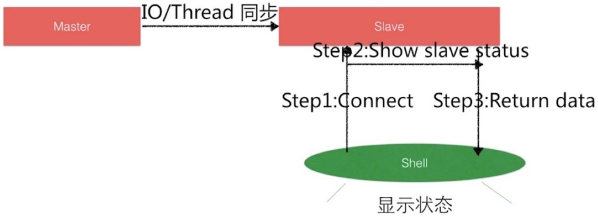

# 10.Shell项⽬实战


1. Shell 典型应⽤之主机存活状态,要求判断三次,如果三次失败则失败


```shell
cat ping_count_3.sh
#!/usr/bin/bash

IP="192.168.70"

for i in {150..170}
do
    IP_UP=$IP.$i
    for i in {1..3}
    do
    {
    ping -c1 -W1 $IP_UP &>/dev/null
    if [ $? -eq 0 ];then
    echo $IP_UP 连接成功!
    break
    fi
    echo $IP_UP 尝试"$i"次失败!
    }&
done
done
```


2.Shell典型应⽤之 MySQL 部署


```txt
cat mysql_install.sh
#!/usr/bin/bash 
```


#1.检查是否存在mysql对应的软件包


```shell
rpm_install_mysql(){
    rpm_check_mysql=$(rpm -qa|grep mysql-community-server|wc -l)
    rpm_check_mysql_version=$(rpm -qa|grep mysql-community-server)

    if [ $rpm_check_mysql -eq 0 ];then
    cat >/etc/yum.repos.d/mysql.repo<<-EOF
    [mysql57-community]
    name=MySQL 5.7 Community Server
    baseurl=http://repo.mysql.com/yum/mysql-5.7-community/el/7/x86_64
    enabled=1
    gpgcheck=1
    gpgkey=file:///etc/pki/rpm-gpg/RPM-GPG-KEY-mysql 
```

```shell
EOF
yum clean all && yum makecache
yum install -y mysql-community-server
else
echo "${rpm_check_mysql_version%-*} Installed Ok"
fi
}
#2. 初始化MySQL数据库
clear_mysql(){
    systemctl start mysqld
    if [ $? -eq 0 ];then
    Mysql_old_pass=$(grep "temporary password" /var/log/mysqld.log |tail -n1|aw k -F '[:]' '{print $NF}')
    mysqladmin -uroot -p"$Mysql_old_pass" password "Xuliangwei.com123"
    fi
}
rpm_install_mysql
clear_mysql
```

# 3.Shell典型应⽤之LNMP架构部署

```txt
config目录
nginx_install.sh
php_install.sh
```

# 4.Shell典型应⽤之服务器初始化脚本

1.配置yum源

2.安装基础软件

```txt
yum install -y vim nc iotop iftop glances dstat telnet wget 更新系统内核、
```

```batch
yum update && rm -rf /etc/yum.repos.d/CentOS* 
```

3.调整⽂件描述符

```txt
/etc/security/limits.d/20-nproc.conf 
```

```txt
* soft nproc 65535
* hard nproc 65535
* soft nofile 65535
* hard nofile 65535 
```

4.调整时区

```shell
test -f /etc/localtime && rm -f /etc/localtime && \
ln -s /usr/share/zoneinfo/Asia/Shanghai /etc/localtime 
```

5.调整语⾔

```shell
sed -i 's#LANG=.*#LANG="en_US.UTF-8"#g' /etc/locale.conf 
```

6.时间同步

7.调整防⽕墙与selinux

8.关闭ipv6

```shell
cd /etc/modprobe.d/ && touch ipv6.conf
cat >> /etc/modprobe.d/ipv6.conf << EOF
alias net-pf-10 off
alias ipv6 off
EOF 
```

9.调整历史记录

修改为100000

```shell
grep -q 'HISTTIMEFORMAT' /etc/profile
if [ $? -eq 0 ];then
sed -i 's/^HISTTIMEFORMAT=.*$/HISTTIMEFORMAT="%F %T"/' /etc/profile
else
echo 'HISTTIMEFORMAT="%F %T " ' >> /etc/profile
fi 
```

10调整内核参数

```txt
cat >> /etc/sysctl.conf <<EOF
net.ipv4.tcp_tw_reuse=1
net.ipv4.tcp_tw_recycle=0
EOF 
```

# 场景脚本

Shell脚本

获取操作系统运行状态

分析应用状态


场景脚本结构


1.Shell典型应⽤之主控脚本实现


```shell
cat monitor_main.sh
#!/usr/bin/bash
resettem=$(tput sgr0)
declare -A ssharray

i=0
numbers="

for scripts_file in `ls -I "montor_main.sh" ./`
do
    echo -e "\e[1;35m" "The Scripts:" ${i}'==>' ${resettem} ${scripts_file}
    ssharray[$i]=${scripts_file}
    numbers="${numbers} | ${i}"
    i=$(i+1))
done
while true
do
    read -p "Please input a number [ ${numbers} ]:" execshell
    if [[ ! ${execshell} =~ ^[0-9]+ ]];then
    exit
    fi
    /usr/bin/bash ./${ssharray[$execshell]}
done 
```


2.Shell典型应⽤之系统信息及运⾏状态获取


```txt
cat system_info.sh 
```

```shell
#!/usr/bin/bash
#Program function system_info
resettem=$(tput sgr0)
# Check OS Type
Os=$(hostnamectl |awk -F":" '/Operating System/ {print $2}')
echo -e "\e[1;35m" "当前的系统版本-->" "${resettem}""${Os}"
# Check Kernel Release
Os_kernel=$(hostnamectl |awk -F":" '/Kernel/ {print $2}')
echo -e "\e[1;35m" "当前的系统内核-->" "${resettem}""${Os_kernel}"
# Check Architecture
Os_Arch=$(hostnamectl |awk -F":" '/Architecture/ {print $2}')
echo -e "\e[1;35m" "当前的系统平台-->" "${resettem}""${Os_Arch}"
# Check Hostname
Os_HostName=$(hostnamectl |awk -F":" '/Static hostname/ {print $2}')
echo -e "\e[1;35m" "当前的系统名称-->" "${resettem}""${Os_HostName}"
# Check Internal IP
Internalip=$(hostname -I)
echo -e "\e[1;35m" "当前的内网IP-->" "${resettem}""${Internalip}"
# Check External IP
Externalip=$(curl -s icanhazip.com)
echo -e "\e[1;35m" "当前的外网IP-->" "${resettem}""${Externalip}"
# Check DNS Name
NameServer=$(awk "/nameserver/{print $2}" /etc/resolv.conf)
echo -e "\e[1;35m" "当前的DNS-->" "${resettem}""${NameServer}"
# Check if connected to Internet or not
ping -c2 xuliangwei.com &>/dev/null && \
echo -e "\e[1;35m" "当前网络畅通-->" "${resettem}""Connected" || \
echo -e "\e[1;35m" "当前网络阻塞-->" "${resettem}""Disconnected"
# Check Logged In Users
who>/tmp/who
echo -e "\e[1;35m" "用户状态信息-->" "${resettem}" && \
cat /tmp/who && rm -f /tmp/who

# Check System Free
system_mem_usages=$(free -mh|awk '/Mem/{print $NF}')
echo -e "\e[1;35m" "系统可用内存-->" "${resettem}""${system_mem_usages}"
# Check System Load
loadaverge=$(top -n 1 -b|awk '/load/{print $12,$13,$14}')
echo -e "\e[1;35m" "系统负载状态-->" "${resettem}""${loadaverge}"
# Chkek Disk
DiskStatus=$(df -h|awk '!/(Filesystem|tmpfs|boot)/')
echo -e "\e[1;35m" "系统磁盘状态-->" "${resettem}""${DiskStatus}"
```

4.Shell典型应⽤之nginx和mysql应⽤状态分析

# 监控Mysql主从复制状态




# 监控MySQL主从复制状态

1.搭建主从复制环境

2.基于mysql客户端连接，获取主从复制状态

3.使⽤show slave status\G;获取状态信息

Slave_IO_Running IO线程是否有连接到主服务器上

Seconds_Behind_Master 主从同步的延时时间

```shell
Check_Mysql_Server(){
    nc -z -w2 ${Mysql_Slave_Server} 3306 &>/dev/null
} 
```

# 4.Shell典型应⽤之应⽤⽇志分析

# 应用日志分析脚本


# 应用日志分析脚本

# HTTP状态码介绍

1** 信息，服务器收到请求，需要请求者继续执行操作

2** 成功，操作被成功接收并处理

3** 重定向，需要进一步的操作以完成请求

4** 客户端错误，请求包含语法错误或无法完成请求

5**服务器错误，服务器在处理请求的过程中发生了错误

# 应用日志分析脚本

# 脚本实现功能介绍

功能一、分析HTTP状态码在100-200、200-300、300-400、400-500、500以上，五个区间的请求条数。

cat	loginfo.sh 

#!/usr/bin/bash 

resettem=$(tput	sgr0) 

```shell
Logfile=/soft/scripts/log/log.bjstack.log
Nginx_Status_code=( \(cat $LogFile |egrep -io "HTTP/1\.[0|1]\"[[:blank:]][0-9]{3}"|awk -F "[ ]+" '{
    if(\(2\)=100 && \(2<200\))
    {i++}
    else if(\(2\)=200 && \(2<300\))
    {j++}
    else if(\(2\)=300 && \(2<400\))
    {k++}
    else if(\(2\)=400 && \(2<500\))
    {n++}
    else if(\(2<500\))
    {p++}
}END{ print i?i:0,j?j:0,k?k:0,n?n:0,p?p:0,i+j+k+n+p}'
)
echo -e "\e[1;35m" "Http Status[100+]: ""${resettem} ${Nginx_Status_code[0]}"
echo -e "\e[1;35m" "Http Status[200+]: ""${resettem} ${Nginx_Status_code[1]}"
echo -e "\e[1;35m" "Http Status[300+]: ""${resettem} ${Nginx_Status_code[2]}"
echo -e "\e[1;35m" "Http Status[400+]: ""${resettem} ${Nginx_Status_code[3]}"
echo -e "\e[1;35m" "Http Status[500+]: ""${resettem} ${Nginx_Status_code[4]}"
echo -e "\e[1;35m" "Http Status[Total]:"${resettem} ${Nginx_Status_code[5]}" 
```