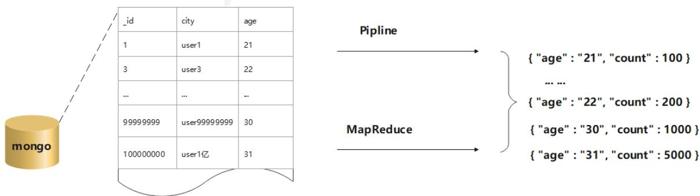
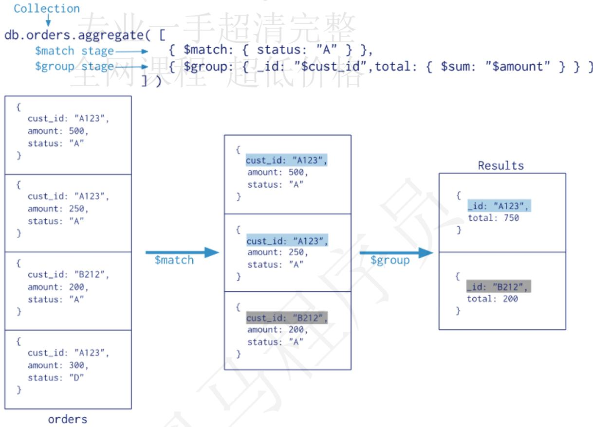
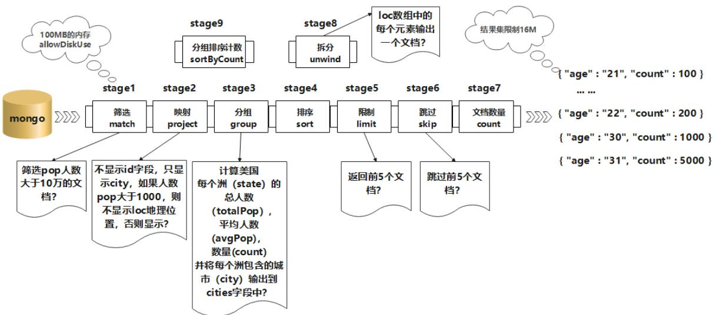
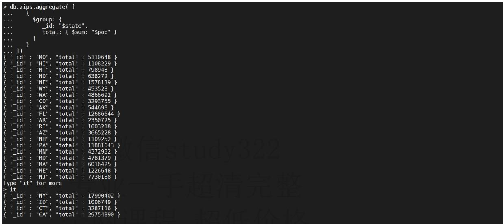
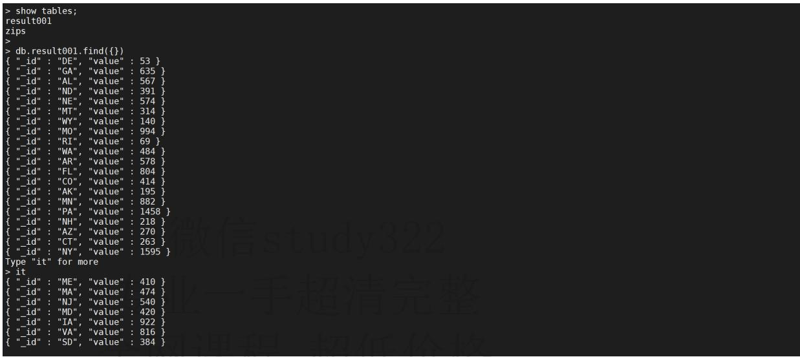

| _id       | city         | age  |
| --------- | ------------ | ---- |
| 1         | user1        | 21   |
| 3         | user3        | 22   |
| ...       | ...          | ..   |
| 99999999  | user99999999 | 30   |
| 100000000 | user1亿      | 31   |

# mongoDB

## MongoDB聚合查询

## 什么是聚合查询

聚合操作主要用于处理数据并返回计算结果。聚合操作将来自多个文档的值组合在一起，按条件分组后，再进行一系列操作（如求和、平均值、最大值、最小值）以返回单个结果。

## MongoDB的聚合查询

聚合是MongoDB的高级查询语言，它允许我们通过转化合并由多个文档的数据来生成新的在单个文档里不存在的文档信息。MongoDB中聚合(aggregate)主要用于处理数据（例如分组统计平均值、求和、最大值等），并返回计算后的数据结果，有点类似sql语句中的count(*)、group by。

在MongoDB中，有两种方式计算聚合：Pipeline 和 MapReduce。Pipeline 查询速度快于 MapReduce，但是MapReduce的强大之处在于能够在多台Server上并行执行复杂的聚合逻辑。MongoDB 不允许 Pipeline 的单个聚合操作占用过多的系统内存。



## 聚合管道方法

MongoDB 的聚合框架就是将文档输入处理管道，在管道内完成对文档的操作，最终将文档转换为聚合结果，MongoDB的聚合管道将MongoDB文档在一个管道处理完毕后将结果传递给下一个管道处理，管道操作是可以重复的。

最基本的管道阶段提供过滤器，其操作类似查询和文档转换，可以修改输出文档的形式。其他管道操作提供了按特定字段对文档进行分组和排序的工具，以及用于聚合数组内容（包括文档数组）的工具。

此外，在管道阶段还可以使用运算符来执行诸如计算平均值或连接字符串之类的任务。聚合管道可以在分片集合上运行。

## 聚合流程

db.collection.aggregate()是基于数据处理的聚合管道，每个文档通过一个由多个阶段（stage）组成的管道，可以对每个阶段的管道进行分组、过滤等功能，然后经过一系列的处理，输出相应的结果。

聚合管道方法的流程参见下图



上图的聚合操作相当于 MySQL 中的以下语句：

select cust_id as _id, sum(amount) as total from orders where status like "%A%" group by cust_id;

## 详细流程



1. db.collection.aggregate() 可以用多个构件创建一个管道，对于一连串的文档进行处理。这些构件包括：筛选操作的 match、映射操作的 project、分组操作的 group、排序操作的 sort、限制操作的 limit、和跳过操作的 skip。

1. db.collection.aggregate() 使用了MongoDB内置的原生操作，聚合效率非常高,支持类似于SQL Group By操作的功能，而不再需要用户编写自定义的JavaScript例程。

1. 每个阶段管道限制为100MB的内存。如果一个节点管道超过这个极限,MongoDB将产生一个错误。为了能够在处理大型数据集,可以设置 allowDiskUse 为 true 来在聚合管道节点把数据写入临时文件。这样就可以解决100MB的内存的限制。

1. db.collection.aggregate() 可以作用在分片集合，但结果不能输在分片集合，MapReduce 可以作用在分片集合，结果也可以输在分片集合。

1. db.collection.aggregate() 方法可以返回一个指针（cursor），数据放在内存中，直接操作。跟Mongo shell 一样指针操作。

1. db.collection.aggregate() 输出的结果只能保存在一个文档中，BSON Document 大小限制为 16M。可以通过返回指针解决，版本2.6中：DB.collect.aggregate() 方法返回一个指针，可以返回任何结果集的大小。

## 聚合语法

db.collection.aggregate(pipeline, options)

## 参数说明

| 参数     | 类型     | 描述                                                         |
| -------- | -------- | ------------------------------------------------------------ |
| pipeline | array    | 一系列数据聚合操作或阶段。详见聚合管道操作符 在版本2.6中更改:该方法仍然可以将流水线阶段作为单独的参数接受,而不是作为数组中的元素;但是,如果不将管道指定为数组,则不能指定options参数 |
| options  | document | 可选。aggregate()传递给聚合命令的其他选项。2.6版中的新增功能:仅当将管道指定为数组时才可用。 |

## 注意事项

使用db.collection.aggregate()直接查询会提示错误，但是传一个空数组如db.collection.aggregate([])则不会报错，且会和find一样返回所有文档。

## 常用聚合管道

## 与mysql聚合类比

为了便于理解，先将常见的mongo的聚合操作和mysql的查询做下类比

| SQL 操作/函数 | mongodb聚合操作 |
| ------------- | --------------- |
| where         | $match          |
| group by      | $group          |
| having        | $match          |
| select        | $project        |
| order by      | $sort           |
| limit         | $limit          |
| sum()         | $sum            |
| count()       | $sum            |
| join          | $lookup         |

## $count

返回包含输入到stage的文档的计数，理解为返回与表或视图的find()查询匹配的文档的计数。

db.collection.count()方法不执行find()操作，而是计数并返回与查询匹配的结果数。

## 语法

{$count: }

Costa阶段相当于下面*g**r**o**u**p*+project的序列:

```
db.zips.aggregate([
    {
    "$group": {
    "_id": null,
    "count": { // 这里count自定义，相当于mysql的select count(*) as tables
    "$sum": 1
    }
    }
},
{
    "$project": { // 返回不显示_id字段
    "_id": 0
    }
}
])
```

## 示例

查询人数是 100000 以上的城市的数量

- $match: 阶段排除pop小于等于100000的文档, 将大于100000的文档传到下个阶段

- *c**o**u**n**t* : *阶**段**返**回**聚**合**管**道**中**剩**余**文**档**的**计**数*, *并**将**该**值**分**配**给**名**为**c**o**u**n**t**的**字**段*。

```
db.zips.aggregate([
    {
    "$match": {
    "pop": {
    "$gt": 100000
    }
    }
},
{
    "$count": "count"
} 
> db.zips.aggregate( [
...    {
...    \(match:{pop:{\$gt:100000}\)
...    },
...    {
...    \(count:"count"
...    }
... ])
{ "count" : 4 }
>
> 
```

## $group

按指定的表达式对文档进行分组，并将每个不同分组的文档输出到下一个阶段。输出文档包含一个_id字段，该字段按键包含不同的组。

输出文档还可以包含计算字段，该字段保存由 *g**r**o**u**p* 的_id字段分组的一些accumulator表达式的值。 *g**r**o**u**p* 不会输出具体的文档而只是统计信息。

## 语法

{ $group: { _id: , : {  : }, ... } }

- _id字段是必填的;但是，可以指定_id值为null来为整个输入文档计算累计值。

- 剩余的计算字段是可选的，并使用  运算符进行计算。

- _id 和  表达式可以接受任何有效的表达式。

## accumulator操作符

| 名称        | 描述                                                         | 类比sql  |
| ----------- | ------------------------------------------------------------ | -------- |
| $avg        | 计算均值                                                     | avg      |
| $first      | 返回每组第一个文档,如果有排序,按照排序,如果没有按照默认的存储的顺序返回第一个文档。 | limit0,1 |
| $last       | 返回每组最后一个文档,如果有排序,按照排序,如果没有按照默认的存储的顺序返回最后一个文档。 | -        |
| $max        | 根据分组,获取集合中所有文档对应值的最大值。                  | max      |
| $min        | 根据分组,获取集合中所有文档对应值的最小值。                  | min      |
| $push       | 将指定的表达式的值添加到一个数组中。                         | -        |
| $addToSet   | 将表达式的值添加到一个集合中(无重复值,无序)。                | -        |
| $sum        | 计算总和                                                     | sum      |
| $stdDevPop  | 返回输入值的总体标准偏差(population standard deviation)      | -        |
| $stdDevSamp | 返回输入值的样本标准偏差(the sample standard deviation)      | -        |

*g**r**o**u**p* 阶段的内存限制为100M，默认情况下，如果stage超过此限制， *g**r**o**u**p* 将产生错误，但是，要允许处理大型数据集，请将allowDiskUse选项设置为true以启用 *g**r**o**u**p* 操作以写入临时文件。

## 注意：

- "$addToSet":expr，如果当前数组中不包含expr，那就将它添加到数组中。

- "$push":expr，不管expr是什么值，都将它添加到数组中，返回包含所有值的数组。

## 示例

按照 state 分组，并计算每一个 state 分组的总人数，平均人数以及每个分组的数量

```
db.zips.aggregate([
    {
    "$group": {
    "_id": "$state",
    "totalPop": {
    "$sum": "$pop"
    },
    "avglPop": {
    "$avg": "$pop"
    },
    "count": {
    "$sum": 1
    }
    }
    }
]) 
> db.zips.aggregate( [
...    {
...    $group: {
...    _id: "$state"
...    }
...    }
... }] 
{ "_id" : "CO" }
{ "_id" : "AK" }
{ "_id" : "VT" }
{ "_id" : "IL" }
{ "_id" : "WI" }
{ "_id" : "UT" }
{ "_id" : "TN" }
{ "_id" : "MS" }
{ "_id" : "IN" }
{ "_id" : "DE" }
{ "_id" : "GA" }
{ "_id" : "AL" }
{ "_id" : "VA" }
{ "_id" : "IA" }
{ "_id" : "SD" }
{ "_id" : "WV" }
{ "_id" : "KS" }
{ "_id" : "TX" }
{ "_id" : "HI" }
{ "_id" : "OR" }
Type "it" for more
> it 
{ "_id" : "NC" }
{ "_id" : "DC" }
{ "_id" : "KY" }
{ "_id" : "SC" } 
> db.zips.aggregate( [
...    {
...    $group: {
...    _id: "$state",
...    totalPop: { $sum: "$pop" },
...    avglPop: { $avg: "$pop" },
...    count:{$sum:1}
...
...    }
...
...    }
{ "_id": "CO", "totalPop": 3293755, "avglPop": 7955.929951690821, "count": 414 }
{ "_id": "AK", "totalPop": 544698, "avglPop": 2793.3230769230768, "count": 196 }
{ "_id": "VT", "totalPop": 562758, "avglPop": 2315.8765432098767, "count": 243 }
{ "_id": "IL", "totalPop": 11427576, "avglPop": 9238.137429264349, "count": 1237 }
{ "_id": "WI", "totalPop": 4891769, "avglPop": 6832.079608938548, "count": 716 }
{ "_id": "UT", "totalPop": 1722850, "avglPop": 8404.146341463415, "count": 205 }
{ "_id": "TN", "totalPop": 4876457, "avglPop": 8378.792096219931, "count": 582 }
{ "_id": "MS", "totalPop": 2573216, "avglPop": 7088.749311294766, "count": 363 }
{ "_id": "TN", "totalPop": 5544136, "avglPop": 8201.384615384615, "count": 676 }
{ "_id": "DE", "totalPop": 666168, "avglPop": 12569.207547169812, "count": 53 }
{ "_id": "GA", "totalPop": 6478216, "avglPop": 10201.914960629922, "count": 635 }
{ "_id": "AL", "totalPop": 4040587, "avglPop": 7126.255731922399, "count": 567 }
{ "_id": "VA", "totalPop": 6181479, "avglPop": 7575.341911764706, "count": 816 }
{ "_id": "IA", "totalPop": 2776420, "avglPop": 3011.301518438178, "count": 922 }
{ "_id": "SD", "totalPop": 695397, "avglPop": 1810.9296875, "count": 384 }
{ "_id": "WV", "totalPop": 1793146, "avglPop": 2733.454268292683, "count": 656 }
{ "_id": "KS", "totalPop": 2475285, "avglPop": 3461.937062937063, "count": 715 }
{ "_id": "TX", "totalPop": 16984601, "avglPop": 10164.333333333334, "count": 1671 }
{ "_id": "HI", "totalPop": 1108229, "avglPop": 13852.8625, "count": 80 }
{ "_id": "OR", "totalPop": 2842321, "avglPop": 7401.877604166667, "count": 384 }
Type "it" for more
> it
{ "_id": "NC", "totalPop": 6628637, "avglPop": 9402.321985815603, "count": 705 } 
```

查找不重复的所有的 state 的值

```
db.zips.aggregate([
    {
    "$group": {
    "_id": "$state"
    }
    }
]) 
```

按照 city 分组，并且分组内的 state 字段列表加入到 stateItem 并显示下面聚合操作使用系统变量$$ROOT按item对文档进行分组，生成的文档不得超过BSON文档大小限制

```
db.zips.aggregate([
    {
    "$group": {
    "_id": "$city",
    "stateItem": {
    "$push": "$state"
    }
    }
    }
]) 
> db.zips.aggregate( [
    ...
    {
    $group: {
    _id: "$city",
    stateItem:{$push:"$state"}
    }
    }
    ...
    })
    {"_id": "POINTE AUX PINS", "stateItem": ["MI"]}
    {"_id": "HARRIMAN", "stateItem": ["NY", "TN"]}
    {"_id": "WARREN CENTER", "stateItem": ["PA"]}
    {"_id": "CIRCLE", "stateItem": ["MT", "AK"]}
    {"_id": "STEELE CITY", "stateItem": ["NE"]}
    {"_id": "SOUTH CHATHAM", "stateItem": ["MA", "MA"]}
    {"_id": "TYNER", "stateItem": ["NC"]}
    {"_id": "STOVALL", "stateItem": ["GA", "MS"]}
    {"_id": "READYVILLE", "stateItem": ["TN"]}
    {"_id": "CRISP", "stateItem": ["NC"]}
    {"_id": "CUTHBERT", "stateItem": ["GA"]}
    {"_id": "AMF OHARE", "stateItem": ["IL"]}
    {"_id": "SARASOTA", "stateItem": ["FL", "FL", "FL", "FL", "FL", "FL", "FL", "FL"]}
    {"_id": "SCROGGINS", "stateItem": ["TX"]}
    {"_id": "EAST ORLAND", "stateItem": ["ME"]}
    {"_id": "LEAKEY", "stateItem": ["TX"]}
    {"_id": "NEW LEBANON", "stateItem": ["NY", "OH"]}
    {"_id": "DE FUNIAK SPRING", "stateItem": ["FL"]}
    {"_id": "JENISON", "stateItem": ["MI"]}
    {"_id": "OHIOPYLE", "stateItem": ["PA"]}
Type "it" for more
> it
{
    {"_id": "KEGLEY", "stateItem": ["WV"]}
    {"_id": "TWAIN", "stateItem": ["CA"]}
    {"_id": "HAWI", "stateItem": ["HI"]}
    {"_id": "PAUL", "stateItem": ["ID"]} 
db.zips.aggregate([
    {
    "$group": {
    "_id": "$city",
    "item": {
    "$push": "$$ROOT"
    }
    }
    }
]).pretty(); 
> db.zips.aggregate( [
    ...    {
    ...    $group: {
    ...    _id: "$city",
    ...    item:{$push: "$$ROOT"}
    ...    }
    ...
    ... ]).pretty();
{
    "_id": "BONAIRE",
    "item": [
    {
    "_id": "31005",
    "city": "BONAIRE",
    "loc": [
    -83.604736,
    32.546037
    ],
    "pop": 5095,
    "state": "GA"
    }
    ]
}
{
    "_id": "CHALLIS",
    "item": [
    {
    "_id": "83226",
    "city": "CHALLIS",
    "loc": [
    -114.19463,
    44.496912
    ],
    "pop": 2426, 
```

## $match

过滤文档，仅将符合指定条件的文档传递到下一个管道阶段。

$match接受一个指定查询条件的文档，查询语法与读操作查询语法相同。

## 语法

```
{ $match: { <query> } } 
```

## 管道优化

$match用于对文档进行筛选,之后可以在得到的文档子集上做聚合,$match可以使用除了地理空间之外的所有常规查询操作符,在实际应用中尽可能将$match放在管道的前面位置。这样有两个好处:

- 一是可以快速将不需要的文档过滤掉，以减少管道的工作量；

- 二是如果再投射和分组之前执行$match，查询可以使用索引。

## 使用限制

- 不能在 $match 查询中使用 $作为聚合管道的一部分。

- 要在 $match 阶段使用 *t**e**x**t*，match 阶段必须是管道的第一阶段。

- 视图不支持文本搜索。

## 示例

使用 $match做简单的匹配查询，查询缩写是 NY 的城市数据

```
db.zips.aggregate([
    {
    "$match": {
    "state": "NY"
    }
    }
]).pretty(); 
> db.zips.aggregate( [
    ...
    {
    $match: {
    "state": "NY"
    }
    }
... ]).pretty();
{
    "id": "06390",
    "city": "FISHERS ISLAND",
    "loc": [
    -72.017834,
    41.263934
    ],
    "pop": 329,
    "state": "NY"
}
{
    "id": "10001",
    "city": "NEW YORK",
    "loc": [
    -73.996705,
    40.74838
    ],
    "pop": 18913,
    "state": "NY"
}
{
    "id": "10002",
    "city": "NEW YORK",
    "loc": [
    -73.987681,
    40.715231
    ],
} 
```

使用*m**a**t**c**h**管**道**选**择**要**处**理**的**文**档*，*然**后**将**结**果**输**出**到*group管道以计算文档的计数

```
db.zips.aggregate([
    {
    "$match": {
    "state": "NY"
    }
    },
    { 
"$group": {
    "_id": null,
    "sum": {
    "$sum": "$pop"
    },
    "avg": {
    "$avg": "$pop"
    },
    "count": {
    "$sum": 1
    }
}
}).pretty(); 
> db.zips.aggregate( [
    ...
    {
    $match: {
    "state":"NY"
    }
    },
    {
    $group: {
    _id:null,
    sum:{$sum: "$pop"},
    avg:{$avg: "$pop"},
    count:{$sum:1}
    }
    }
    ]).pretty();
{
    "_id": null,
    "sum": 17990402,
    "avg": 11279.248902821317,
    "count": 1595
} 
```

## $unwind

从输入文档解构数组字段以输出每个元素的文档，简单说就是可以将数组拆分为单独的文档。

## 语法

要指定字段路径，在字段名称前加上$符并用引号括起来。

```
{$unwind: <field path>} 
```

## v3.2+支持如下语法

```
{
    $unwind:
    {
    path: <field path>,
    #可选,一个新字段的名称用于存放元素的数组索引。该名称不能以$开头。
    includeArrayIndex: <string>,
    #可选,default :false,若为true,如果路径为空,缺少或为空数组,则$unwind输出文档
    preserveNullAndEmptyArrays: <boolean>
    }
}
```

如果为输入文档中不存在的字段指定路径，或者该字段为空数组，则$unwind默认会忽略输入文档，并且不会输出该输入文档的文档。

版本3.2中的新功能：要输出数组字段丢失的文档，null或空数组，请使用选项preserveNullAndEmptyArrays。

## 示例

以下聚合使用$unwind为loc数组中的每个元素输出一个文档:

```
db.zips.aggregate([
    {
    "$match": {
    "_id": "01002"
    }
    },
    {
    "$unwind": "$loc"
    }
]).pretty();
db.zips.aggregate([
    {
    "$match": {
    "_id": "01002"
    }
    },
    {
    "$unwind": {
    "path": "$loc",
    "includeArrayIndex": "locIndex",
    "preserveNullAndEmptyArrays": true
    }
    }
]).pretty(); 
> db.zips.aggregate( [
    ...    {
    ...    $match: {
    ...    "_id":"01002"
    ...    }
    ...    },
    ...
    ...    $unwind: "$loc"
    ...    }
... ]).pretty();
{
    "_id": "01002",
    "city": "CUSHMAN",
    "loc": -72.51565,
    "pop": 36963,
    "state": "MA"
}
{
    "_id": "01002",
    "city": "CUSHMAN",
    "loc": 42.377017,
    "pop": 36963,
    "state": "MA"
}
> 
```

## $project

$project可以从文档中选择想要的字段，和不想要的字段（指定的字段可以是来自输入文档或新计算字段的现有字段），也可以通过管道表达式进行一些复杂的操作，例如数学操作，日期操作，字符串操作，逻辑操作。

## 语法

$project 管道符的作用是选择字段（指定字段，添加字段，不显示字段,_id: 0，排除字段等），重命名字段，派生字段。

```
{ $project: { <specification(s)> } } 
```

specifications有以下形式:

: <1 or true> 是否包含该字段，field:1/0，表示选择/不选择 field:  添加新字段或重置现有字段的值。在版本3.6中更改：MongoDB 3.6添加变量REMOVE。如果表达式的计算结果为$$REMOVE，则该字段将排除在输出中。

_id: <0 or false> 是否指定_id字段

: <0 or false> v3.4新增功能，指定排除字段

- 默认情况下，_id字段包含在输出文档中。要在输出文档中包含输入文档中的任何其他字段，必须明确指定*p**r**o**j**e**c**t**中**的**包**含*。*如**果**指**定**包**含**文**档**中**不**存**在**的**字**段*，project将忽略该字段包含，并且不会将该字段添加到文档中。

- 默认情况下，id字段包含在输出文档中。要从输出文档中排除id字段，必须明确指定$project中的_id字段为0。

- v3.4版新增功能-如果指定排除一个或多个字段,则所有其他字段将在输出文档中返回。如果指定排除_id以外的字段,则不能使用任何其他$project规范表单:即,如果排除字段,则不能指定包含字段,重置现有字段的值或添加新字段。此限制不适用于使用REMOVE变量条件排除字段。

- v3.6版本中的新功能-从MongoDB 3.6开始，可以在聚合表达式中使用变量REMOVE来有条件地禁止一个字段。

- 要添加新字段或重置现有字段的值，请指定字段名称并将其值设置为某个表达式。

- 要将字段值直接设置为数字或布尔文本,而不是将字段设置为解析为文字的表达式,请使用 *l**i**t**e**r**a**l* 操作符。否则, *p**r**o**j**e**c**t* 会将数字或布尔文字视为包含或排除该字段的标志。

- 通过指定新字段并将其值设置为现有字段的字段路径，可以有效地重命名字段。

- 从MongoDB 3.2开始，$project阶段支持使用方括号[]直接创建新的数组字段。如果数组规范包含文档中不存在的字段，则该操作会将空值替换为该字段的值。

- 在版本3.4中更改-如果$project 是一个空文档，MongoDB 3.4和更高版本会产生一个错误。

- 投影或添加/重置嵌入文档中的字段时，可以使用点符号

## 示例

以下*p**r**o**j**e**c**t**阶**段**的**输**出**文**档**中**只**包**含**i**d*，*c**i**t**y**和**s**t**a**t**e**字**段**i**d**字**段**默**认**包**含**在**内*。*要**从* project阶段的输出文档中排除_id字段，请在project文档中将_id字段设置为0来指定排除_id字段。

```
db.zips.aggregate([
    {
    "$project": {
    "_id": 1,
    "city": 1,
    "state": 1
    }
    }
]).pretty(); 
> db.zips.aggregate( [
...    {
...    $project : {
...    "id":1,
...    "city":1,
...    "state":1,
...    }
...    }
... ]).pretty();
{"_id": "01002", "city": "CUSHMAN", "state": "MA" }
{"_id": "01007", "city": "BELCHERTOWN", "state": "MA" }
{"_id": "01008", "city": "BLANDFORD", "state": "MA" }
{"_id": "01010", "city": "BRIMFIELD", "state": "MA" }
{"_id": "01011", "city": "CHESTER", "state": "MA" }
{"_id": "01012", "city": "CHESTERFIELD", "state": "MA" }
{"_id": "01013", "city": "CHICOPEE", "state": "MA" }
{"_id": "01005", "city": "BARRE", "state": "MA" }
{"_id": "01022", "city": "WESTOVER AFB", "state": "MA" }
{"_id": "01026", "city": "CUMMINGTON", "state": "MA" }
{"_id": "01027", "city": "MOUNT TOM", "state": "MA" }
{"_id": "01028", "city": "EAST LONGMEADOW", "state": "MA" }
{"_id": "01030", "city": "FEEDING HILLS", "state": "MA" }
{"_id": "01031", "city": "GILBERTVILLE", "state": "MA" }
{"_id": "01001", "city": "AGAWAM", "state": "MA" }
{"_id": "01033", "city": "GRANBY", "state": "MA" }
{"_id": "01035", "city": "HADLEY", "state": "MA" }
{"_id": "01034", "city": "TOLLAND", "state": "MA" }
{"_id": "01036", "city": "HAMPDEN", "state": "MA" }
{"_id": "01032", "city": "GOSHEN", "state": "MA" }
Type "it" for more
> it
{"_id": "01020", "city": "CHICOPEE", "state": "MA" }
{"_id": "01038", "city": "HATFIELD", "state": "MA" }
{"_id": "01039", "city": "HAYDENVILLE", "state": "MA" } 
db.zips.aggregate([
    {
    "$project": {
    "loc": 0
    }
    }
]).pretty(); 
db.zips.aggregate([
    {
    "$project": {
    "_id": 0,
    "city": 1,
    "state": 1
    }
    }
]).pretty(); 
> db.zips.aggregate( [
    ...    {
    ...    $project : {
    ...    "_id":0,
    ...    "city":1,
    ...    "state":1,
    ...    }
    ...    }
    ... 1).pretty();
{ "city" : "CUSHMAN", "state" : "MA" }
{ "city" : "BELCHERTOWN", "state" : "MA" }
{ "city" : "BLANDFORD", "state" : "MA" }
{ "city" : "BRIMFIELD", "state" : "MA" }
{ "city" : "CHESTER", "state" : "MA" }
{ "city" : "CHESTERFIELD", "state" : "MA" }
{ "city" : "CHICOPEE", "state" : "MA" }
{ "city" : "BARRE", "state" : "MA" }
{ "city" : "WESTOVER AFB", "state" : "MA" }
{ "city" : "CUMMINGTON", "state" : "MA" }
{ "city" : "MOUNT TOM", "state" : "MA" }
{ "city" : "EAST LONGMEADOW", "state" : "MA" }
{ "city" : "FEEDING HILLS", "state" : "MA" }
{ "city" : "GILBERTVILLE", "state" : "MA" }
{ "city" : "AGAWAM", "state" : "MA" }
{ "city" : "GRANBY", "state" : "MA" }
{ "city" : "HADLEY", "state" : "MA" }
{ "city" : "TOLLAND", "state" : "MA" }
{ "city" : "HAMPDEN", "state" : "MA" }
{ "city" : "GOSHEN", "state" : "MA" }
Type "it" for more
> it
{ "city" : "CHICOPEE", "state" : "MA" }
{ "city" : "HATFIELD", "state" : "MA" }
{ "city" : "HAYDENVILLE", "state" : "MA" } 
```

以下$ project阶段从输出中排除loc字段

```
> db.zips.aggregate( [
...    {
...    $project : {
...    "loc":0
...    }
...    }
... }).pretty();
{"_id": "01002", "city": "CUSHMAN", "pop": 36963, "state": "MA" }
{"_id": "01007", "city": "BELCHERTOWN", "pop": 10579, "state": "MA" }
{"_id": "01008", "city": "BLANDFORD", "pop": 1240, "state": "MA" }
{"_id": "01010", "city": "BRIMFIELD", "pop": 3706, "state": "MA" }
{"_id": "01011", "city": "CHESTER", "pop": 1688, "state": "MA" }
{"_id": "01012", "city": "CHESTERFIELD", "pop": 177, "state": "MA" }
{"_id": "01013", "city": "CHICOPEE", "pop": 23396, "state": "MA" }
{"_id": "01005", "city": "BARRE", "pop": 4546, "state": "MA" }
{"_id": "01022", "city": "WESTOVER AFB", "pop": 1764, "state": "MA" }
{"_id": "01026", "city": "CUMMINGTON", "pop": 1484, "state": "MA" }
{"_id": "01027", "city": "MOUNT TOM", "pop": 16864, "state": "MA" }
{
    "_id": "01028",
    "city": "EAST LONGMEADOW",
    "pop": 13367,
    "state": "MA"
}
{
    "_id": "01030",
    "city": "FEEDING HILLS",
    "pop": 11985,
    "state": "MA"
}
{"_id": "01031", "city": "GILBERTVILLE", "pop": 2385, "state": "MA" }
{"_id": "01001", "city": "AGAWAM", "pop": 15338, "state": "MA" }
{"_id": "01033", "city": "GRANBY", "pop": 5526, "state": "MA" }
{"_id": "01035", "city": "HADLEY", "pop": 4231, "state": "MA" } 
```

可以在聚合表达式中使用变量REMOVE来有条件地禁止一个字段，

```
> db.zips.aggregate( [
...    {
...    $project : {
...    "_id":1,
...    "city":1,
...    "state":1,
...    "pop":1,
...    "loc":{
...    $cond:{ if:{ $gt[: "$pop",1000]}, then: "$REMOVE",
...    else: "$loc"
...    }
...    }
...    }
...    }
... }).pretty();
{"_id": "01002", "city" : "CUSHMAN", "pop" : 36963, "state" : "MA" }
{"_id": "01007", "city" : "BELCHERTOWN", "pop" : 10579, "state" : "MA" }
{"_id": "01008", "city" : "BLANDFORD", "pop" : 1240, "state" : "MA" }
{"_id": "01010", "city" : "BRIMFIELD", "pop" : 3706, "state" : "MA" }
{"_id": "01011", "city" : "CHESTER", "pop" : 1688, "state" : "MA" }
{
    "_id": "01012",
    "city" : "CHESTERFIELD",
    "pop" : 177,
    "state" : "MA",
    "loc" : [
      .72.833309,
      42.38167
    ]
}
{"_id": "01013", "city" : "CHICOPEE", "pop" : 23396, "state" : "MA" }
{"_id": "01005", "city" : "BARRE", "pop" : 4546, "state" : "MA" } 
db.zips.aggregate([
    {
    "$project": {
    "_id": 1,
    "city": 1,
    "state": 1,
    "pop": 1,
    "loc": {
    "$cond": {
    "if": {
    "$gt": [
    "$pop",
    1000
    ]
    },
    "then": "$REMOVE",
    "else": "$loc"
    }
    }
    }
    }
]).pretty(); 
```

我们还可以改变数据，将人数大于1000的城市坐标重置为0

```
db.zips.aggregate([
    {
    "$project": {
    "_id": 1,
    "city": 1,
    "state": 1,
    "pop": 1,
    "loc": {
    "$cond": {
    "if": {
    "$gt": [
    "$pop",
    1000
    ]
    },
    "then": [
    0,
    }
    ]
    }
] 
0
],
"else": "$loc"
}
}
}).pretty(); 
db.zips.aggregate([
    {
    "$project": {
    "_id": 1,
    "city": 1,
    "state": 1,
    "pop": 1,
    "desc": {
    "$cond": {
    "if": {
    "$gt": [
    "$pop",
    1000
    ]
    },
    "then": "人数过多",
    "else": "人数过少"
    }
    },
    "loc": {
    "$cond": {
    "if": {
    "$gt": [
    "$pop",
    1000
    ]
    },
    "then": [
    0,
    0
    ],
    }
]
"else": "$loc"
}
}
}
}).pretty(); 
> db.zips.aggregate( [
    ...    {
    ...    $project : {
    ...    "id":1,
    ...    "city":1,
    ...    "state":1,
    ...    "pop":1,
    ...    "disc": {
    ...    $cond:{ if:{ $gt:[$pop",1000]},
    ...    then:"人数过多",
    ...    else:"人数过少"
    ...    }
    ...
    ...    },
    ...    "loc": {
    ...    $cond:{ if:{ $gt:[$pop",1000]},
    ...    then:[0,0],
    ...    else:$loc"
    ...    }
    ...
    ...    }
    ...
    ...    }
... }).pretty();
{
    "_id": "01002",
    "city": "CUSHMAN",
    "pop": 36963,
    "state": "MA",
    "disc": "人数过多",
    "loc": [
    0,
    0
]
```

## $limit

限制传递到管道中下一阶段的文档数

## 语法

```
{ $limit: <positive integer> } 
```

示例，此操作仅返回管道传递给它的前5个文档。$limit对其传递的文档内容没有影响。

```
db.zips.aggregate({
    "$limit": 5
}); 
```

## 注意

当 *s**o**r**t* 在管道中的 *l**i**m**i**t* 之前立即出现时， *s**o**r**t* 操作只会在过程中维持前n个结果，其中n是指定的限制，而MongoDB只需要将n个项存储在内存中。当allowDiskUse为true并且n个项目超过聚合内存限制时，此优化仍然适用。

## $skip

跳过进入stage的指定数量的文档，并将其余文档传递到管道中的下一个阶段

## 语法

```
{$skip: <positive integer>} 
```

示例，此操作将跳过管道传递给它的前5个文档，$skip对沿着管道传递的文档的内容没有影响。

```
db.zips.aggregate({
    "$skip": 5
}); 
```

## $sort

对所有输入文档进行排序，并按排序顺序将它们返回到管道。

## 语法

```
{ $sort: { <field1>: <sort order>, <field2>: <sort order> ... } } 
```

$sort指定要排序的字段和相应的排序顺序的文档。可以具有以下值之一:

- 1指定升序。

- -1指定降序。

- {$meta: "textScore"}按照降序排列计算出的textScore元数据。

## 示例

全网课程 超低价格

要对字段进行排序，请将排序顺序设置为1或-1，以分别指定升序或降序排序，如下例所示：

```
db.zips.aggregate([
    {
    "$sort": {
    "pop": -1,
    "city": 1
    }
    }
]) 
> db.zips.aggregate( {
...    { $sort : { pop : -1, city: 1} }
...    })
{ _id" : "60623", "city" : "CHICAGO", "loc" : [ -87.7157, 41.849015 ], "pop" : 112047, "state" : "IL" }
{ "_id" : "11226", "city" : "BROOKLYN", "loc" : [ -73.956985, 40.646694 ], "pop" : 111396, "state" : "NY" }
{ "_id" : "10021", "city" : "NEW YORK", "loc" : [ -73.958805, 40.768476 ], "pop" : 106564, "state" : "NY" }
{ "_id" : "10025", "city" : "NEW YORK", "loc" : [ -73.968312, 40.797466 ], "pop" : 100027, "state" : "NY" }
{ "_id" : "90201", "city" : "BELL GARDENS", "loc" : [ -118.17205, 33.969177 ], "pop" : 99568, "state" : "CA" }
{ "_id" : "60617", "city" : "CHICAGO", "loc" : [ -87.556012, 41.725743 ], "pop" : 98612, "state" : "IL" }
{ "_id" : "90011", "city" : "LOS ANGELES", "loc" : [ -118.258189, 34.007856 ], "pop" : 96074, "state" : "CA" }
{ "_id" : "60647", "city" : "CHICAGO", "loc" : [ -87.704322, 41.920903 ], "pop" : 95971, "state" : "IL" }
{ "_id" : "60628", "city" : "CHICAGO", "loc" : [ -87.624277, 41.693443 ], "pop" : 94317, "state" : "IL" }
{ "_id" : "90650", "city" : "NORWALK", "loc" : [ -118.081767, 33.90564 ], "pop" : 94188, "state" : "CA" }
{ "_id" : "60620", "city" : "CHICAGO", "loc" : [ -87.654251, 41.741119 ], "pop" : 92005, "state" : "IL" }
{ "_id" : "60629", "city" : "CHICAGO", "loc" : [ -87.706936, 41.778149 ], "pop" : 91814, "state" : "IL" }
{ "_id" : "60609", "city" : "CHICAGO", "loc" : [ -87.653279, 41.809721 ], "pop" : 89762, "state" : "IL" }
{ "_id" : "60618", "city" : "CHICAGO", "loc" : [ -87.704214, 41.946401 ], "pop" : 88377, "state" : "IL" }
{ "_id" : "11373", "city" : "JACKSON HEIGHTS", "loc" : [ -73.878551, 40.740388 ], "pop" : 88241, "state" : "NY"
{ "_id" : "91331", "city" : "ARLETA", "loc" : [ -118.420692, 34.258081 ], "pop" : 88114, "state" : "CA" }
{ "_id" : "11212", "city" : "BROOKLYN", "loc" : [ -73.914483, 40.662474 ], "pop" : 87079, "state" : "NY"
{ "_id" : "90280", "city" : "SOUTH GATE", "loc" : [ -118.201349, 33.94617 ], "pop" : 87026, "state" : "CA"
{ "_id" : "11385", "city" : "RIDGEWOOD", "loc" : [ -73.896122, 40.703613 ], "pop" : 85732, "state" : "NY"
{ "_id" : "10467", "city" : "BRONX", "loc" : [ -73.871242, 40.873671 ], "pop" : 85710, "state" : "NY"
Type “it” for more
> 
```

## $sortByCount

根据指定表达式的值对传入文档分组，然后计算每个不同组中文档的数量。每个输出文档都包含两个字段：包含不同分组值的_id字段和包含属于该分组或类别的文档数的计数字段，文件按降序排列。

## 语法

```
{ $sortByCount: <expression> } 
```

## 使用示例

下面举了一些常用的mongo聚合例子和mysql对比，假设有一条如下的数据库记录（表名：zips）作为例子：

## 统计所有数据

SQL的语法格式如下

```
select count(1) from zips; 
```

mongoDB的语法格式

```
db.zips.aggregate([
    {
    "$group": {
    "_id": null,
    "count": {
    "$sum": 1
    }
    }
    }
]) 
> db.zips.aggregate( [
...    {
...    $group: {
...    _id: null,
...    count: { $sum: 1 }
...    }
...    }
{ "_id" : null, "count" : 29353 }
>
> db.zips.count();
29353
>
> 
```

## 对所有城市人数求合

SQL的语法格式如下

```
select sum(pop) AS tota from zips; 
```

mongoDB的语法格式

```
db.zips.aggregate([
    {
    "$group": {
    "_id": null,
    "total": {
    "$sum": "$pop"
    }
    }
    }
]) 
> db.zips.aggregate( [
...    {
...    $group: {
...    _id: null,
...    total: { $sum: "$pop" }
...    }
...    }
{ "_id": null, "total": 248408400 }
> 
```

## 对城市缩写相同的城市人数求合

SQL的语法格式如下

```
select state,sum(pop) AS tota from zips group by state; 
```

mongoDB的语法格式

```
db.zips.aggregate([
    {
    "$group": {
    "_id": "$state",
    "total": {
    "$sum": "$pop"
    }
    }
    }
]) 
> db.zips.aggregate( [
    ...
    {
    $group: {
    _id: "$state",
    total: { $sum: "$pop" }
    }
    ...
    }
    {"id": "MO", "total": 5110648}
    {"_id": "HT", "total": 1108229}
    {"_id": "MT", "total": 798948}
    {"_id": "ND", "total": 638272}
    {"_id": "NE", "total": 1578139}
    {"_id": "WY", "total": 453528}
    {"_id": "WA", "total": 4866692}
    {"_id": "CO", "total": 3293755}
    {"_id": "AK", "total": 544698}
    {"_id": "FL", "total": 12686644}
    {"_id": "AR", "total": 2350725}
    {"_id": "RI", "total": 1003218}
    {"_id": "AZ", "total": 3665228}
    {"_id": "NH", "total": 1109252}
    {"_id": "PA", "total": 11881643}
    {"_id": "MN", "total": 4372982}
    {"_id": "MD", "total": 4781379}
    {"_id": "MA", "total": 6016425}
    {"_id": "ME", "total": 1226648}
    {"_id": "NJ", "total": 7730188}
Type "it" for more
> it
{"_id": "NY", "total": 17990402}
{"_id": "ID", "total": 1006749}
{"_id": "CT", "total": 3287116}
{"_id": "CA", "total": 29754890} 
```

## state重复的城市个数

SQL的语法格式如下

```
select state,count(1) AS total from zips group by state; 
```

mongoDB的语法格式

```
db.zips.aggregate([
    {
    "$group": {
    "_id": "$state",
    "total": {
    "$sum": 1
    }
    }
    }
]) 
```



## state重复个数大于100的城市

SQL的语法格式如下

select state,count(1) AS total from zips group by state having count(1)>100;

mongoDB的语法格式

```
db.zips.aggregate([
    {
    "$group": {
    "_id": "$state",
    "total": {
    "$sum": 1
    }
    }
},
{
    "$match": {
    "total": {
    "$gt": 100
    }
    }
]
]) 
> db.zips.aggregate( [
    ...
    {
    $group: {
    _id: "$state",
    total: { $sum: 1 }
    }
    },
    {
    $match:{total:{$gt:100}
    }
    ]
    {
    "_id": "MO", "total": 994
    {
    "_id": "TN", "total": 582
    {
    "_id": "MS", "total": 363
    {
    "_id": "IN", "total": 676
    {
    "_id": "KS", "total": 715
    {
    "_id": "GA", "total": 635
    {
    "_id": "AL", "total": 567
    {
    "_id": "VT", "total": 243
    {
    "_id": "IL", "total": 1237
    {
    "_id": "WI", "total": 716
    {
    "_id": "UT", "total": 205
    {
    "_id": "NC", "total": 705
    {
    "_id": "LA", "total": 464
    {
    "_id": "NV", "total": 104
    {
    "_id": "KY", "total": 809
    {
    "_id": "SC", "total": 350
    {
    "_id": "MI", "total": 876
    {
    "_id": "OH", "total": 1007
    {
    "_id": "VA", "total": 816
    {
    "_id": "IA", "total": 922
    }
    Type "it" for more
    }
    }
    }
    }
] 
```

## MapReduce

MongoDB的聚合操作主要是对数据的批量处理，一般都是将记录按条件分组之后进行一系列求最大值，最小值，平均值的简单操作，也可以对记录进行数据统计，数据挖掘的复杂操作，聚合操作的输入是集中的文档，输出可以是一个文档也可以是多个文档。

Pipeline查询速度快于MapReduce，但是MapReduce的强大之处在于能够在多台Server上并行执行复杂的聚合逻辑，MongoDB不允许Pipeline的单个聚合操作占用过多的系统内存，如果一个聚合操作消耗20%以上的内存，那么MongoDB直接停止操作，并向客户端输出错误消息。

## 什么是MapReduce

MapReduce是一种计算模型，简单的说就是将大批量的工作（数据）分解（MAP）执行，然后再将结果合并成最终结果（REDUCE）

mapreduce使用javascript语法编写，其内部也是基于javascript V8引擎解析并执行，javascript语言的灵活性也让mapreduce可以处理更加复杂的业务场景；当然这相对于aggreation pipeine而言，意味着需要书写大量的脚本，而且调试也将更加困难。（调试可以基于javascript调试，成功后再嵌入到mongodb中）

## 执行阶段

mapreduce有2个阶段：map和reduce；

- mapper处理每个document，然后emits一个或者多个objects，object为key-value对；

- reducer将map操作的结果进行联合操作（combine）。此外mapreduce还可以有一个finalizeize阶段，这是可选的，它可以调整reducer计算的结果。在进行mapreduce之前，mongodb支持使用query来筛选文档，也支持sort排序和limit。

## 语法

MapReduce 的基本语法如下:

```
db.collection.mapReduce(
    function() {
    this -- document

    emit(key, value);
}, //map 函数
function(key, values) {
    key, values
    return reduceFunction

}, //reduce 函数
{
    out: collection,
    query: document,
    sort: document,
    limit: number,
    finalize: <function>,
    scope: <document>,
    jsMode: <boolean>,
    verbose: <boolean>
}
```

使用MapReduce要实现两个函数Map函数和Reduce函数,Map函数调用emit(key, value),遍历collection中所有的记录,将key与value传递给Reduce函数进行处理。

## 参数说明

- map：是JavaScript函数，负责将每一个输入文档转换为零或多个文档，通过key进行分组，生成键值对序列,作为reduce函数参数

- reduce：是JavaScript函数，对map操作的输出做合并的化简的操作（将key-values变成key-value，也就是把values数组变成一个单一的值value）

- out: 统计结果存放集合 (不指定则使用临时集合,在客户端断开后自动删除)。

- query：一个筛选条件，只有满足条件的文档才会调用map函数。（query。limit，sort可以随意组合）

- sort：和limit结合的sort排序参数（也是在发往map函数前给文档排序），可以优化分组机制

- limit：发往map函数的文档数量的上限（要是没有limit，单独使用sort的用处不大）

- finalize：可以对reduce输出结果再一次修改，跟group的finalize一样，不过MapReduce没有group的4MB文档的输出限制

- scope: 向map、reduce、finalize导入外部变量

- verbose：是否包括结果信息中的时间信息，默认为fasle

## 使用示例

## 按照state分组统计

样例SQL

```
select by,count(1) from blog group by by having likes>100 
```

## mapReduce写法

这是统计每一个作者的博客分数是100以上的文章数

```
db.zips.mapReduce(
    function(){
    emit(this.state,1);
    },
    function(key, values){
    return Array.sum(values);
    },
    {
    query: {pop:{$gt:100} },
    out: "result001",
    }
) 
```

## 输出结果

将结果输出

```
# 显示集合
show tables;
# 查询结果集数据
db.result001.find({})
```



## 编程语法

在mongodb中，mapreduce除了包含mapper和reducer之外，还包含其他的一些选项，不过整体遵循mapreduce的规则：

## map

javascript方法，此方法中可以使用emit(key,value)，一次map调用中允许返回调用多次emit（也可以不调用），它不需要返回值；其中key用来分组，value将来会被传递给reducer用于“聚合计算”。每条document都会调用一次map方法。

mapper中输入的是当前document，可以通过this.< UgelName>来获取字段的值。mapper应该是封闭的，它不能访问外部资源，比如collection、database，不能修改外部的值，但允许访问“scope”中的变量。emit的值不能大于16M，即document最大的尺寸，否则mongodb将会抛出错误。

```
function() {
    this.items.forEach(function(item) {emit(item.sku,1);}); // 多次emit
}
```

## reduce

javascript方法，此方法接收key和values两个参数，经过mapper处理和“归并之后”，一个key将会对应一组values（分组，key:values），此values将会在reduce中进行“聚合计算”，比如：sum、平均数、数据分拣等等。

reducer和mapper一样是封闭的，它内部不允许访问database、collection等外部资源，不能修改外部值，但可以访问“scope”中的变量；如果一个key只有一个value，那么mongodb就不会调用reduce方法。可能一个key对应 Values条数很多，将会调用多次reduce，即前一次reduce的结果可能被包含在values中再次传递给reduce方法，这也要求，reduce返回的结果需要和value的结构保持一致。同样，reduce返回的数据尺寸不能大于8M（document最大尺寸的一半，因为reduce的结果可能会作为input再次reduce）。

```
//mapper
function() {
    emit(this.categoryId, {'count': 1});
}

//reducer
function(key, values) {
    var current = {'count': 0};
    values.forEach(function(item) { current.count += item.count; });
    return current;
} 
```

此外reduce内的算法需要是幂等的，且与输入values的顺序无关的，因为即使相同的input文档，也无法保证map-reduce的每个过程都是逐字节相同的，但应该确保计算的结果是一致的。

## out

document结构，包含一些配置选项；用于指定reduce的结果最终如何保存。可以将结果以inline的方式直接输出（cursor），或者写入一个collection中。

```
out : {
    <action> : <collectionName>
    [,db:<dbName>]
    [,sharded:<boolean>]
    [,nonAtomic:<boolean>]
} 
```

out方式默认为inline，即不保存数据，而是返回一个cursor，客户端直接读取数据即可。

## action

表示如果保存结果的已经存在时，将如何处理：

- replace：替换，替换原collection中的内容；先将数据保存在临时collection，此后rename，再将旧collection删除

- merge：将结果与原有内容合并，如果原有文档中持有相同的key（即_id字段），则直接覆盖原值

- reduce：将结果与原有内容合并，如果原有文档中有相同的key，则将新值、旧值合并后再次应用reduce方法，并将得到的值覆盖原值（对于“用户留存”、“数据增量统计”非常有用）。

## db

结果数据保存在哪个database中，默认为当前db；开发者可能为了进一步使用数据，将统计结果统一放在单独的database中

```
sharded 
```

输出结果的collection将使用sharding模式，使用_id作为shard key；不过首先需要开发者对所在的database开启sharding，否则将无法执行。

## nonAtomic

“非原子性”，仅对“merge”和“replace”有效，控制output collection，默认为false，即“原子性”；

即mapreduce在输出阶段将会对output collection所在的数据库加锁，直到输出结束，可能性能会有影响；

如果为true，则不会对db加锁，其他客户端可以读取到output collection的中间状态数据。我们通常将output collection单独放在一个db中，和application数据分离开，而且nonAtomic为false，我们也不希望用户读到“中间状态数据”。

可以通过指定“out:{inline : 1}”将输出结果保存在内存中，并返回一个cursor，客户端可以直接读取即可。

## query

筛选文档，只需要将符合条件的documents传递给mapper

## sort

对筛选之后的文档排序，然后才传递给mapper。如果根据map的key进行排序，则可以减少reduce的操作次数。排序必须能够使用index。

## limit

限定输入到map的文档条数

## finalize

终结操作，在输出之前调整reduce的结果。它和map、reduce一样，也是一个javascript方法，接收key和value，其中value为reduce输出结果，finalizeize方法中可以修改value的值作为最终的输出结果：

```
function(key, value) {
    var final = {count : 0, key: ""};
    final.key = key;
    return final;
} 
```

## scope

document结构，保存一些global级别的变量值，它们可以在map、reduce、finalize中被访问。

## jsMode

可选值为true或者false；表示是否将map执行的中间结果数据由javascript对象转换成BSON对象，默认为false。

- false表示，在mapper中emit最终输出的是javascript对象，因为是javascript引擎处理的，不过mapper可能产生大量的数据，这些数据将会被保存在临时的存储中（collection），所以需要将javascript对象转换成BSON；在reduce阶段，这些BSON结果再被转换成javascript对象，传递给reduce方法，转换意味着性能消耗和慢速，它解决的问题就是“临时存储”以适应较大数据集的数据分析。

- 如果为true，将不会进行类型转换，数据被暂存在内存中，reduce阶段直接使用mapper的结果即可，但是key的个数不能超过50W个。在production环境中，此值建议为false。

mongo特性、搭建、springboot、索引调优、explain分析工具、索引设计，高级特性：geo、聚合查询、集群，mongodbshell

## 课后作业：

1. 索引为什么这么快？

1. 按州进行分组计数（pipeline、mapreduce）

+微信study322专业一手超清完整全网课程 超低价格