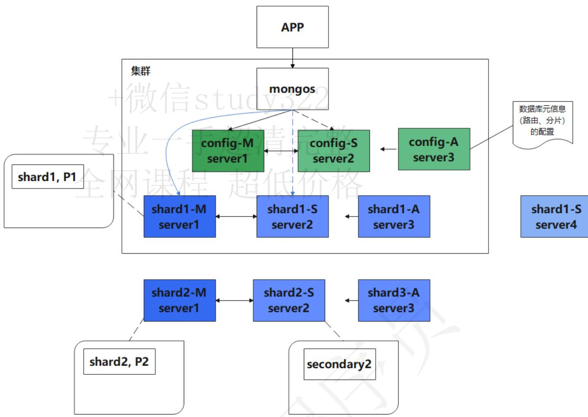
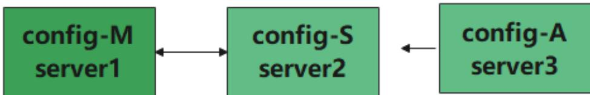
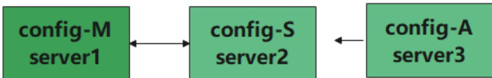
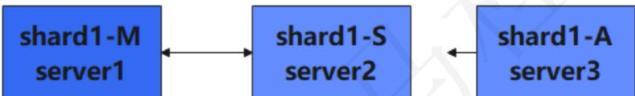
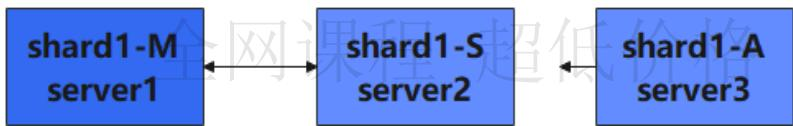
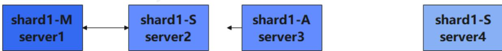
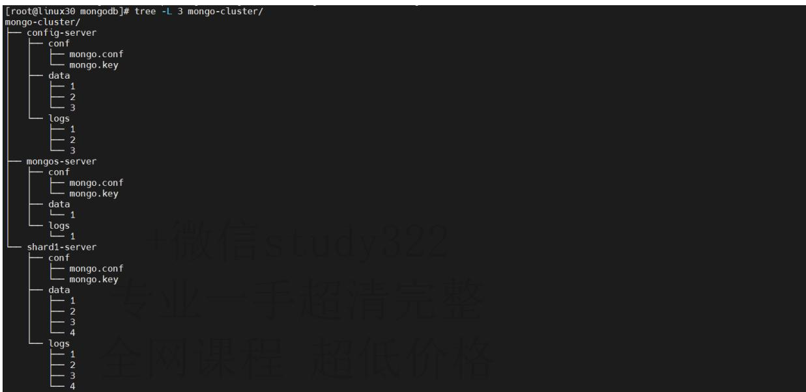
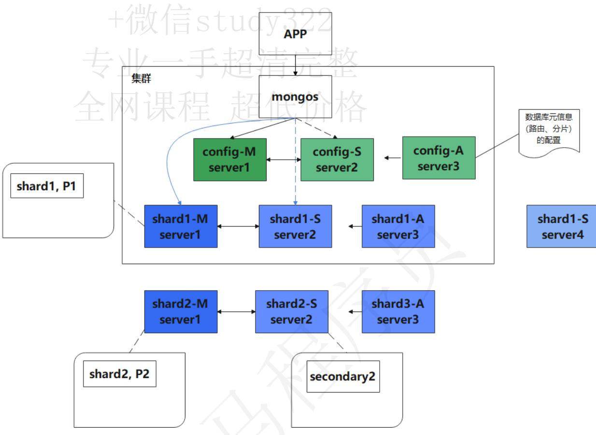
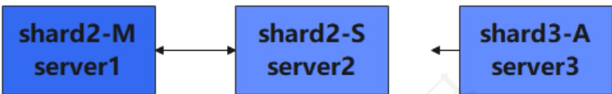
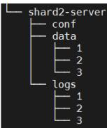

## 基础环境准备



## 安装Docker

## 创建Docker网络

因为需要使用Docker搭建MongoDB集群，所以先创建Docker网络

```
docker network create mongo-cluster
docker network ls 
```

## 创建挂载目录



我们需要创建对应的挂载目录来存储配置文件以及日志文件

```
# 创建配置文件目录
mkdir -p /opt/mongodb/mongo-cluster/config-server/conf
# 创建数据文件目录
mkdir -p /opt/mongodb/mongo-cluster/config-server/data/{1..3}
# 创建日志文件目录
mkdir -p /opt/mongodb/mongo-cluster/config-server/logs/{1..3}

[root@linux30 mongodb]# tree -L 3 mongo-cluster/
mongo-cluster/
    └─ config-server
    └─ conf
data
1 1
1 2
1 3
logs
1 1
1 2
1 3 
```

## 创建密钥文件

+微信study322

因为我们知道搭建的话一定要高可用而且一定要权限这里mongo之间通信采用秘钥文件，所以我专业一手超清完整们先进行生成密钥文件全网课程 超低价格

```
# 创建密钥文件
openssl rand -base64 756 > /opt/mongodb/mongo-cluster/config-server/conf/mongo.key
# 设置
chmod 600 /opt/mongodb/mongo-cluster/config-server/conf/mongo.key
```

## 创建配置文件

因为有多个容器，配置文件是一样的，我们只需要创建一个配置文件，其他的容器统一读取该配置文件即可

```
echo "
# 日志文件
storage:
    # mongod 进程存储数据目录，此配置仅对 mongod 进程有效
    dbPath: /data/db
systemLog:
    destination: file
    logAppend: true
    path: /data/logs/mongo.log

# 网络设置
net:
    port: 27017  #端口号
# bindIp: 127.0.0.1  #绑定ip
replication:
    replSetName: configsvr  #副本集名称
sharding:
    clusterRole: configsvr  # 集群角色，这里配置的角色是配置节点
security:
    authorization: enabled  #是否开启认证
    keyFile: /data/configdb/conf/mongo.key  #keyFile路径
"> /opt/mongodb/mongo-cluster/config-server/conf/mongo.conf
```

## 启动容器



## 启动config-server1

```
docker run --name config-server1 -d \
--net=mongo-cluster \
--privileged=true \
-v /opt/mongodb/mongo-cluster/config-server:/data/configdb \
-v /opt/mongodb/mongo-cluster/config-server/data/1:/data/db \
-v /opt/mongodb/mongo-cluster/config-server/logs/1:/data/logs \
mongo --config /data/configdb/conf/mongo.conf 
```

## 启动config-server2

```
docker run --name config-server2 -d \
--net=mongo-cluster \
--privileged=true \
-v /opt/mongodb/mongo-cluster/config-server:/data/configdb \
-v /opt/mongodb/mongo-cluster/config-server/data/2:/data/db \
-v /opt/mongodb/mongo-cluster/config-server/logs/2:/data/logs \
mongo --config /data/configdb/conf/mongo.conf 
```

## 启动config-server3

```
docker run --name config-server3 -d \
--net=mongo-cluster \
--privileged=true \
-v /opt/mongodb/mongo-cluster/config-server:/data/configdb \
-v /opt/mongodb/mongo-cluster/config-server/data/3:/data/db \
-v /opt/mongodb/mongo-cluster/config-server/logs/3:/data/logs \
mongo --config /data/configdb/conf/mongo.conf 
[root@linux30 mongodb]# docker ps
CONTAINER ID    IMAGE    COMMAND    CREATED    STATUS
PORTS    NAMES
57f07f195a37    mongo    "docker-entrypoint.s..."    4 seconds ago    Up 4 seconds
27017/tcp    config-server3
4d1f22f7d025    mongo    "docker-entrypoint.s..."    12 seconds ago    Up 12 seconds
27017/tcp    config-server2
8dc8ce9f7a6a    mongo    "docker-entrypoint.s..."    5 minutes ago    Up 5 minutes
27017/tcp    config-server1 
```

## 初始化config-server

## 登录容器

进入第一台容器

```
docker exec -it config-server1 bash
mongo -port 27017 
```

## 执行命令

执行以下命令进行MongoDB容器的初始化

```
rs.initiate(
    {
    _id: "configsvr",
    members: [
    { _id : 1, host : "config-server1:27017" },
    { _id : 2, host : "config-server2:27017" },
    { _id : 3, host : "config-server3:27017" }
    ]
    }
) 
```

## 创建用户

因为我们需要对用户进行权限管理，我们需要创建用户，这里为了演示，我们创建超级用户 权限是 root

```
use admin
db微信公众({user:"root",pwd:"root",roles:[{role:'root',db:'admin'}]})
```

## 搭建Shard1分片组

由于mongos是客户端，所以我们先搭建好config以及shard之后再搭建mongos。

## 创建挂载目录



我们先创建shard1挂载目录

shard1-S server4

```
# 创建配置文件目录
mkdir -p /opt/mongodb/mongo-cluster/shard1-server/conf
# 创建数据文件目录
mkdir -p /opt/mongodb/mongo-cluster/shard1-server/data/{1..4}
# 创建日志文件目录
mkdir -p /opt/mongodb/mongo-cluster/shard1-server/logs/{1..4}

[root@linux30 mongodb]# tree -L 3 mongo-cluster/
mongo-cluster/
| — config-server
| | — conf
| | | — mongo.conf
| | | — mongo.key
| | — data
| | | — 1
| | | — 2
| | | — 3
| | — logs
| | | — 1
| | | — 2
| | | — 3
| — shard1-server
|— conf
|— data
| |— 1
| |— 2
| |— 3
| |— 4
|— logs
|— 1
|— 2
|— 3
|— 4
建shard1分片组
在同一台服务器上初始化一组分片
```

在同一台服务器上初始化一组分片

## 创建密钥文件

因为集群只需要一个密钥文件，我们可以将config-server中的密钥文件复制过来

```
cp /opt/mongodb/mongo-cluster/config-server/conf/mongo.key /opt/mongodb/mongo-cluster/shard1-server/conf/ 
```

## 配置配置文件

因为有多个容器，配置文件是一样的，我们只需要创建一个配置文件，其他的容器统一读取该配置文件即可

```
echo "
# 日志文件
storage:
    # mongod 进程存储数据目录，此配置仅对 mongod 进程有效
    dbPath: /data/db
systemLog:
    destination: file
    logAppend: true
    path: /data/logs/mongo.log

# 网络设置
net:
    port: 27017  #端口号
# bindIp: 127.0.0.1  #绑定ip
replication:
    replSetName: shard1 #复制集名称是 shardsvr
sharding:
    clusterRole: shardsvr # 集群角色，这里配置的角色是分片节点
security:
    authorization: enabled #是否开启认证
    keyFile: /data/configdb/conf/mongo.key #keyFile路径
"> /opt/mongodb/mongo-cluster/shard1-server/conf/mongo.conf
```

## 启动shard1-server1

```
docker run --name shard1-server1 -d \
--net=mongo-cluster \
--privileged=true \
-v /opt/mongodb/mongo-cluster/shard1-server:/data/configdb \
-v /opt/mongodb/mongo-cluster/shard1-server/data/1:/data/db \
-v /opt/mongodb/mongo-cluster/shard1-server/logs/1:/data/logs \
mongo --config /data/configdb/conf/mongo.conf 
```

## 启动shard1-server2

```
docker run --name shard1-server2 -d \
--net=mongo-cluster \
--privileged=true \
-v /opt/mongodb/mongo-cluster/shard1-server:/data/configdb \
-v /opt/mongodb/mongo-cluster/shard1-server/data/2:/data/db \
-v /opt/mongodb/mongo-cluster/shard1-server/logs/2:/data/logs \
mongo --config /data/configdb/conf/mongo.conf 
```

## 启动shard1-server3

```
docker run --name shard1-server3 -d \
--net=mongo-cluster \
--privileged=true \
-v /opt/mongodb/mongo-cluster/shard1-server:/data/configdb \
-v /opt/mongodb/mongo-cluster/shard1-server/data/3:/data/db \
-v /opt/mongodb/mongo-cluster/shard1-server/logs/3:/data/logs \
mongo --config /data/configdb/conf/mongo.conf 
[root@linux30 mongodb]# docker ps
CONTAINER ID    IMAGE    COMMAND    CREATED    STATUS    PORTS    NAMES
d5ea0f2f2c7    mongo    "docker-entrypoint.s..."    10 seconds ago    Up 9 seconds    27017/tcp    shard1-server3
8bd4805bdc53    mongo    "docker-entrypoint.s..."    17 seconds ago    Up 15 seconds    27017/tcp    shard1-server2
99265fd6ceb0    mongo    "docker-entrypoint.s..."    24 seconds ago    Up 22 seconds    27017/tcp    shard1-server1
57f07f195a37    mongo    "docker-entrypoint.s..."    15 minutes ago    Up 15 minutes    27017/tcp    config-server3
4d1f22f7d025    mongo    "docker-entrypoint.s..."    15 minutes ago    Up 15 minutes    27017/tcp    config-server2
8dc8ce9f7a6a    mongo    "docker-entrypoint.s..."    20 minutes ago    Up 20 minutes    27017/tcp    config-server1
[root@linux30 mongodb]# 
```

## 初始化shard1分片组

## 并且制定第三个副本集为仲裁节点

```
docker exec -it shard1-server1 bin/bash
mongo -port 27017 
```

登录后进行初始化节点，这里面arbiterOnly:true是设置为仲裁节点

```
#进行副本集配置
rs.initiate(
    {
    _id : "shard1",
    members: [
    { _id : 0, host : "shard1-server1:27017" },
    { _id : 1, host : "shard1-server2:27017" },
    { _id : 2, host : "shard1-server3:27017", arbiterOnly:true }
    ]
    }
);
```

## 创建用户

因为我们需要对用户进行权限管理，我们需要创建用户，这里为了演示，我们创建超级用户 权限是 root

```
use admin
db微信公众({user:"root",pwd:"root",roles:[{role:'root',db:'admin'}]})
```

## 查看节点信息

## 主从复制测试

## 主节点添加数据

## 在主节点执行下面的命令

```
# 创建test数据库
use test;
db.blog.insert({
    "title": "MongoDB 教程",
    "description": "MongoDB 是一个 Nosql 数据库",
    "by": "我的博客",
    "url": "http://www.baiyp.ren",
    "tags": [
    "mongodb",
    "database",
    "NoSQL"
    ],
    "likes": 100
});

use admin
db.auth("root","root")
use test;
db.blog.insert({
    "title": "MongoDB 教程",
    "description": "MongoDB 是一个 Nosql 数据库",
    "by": "我的博客",
    "url": "http://www.baiyp.ren",
    "tags": [
    "mongodb",
    "database",
    "NoSQL"
    ],
    "likes": 100
});
```

## 设置从节点可读

```
use test
db.blog.findOne();
use admin
db.auth("root","root")
use test
db.blog.findOne();
db.setSecondaryOk()
db.blog.findOne(); 
```

## 主从切换测试专业一手超清完整



停掉主节点shard1-Sserver4

```
docker stop shard1-server1 
```

## 查看从节点信息

我们看刚才的从节点已经变成了主节点

```
rs.isMaster() 
```

## 启动停止的节点

docker start shard1-server1

docker exec -it shard1-server1 bin/bash mongo -port 27017

## 扩缩容



shard1-S server2

shard1-A server3 shard1-S server4

## 扩容节点

新增一个docker节点

```
docker run --name shard1-server4 -d \
--net=mongo-cluster \
--privileged=true \
-v /opt/mongodb/mongo-cluster/shard1-server:/data/configdb \
-v /opt/mongodb/mongo-cluster/shard1-server/data/4:/data/db \
-v /opt/mongodb/mongo-cluster/shard1-server/logs/4:/data/logs \
mongo --config /data/configdb/conf/mongo.conf 
```

## 从主节点新增节点

```
use admin
db.auth("root", "root")
rs.add("shard1-server4:27017")
rs.isMaster() 
```

到新增的shard1-server4副本节点查看数据

```
docker exec -it shard1-server4 bin/bash
mongo -port 27017
use admin
db.auth("root","root");
use test;
db.setSecondaryOk()
db.blog.find().pretty(); 
```

## 缩容节点

将我们刚才添加的模拟shard1-server4节点删除，在主节点执行以下命令

```
rs.remove("shard1-server4:27017")
rs.isMaster() 
```

## 搭建Mongos

mongos负责查询与数据写入的路由，是实例访问的统一入口，是一个无状态的节点，每一个节点都可以从 config-server 节点获取到配置信息

## 创建挂载目录

我们需要创建对应的挂载目录来存储配置文件以及日志文件

```
# 创建配置文件目录
mkdir -p /opt/mongodb/mongo-cluster/mongos-server/conf
# 创建数据文件目录
mkdir -p /opt/mongodb/mongo-cluster/mongos-server/data/1
# 创建日志文件目录
mkdir -p /opt/mongodb/mongo-cluster/mongos-server/logs/1

[root@linux30 mongodb]# tree -L 3 mongo-cluster/
mongo-cluster/

| — config-server
| | — conf
| | | — mongo.conf
| | | — mongo.key
| | — data
| | | — 1
| | | — 2
| | | — 3
| | — logs
| | | — 1
| | | — 2
| | | — 3
| — mongos-server
| | — conf
| | — data
| | | — 1
|    └ logs
|    └ 1
└ shard1-server
    | └ conf
    |    └ mongo.conf
    |    └ mongo.key
    | └ data
    |    └ 1
    |    └ 2
    |    └ 3
    |    └ 4
    └ logs
    └ 1
    └ 2
    └ 3
    └ 4 
```

## 创建密钥文件

因为集群只需要一个密钥文件，我们可以将config-server中的密钥文件复制过来

```
cp /opt/mongodb/mongo-cluster/config-server/conf/mongo.key /opt/mongodb/mongo-cluster/mongos-server/conf/ 
```

## 创建配置文件

因为由多个容器，配置文件是一样的，我们只需要创建一个配置文件，其他的容器统一读取该配置文件即可,因为Mongos只负责路由，就不需要数据文件了，并且mongos服务是不负责认证的，需要将 authorization 配置项删除

```
echo "
# 日志文件
systemLog:
destination: file
logAppend: true
path: /data/logs/mongo.log

# 网络设置
net:
    port: 27017 #端口号
# bindIp: 127.0.0.1 #绑定ip
# 配置分片，这里面配置的是需要读取的配置节点的信息
sharding:
    configDB: configsvr/config-server1:27017,config-server2:27017,config-server3:27017
security:
    keyFile: /data/configdb/conf/mongo.key #keyFile路径
"> /opt/mongodb/mongo-cluster/mongos-server/conf/mongo.conf
```



## 启动mongos集群

启动mongos1

```
docker run --name mongos-server1 -d \
-p 30001:27017 \
--net=mongo-cluster \
--privileged=true \
--entrypoint "mongos" \
-v /opt/mongodb/mongo-cluster/mongos-server:/data/configdb \
-v /opt/mongodb/mongo-cluster/mongos-server/logs/1:/data/logs \
mongo --config /data/configdb/conf/mongo.conf 
```

## 配置mongos-server1

因为mongos是无中心的配置，所有需要每一台都需要进行分片配置

## 进入容器

```
docker exec -it mongos-server1 /bin/bash
mongo -port 27017 
```

## 登录Mongos

使用前面设置的root用户密码

```
use admin;
db.auth("root", "root"); 
```

## 配置分片

进行配置分片信息

```
mongos> sh.addShard("shard1/shard1-server1:27017, shard1-server2:27017, shard1-server3:27017")
{
    "shardAdded": "shard1",
    "ok": 1,
    "$clusterTime": {
    "clusterTime": Timestamp(1641954916, 6), 
"signature": {
    "hash": BinData(0,"FasWaVTFDcDgB/wp32513BWA4hI="),
    "keyId": NumberLong("7052134531058368535")
}
},
"operationTime": Timestamp(1641954916, 6) 
```



## 开启数据库分片

开启数据库分片功能，命令很简单 enablesharding(),这里我就开启test数据库。

# 对集合所在的数据库启用分片功能sh.enableSharding("test")

## 对片键的字段建立索引

分片键必须要有索引才可以，并且一个集合只能有一个分片健；

```
use test;
db.blog.createIndex({"by":"hashed","likes":1})
db.blog.getIndexes() 
```

指定集合中分片的片键，并且指定使用哈希分片和范围分片

```
sh.shardCollection("test.blog", {"by":"hashed","likes":1}) 
```

## 查看分片状态

```
sh.status() 
```

查看数据分布 +微信study322

通过该命令可以查看数据的分布 超清完整

## 搭建shard2分片组



## 我们先创建shard2挂载目录

```
# 创建配置文件目录
mkdir -p /opt/mongodb/mongo-cluster/shard2-server/conf
# 创建数据文件目录
mkdir -p /opt/mongodb/mongo-cluster/shard2-server/data/{1..3}
# 创建日志文件目录
mkdir -p /opt/mongodb/mongo-cluster/shard2-server/logs/{1..3}
```



## 创建密钥文件

因为集群只需要一个密钥文件，我们可以将config-server中的密钥文件复制过来

cp /opt/mongodb/mongo-cluster/config-server/conf/mongo.key /opt/mongodb/mongocluster/shard2-server/conf/

## 配置配置文件

因为由多个容器，配置文件是一样的，我们只需要创建一个配置文件，其他的容器统一读取该配置文件即可

```
echo "
# 日志文件
storage:
    # mongod 进程存储数据目录，此配置仅对 mongod 进程有效
    dbPath: /data/db
systemLog:
    destination: file
    logAppend: true
    path: /data/logs/mongo.log
```

## # 网络设置

```
net:
    port: 27017 #端口号
# bindIp: 127.0.0.1 #绑定ip
replication:
    replSetName: shard2 #复制集名称是 shard2
sharding:
    clusterRole: shardsvr # 集群角色，这里配置的角色是分片节点
security:
    authorization: enabled #是否开启认证
    keyFile: /data/configdb/conf/mongo.key #keyFile路径
"> /opt/mongodb/mongo-cluster/shard2-server/conf/mongo.conf
```

## 启动shard2-server1

```
docker run --name shard2-server1 -d \
--net=mongo-cluster \
--privileged=true \
-v /opt/mongodb/mongo-cluster/shard2-server:/data/configdb \
-v /opt/mongodb/mongo-cluster/shard2-server/data/1:/data/db \
-v /opt/mongodb/mongo-cluster/shard2-server/logs/1:/data/logs \
mongo --config /data/configdb/conf/mongo.conf 
```

## 启动shard2-server2

```
docker run --name shard2-server2 -d \
--net=mongo-cluster \
--privileged=true \
-v /opt/mongodb/mongo-cluster/shard2-server:/data/configdb \
-v /opt/mongodb/mongo-cluster/shard2-server/data/2:/data/db \
-v /opt/mongodb/mongo-cluster/shard2-server/logs/2:/data/logs \
mongo --config /data/configdb/conf/mongo.conf 
```

## 启动shard2-server3

```
docker run --name shard2-server3 -d \
--net=mongo-cluster \
--privileged=true \
-v /opt/mongodb/mongo-cluster/shard2-server:/data/configdb \
-v /opt/mongodb/mongo-cluster/shard2-server/data/3:/data/db \
-v /opt/mongodb/mongo-cluster/shard2-server/logs/3:/data/logs \
mongo --config /data/configdb/conf/mongo.conf 
[root@linux30 mongodb]# docker ps
CONTAINER ID IMAGE COMMAND CREATED STATUS PORTS NAMES
a70fcad2cd6d mongo "docker-entrypoint.s..." 3 seconds ago Up 2 seconds 27017/tcp shard2-server3
70360323918b mongo "docker-entrypoint.s..." 10 seconds ago Up 9 seconds 27017/tcp shard2-server2
3816abfe1da6 mongo "docker-entrypoint.s..." 18 seconds ago Up 17 seconds 27017/tcp shard2-server1
28af3c4ab8bbc mongo "mongos --config /da..." 11 minutes ago Up 11 minutes 0.0.0.0:30001->27017/tcp, :::30001->27017/tcp mongos-server1
954f1d943a6a mongo "docker-entrypoint.s..." 21 minutes ago Up 21 minutes 27017/tcp shard1-server4
d5ea0f2f22c7 mongo "docker-entrypoint.s..." 34 minutes ago Up 34 minutes 27017/tcp shard1-server3
8bd4805bdc53 mongo "docker-entrypoint.s..." 35 minutes ago Up 35 minutes 27017/tcp shard1-server2
99265fd6ceb0 mongo "docker-entrypoint.s..." 35 minutes ago Up 23 minutes 27017/tcp shard1-server1
57f07f195a37 mongo "docker-entrypoint.s..." 49 minutes ago Up 49 minutes 27017/tcp config-server3
4d1f22f7d025 mongo "docker-entrypoint.s..." 50 minutes ago Up 50 minutes 27017/tcp config-server2
8dc8ce9f7a6a mongo "docker-entrypoint.s..." 55 minutes ago Up 55 minutes 27017/tcp config-server1
[root@linux30 mongodb]# 
```

## 初始化shard2分片组

登录节点后进行初始化分片2

```
docker exec -it shard2-server1 bin/bash
mongo -port 27017 
```

执行下面的命令进行初始化分片2，全网课程 arbiterOnly:true 参数是设置为为仲裁节点 超低价格

```
#进行副本集配置
rs.initiate(
    {
    _id : "shard2",
    members: [
    { _id : 0, host : "shard2-server1:27017" },
    { _id : 1, host : "shard2-server2:27017" },
    { _id : 2, host : "shard2-server3:27017", arbiterOnly:true }
    ]
    }
);
```

## 创建用户

因为我们需要对用户进行权限管理，我们需要创建用户，这里为了演示，我们创建超级用户 权限是 root

```
use admin
db签订了用户创建的用户权限（用户权限为10个，用户权限为10个）
```

## 将分片添加到mongos

要将新增节点添加到mongos中

```
docker exec -it mongos-server1 /bin/bash
mongo -port 27017

use admin;
db.auth("root","root");

sh.addShard("shard2/shard2-server1:27017,shard2-server2:27017,shard2-server3:27017") 
for (var i = 0; i < 500; i++) {
    db.blog.insert({
    "_id": i,
    "title": "张三的文章" + i,
    "by": "李四" + i,
    "url": "http://www.baidu.com"
    }
}
{
    "tags": [
    "语文",
    "数学"
    ],
    "likes": i
    });
}

for (var i = 0; i < 500; i++) {
    db.blog2.insert({
    "_id": i,
    "title": "张三的文章" + i,
    "by": "李四" + i,
    "url": "http://www.baidu.com",
    "tags": [
    "语文",
    "数学"
    ],
    "likes": i
    });
}
```

## 删除分片

发起删除分片节点命令，平衡器开始自动迁移数据

```
use admin
db.runCommand({removeshard: "shard2"})
sh.status() 
```

## 课后作业：

1.了解mongos、config server、shard、replica set、arbiter的概念和作用

2.实现对test数据库下的blog集合进行分片操作