# 0、目标

能够掌握kafka的各个组件及作用

能够运用kafka的ui工具来管理kafka

学会使用springboot来操作kafka

实战运用，实现order记录的kafka传输

# 1、应用场景全网课

# 1.1 kafka场景

Kafka最初是由LinkedIn公司采用Scala语言开发，基于ZooKeeper，现在已经捐献给了Apache基金会。目前Kafka已经定位为一个分布式流式处理平台，它以 高吞吐、可持久化、可水平扩展、支持流处理等多种特性而被广泛应用。

Apache Kafka能够支撑海量数据的数据传递。在离线和实时的消息处理业务系统中，Kafka都有广泛的应用。

（1）日志收集：收集各种服务的log，通过kafka以统一接口服务的方式开放 给各种consumer，例如Hadoop、Hbase、Solr等；

（2）消息系统：解耦和生产者和消费者、缓存消息等；

（3）用户活动跟踪：Kafka经常被用来记录web用户或者app用户的各种活动，如浏览网页、搜索、点击等活动，这些活动信息被各个服务器发布到kafka的topic中，然后订阅者通过订阅这些topic来做实时的监控分析，或者装载到Hadoop、数据仓库中做离线分析和挖掘；

（4）运营指标：Kafka也经常用来记录运营监控数据。包括收集各种分布式应用的数据，生产各种操作的集中反馈，比如报警和报告；

（5）流式处理：比如spark streaming和storm；

# 1.2 kafka特性

kafka以高吞吐量著称，主要有以下特性：

（1）高吞吐量、低延迟：kafka每秒可以处理几十万条消息，它的延迟最低只有几毫秒；

（2）可扩展性：kafka集群支持热扩展；

（3）持久性、可靠性：消息被持久化到本地磁盘，并且支持数据备份防止数据丢失；

（4）容错性：允许集群中节点失败（若副本数量为n,则允许n-1个节点失败）；

（5）高并发：支持数千个客户端同时读写；

# 1.3 消息对比

如果普通的业务消息解耦，消息传输，rabbitMq是首选，它足够简单，管理方便，性能够用。

如果在上述，日志、消息收集、访问记录等高吞吐，实时性场景下，推荐kafka，它基于分布式，扩容便捷

如果很重的业务，要做到极高的可靠性，考虑rocketMq，但是它太重。需要你有足够的了解

# 1.4 大厂应用

京东通过kafka搭建数据平台，用于用户购买、浏览等行为的分析。成功抗住6.18的流量洪峰

阿里借鉴kafka的理念，推出自己的rocketmq。在设计上参考了kafka的架构体系+微信study322

# 2、基础组件

# 2.1 角色

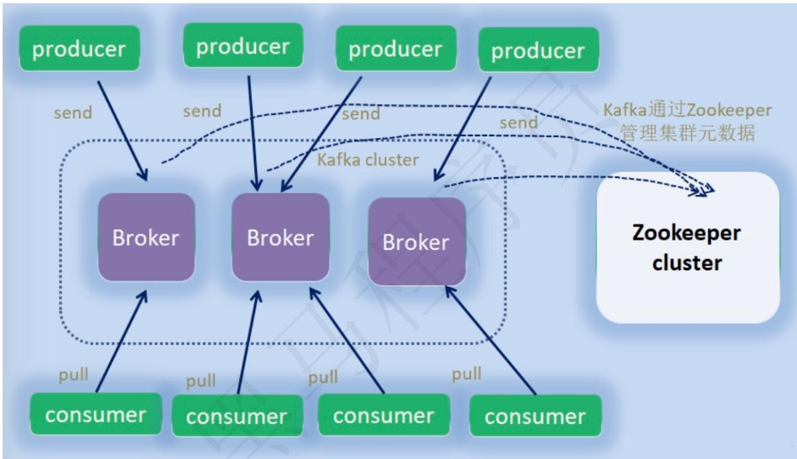


broker：节点，就是你看到的机器

provider：生产者，发消息的

consumer：消费者，读消息的

zookeeper：信息中心，记录kafka的各种信息的地方

controller：其中的一个broker，作为leader身份来负责管理整个集群。如果挂掉，借助zk重新选主

# 2.2 逻辑组件

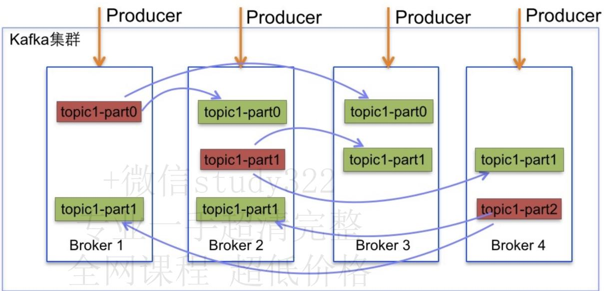


topic：主题，一个消息的通道，收发总得知道消息往哪投

partition：分区，每个主题可以有多个分区分担数据的传递，多条路并行，吞吐量大

Replicas：副本，每个分区可以设置多个副本，副本之间数据一致。相当于备份，有备胎更可靠

leader & follower：主从，上面的这些副本里有1个身份为leader，其他的为follower。leader处理partition的所有读写请求

# 2.3 副本集合

AR（assigned replica）：所有副本的统称，AR=ISR+OSR

ISR（In-sync Replica）：同步中的副本，可以参与leader选主。一旦落后太多（数量滞后和时间滞后两个维度）会被踢到OSR。

OSR（Out-Sync Relipcas）：踢出同步的副本，一直追赶leader，追上后会进入ISR

# 2.4 消息标记

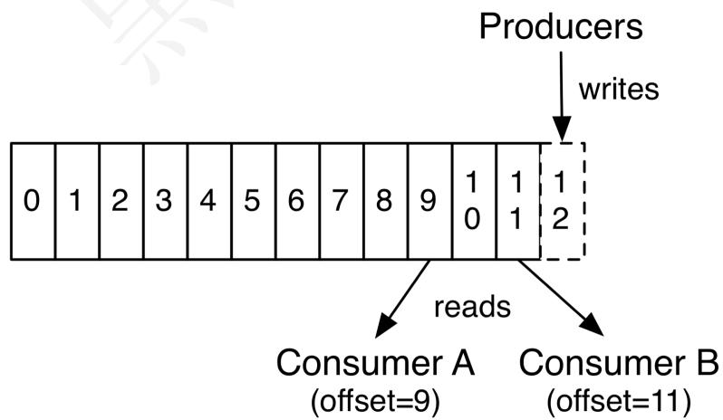


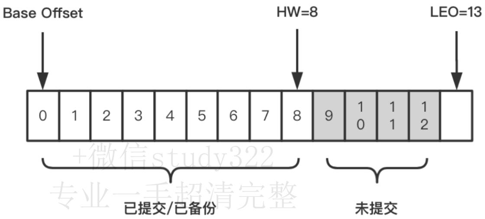


offset：偏移量，消息消费到哪一条了？每个消费者都有自己的偏移量

HW：(high watermark）：副本的高水印值，客户端最多能消费到的位置，HW值为8，代表offset为[0,8]的9条消息都可以被消费到，它们是对消费者可见的，而[9,12]这4条消息由于未提交，对消费者是不可见的。

LEO：(log end offset）：日志末端位移，代表日志文件中下一条待写入消息的offset，这个offset上实际是没有消息的。不管是leader副本还是follower副本，都有这个值。

那么这三者有什么关系呢？

比如在副本数等于3的情况下，消息发送到Leader A之后会更新LEO的值，Follower B和Follower C也会实时拉取Leader A中的消息来更新自己，HW就表示A、B、C三者同时达到的日志位移，也就是A、B、C三者中LEO最小的那个值。由于B、C拉取A消息之间延时问题，所以HW一般会小于LEO，即LEO>=HW。

具体的同步原理，下面章节会详细讲到

# 3、架构探索

# 3.1 发展历程

http://kafka.apache.org/downloads 

# 2.7.0

·Released Dec 21,2020 

Release Notes 

· Source download: kafka-2.7.0-src.tgz (asc, sha512) 

· Binary downloads: 

。 Scala 2.12 - kafka_2.12-2.7.0.tgz (asc, sha512) 

o Scala 2.13 - kafka_2.13-2.7.0.tgz (asc, sha512) 

# 3.1.1 版本命名

Kafka在1.0.0版本前的命名规则是4位，比如0.8.2.1，0.8是大版本号，2是小版本号，1表示打过1个补丁

现在的版本号命名规则是3位，格式是“大版本号”+“小版本号”+“修订补丁数”，比如2.5.0，前面的2代表的是大版本号，中间的5代表的是小版本号，0表示没有打过补丁

我们所看到的下载包，前面是scala编译器的版本，后面才是真正的kafka版本。

# 3.1.2 演进历史专业

# 0.7版本

只提供了最基础的消息队列功能。

# 0.8版本

引入了副本机制，至此Kafka成为了一个真正意义上完备的分布式高可靠消息队列解决方案。

# 0.9版本

增加权限和认证，使用Java重写了新的consumer API，Kafka Connect功能；不建议使用consumerAPI；

# 0.10版本

引入Kafka Streams功能，正式升级成分布式流处理平台；建议版本0.10.2.2；建议使用新版consumerAPI

# 0.11版本

producer API幂等，事务API，消息格式重构；建议版本0.11.0.3；谨慎对待消息格式变化

# 1.0和2.0版本

Kafka Streams改进；建议版本2.0；

# 3.2 集群搭建（助学）

# 1）原生启动

kafka启动需要zookeeper，第一步启动zk：

```batch
docker run --name zookeeper-1 -d -p 2181 zookeeper:3.4.13 
```

原生安装：下载后解压启动即可 http://kafka.apache.org/downloads

```txt
bin/kafka-server-start.sh config/server.properties 
```

#server.properties配置说明

#表示broker的编号，如果集群中有多个broker，则每个broker的编号需要设置的不同

broker.id=0 

#brokder对外提供的服务入口地址，默认9092

listeners=PLAINTEXT://:9092 

#设置存放消息日志文件的地址

log.dirs=/tmp/kafka/log 

#Kafka所需Zookeeper集群地址，这里是关键！加入同一个zk的kafka为同一集群

zookeeper.connect=zookeeper:2181 


2）推荐docker-compose 一键启动


```yaml
#参考资料中的kafka.yml
#注意hostname问题，ip地址：192.168.10.30，换成你自己服务器的
#docker-compose -f kafka.yml up -d 启动
version: '3'
services:
    zookeeper:
    image: zookeeper:3.4.13

    kafka-1:
    container_name: kafka-1
    image: wurstmeister/kafka:2.12-2.2.2
    ports:
    - 10903:9092
    environment:
    KAFKA_BROKER_ID: 1
    HOST_IP: 192.168.10.30
    KAFKA_ZOOKEEPER_CONNECT: zookeeper:2181
    #docker部署必须设置外部可访问ip和端口，否则注册进zk的地址将不可达造成外部无法连接

    KAFKA_ADVERTISED_HOST_NAME: 192.168.10.30
    KAFKA_ADVERTISED_PORT: 10903
    volumes:
    - /etc/localtime:/etc/localtime
    depends_on:
    - zookeeper
    kafka-2:
    container_name: kafka-2
    image: wurstmeister/kafka:2.12-2.2.2
    ports:
    - 10904:9092
    environment:
    KAFKA_BROKER_ID: 2
    HOST_IP: 192.168.10.30
    KAFKA_ZOOKEEPER_CONNECT: zookeeper:2181
    KAFKA_ADVERTISED_HOST_NAME: 192.168.10.30
    KAFKA_ADVERTISED_PORT: 10904
    volumes:
    - /etc/localtime:/etc/localtime
    depends_on:
    - zookeeper
```

# 3.3 组件探秘

命令行工具是管理kafka集群最直接的工具。官方自带，不需要额外安装。

# 3.2.1 主题创建

创建主题：test

kafka-topics.sh --zookeeper zookeeper:2181 --create --topic test --partitions 2 --replication-factor 1 

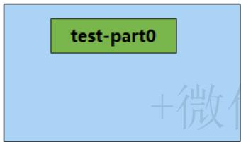


kafka-1


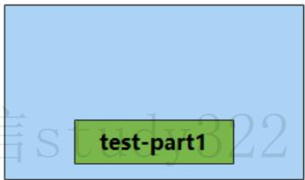


kafka-2


#进入容器

```batch
docker exec -it kafka-1 sh 
```

#进入bin目录

```txt
cd /opt/kafka/bin 
```

#创建

```batch
kafka-topics.sh --zookeeper zookeeper:2181 --create --topic test --partitions 2 --replication-factor 1 
```

# 3.2.2 查看主题

```batch
kafka-topics.sh --zookeeper zookeeper:2181 --list 
```

# 3.2.3 主题详情

```batch
kafka-topics.sh --zookeeper zookeeper:2181 --describe --topic test 
```

#分析输出：

```txt
Topic:test PartitionCount:2 ReplicationFactor:1 Configs: 
```

```yaml
Topic: test Partition: 0 Leader: 2 Replicas: 2 Isr: 2 
```

```yaml
Topic: test Partition: 1 Leader: 1 Replicas: 1 Isr: 1 
```

# 3.2.4 消息收发

#使用docker连接任意集群中的一个容器

```batch
docker exec -it kafka-1 sh 
```

#进入kafka的容器内目录

```txt
cd /opt/kafka/bin 
```

#客户端监听

```batch
./kafka-console-consumer.sh --bootstrap-server localhost:9092 --topic test 
```

#另起一个终端，验证发送

```txt
./kafka-console-producer.sh --broker-list localhost:9092 --topic test 
```

# 3.2.5 分组消费

#启动两个consumer时，如果不指定group信息，消息被广播

#指定相同的group，让多个消费者分工消费（画图：group原理）

```txt
./kafka-console-consumer.sh --bootstrap-server localhost:9092 --topic test --group aaa 
```

#结果：在发送方，连续发送 1-4 ，4条消息，同一group下的两台consumer交替消费，并发执行

# 注意！！！

这是在消费者和分区数相等（都是2）的情况下。

如果同一group下的 （ 消费者数量 > 分区数量 ） 那么就会有消费者闲置。

# 验证方式：

可以再多启动几个消费者试一试，会发现，超出2个的时候，有的始终不会消费到消息。

停掉可以消费到的，那么闲置的会被激活，进入工作状态

# 3.2.6 指定分区

#指定分区通过参数 --partition，注意！需要去掉上面的group

#指定分区的意义在于，保障消息传输的顺序性（画图：kafka顺序性原理）

```txt
./kafka-console-consumer.sh --bootstrap-server localhost:9092 --topic test --partition 0
./kafka-console-consumer.sh --bootstrap-server localhost:9092 --topic test --partition 1 
```

#结果：发送1-4条消息，交替出现。说明消息被均分到各个分区中投递

#默认的发送是没有指定key的

#要指定分区发送，就需要定义key。那么相同的key被路由到同一个分区

```batch
./kafka-console-producer.sh --broker-list kafka-1:9092 --topic test --property parse.key=true 
```

#携带key再发送，注意key和value之间用tab分割

```txt
>1 1111
>1 2222
>2 3333
>2 4444 
```

#查看consumer的接收情况

#结果：相同的key被同一个consumer消费掉

# 3.2.7 偏移量

#偏移量决定了消息从哪开始消费，支持：开头，还是末尾

# earliest: 当各分区下有已提交的offset时，从提交的offset开始消费；无提交的offset时，从头开始消费

# latest: 当各分区下有已提交的offset时，从提交的offset开始消费；无提交的offset时，消费新产生的该分区下的数据

# none: topic各分区都存在已提交的offset时，从offset后开始消费；只要有一个分区不存在已提交的offset，则抛出异常

# 注意点！！！有提交偏移量的话，仍然以提交的为主，即便使用earliest，比提交点更早的也不会被提取专业一手超清完整

#--offset [earliest|latest(默认)] ， 或者 --from-beginning 全网课程 超低价格

#新起一个终端，指定offset位置

```batch
./kafka-console-consumer.sh --bootstrap-server localhost:9092 --topic test --partition 0 --offset earliest 
```

```txt
./kafka-console-consumer.sh --bootstrap-server localhost:9092 --topic test --partition 0 --from-beginning 
```

#结果：之前发送的消息，从头又消费了一遍！

# 3.4 zk探秘

前面说过，zk存储了kafka集群的相关信息，本节来探索内部的秘密。

kafka的信息记录在zk中，进入zk容器，查看相关节点和信息

```txt
docker exec -it kafka-zookeeper-1 sh
>/bin/zkCli.sh
>ls / 
```

#结果：得到以下配置信息

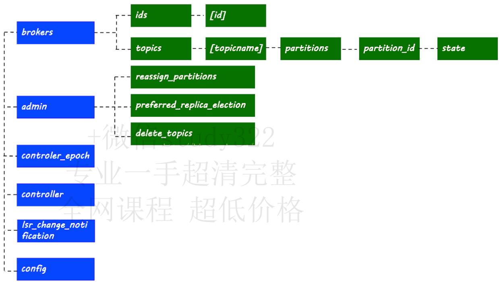


# 3.4.1 broker信息

```ini
[zk: localhost:2181(CONNECTED) 0] ls /brokers
[ids, topics, seqid]
[zk: localhost:2181(CONNECTED) 1] ls /brokers/ids
[1, 2]

#机器broker信息
[zk: localhost:2181(CONNECTED) 4] get /brokers/ids/1
{"listener_security_protocol_map":{"PLAINTEXT":"PLAINTEXT"},{"endpoints":["PLAINTEXT://192.168.10.30:10903"],"jmx_port":-1,"host":"192.168.10.30","timestamp":"1609825245500","port":10903,"version":4}
czxid = 0x27
ctime = Tue Jan 05 05:40:45 GMT 2021
mZxid = 0x27
mtime = Tue Jan 05 05:40:45 GMT 2021
pzxid = 0x27
cversion = 0
dataversion = 1
aclVersion = 0
ephemeralOwner = 0x105a2db626b0000
dataLength = 196
numChildren = 0
```

# 3.4.2 主题与分区


#分区节点路径


```ini
[zk: localhost:2181(CONNECTED) 5] ls /brokers/topics
[test, __consumer_offsets]
[zk: localhost:2181(CONNECTED) 6] ls /brokers/topics/test
[partitions]
[zk: localhost:2181(CONNECTED) 7] ls /brokers/topics/test/partitions
[0, 1]
[zk: localhost:2181(CONNECTED) 8] ls /brokers/topics/test/partitions/0 
```

```txt
[state] 
```


#分区信息，leader所在的机器id，isr列表等


```ini
[zk: localhost:2181(CONNECTED) 18] get /brokers/topics/test/partitions/0/state {"controller_epoch":1,"leader":1,"version":1,"leader_epoch":0,"isr":[1]}
czxid = 0xb0
ctime = Tue Jan 05 05:56:06 GMT 2021
mZxid = 0xb0
mtime = Tue Jan 05 05:56:06 GMT 2021
pzxid = 0xb0
cversion = 0
dataVersion = 0
aclVersion = 0
ephemeralOwner = 0x0
dataLength = 72
numChildren = 0 
```

# 3.4.3 消费者与偏移量

```txt
[zk: localhost:2181(CONNECTED) 15] ls /consumers [] 
```


#空的？？？


#那么，消费者以及它的偏移记在哪里呢？？？


kafka 消费者记录 group 的消费 偏移量 有两种方式 ：

1）kafka 自维护 （新）

2）zookpeer 维护 (旧) ，已经逐渐被废弃

查看方式：

上面的消费用的是控制台工具，这个工具使用--bootstrap-server，不经过zk，也就不会记录到/consumers下。

其消费者的offset会更新到一个kafka自带的topic【__consumer_offsets】下面


#先起一个消费端，指定group


```txt
./kafka-console-consumer.sh --bootstrap-server localhost:9092 --topic test --group aaa 
```


#使用控制台工具查看消费者及偏移量情况


```txt
./kafka-consumer-groups.sh --bootstrap-server kafka-1:9092 --list
KMOffsetCache-44acff134cad
aaa 
```


#查看偏移量详情


```txt
./kafka-consumer-groups.sh --bootstrap-server kafka-1:9092 --describe --group aaa 
```

当前与LEO保持一致，说明消息都完整的被消费过

<table><tr><td colspan="8">/opt/kafka_2.12-2.2.2/bin # kafka-consumer-groups.sh --bootstrap-server kafka-1:9092 --describe --group aaa</td></tr><tr><td>TOPIC</td><td>PARTITION</td><td>CURRENT-OFFSET</td><td>LOG-END-OFFSET</td><td>LAG</td><td>CONSUMER-ID</td><td>HOST</td><td>CLIENT-ID</td></tr><tr><td>test</td><td>0</td><td>4</td><td>4</td><td>0</td><td>consumer-1-936af8ef-fd45-4372-bfd7-254b3a55d4b4</td><td>/52.82.98.209</td><td>consumer-1</td></tr><tr><td>test</td><td>1</td><td>4</td><td>4</td><td>0</td><td>consumer-1-936af8ef-fd45-4372-bfd7-254b3a55d4b4</td><td>/52.82.98.209</td><td>consumer-1</td></tr></table>

停掉consumer后，往provider中再发几条记录，offset开始滞后：

<table><tr><td colspan="8">/opt/kafka_2.12-2.2.2/bin # kafka-consumer-groups.sh --bootstrap-server kafka-1:9092 --describe --group aaa Consumer group &#x27;aaa&#x27; has no active members.</td></tr><tr><td>TOPIC</td><td>PARTITION</td><td>CURRENT-OFFSET</td><td>LOG-END-OFFSET</td><td>LAG</td><td>CONSUMER-ID</td><td>HOST</td><td>CLIENT-ID</td></tr><tr><td>test</td><td>1</td><td>5</td><td>6</td><td>1</td><td>-</td><td>-</td><td>-</td></tr><tr><td>test</td><td>0</td><td>5</td><td>7</td><td>2</td><td>-</td><td>-</td><td>-</td></tr></table>

重新启动consumer，消费到最新的消息，同时再返回看偏移量，消息得到同步：

<table><tr><td colspan="8">/opt/kafka_2.12-2.2.2/bin # kafka-consumer-groups.sh --bootstrap-server kafka-1:9092 --describe --group aaa</td></tr><tr><td>TOPIC</td><td>PARTITION</td><td>CURRENT-OFFSET</td><td>LOG-END-OFFSET</td><td>LAG</td><td>CONSUMER-ID</td><td>HOST</td><td>CLIENT-ID</td></tr><tr><td>test</td><td>0</td><td>7</td><td>7</td><td>0</td><td>consumer-1-92f566a9-c3ff-4665-b3f7-bfefce896524</td><td>/52.82.98.209</td><td>consumer-1</td></tr><tr><td>test</td><td>1</td><td>6</td><td>6</td><td>0</td><td>consumer-1-92f566a9-c3ff-4665-b3f7-bfefce896524</td><td>/52.82.98.209</td><td>consumer-1</td></tr></table>

# 3.4.4 controller


#当前集群中的主控节点是谁


```ini
[zk: localhost:2181(CONNECTED) 17] get /controller
{"version":1,"brokerid":1,"timestamp":"1609825245694"}
czxid = 0x2a
ctime = Tue Jan 05 05:40:45 GMT 2021
mzxid = 0x2a
mtime = Tue Jan 05 05:40:45 GMT 2021
pzxid = 0x2a
cversion = 0
dataVersion = 0
aclVersion = 0
ephemeralowner = 0x105a2db626b0000
dataLength = 54
numChildren = 0 
```

# 3.5 km

# 3.5.1 启动

kafka-manager是目前最受欢迎的kafka集群管理工具，最早由雅虎开源。提供可视化kafka集群操作

官网：https://github.com/yahoo/kafka-manager/releases

注意它的版本，docker社区的镜像版本滞后于kafka，我们自己来打镜像。


#Dockerfile


```dockerfile
FROM daocloud.io/library/java:openjdk-8u40-jdk
ADD kafka-manager-2.0.0.2/ /opt/km2002/
CMD ["/opt/km2002/bin/kafka-manager","-Dconfig.file=/opt/km2002/conf/application.conf"] 
```

#打包，注意将kafka-manager-2.0.0.2放到同一目录

```batch
docker build -t km:2002 . 
```


# 还可以直接拉取


```txt
docker pull liggdocker/km:2002 
```


# 修改镜像标签为km:2002专业


```txt
docker tag imageId km:2002 
```

#启动：在上面的yml里，services节点下加一段


#参考资料：km.yml


```yaml
#执行： docker-compose -f km.yml up -d
    km:
    image: liggdocker/km:2002
    ports:
    - 10906:9000
    depends_on:
    - zookeeper
```


完整的km.yml内容


```yaml
version: '3'
services:
zookeeper:
image: zookeeper:3.4.13

kafka-1:
container_name: kafka-1
image: wurstmeister/kafka:2.12-2.2.2
ports:
- 10903:9092
environment:
KAFKA_BROKER_ID: 1
HOST_IP: 192.168.10.30
KAFKA_ZOOKEEPER_CONNECT: zookeeper:2181
#docker部署必须设置外部可访问ip和端口，否则注册进zk的地址将不可达造成外部无法连接
KAFKA_ADVERTISED_HOST_NAME: 192.168.10.30
KAFKA_ADVERTISED_PORT: 10903
volumes:
- /etc/localtime:/etc/localtime
depends_on:
- zookeeper
kafka-2:
container_name: kafka-2
image: wurstmeister/kafka:2.12-2.2.2
ports:
- 10904:9092
environment:
KAFKA_BROKER_ID: 2
```

```yaml
HOST_IP: 192.168.10.30
KAFKA_ZOOKEEPER_CONNECT: zookeeper:2181
KAFKA_ADVERTISED_HOST_NAME: 192.168.10.30
KAFKA_ADVERTISED_PORT: 10904
volumes:
- /etc/localtime:/etc/localtime
depends_on:
- zookeeper
km:
image: liggdocker/km:2002
ports:
- 10906:9000
depends_on:
- zookeeper 
```

# 3.5.2 使用

使用km可以方便的查看以下信息：

cluster：创建集群，填写zk地址，选中jmx，consumer信息等选项

brokers：列表，机器信息

topic：主题信息，主题内的分区信息。创建新的主题，增加分区

cosumers: 消费者信息，偏移量等

# 4、深入应用

# 4.1 springboot-kafka

1）配置文件

```yaml
kafka:
bootstrap-servers: 192.168.10.30:10903,192.168.10.30:10904
producer: # producer 生产者
    retries: 0 # 重试次数
    acks: 1 # 应答级别:多少个分区副本备份完成时向生产者发送ack确认(可选0、1、all/-1)
    batch-size: 16384 # 一次最多发送数据量
    buffer-memory: 33554432 # 生产端缓冲区大小
    key-serializer: org.apache.kafka.common.serialization.StringSerializer
    value-serializer: org.apache.kafka.common.serialization.StringSerializer

consumer: # consumer消费者
    group-id: javagroup # 默认的消费组ID
    enable-auto-commit: true # 是否自动提交offset
    auto-commit-interval: 100 # 提交offset延时(接收到消息后多久提交offset)
    auto-offset-reset: latest #earliest, latest
    key-deserializer: org.apache.kafka.common.serialization.StringDeserializer
    value-deserializer:
    org.apache.kafka.common.serialization.StringDeserializer
```

# 2）启动信息

```ini
[Consumer clientId=consumer-1, groupId=javagroup] Subscribed to topic(s): test
Initializing ExecutorService
Context refreshed
Found 1 custom documentation plugin(s)
Scanning for api listing references
[Consumer clientId=consumer-1, groupId=javagroup] Cluster ID: WlcHvvRHRSe3dnQg1jD5Tg
[ConsumerClientId=consumer-1, groupId=javagroup] Discovered group coordinator 52.82.98.209:10903 (id: 2147483646 rack: null)
[Consumer clientId=consumer-1, groupId=javagroup] Revoking previously assigned partitions []
javagroup: partitions revoked: []
[ConsumerclientId=consumer-1, groupId=javagroup] (Re-)joining group
[ConsumerclientId=consumer-1, groupId=javagroup] (Re-)joining group
[ConsumerClientId=consumer-1, groupId=javagroup] Successfully joined group with generation 9
[ConsumerClientId=consumer-1, groupId=javagroup] Setting newly assigned partitions: test-1, test-0
Starting ProtocolHandler ["http-nio-8080"]
[ConsumerclientId=consumer-1, groupId=javagroup] Setting offset for partition test-1 to the committed offset FetchPosition{offset=11, offsetEpoch=Optional[0], currentLeader=LeaderAndEpoch{leader=52.82.98.209:10903 (id: 1 rack: null), epoch=0}}
[ConsumerClientId=consumer-1, groupId=javagroup] Setting offset for partition test-0 to the committed offset FetchPosition{offset=11, offsetEpoch=Optional[0], currentLeader=LeaderAndEpoch{leader=52.82.98.209:10904 (id: 2 rack: null), epoch=0}}
Tomcat started on port(s): 8080 (http) with context path
Started App in 4.446 seconds (JVM running for 5.279)
javagroup: partitions assigned: [test-1, test-0] 
```

# 4.2 消息发送

# 4.2.1 发送类型

KafkaTemplate调用send时默认采用异步发送，如果需要同步获取发送结果，调用get方法

详细代码参考：AsyncProducer.java

消费者使用：KafkaConsumer.java

# 1）同步发送

```java
ListenableFuture<SendResult<String, Object>> future = kafkaTemplate.send("test", JSON.toJSONString(message)); //注意，可以设置等待时间，超出后，不再等候结果
SendResult<String, Object> result = future.get(3, TimeUnit.SECONDS); logger.info("send result:{}", result.getProducerRecord().value());
```

通过swagger发送，控制台可以正常打印send result

swagger访问地址：http://localhost:8080/doc.html

# 2）阻断

在服务器上，将kafka暂停服务

```txt
docker-compose -f km.yml pause kafka-1 kafka-2 
```

在swagger发送消息

调同步发送：请求被阻断，一直等待，超时后返回错误

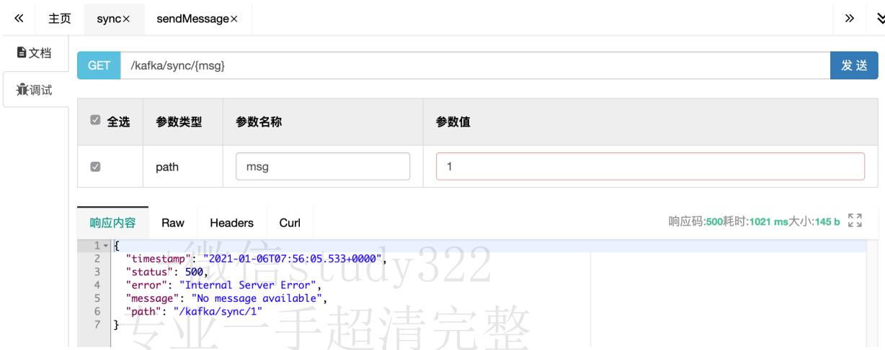


而调异步发送的（默认发送接口），请求立刻返回。

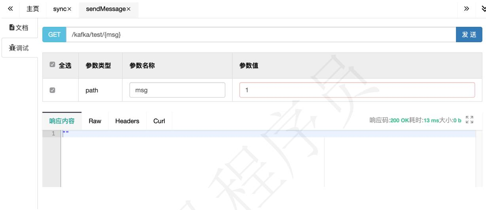


那么，异步发送的消息怎么确认发送情况呢？？？往下看！

# 3）注册监听

代码参考： KafkaListener.java (释放注解)

可以给kafkaTemplate设置Listener来监听消息发送情况，实现内部的对应方法

```txt
kafkaTemplate.setProducerListener(new ProducerListener<String, Object>() {}); 
```

查看控制台，等待一段时间后，异步发送失败的消息会被回调给注册过的listener

```txt
com.itheima.demo.config.KafkaListener:error!message={"message":"1","sendTime":1609920296374} 
```

启动kafka

```txt
docker-compose unpause kafka-1 kafka-2 
```

```txt
com.itheima.demo.config.KafkaListener$1:ok,message={"message":"1","sendTime":1610089315395}
com.itheima.demo.controller.PartitionConsumer:patition=1,message:[{"message":"1","sendTime":1610089315395}] 
```

可以看到，在内部类 KafkaListener$1 中，即注册的Listener的消息。

# 4.2.2 序列化

消费者使用：KafkaConsumer.java

# 1）序列化详解

前面用到的是Kafka自带的字符串序列化器

```txt
(org.apache.kafka.common.serialization.StringSerializer) 
```

除此之外还有：ByteArray、ByteBuffer、Bytes、Double、Integer、Long 等

这些序列化器都实现了接口 （org.apache.kafka.common.serialization.Serializer）

基本上，可以满足绝大多数场景

# 2）自定义序列化

自己实现，实现对应的接口即可，有以下方法：

```java
public interface Serializer<T> extends Closeable {
    default void configure(Map<String, ?> configs, boolean isKey) {
    }

    //理论上，只实现这个即可正常运行
    byte[] serialize(String var1, T var2);

    //默认调上面的方法
    default byte[] serialize(String topic, Headers headers, T data) {
    return this.serialize(topic, data);
    }

    default void close() {
    }
}
```

案例，参考: MySerializer.java

在yaml中配置自己的编码器

```txt
value-serializer: com.itheima.demo.config.MySerializer 
```

重新发送，发现：消息发送端编码回调一切正常。但是消费端消息内容不对！

```javascript
com.itheima.demo.controller.KafkaListener$1:ok,message={"message":"1","sendTime":1609923570477}
com.itheima.demo.controller.KafkaConsumer:message:"
{\message\":\"1\",\"sendTime\":1609923570477}" 
```

怎么办？

# 3）解码

发送端有编码并且我们自己定义了编码，那么接收端自然要配备对应的解码策略

代码参考：MyDeserializer.java，实现方式与编码器几乎一样！

在yaml中配置自己的解码器

```txt
value-deserializer: com.itheima.demo.config.MyDeserializer 
```

再次收发，消息正常

```javascript
com.itheima.demo.controller.AsyncProducer$1:ok,message={"message":"1","sendTime":1609924855896}
com.itheima.demo.controller.KafkaConsumer:message:{"message":"1","sendTime":1609924855896} 
```

# 4.2.3 分区策略

分区策略决定了消息根据key投放到哪个分区，也是顺序消费保障的基石。

给定了分区号，直接将数据发送到指定的分区里面去

没有给定分区号，给定数据的key值，通过key取上hashCode进行分区

既没有给定分区号，也没有给定key值，直接轮循进行分区

自定义分区，你想怎么做就怎么做

# 1）验证默认分区规则

发送者代码参考：PartitionProducer.java

消费者代码使用：PartitionConsumer.java


通过swagger访问setKey：


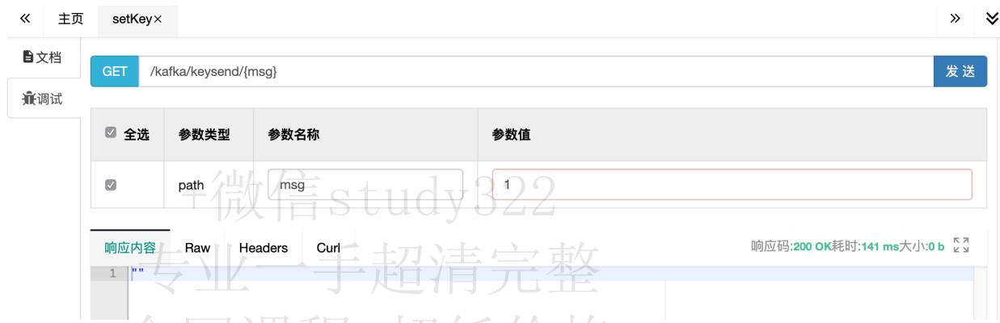


看控制台：


com.itheima.demo.controller.PatitionConsumer:patiton=0,message:[key=2,msg=不指定分区]com.itheima.demo.controller.PatitionConsumer:patiton=0,message:[key=2,msg=不定分区]com.itheima.demo.controller.PatitionConsumer:patiton=0,message:[key=2，msg=不指定分区]com.itheima.demo.controller.PatitionConsumer:patiton=0,message:[key=2,msg=不指定分区]com.itheima.demo.controller.PatitionConsumer:patiton=0,message:[key=2,msg=不指定分区]com.itheima.demo.controller.PatitionConsumer:patition=1,message:[key=1，msg=不指定分区]com.itheima.demo.controller.PatitionConsumer:patition=1,message:[key=1,msg=不定分区]com.itheima.demo.controller.PatitionConsumer:patition=1,message:[key=1,msg=不指定分区]com.itheima.demo.controller.PatitionConsumer:patition=1,message:[key=1，msg=不定分区]com.itheima.demo.controller.PatitionConsumer:patition=1,message:[key=1,msg=不指定分区]


分别用key=1和2连续发送5次

被固定的分区消费！


再访问setPartition来设置分区号0来发送


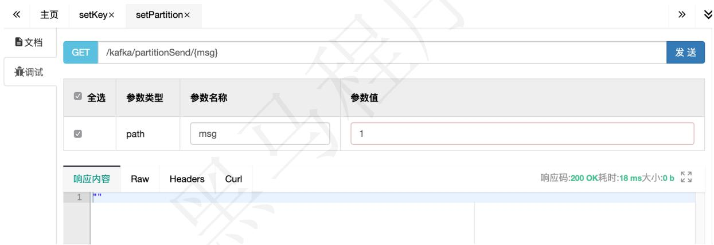


看控制台：


com.itheima.demo.controller.PatitionConsumer:patiton=0,message:[key=0,msg=指定0号分区]com.itheima.demo.controller.PatitionConsumer:patiton=0,message:[key=1,msg=指定o号分区]com.itheima.demo.controller.PatitionConsumer:patiton=0,message:[key=2，msg=指定0号分区]com.itheima.demo.controller.PatitionConsumer:patiton=0,message:[key=3,msg=指定0号分区]com.itheima.demo.controller.PatitionConsumer:patiton=0,message:[key=4,msg=指定o号分区]


不管你key是什么

都被指定的0号分区消费

# 2）自定义分区

你想自己定义规则，根据我的要求，把消息投放到对应的分区去？ 可以！

参考代码：MyPartitioner.java , MyPartitionTemplate.java ,

发送使用：MyPartitionProducer.java

使用swagger，发送0开头和非0开头两种key试一试！

备注：

自己定义config参数，比较麻烦，需要打破默认的KafkaTemplate设置

可以将KafkaConfiguration.java中的getTemplate加上@Bean注解来覆盖系统默认bean

这里为了避免混淆，采用@Autowire注入 专业一手超

# 4.3 消息消费

# 4.3.1 消息组别

发送者使用：KafkaProducer.java

1）代码参考：GroupConsumer.java，Listener拷贝3份，分别赋予两组group，验证分组消费：

```txt
@KafkaListener(topics = {"test"},groupId = "group1")
public void onMessage1(ConsumerRecord<?, ?>consumerRecord) {
    Optional<?> optional = Optional.ofNullable(consumerRecord.value());
    if (optional.isPresent()) {
    Object msg = optional.get();
    logger.info("group:group1-1, message:", msg);
    }
}

@KafkaListener(topics = {"test"},groupId = "group1")
public void onMessage2(ConsumerRecord<?, ?>consumerRecord) {
    Optional<?> optional = Optional.ofNullable(consumerRecord.value());
    if (optional.isPresent()) {
    Object msg = optional.get();
    logger.info("group:group1-2, message:", msg);
    }
}

@KafkaListener(topics = {"test"},groupId = "group2")
public void onMessage3(ConsumerRecord<?, ?>consumerRecord) {
    Optional<?> optional = Optional.ofNullable(consumerRecord.value());
    if (optional.isPresent()) {
    Object msg = optional.get();
    logger.info("group:group2, message:", msg);
    }
} 
```

2）启动

Found 1 custom documentation plugin(s) 

```ini
[Consumer clientId=consumer-2, groupId=group1] Successfully joined group with generation 10
[Consumer clientId=consumer-2, groupId=group1] Setting newly assigned partitions: test-1, test-0
group2: partitions assigned: [test-1, test-0]
[Consumer clientId=consumer-2, groupId=group1] Setting offset for partition test-1 to the committed offset Fet currentLeader=LeaderAndEpoch{leader=52.82.98.209:10903 (id: 1 rack: null), epoch=0}}
[Consumer clientId=consumer-2, groupId=group1] Setting offset for partition test-0 to the committed offset Fet currentLeader=LeaderAndEpoch{leader=52.82.98.209:10904 (id: 2 rack: null), epoch=0}}
[ConsumerclientId=consumer-3, groupId=group1] Cluster ID: WlcHvvRHRSe3dnQg1jD5Tg
[ConsumerClientId=consumer-3, groupId=group1] Discovered group coordinator 52.82.98.209:10904 (id: 2147483645)
[ConsumerClientId=consumer-3, groupId=group1] Revoking previously assigned partitions [] group1: partitions revoked: [] 
```

1个消费者，分2个分区

```ini
[Consumer clientId=consumer-3, groupId=group1] (Re-)joining group Scanning for api listing references
[Consumer clientId=consumer-3, groupId=group1] (Re-)joining group Starting ProtocolHandler ["http-nio-8080"]
Tomcat started on port(s): 8080 (http) with context path ''
Started App in 4.752 seconds (JVM running for 5.529) 
```

```ini
group1: partitions assigned: [test-1, test-0]
[Consumer clientId=consumer-2, groupId=group1] Attempt to heartbeat failed since group is rebalancing
[Consumer clientId=consumer-2, groupId=group1] Revoking previously assigned partitions [test-1, test-0]
group1: partitions revoked: [test-1, test-0]
[Consumer clientId=consumer-2, groupId=group1] (Re-)joining group
[Consumer clientId=consumer-3, groupId=group1] Successfully joined group with generation 11
[ConsumerclientId=consumer-2, groupId=group1] Successfully joined group with generation 11
[ConsumerClientId=consumer-3, groupId=group1] Setting newly assigned partitions: test-1
[ConsumerclientId=consumer-2, groupId=group1] Setting newly assigned partitions: test-0
[ConsumerClientId=consumer-2, groupId=group1] Setting offset for partition test-0 to the committed offset Fet currentLeader=LeaderAndEpoch{leader=52.82.98.209:10904 (id: 2 rack: null), epoch=0}
[ConsumerclientId=consumer-3, groupId=group1] Setting offset for partition test-1 to the committed offset Fet currentLeader=LeaderAndEpoch{leader=52.82.98.209:10903 (id: 1 rack: null), epoch=0}
group1: partitions assigned: [test-1]
group1: partitions assigned: [test-0] 
```

# 3）通过swagger发送2条消息

```javascript
group:group1-1, message:{"message":"1","sendTime":1609915308101}
group:group2, message:{"message":"1","sendTime":1609915308101}
group:group1-2, message:{"message":"2","sendTime":1609915310428}
group:group2, message:{"message":"2","sendTime":1609915310428} 
```

同一group下的两个消费者，在group1均分消息

group2下只有一个消费者，得到全部消息

# 4）消费端闲置

注意分区数与消费者数的搭配，如果 （ 消费者数 > 分区数量 ），将会出现消费者闲置，浪费资源！

验证方式：

停掉项目，删掉test主题，重新建一个 ，这次只给它分配一个分区。

重新发送两条消息，试一试

```javascript
group:group2, message:{"message":"1","sendTime":1612515973287}
group:group1-1, message:{"message":"1","sendTime":1612515973287}
group:group1-1, message:{"message":"2","sendTime":1612515976421}
group:group2, message:{"message":"2","sendTime":1612515976421} 
```

解析：

group2可以消费到1、2两条消息

group1下有两个消费者，但是只分配给了 -1 ， -2这个进程被闲置

# 4.3.2 位移提交

# 1）自动提交

前面的案例中，我们设置了以下两个选项，则kafka会按延时设置自动提交

```txt
enable-auto-commit: true # 是否自动提交offset
auto-commit-interval: 100 # 提交offset延时(接收到消息后多久提交offset)
```

# 2）手动提交

有些时候，我们需要手动控制偏移量的提交时机，比如确保消息严格消费后再提交，以防止丢失或重复。 全网课程 超低价格

下面我们自己定义配置，覆盖上面的参数

代码参考：MyOffsetConfig.java

通过在消费端的Consumer来提交偏移量，有如下几种方式：

代码参考：MyOffsetConsumer.java

同步提交、异步提交：manualCommit() ，同步异步的差别，下面会详细讲到。

指定偏移量提交：offset()

# 3）重复消费问题

如果手动提交模式被打开，一定不要忘记提交偏移量。否则会造成重复消费！

代码参考和对比：manualCommit() , noCommit()

# 验证过程：

用km将test主题删除，新建一个test空主题。方便观察消息偏移

注释掉其他Consumer的Component注解，只保留当前MyOffsetConsumer.java

启动项目，使用swagger的KafkaProducer发送连续几条消息

留心控制台，都能消费，没问题：

```txt
com.itheima.demo.controller.MyOffsetConsumer:忘记提交偏移量，partition=0，msg={"message":"1","sendTime":1610510825323}
com.itheima.demo.controller.MyOffsetConsumer:手动提交偏移量，partition=0，msg={"message":"1","sendTime":1610510825323}
com.itheima.demo.controller.MyOffsetConsumer:手动提交偏移量，partition=1，msg={"message":"1","sendTime":1610510826182}
com.itheima.demo.controller.MyOffsetConsumer:忘记提交偏移量，partition=1，msg={"message":"1","sendTime":1610510826182}
com.itheima.demo.controller.MyOffsetConsumer:忘记提交偏移量，partition=0，msg={"message":"1","sendTime":1610510826620}
com.itheima.demo.controller.MyOffsetConsumer:手动提交偏移量，partition=0，msg={"message":"1","sendTime":1610510826620}
com.itheima.demo.controller.MyOffsetConsumer:忘记提交偏移量，partition=1，msg={"message":"1","sendTime":1610510826960}
com.itheima.demo.controller.MyOffsetConsumer:手动提交偏移量，partition=1，msg={"message":"1","sendTime":1610510826960}
```

# 但是！重启试试：

```txt
org.springframework.core.log.LogAccessor:myoffset-group-1: partitions assigned: [test-1, test-0]
org.springframework.core.log.LogAccessor:myoffset-group-2: partitions assigned: [test-1, test-0]
com.itheima.demo.controller.MyOffsetConsumer:忘记提交偏移量，partition=1，msg={"message":"1","sendTime":1610510826182}
com.itheima.demo.controller.MyOffsetConsumer:忘记提交偏移量，partition=1，msg={"message":"1","sendTime":1610510826960}
com.itheima.demo.controller.MyOffsetConsumer:忘记提交偏移量，partition=0，msg={"message":"1","sendTime":1610510825323}
com.itheima.demo.controller.MyOffsetConsumer:忘记提交偏移量，partition=0，msg={"message":"1","sendTime":1610510826620}
```

无论重启多少次，不提交偏移量的消费组，会重复消费一遍！！！

# 再通过命令行查询偏移量试试：

<table><tr><td></td><td></td><td></td><td></td><td></td><td></td></tr><tr><td></td><td></td><td></td><td></td><td></td><td></td></tr><tr><td></td><td></td><td></td><td></td><td></td><td></td></tr><tr><td></td><td></td><td></td><td></td><td></td><td></td></tr><tr><td colspan="6"></td></tr><tr><td></td><td></td><td></td><td></td><td></td><td></td></tr><tr><td></td><td></td><td></td><td></td><td></td><td></td></tr><tr><td></td><td></td><td></td><td></td><td></td><td></td></tr><tr><td colspan="6"></td></tr></table>

# 4）经验与总结

commitSync()方法，即同步提交，会提交最后一个偏移量。在成功提交或碰到无怯恢复的错误之前，commitSync()会一直重试，但是commitAsync()不会。

这就造成一个陷阱：

如果异步提交，针对偶尔出现的提交失败，不进行重试不会有太大问题，因为如果提交失败是因为临时问题导致的，那么后续的提交总会有成功的。只要成功一次，偏移量就会提交上去。

但是！如果这是发生在关闭消费者时的最后一次提交，就要确保能够提交成功，如果还没提交完就停掉了进程。就会造成重复消费！

因此，在消费者关闭前一般会组合使用commitAsync()和commitSync()。详细代码参考：MyOffsetConsumer.manualOffset()

# 5、高级特性

# 5.1 扩展性

# 5.1.1 broker扩容

1）在yaml中复制kafka-2，拷贝为新的节点，注意以下标注修改的地方！

#修改后的内容参考：cluster.yml

```yaml
kafka-3: #改
container_name: kafka-3 #改
image: wurstmeister/kafka:2.12-2.2.2
ports:
- 10905:9092 #改
environment:
KAFKA_BROKER_ID: 3 #改
HOST_IP: 192.168.10.30
KAFKA_ZOOKEEPER_CONNECT: zookeeper:2181
KAFKA_ADVERTISED_HOST_NAME: 192.168.10.30
KAFKA_ADVERTISED_PORT: 10905 #改
volumes:
```

```yaml
- /etc/localtime:/etc/localtime depends_on:
- zookeeper 
```


完整的 cluster.yml


```yaml
version: '3'
services:
zookeeper:
image: zookeeper:3.4.13

kafka-1:
container_name: kafka-1
image: wurstmeister/kafka:2.12-2.2.2
ports:
- 10903:9092
environment:
KAFKA_BROKER_ID: 1
HOST_IP: 192.168.10.30
KAFKA_ZOOKEEPER_CONNECT: zookeeper:2181
#docker部署必须设置外部可访问ip和端口，否则注册进zk的地址将不可达造成外部无法连接

KAFKA_ADVERTISED_HOST_NAME: 192.168.10.30
KAFKA_ADVERTISED_PORT: 10903
volumes:
- /etc/localtime:/etc/localtime
depends_on:
- zookeeper
kafka-2:
container_name: kafka-2
image: wurstmeister/kafka:2.12-2.2.2
ports:
- 10904:9092
environment:
KAFKA_BROKER_ID: 2
HOST_IP: 192.168.10.30
KAFKA_ZOOKEEPER_CONNECT: zookeeper:2181
KAFKA_ADVERTISED_HOST_NAME: 192.168.10.30
KAFKA_ADVERTISED_PORT: 10904
volumes:
- /etc/localtime:/etc/localtime
depends_on:
- zookeeper
km:
image: liggdocker/km:2002
ports:
- 10906:9000
depends_on:
- zookeeper
kafka-3: #改
container_name: kafka-3 #改
image: wurstmeister/kafka:2.12-2.2.2
ports:
- 10905:9092 #改
environment:
KAFKA_BROKER_ID: 3 #改
HOST_IP: 192.168.10.30
```

```yaml
KAFKA_ZOOKEEPER_CONNECT: zookeeper:2181
KAFKA_ADVERTISED_HOST_NAME: 192.168.10.30
KAFKA_ADVERTISED_PORT: 10905 #改
volumes:
- /etc/localtime:/etc/localtime
depends_on:
- zookeeper
```


2）更新docker集群信息+微


```txt
docker-compose -f cluster.yml up -d 
```


#启动消息


```shell
kafka_zookeeper_1 is up-to-date
kafka_km_1 is up-to-date
kafka-1 is up-to-date
kafka-2 is up-to-date
Creating kafka-3 ... done 
```


3）进命令行，或打开km查看新的broker信息


# ← Brokers

<table><tr><td>Id</td><td>Host</td><td>Port</td><td>JMX Port</td><td>Bytes In</td><td>Bytes Out</td></tr><tr><td>1</td><td>52.82.98.209</td><td>PLAINTEXT:10903</td><td>-1</td><td>0.00</td><td>0.00</td></tr><tr><td>2</td><td>52.82.98.209</td><td>PLAINTEXT:10904</td><td>-1</td><td>0.00</td><td>0.00</td></tr><tr><td>3</td><td>52.82.98.209</td><td>PLAINTEXT:10905</td><td>-1</td><td>0.00</td><td>0.00</td></tr></table>

# 5.1.2 分区扩容

1）使用km对test主题增加分区到3个，看分区分配机器情况

test 


Topic Summary


<table><tr><td>Replication</td><td>1</td></tr><tr><td>Number of Partitions</td><td>2</td></tr><tr><td>Sum of partition offsets</td><td>0</td></tr><tr><td>Total number of Brokers</td><td>3</td></tr><tr><td>Number of Brokers for Topic</td><td>2</td></tr></table>


Operations


<table><tr><td>Delete Topic</td><td>Reassign Partitions</td><td>Generate Partition Assignments</td></tr><tr><td>Add Partitions</td><td>Update Config</td><td>Manual Partition Assignments</td></tr></table>

可以指定新分区数量，及分配到的机器


# Add Partitions

Add Partitions 

Topic 

test 

Partitions 

3 

Brokers 

Select All 

Select None 

□1- 52.82.98.209 

2 - 52.82.98.209 

3 - 52.82.98.209 

Add Partitions 

Cancel 

# 2）注意问题

新加分区或重新调整分区，已经启动的客户端会动态更新对应的分配信息，不需要重启。

但是！！！

在同步变更消息的过程中有可能会丢失消息！想想为什么？（答案在下面）

（注意！以下场景不保证100%会重现！）

```txt
com.itheima.demo.controller.KafkaConsumer:message {"message":"1","sendTime":1610599285671}
com.itheima.demo.controller.KafkaConsumer:message {"message":"1","sendTime":1610599286411}
org.apache.kafka.clients.consumer.internals.ConsumerCoordinator:[Consumer clientId=consumer-1, groupId=javagroup] Revoking previously assigned partitions
[test-1, test-0]
org.springframework.core.log.LogAccessor:javagroup: partitions revoked: [test-1, test-0]
org.apache.kafka.clients.consumer.internals.AbstractCoordinator:[Consumer clientId=consumer-1, groupId=javagroup] (Re-)joining group
org.apache.kafka.clients.consumer.internals.AbstractCoordinator$1:[ConsumerClientId=consumer-1, groupId=javagroup] Successfully joined group with generation
8
org.apache.kafka.clients.consumer.internals.ConsumerCoordinator:[Consumer clientId=consumer-1, groupId=javagroup] Setting newly assigned partitions: test-1,
test-0, test-2
org.apache.kafka.clients.consumer.internals.ConsumerCoordinator$OffsetFetchResponseHandler:[ConsumerlicitId=consumer-1, groupId=javagroup] Found no
committed offset for partition test-2
但是新分区下没有任何offset提交过! 那么latest配置下就不会消费到之前的消息
org.apache.kafka.clients.consumer.internals.ConsumerCoordinator:[ConsumerlicitId=consumer-1, groupId=javagroup] Setting offset for partition test-1 to the
committed offset FetchPosition{offset=4, offsetEpoch=Optional[0], currentLeader=LeaderAndEpoch{leader=52.82.98.209:10904 (id: 2 rack: null), epoch=0}}
org.apache.kafka.clients.consumer.internals.ConsumerCoordinator:[ConsumerlicitId=consumer-1, groupId=javagroup] Setting offset for partition test-0 to the
committed offset FetchPosition{offset=4, offsetEpoch=Optional[0], currentLeader=LeaderAndEpoch{leader=52.82.98.209:10903 (id: 1 rack: null), epoch=0}}
org.apache.kafka.clients.consumer.internals.SubscriptionState:[ConsumerlicitId=consumer-1, groupId=javagroup] Resetting offset for partition test-2 to
offset 2.
org.springframework.core.log.LogAccessor:javagroup: partitions assigned: [test-1, test-0, test-2]
com.itheima.demo.controller.KafkaConsumer:message {"message":"1","sendTime":1610599547722}
com.itheima.demo.controller.KafkaConsumer:message {"message":"1","sendTime":1610599548442}
com.itheima.demo.controller.KafkaConsumer:message {"message":"1","sendTime":1610599549161}
```

答案：

回顾一下消费偏移量的默认提交配置：latest，因为新分区没有任何offset提交记录全网课程 超低价格

所以会在重新分配分区后从末尾开始消费！

那么分配前的那些消息就不会消费到。而分配后再发送的不会受影响，可以正常消费

分区分配正常后，查看偏移量提交信息，没问题：

<table><tr><td>TOPIC</td><td>PARTITION</td><td>CURRENT-OFFSET</td><td>LOG-END-OFFSET</td></tr><tr><td>test</td><td>0</td><td>5</td><td>5</td></tr><tr><td>test</td><td>1</td><td>5</td><td>5</td></tr><tr><td>test</td><td>2</td><td>3</td><td>3</td></tr></table>

km的Consumer页签里也可以查看偏移量信息：

<table><tr><td>Partition</td><td>LogSize</td><td>Consumer Offset</td></tr><tr><td>0</td><td>5</td><td>5</td></tr><tr><td>1</td><td>5</td><td>5</td></tr><tr><td>2</td><td>3</td><td>3</td></tr></table>

# 5.2 高可用

以上动态扩容操作是怎么实现的呢？集群中必然有一个节点协调了相关操作。

这台协调者，就是controller节点。

controller节点是其中的一台broker，所有broker都有可能成为controller

当前controller宕机后，其他就会参与竞争，选出新的controller，保持集群对外的高可用

# 5.2.1 节点选举


1）查找controller，找到它所在的broker


#查找docker进程，找到zookeeper的容器


```txt
[root@iz8vb3a9qxofwannyywl6zz ~]# docker ps --format
"table{{.ID}}\t{{.Names}}\t{{.Ports}}"
CONTAINER ID NAMES PORTS
75318748caab kafka-3 0.0.0.0:10905->9092/tcp
4807d188a180 kafka_km_1 0.0.0.0:10906->9000/tcp
4453eb0b2a36 kafka-2 0.0.0.0:10904->9092/tcp
d6fd814a0851 kafka-1 0.0.0.0:10903->9092/tcp
8c1fc2cc6e9a kafka_zookeeper_1 2181/tcp, 2888/tcp, 3888/tcp 
```


#进入容器，连上zk


```txt
[root@iz8vb3a9qxofwannyywl6zz ~]# docker exec -it kafka_zookeeper_1 sh /zookeeper-3.4.13 #
/zookeeper-3.4.13 # zkCli.sh
Connecting to localhost:2181 
```


#查询当前controller是哪个节点，发现是2号机器（有可能是其他节点，找到这个brokerid，下面要用！）


```txt
[zk: localhost:2181(CONNECTED) 6] get /controller {"version":1,"brokerid":2,"timestamp":"1610500701187"} 
```


#controller变更的次数


```txt
[zk: localhost:2181(CONNECTED) 7] get /controller_epoch 1 
```


2）docker-compose停掉它！


#docker pause 暂停容器的服务，注意是上面找到的那台broker


```txt
[root@iz8vb3a9qxofwannyywl6zz ~]# docker pause kafka-2 kafka-2 
```


#查看状态，发现(Paused)


```txt
[root@iz8vb3a9qxofwannyywl6zz ~]# docker ps | grep kafka-2
4453eb0b2a36    wurstmeister/kafka:2.12-2.2.2    "start-kafka.sh"
>9092/tcp
kafka-2 
```


#再次按 1）的步骤进入zk容器，查看当前controller，已经变为3号


```txt
[zk: localhost:2181(CONNECTED) 0] get /controller {"version":1,"brokerid":3,"timestamp":"1610679583216"} 
```


#变更次数加了1


```txt
[zk: localhost:2181(CONNECTED) 1] get /controller_epoch 2 
```

# 5.2.2 原理剖析

当控制器被关闭或者与Zookeeper系统断开连接时，Zookeeper系统上的/controller临时节点就会被清除。

Kafka集群中的监听器会接收到变更通知，各个代理节点会尝试到Zookeeper系统中创建它。

第一个成功在Zookeeper系统中创建的代理节点，将会成为新的控制器。

每个新选举出来的控制器，会在Zookeeper系统中递增controller_epoch的值。


附：详细流程图


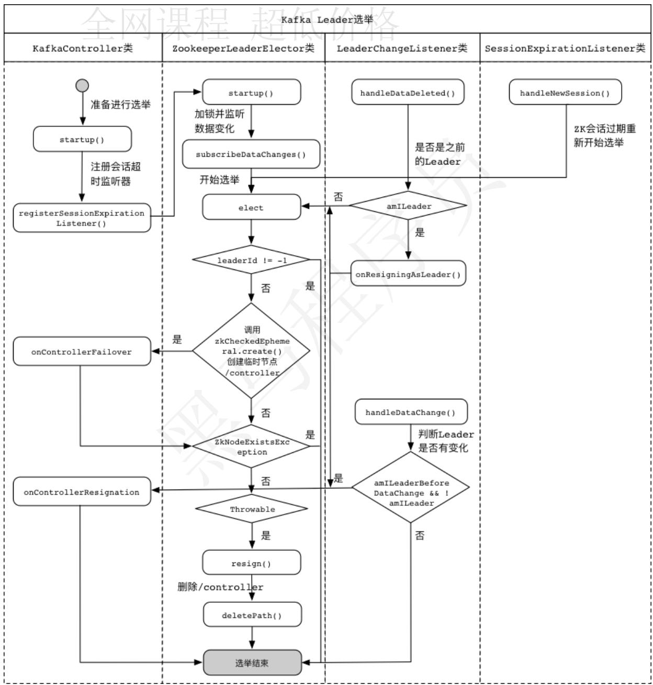


# 6、底层架构

# 6.1 存储架构

# 6.1.1 分段存储

开篇讲过，kafka每个主题可以有多个分区，每个分区在它所在的broker上创建一个文件夹

每个分区又分为多个段，每个段两个文件，log文件里顺序存消息，index文件里存消息的索引

段的命名直接以当前段的第一条消息的offset为名

注意是偏移量，不是序号！ 第几条消息 = 偏移量 + 1。类似数组长度和下标。

所以offset从0开始（可以开新队列新groupid消费第一条消息打印offset得到验证）+微信study322

```javascript
com.itheima.demo.controller.KafkaConsumer:offset:0,message:{"message":"1","sendTime":1611039911283}
com.itheima.demo.controller.KafkaConsumer:offset:1,message:{"message":"2","sendTime":1611039914687}
com.itheima.demo.controller.KafkaConsumer:offset:2,message:{"message":"3","sendTime":1611039918061} 
```

例如：

0.log -> 有8条，offset为 0-7，[0, 8)

8.log -> 有两条，offset为 8-9，[8, 10)

10.log -> 有xx条，offset从10-xx，[10, 10 + xx)

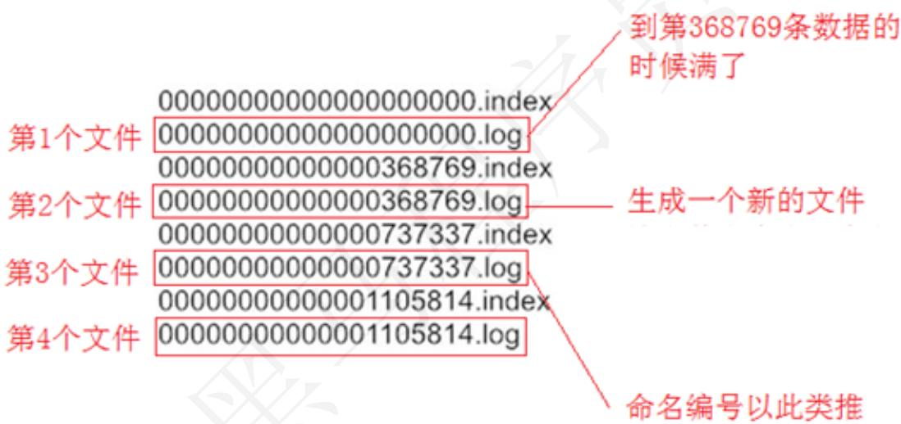


# 6.1.2 日志索引

每个log文件配备一个索引文件 *.index

/opt/kafka/bin/kafka-run-class.sh kafka.tools.DumpLogSegments --files test-

0/00000000000000000000.index 

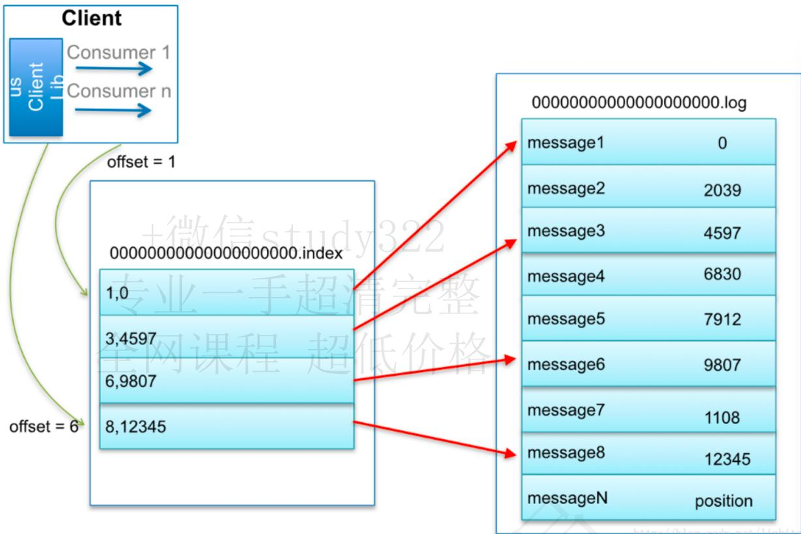


综合上述，来看一个消息的查找：

consumer发起请求要求从offset=6的消息开始消费

kafka直接根据文件名大小，发现6号消息在00000.log这个文件里

那文件找到了，它在文件的哪个位置呢？

根据index文件，发现 (6 , 9807)，说明消息藏在这里！

从log文件的 9807 位置开始读取。

那读多长呢？简单，读到下一条消息的偏移量停止就可以了

# 6.1.3 日志删除

Kafka作为消息中间件，数据需要按照一定的规则删除，否则数据量太大会把集群存储空间占满。

删除数据方式：

按照时间，超过一段时间后删除过期消息

按照消息大小，消息数量超过一定大小后删除最旧的数据

Kafka删除数据的最小单位：segment，也就是直接干掉文件！一删就是一个log和index文件

# 6.1.4 存储验证

# 1）数据准备

将broker 2和3 停掉，只保留1

```txt
docker pause kafka-2 kafka-3 
```

2）删掉test主题，通过km新建一个test主题，加2个分区

新建时，注意下面的选项：

segment.bytes = 1000 ，即：每个log文件到达1000byte时，开始创建新文件

删除策略：

retention.bytes = 2000，即：超出2000byte的旧日志被删除

retention.ms = 60000，即：超出1分钟后的旧日志被删除

以上任意一条满足，就会删除。专业一


3）进入kafka-1这台容器


```txt
docker exec -it kafka-1 sh

#查看容器中的文件信息
/ # ls /
bin dev etc home kafka lib lib64 media mnt opt proc root run sbin srv sys tmp usr var

/ # cd /kafka/

/kafka # ls
kafka-logs-d0b9c75080d6

/kafka # cd kafka-logs-d0b9c75080d6 / kafka/kafka-logs-d0b9c75080d6 # ls -l | grep test
drwxr-xr-x 2 root root 4096 Jan 15 14:35 test-0
drwxr-xr-x 2 root root 4096 Jan 15 14:35 test-1

#2个分区的日志文件清单，注意当前还没有任何消息写进来
#timeindex: 日志的时间信息
#leader-epoch, 下面会讲到
/kafka/kafka-logs-d0b9c75080d6 # ls -lR test-* 
test-0:
total 4
-rw-r--r-- 1 root root 10485760 Jan 15 14:35
000000000000000000000.index
-rw-r--r-- 1 root root 0 Jan 15 14:35
00000000000000000000.log
-rw-r--r-- 1 root root 10485756 Jan 15 14:35
00000000000000000000.timeindex
-rw-r--r-- 1 root root 8 Jan 15 14:35 leader-epoch-checkpoint
test-1:
total 4
-rw-r--r-- 1 root root 10485760 Jan 15 14:35
00000000000000000000.index
-rw-r--r-- 1 root root 0 Jan 15 14:35
0000000000000000000.log
-rw-r--r-- 1 root root 10485756 Jan 15 14:35
000000000000000000TimeIndex
-rw-r--r-- 1 root root 8 Jan 15 14:35 leader-epoch-checkpoint
```

4）往里灌数据。启动项目通过swagger发送消息

注意！边发送边查看上一步的文件列表信息！

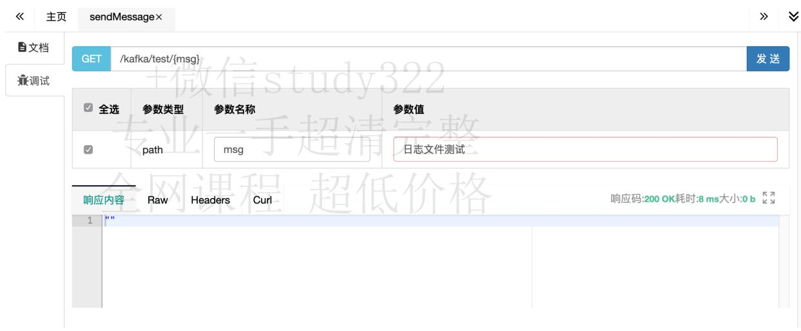


#先发送2条，消息开始进来，log文件变大！消息在两个分区之间逐个增加。

```txt
/kafka/kafka-logs-d0b9c75080d6 # ls -lR test-*
test-0:
total 8
-rw-r--r-- 1 root root 10485760 Jan 15 14:35
000000000000000000000.index
-rw-r--r-- 1 root root 875 Jan 15 14:46
00000000000000000000.log
-rw-r--r-- 1 root root 10485756 Jan 15 14:35
000000000000000000000.timeindex
-rw-r--r-- 1 root root 8 Jan 15 14:35 leader-epoch-checkpoint
test-1:
total 8
-rw-r--r-- 1 root root 10485760 Jan 15 14:35
00000000000000000000index
-rw-r--r-- 1 root root 875 Jan 15 14:46
0000000000000000000log
-rw-r--r-- 1 root root 10485756 Jan 15 14:35
0000000000000000000timeindex
-rw-r--r-- 1 root root 8 Jan 15 14:35 leader-epoch-checkpoint 
```

#继续逐条发送，返回再来看文件，大小为1000，到达边界！

```txt
/kafka/kafka-logs-d0b9c75080d6 # ls -lR test-*  
test-0:  
total 8  
-rw-r--r-- 1 root root 10485760 Jan 15 14:35  
0000000000000000000000.index  
-rw-r--r-- 1 root root 1000 Jan 15 14:46  
000000000000000000000.log  
-rw-r--r-- 1 root root 10485756 Jan 15 14:35  
000000000000000000000.timeindex  
-rw-r--r-- 1 root root 8 Jan 15 14:35 leader-epoch-checkpoint 
```

test-1: 

total 8 

```txt
-rw-r--r-- 1 root root 10485760 Jan 15 14:35
000000000000000000000.index
-rw-r--r-- 1 root root 1000 Jan 15 14:46
00000000000000000000.log
-rw-r--r-- 1 root root 10485756 Jan 15 14:35
000000000000000000000.timeindex
-rw-r--r-- 1 root root 8 Jan 15 14:35 leader-epoch-checkpoint 
```

#继续发送消息！1号分区的log文件开始分裂

#说明第8条消息已经进入了第二个log专业一手

/kafka/kafka-logs-d0b9c75080d6 # ls -lR test-* 

test-0: 

total 8 

```txt
-rw-r--r-- 1 root root 10485760 Jan 15 14:35
0000000000000000000000.index
-rw-r--r-- 1 root root 1000 Jan 15 14:46
000000000000000000000.log
-rw-r--r-- 1 root root 10485756 Jan 15 14:35
000000000000000000000.timeindex
-rw-r--r-- 1 root root 8 Jan 15 14:35 leader-epoch-checkpoint 
```

test-1: 

total 20 

```txt
-rw-r--r-- 1 root root 0 Jan 15 14:46
000000000000000000000.index
-rw-r--r-- 1 root root 1000 Jan 15 14:46
00000000000000000000.log
-rw-r--r-- 1 root root 12 Jan 15 14:46
000000000000000000000.timeindex
-rw-r--r-- 1 root root 10485760 Jan 15 14:46
00000000000000000008.index
-rw-r--r-- 1 root root 125 Jan 15 14:46 
```

00000000000000000008.log #第二个log文件！

```txt
-rw-r--r-- 1 root root 10 Jan 15 14:46
00000000000000000008.snapshot
-rw-r--r-- 1 root root 10485756 Jan 15 14:46
00000000000000000008.timeindex
-rw-r--r-- 1 root root 8 Jan 15 14:35 
```

#持续发送，另一个分区也开始分离

/kafka/kafka-logs-d0b9c75080d6 # ls -lR test-* 

test-0: 

total 20 

```txt
-rw-r--r-- 1 root root 0 Jan 15 15:55
000000000000000000000.index
-rw-r--r-- 1 root root 1000 Jan 15 14:46
00000000000000000000.log
-rw-r--r-- 1 root root 12 Jan 15 15:55
000000000000000000000.timeindex
-rw-r--r-- 1 root root 10485760 Jan 15 15:55
00000000000000000008.index
-rw-r--r-- 1 root root 625 Jan 15 15:55
00000000000000000008.log
-rw-r--r-- 1 root root 10 Jan 15 15:55
0000000000000000008.snapshot 
```

```txt
-rw-r--r-- 1 root root 10485756 Jan 15 15:55
00000000000000000008.timeindex
-rw-r--r-- 1 root root 8 Jan 15 14:35 leader-epoch-checkpoint
test-1:
total 20
-rw-r--r-- 1 root root 0 Jan 15 14:46
00000000000000000000.index
-rw-r--r-- 1 root root 1000 Jan 15 14:46
00000000000000000000.log
-rw-r--r-- 1 root root 12 Jan 15 14:46
00000000000000000000.log
-rw-r--r-- 1 root root 10485760 Jan 15 14:46
0000000000000000008.index
-rw-r--r-- 1 root root 750 Jan 15 15:55
0000000000000000008.log
-rw-r--r-- 1 root root 10 Jan 15 14:46
000000000000000008.snapshot
-rw-r--r-- 1 root root 10485756 Jan 15 14:46
00000000000000008.log
-rw-r--r-- 1 root root 8 Jan 15 14:35 leader-epoch-checkpoint 
```

#持续发送消息，分区越来越多。

#过一段时间后再来查看，清理任务将会执行，超出的日志被删除！（默认调度间隔5min）

#log.retention.check.interval.ms 参数指定

```txt
/kafka/kafka-logs-d0b9c75080d6 # ls -lR test-*
test-0:
total 8
-rw-r--r-- 1 root root 10485760 Jan 15 19:12
00000000000000000119.index
-rw-r--r-- 1 root root 0 Jan 15 19:12
00000000000000000119.log
-rw-r--r-- 1 root root 10 Jan 15 19:12
0000000000000000119.snapshot
-rw-r--r-- 1 root root 10485756 Jan 15 19:12
0000000000000000119.timeindex
-rw-r--r-- 1 root root 10 Jan 15 19:12 leader-epoch-checkpoint
test-1:
total 8
-rw-r--r-- 1 root root 10485760 Jan 15 19:12
0000000000000000119.index
-rw-r--r-- 1 root root 0 Jan 15 19:12
0000000000000000119.log
-rw-r--r-- 1 root root 10 Jan 15 19:12
000000000000000119.snapshot
-rw-r--r-- 1 root root 10485756 Jan 15 19:12
00000000000000119.timeindex
-rw-r--r-- 1 root root 10 Jan 15 19:12 leader-epoch-checkpoint 
```

# 6.2 零拷贝

# 6.2.1 传统文件读写

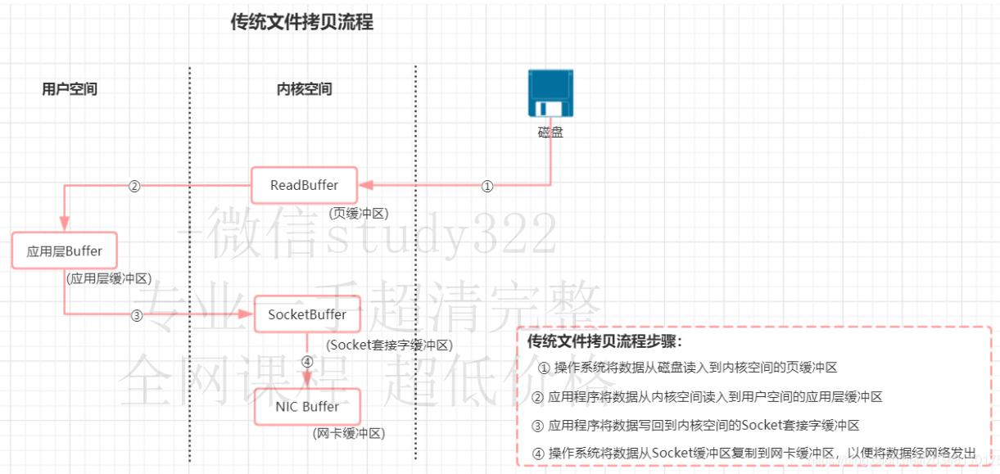


传统读写，涉及到 4 次数据的复制。但是这个过程中，数据完全没有变化，我们仅仅是想从磁盘把数据送到网卡。

那有没有办法不绕这一圈呢？让磁盘和网卡之类的外围设备直接访问内存，而不经过cpu？

有！ 这就是DMA（Direct Memory Access 直接内存访问） 。

# 6.2.2 DMA

DMA其实是由DMA芯片（硬件支持）来控制的。通过DMA控制芯片，可以让网卡等外部设备直接去读取内存，而不是由cpu来回拷贝传输。这就是所谓的零拷贝

目前计算机主流硬件基本都支持DMA，就包括我们的硬盘和网卡。

kafka就是调取操作系统的sendfile，借助DMA来实现零拷贝数据传输的

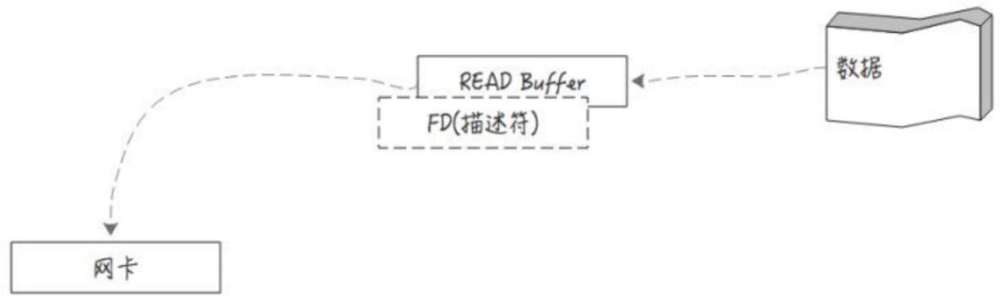


# 6.2.3 java实现

为加深理解，类比为java中的零拷贝：

在Java中的零拷贝是通过java.nio.channels.FileChannel中的transferTo方法来实现的

transferTo方法底层通过native调操作系统的sendfile

操作系统sendfile负责把数据从某个fd（linux file descriptor）传输到另一个fd

备注：linux下所有的设备都是一个文件描述符fd


代码参考：


```txt
File file = new File("0.log");
RandomAccessFile raf = new RandomAccessFile(file, "rw");
//文件通道，来源
FileChannel fileChannel = raf.getChannel();
//网络通道，去处
SocketChannel socketChannel = SocketChannel.open(new InetSocketAddress("1.1.1.1", 1234));
//对接上，通过transfer直接送过去
fileChannel.transferTo(0, fileChannel.size(), socketChannel);
```

# 6.3 分区一致性

# 6.3.1 水位值


1）先回顾两个值：


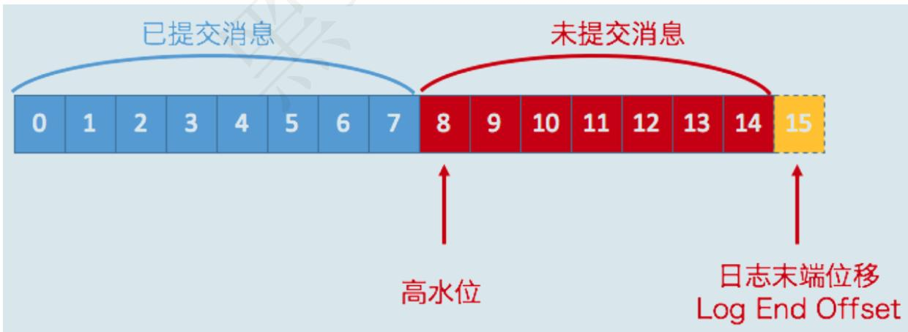


# 2）再看下几个值的存储位置：

注意！分区是有leader和follower的，最新写的消息会进入leader，follower从leader不停的同步

无论leader还是follower，都有自己的HW和LEO，存储在各自分区所在的磁盘上

leader多一个Remote LEO，它表示针对各个follower的LEO，leader又额外记了一份！

# 3）为什么这么做呢？

# 6.3.2 同步原理

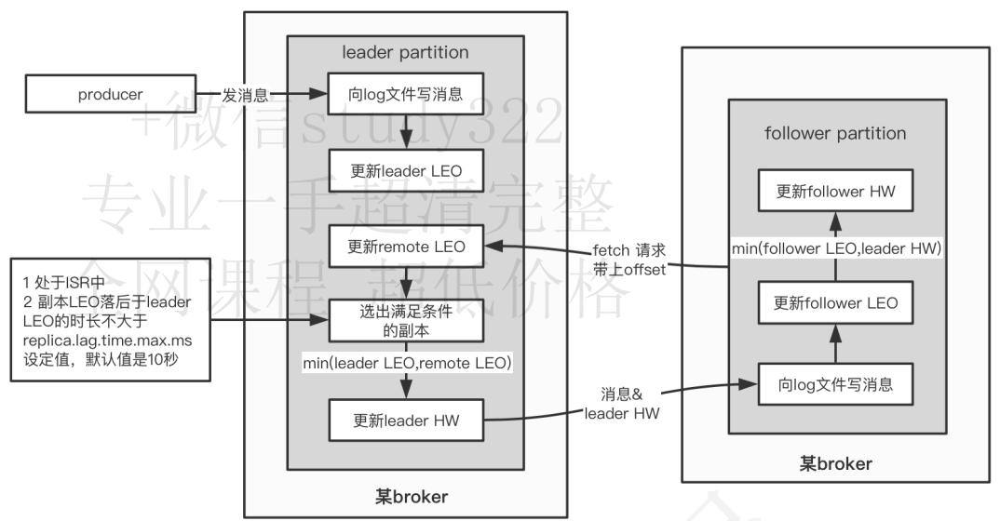


我们来看这几个值是如何更新的：

1）leader.LEO 

这个很简单，每次producer有新消息发过来，就会增加

2）其他值

另外的4个值初始化都是 0

他们的更新由follower的fetch（同步消息线程）得到的数据来决定！

如果把fetch看做是leader上提供的方法，由follower远程请求调用，那么它的伪代码大概是这个样子：

```java
//java伪代码!
//follower端的操作，不停的请求从leader获取最新数据
class Follower{
    private List<Message> messages;
    private HW hw;
    private LEO leo;

    @Schedule("不停的向leader发起同步请求")
    void execute(){
    //向leader发起fetch请求，将自己的leo传过去
    //leader返回leo之后最新的消息，以及leader的hw
    LeaderReturn lr = leader.fetch(this.leo);

    //存消息
    this.messages.addAll(lr.newMsg);
    //增加follower的leo值
    this.leo = this.leo + lr.newMsg.length;
    //比较自己的leo和leader的hw，取两者小的，作为follower的hw
    this.hw = min(this.leo, lr.leaderHw);
    }
}
```

```dart
//leader返回的报文
class LeaderReturn{
    //新增的消息
    List<Messages> newMsg;
    //leader的hw
    HW leaderHw;
}
```

```txt
//leader在接到follower的fetch请求时，做的逻辑
class Leader{
    private List<Message> messages;
    private LEO leo;
    private HW hw;
    //Leader比follower多了个Remote!
    //注意！如果有多个副本，那么RemoteLEO也有多个，每个副本对应一个
    private RemoteLEO remoteLEO;

    //接到follower的fetch请求时，leader做的事情
    LeaderReturn fetch(LEO followerLEO){
    //根据follower传过来的leo，来更新leader的remote
    this.remoteLEO = followerLEO ;
    //然后取ISR（所有可用副本）的最小leo作为leader的hw
    this.hw = min(this.leo, this.remoteLEO);

    //从leader的消息列表里，查找大于follower的leo的所有新消息
    List<Message> newMsg = queryMsg(followerLEO);

    //将最新的消息（大于follower leo的那些），以及leader的hw返回给follower
    LeaderReturn lr = new LeaderReturn(newMsg, this.hw)
    return lr;
    }
}
```

# 6.3.3 Leader Epoch

# 1）产生的背景

0.11版本之前的kafka，完全借助hw作为消息的基准，不管leo。

# 发生故障后的规则：

follower故障再次恢复后，从磁盘读取hw的值并从hw开始剔除后面的消息，并同步leader消息

leader故障后，新当选的leader的hw作为新的分区hw，其余节点按照此hw进行剔除数据，并重新同步

上述根据hw进行数据恢复会出现数据丢失和不一致的情况，下面分开来看

假设：

我们有两个副本：leader（A），follower（B）


场景一：丢数据


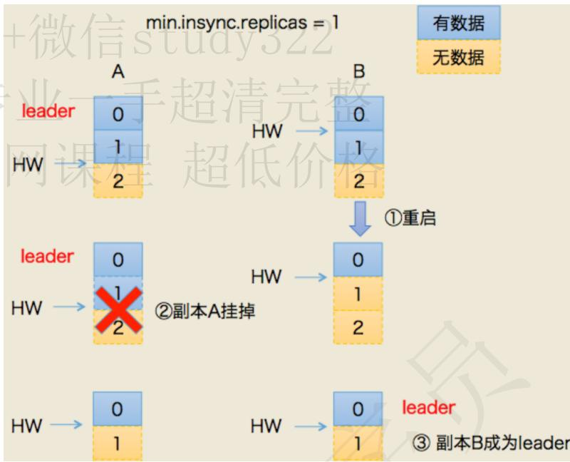


某个时间点B挂了。当它恢复后，以挂之前的hw为准，设置 leo = hw

这就造成一个问题：现实中，leo 很可能是 大于 hw的。leo被回退了！

如果这时候，恰恰A也挂掉了。kafka会重选leader，B被选中。

过段时间，A恢复后变成follower，从B开始同步数据。

问题来了！上面说了，B的数据是被回退过的，以它为基准会有问题

最终结果：两者的数据都发生丢失，没有地方可以找回！


场景二：数据不一致


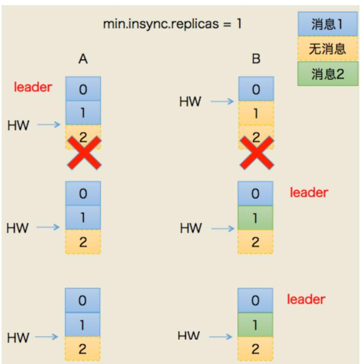


这次假设AB全挂了。比较惨

B先恢复。但是它的hw有可能挂之前没从A同步过来（原来A是leader）

我们假设，A.hw = 2 , B.hw = 1

B恢复后，集群里只有它自己，所以被选为leader，开始接受新消息

B.hw上涨，变成2

然后，A恢复，原来A.hw = 2 ，恢复后以B的hw，也就是2为基准开始同步。

问题来了！B当leader后新接到的2号消息是不会同步给A的，A一直保留着它当leader时的旧数据

最终结果：数据不一致了！

# 2）改进思路

0.11之后，kafka改进了hw做主的规则，这就是leader epoch

leader epoch给leader节点带了一个版本号，类似于乐观锁的设计。

它的思想是，一旦发生机器故障，重启之后，不再机械的将leo退回hw

而是借助epoch的版本信息，去请求当前leader，让它去算一算leo应该是什么

# 3）实现原理

对比上面丢数据的问题：

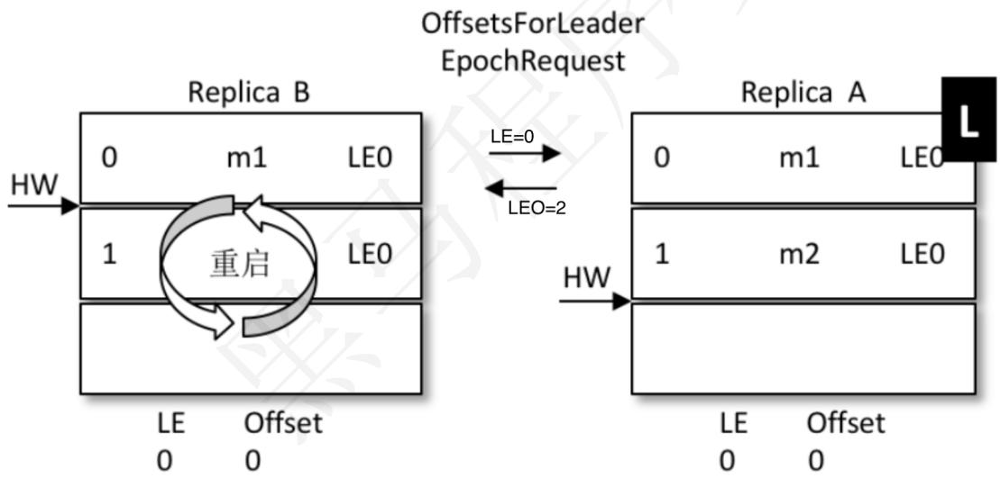


A为（leo=2 , hw=2），B为（leo=2 , hw=1）

B重启，但是B不再着急将leo打回hw，而是发起一个Epoch请求给当前leader，也就是A

A收到LE=0后，发现和自己的LE一样，说明B在挂掉前后，leader没变，都是A自己

那么A就将自己的leo值返回给B，也就是数字2

B收到2后和自己的leo比对取较小值，发现也是2，那么不再退回到hw的1

没有回退，也就是信息1的位置没有被覆盖，最大程度的保护了数据

如果和上面一样的场景，A挂掉，B被选为leader

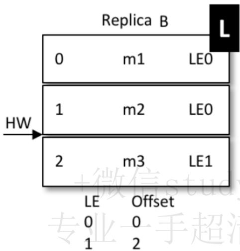


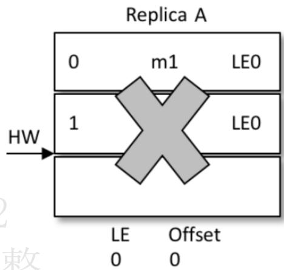


那么A再次启动时后，从B开始同步数据

因为B之前没有回退，1号信息得到了保留

同时，B的LE（epoch号码）开始增加，从0变成1，offset记录为B当leader时的位置，也就是2

A传过来的epoch为0，B是1，不相等。那么取大于0的所有epoch里最小的

（现实中可能发生了多次重新选主，有多条epoch）

其实就是LE=1的那条。现实中可能有多条。并找到它对应的offset（也就是2）给A返回去

最终A得到了B同步过来的数据

再来看一致性问题的解决：

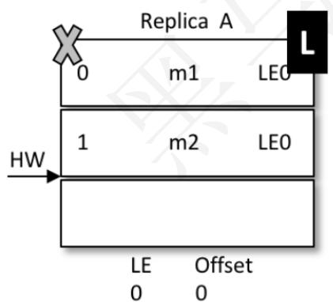


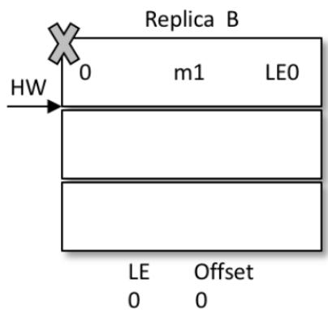


还是上面的场景，AB同时挂掉，但是hw还没同步，那么A.hw=2 , B.hw=1

B先启动被选成了leader，新leader选举后，epoch加了一条记录（参考下图，LE=1，这时候offset=1）

表示B从1开始往后继续写数据，新来了条信息，内容为m3，写到1号位

A启动前，集群只有B自己，消息被确认，hw上涨到2，变成下面的样子

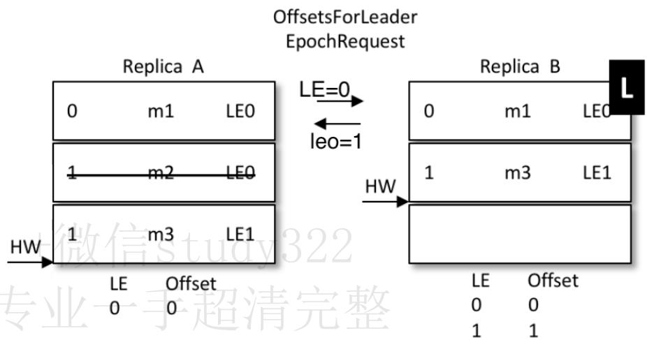


A开始恢复，启动后向B发送epoch请求，将自己的LE=0告诉leader，也就是B全网课程 超低价格

B发现自己的LE不同，同样去大于0的LE里最小的那条，也就是1 , 对应的offset也是1，返回给A

A从1开始同步数据，将自己本地的数据截断、覆盖，hw上升到2

那么最新的写入的m3从B给同步到了A，并覆盖了A上之前的旧数据m2

结果：数据保持了一致


附：epochRequest的详细流程图


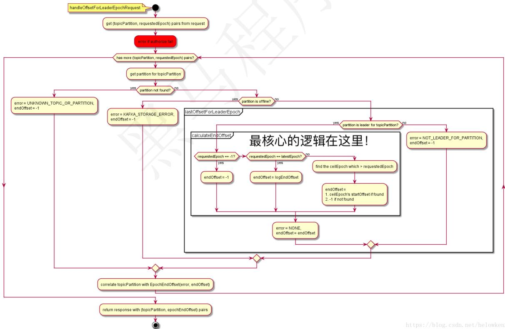


# 7、业务实战

# 7.1 顺序性场景

# 7.1.1 场景概述

假设我们要传输一批订单到另一个系统，那么订单对应状态的演变是有顺序性要求的。

已下单 → 已支付 → 已确认

不允许错乱！

# 7.1.2 顺序级别+

# 1）全局有序：

串行化。每条经过kafka的消息必须严格保障有序性。

这就要求kafka单通道，每个groupid下单消费者

极大的影响性能，现实业务下几乎没必要

# 2）局部有序：

业务局部有序。同一条订单有序即可，不同订单可以并行处理。不同订单的顺序前后无所谓充分利用kafka多分区的并发性，只需要想办法让需要顺序的一批数据进同一分区即可。

# 7.1.3 实现方案

# 1）发送端：

指定key发送，key=order.id即可，案例回顾：4.2.3，PartitionProducer

# 2）发送中：

给队列配置多分区保障并发性。

# 3）读取端：

单消费者：显然不合理

吞吐量显然上不去，kafka开多个分区还有何意义？

所以开多个消费者指定分区消费，理想状况下，每个分区配一个。

但是，这个吞吐量依然有限，那如何处理呢？

# 方案：多线程

在每个消费者上再开多线程，是个解决办法。但是，要警惕顺序性被打破！

参考下图：thread处理后，会将data变成 2-1-3

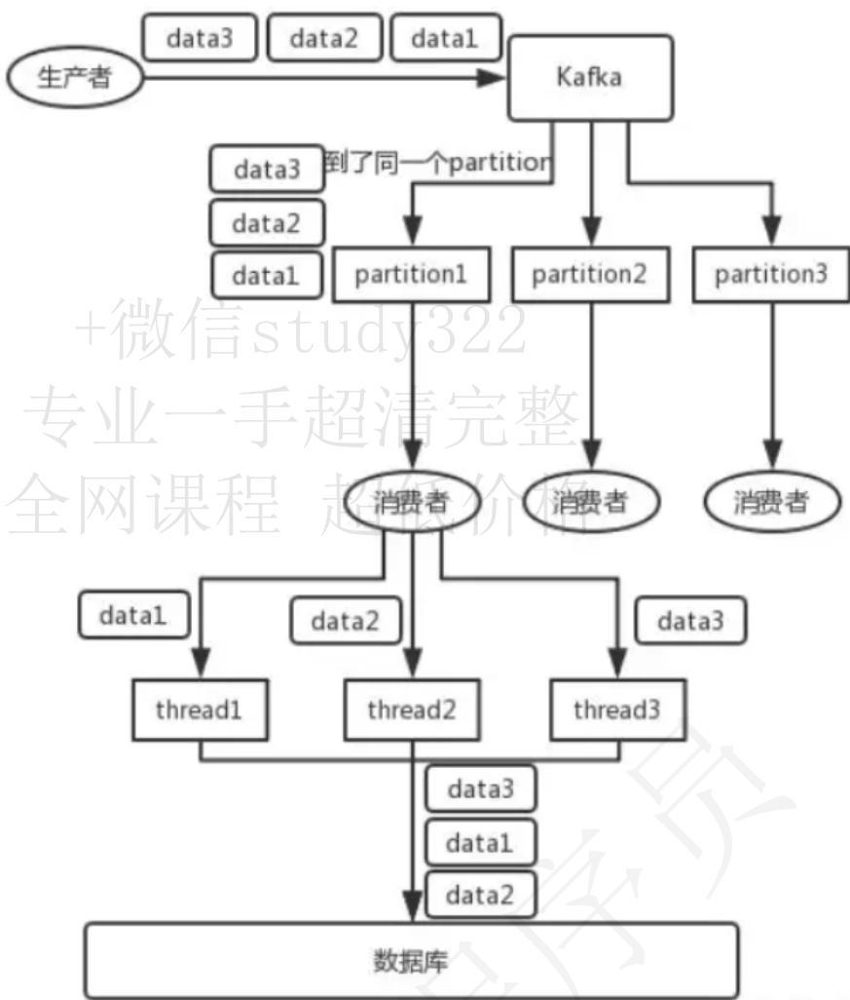


改进：接收后分发二级内存队列


消费者取到消息后不做处理，根据key二次分发到多个阻塞队列。


再开启多个线程，每个队列分配一个线程处理。提升吞吐量


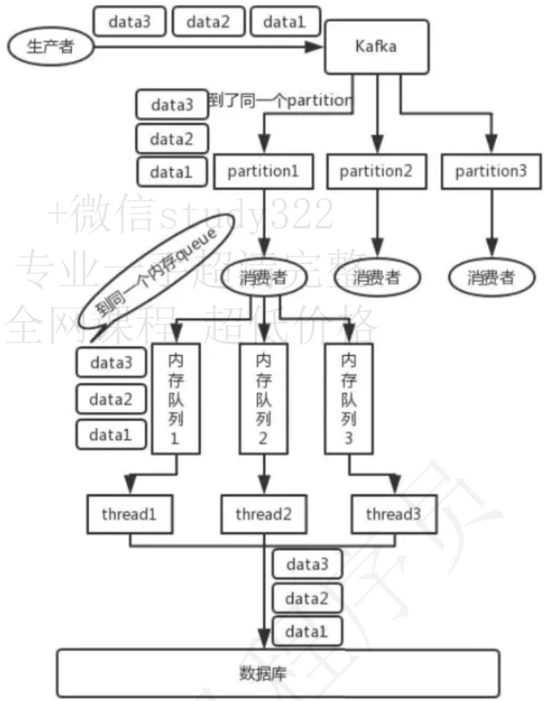


# 7.1.4 代码验证

1）新建一个sort队列，2个分区

2）启动order项目

源码参考：

SortedProducer（顺序性发送端）

SortedConsumer（顺序性消费端 - 阻塞队列实现，方便大家理解设计思路）

SortedConsumer2（顺序性消费端 - 线程池实现，现实中推荐这种方式！）

3）通过swagger请求

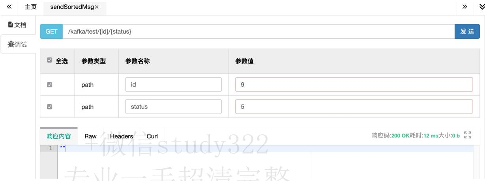


先按不同的id发送，查看控制台日志，id被正确分发到对应的队列全网课程 超低价格

```javascript
com.itheima.demo.controller.SortedConsumer:get from queue, queue:1, order:[id=1, status=0]
com.itheima.demo.controller.SortedConsumer:get from queue, queue:2, order:[id=2, status=0]
com.itheima.demo.controller.SortedConsumer:get from queue, queue:3, order:[id=3, status=0]
com.itheima.demo.controller.SortedConsumer:get from queue, queue:0, order:[id=4, status=0]
com.itheima.demo.controller.SortedConsumer:get from queue, queue:1, order:[id=5, status=0]
com.itheima.demo.controller.SortedConsumer:get from queue, queue:2, order:[id=6, status=0]
com.itheima.demo.controller.SortedConsumer:get from queue, queue:3, order:[id=7, status=0] 
```

同一个key分配到同一个queue，顺序性得到保障

```javascript
com.itheima.demo.controller.SortedConsumer:get from queue, queue:1,order:[id=1 status=0]
com.itheima.demo.controller.SortedConsumer:get from queue, queue:1,order:[id=1 status=1]
com.itheima.demo.controller.SortedConsumer:get from queue, queue:1,order:[id=1 status=2]
com.itheima.demo.controller.SortedConsumer:get from queue, queue:1,order:[id=1 status=3]
com.itheima.demo.controller.SortedConsumer:get from queue, queue:1,order:[id=1 status=4]
com.itheima.demo.controller.SortedConsumer:get from queue, queue:1,order:[id=1 status=5] 
```

# 7.2 海量同步场景

假设大数据部门需要大屏来展示用户的打车订单情况，需要把订单数据送入druid这里不涉及顺序，只要下单就传输，但是对实时性和并发量要求较高

# 7.2.1 常规架构

在下单完成mysql后，通过程序代码打印，直接进入kafka

或者logback和kafka集成，通过log输送

优点：

更符合常规的思维。将数据送给想要的部门

缺点：

耦合度高，将kafka发送消息嵌入了订单下单的主业务，形成代码入侵。

# 7.2.2 解耦合

借助canal，监听订单表的数据变化，不再影响主业务。

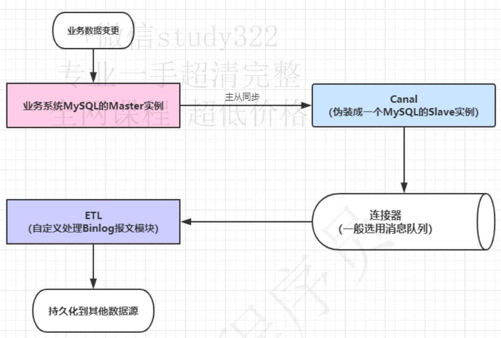


# 7.2.3 部署实现

# 1）mysql部署

注意，需要打开binlog，8.0 默认处于开启状态

#启动mysql8

```batch
docker run --name mysql8 -v /opt/kafka/data/mysql8:/var/lib/mysql -p 3306:3306 -e TZ=Asia/Shanghai -e MYSQL_ROOT_PASSWORD=123456 -d daocloud.io/mysql:8.0 
```

连上mysql，执行以下sql，添加canal用户

```sql
CREATE USER canal IDENTIFIED BY 'canal';
GRANT SELECT, REPLICATION SLAVE, REPLICATION CLIENT ON *.* TO 'canal'@'%;
FLUSH PRIVILEGES;
ALTER USER 'canal'@'%' IDENTIFIED WITH mysql_native_password BY 'canal'; 
```

创建订单表

```sql
CREATE TABLE `orders` (
    `id` int unsigned NOT NULL AUTO_INCREMENT,
    `name` varchar(255) DEFAULT NULL,
    PRIMARY KEY (`id`)
); 
```


2）canal部署


```txt
#canal.properties
#附带资料里有，放到服务器 /opt/kafka/data/canal/ 目录下
#修改servers为你的kafka的机器地址
canal.serverMode = kafka
kafka.bootstrap.servers = 192.168.10.30:10903,192.168.10.30:10904
```

```yaml
#docker-compose.yml
#附带资料里有canal.yml，随便找个目录，重命名为docker-compose.yml
#修改mysql的链接信息的链接信息
#然后在当前目录下执行 docker-compose up -d
version: '2'
services:
    canal:
    image: canal/canal-server
    container_name: canal
    restart: always
    ports:
    - "10908:11111"
    environment:
    #mysql的链接信息
    canal.instance.master.address: 192.168.10.30:3306
    canal.instance.dbUsername: canal
    canal.instance.dbPassword: canal
    #投放到kafka的哪个主题？要提前准备好！
    canal.mq.topic: canal
    volumes:
    - "/opt/kafka/data/canal/canal.properties:/home/admin/canal-server/conf/canal.properties"
```

# 3）数据通道验证

进入kafka容器，用上面3.2.4里的命令行方式监听canal队列

```batch
./kafka-console-consumer.sh --bootstrap-server localhost:9092 --topic canal 
```

在mysql上创建orders表，增删数据试一下

```txt
mysql> insert into orders (name) values ('张三'); Query OK, 1 row affected (0.03 sec)
```

在kafka控制台，可以看到同步的消息

```json
{"data":[{"id":"1","name":"张三"}],"database":"canal","es":1611657853000,"id":5,"isDdl":false,"mysqlType":{"id":"int unsigned","name":"varchar(255)},"old":null,"pkNames":["id"],"sql":"","sqlType":{"id":4,"name":12},"table":"orders","ts":1611657853802,"type":"INSERT"}
```

数据通道已打通，还缺少的是druid作为消费端来接收消息

# 4）druid部署

```txt
#druid.yml
#在附带资料里有
#随便找个目录，执行
docker-compose -f druid.yml up -d
```

# 5）验证

配置druid的数据源，从kafka读取数据，验证数据可以正确进入druid。

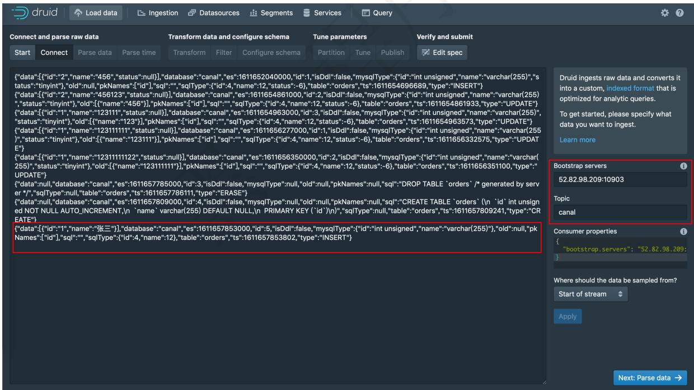


注：

关于druid的详细使用，在大数据篇章里会详细讲解。

# 7.3 kafka监控

# 7.3.1 eagle简介

Kafka Eagle监控系统是一款用来监控Kafka集群的工具，支持管理多个Kafka集群、管理Kafka主题（包含查看、删除、创建等）、消费者组合消费者实例监控、消息阻塞告警、Kafka集群健康状态查看等。

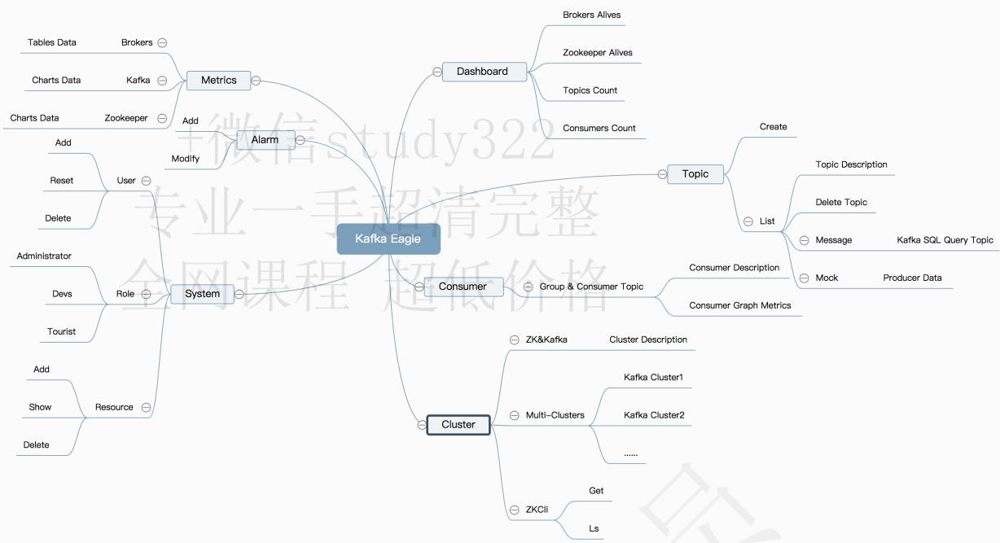


# 7.3.2 部署

推荐docker-compose启动

将配备的资料中 eagle.yml ， 拷贝到服务器任意目录

修改对应的ip地址为你服务器的地址


#注意ip地址：192.168.10.30，全部换成你自己服务器的


```yaml
version: '3'
services:
zookeeper:
image: zookeeper:3.4.13

kafka-1:
container_name: kafka-1
image: wurstmeister/kafka:2.12-2.2.2
ports:
- 10903:9092
- 10913:10913
environment:
KAFKA_BROKER_ID: 1
HOST_IP: 192.168.10.30
KAFKA_ZOOKEEPER_CONNECT: zookeeper:2181
#docker部署必须设置外部可访问ip和端口，否则注册进zk的地址将不可达造成外部无法连接
KAFKA_ADVERTISED_HOST_NAME: 192.168.10.30
KAFKA_ADVERTISED_PORT: 10903
KAFKA_JMX_OPTS: "-Dcom.sun.management.jmxremote=true - Dcom.sun.management.jmxremote.authenticate=false -
Dcom.sun.management.jmxremote.ssl=false -Djava.rmi.server.hostname=192.168.10.30 -Dcom.sun.management.jmxremote.rmi.port=10913"
JMX_PORT: 10913
```

```yaml
volumes:
    - /etc/localtime:/etc/localtime
depends_on:
    - zookeeper
kafka-2:
container_name: kafka-2
image: wurstmeister/kafka:2.12-2.2.2
ports:
    - 10904:9092
    - 10914:10914
environment:
KAFKA_BROKER_ID: 2
HOST_IP: 192.168.10.30
KAFKA_ZOOKEEPER_CONNECT: zookeeper:2181
KAFKA_ADVERTISED_HOST_NAME: 192.168.10.30
KAFKA_ADVERTISED_PORT: 10904
KAFKA_JMX_OPTS: "-Dcom.sun.management.jmxremote=true -
Dcom.sun.management.jmxremote.authenticate=false -
Dcom.sun.management.jmxremote.ssl=false -Djava.rmi.server.hostname=192.168.10.30
-Dcom.sun.management.jmxremote.rmi.port=10914"
JMX_PORT: 10914
volumes:
    - /etc/localtime:/etc/localtime
depends_on:
    - zookeeper
eagle:
image: gui66497/kafka_eagle
container_name: ke
restart: always
depends_on:
    - kafka-1
    - kafka-2
ports:
    - "10907:8048"
environment:
ZKSERVER: "zookeeper:2181" 
```

执行 docker-compose -f eagle.yml up -d

# 7.3.3 使用说明

访问 ： http://192.168.10.30:10907/ke/

默认用户名密码： admin/ 123456

如果要删除topic等操作，需要管理token： keadmin

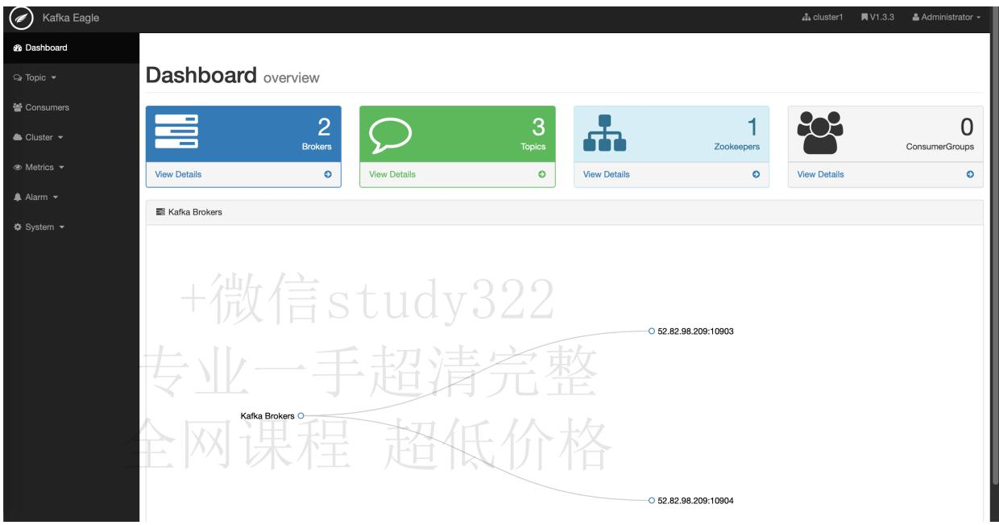


与km到底选哪个呢？根据自己习惯，个人认为：

界面美观程度和监控曲线优于km，有登录权限控制

功能操作上不如km简单直白，但是km需要配置一定的连接信息