# 故障定位课程整理

## 目录

- [01. 整体分析思路](#chapter-01-整体分析思路)
  - [01.01 程序故障分析思路](#chapter-01-slide-01-程序故障分析思路)
  - [01.02 故障排查分析](#chapter-01-slide-02-故障排查分析)
  - [01.03 软件技术栈](#chapter-01-slide-03-软件技术栈)
  - [01.04 二种分析视角](#chapter-01-slide-04-二种分析视角)
  - [01.06 常规排查思路](#chapter-01-slide-06-常规排查思路)
  - [01.07 诊断工具分类 - 按程序态分类](#chapter-01-slide-07-诊断工具分类---按程序态分类)
  - [01.08 诊断工具分类图](#chapter-01-slide-08-诊断工具分类图)
  - [01.09 故障定位系列](#chapter-01-slide-09-故障定位系列)
- [02. 如何正确高效的看日志](#chapter-02-如何正确高效的看日志)
  - [02.01 如何正确高效看日志？](#chapter-02-slide-01-如何正确高效看日志)
  - [02.03 cat/head/tail命令](#chapter-02-slide-03-cat-head-tail命令)
  - [02.04 vim命令](#chapter-02-slide-04-vim命令)
  - [02.05 less/more命令](#chapter-02-slide-05-less-more命令)
  - [02.06 less其它常用选项](#chapter-02-slide-06-less其它常用选项)
  - [02.07 less命令](#chapter-02-slide-07-less命令)
  - [02.08 less命令过滤显示](#chapter-02-slide-08-less命令过滤显示)
  - [02.09 grep命令](#chapter-02-slide-09-grep命令)
  - [02.13 awk命令](#chapter-02-slide-13-awk命令)
  - [02.17 wc命令](#chapter-02-slide-17-wc命令)
  - [02.18 sort命令](#chapter-02-slide-18-sort命令)
  - [02.20 uniq命令](#chapter-02-slide-20-uniq命令)
  - [02.21 zcat/zless/zgrep](#chapter-02-slide-21-zcat-zless-zgrep)
  - [02.22 查看日志一般使用less命令](#chapter-02-slide-22-查看日志一般使用less命令)
- [03. 硬件资源观测](#chapter-03-硬件资源观测)
  - [03.01 硬件资源观测](#chapter-03-slide-01-硬件资源观测)
  - [03.02 何为硬件资源，如何观测？](#chapter-03-slide-02-何为硬件资源-如何观测)
  - [03.03 何为硬件资源？](#chapter-03-slide-03-何为硬件资源)
  - [03.04 CPU/内存资源观测](#chapter-03-slide-04-cpu-内存资源观测)
  - [03.05 top命令](#chapter-03-slide-05-top命令)
  - [03.07 vmstat命令](#chapter-03-slide-07-vmstat命令)
  - [03.08 free命令](#chapter-03-slide-08-free命令)
  - [03.09 slabtop命令](#chapter-03-slide-09-slabtop命令)
  - [03.10 磁盘资源观测](#chapter-03-slide-10-磁盘资源观测)
  - [03.11 df命令](#chapter-03-slide-11-df命令)
  - [03.12 iostat命令](#chapter-03-slide-12-iostat命令)
  - [03.13 iotop命令](#chapter-03-slide-13-iotop命令)
  - [03.14 网络资源观测](#chapter-03-slide-14-网络资源观测)
  - [03.15 nicstat命令](#chapter-03-slide-15-nicstat命令)
  - [03.16 iftop命令](#chapter-03-slide-16-iftop命令)
  - [03.17 全能观测命令](#chapter-03-slide-17-全能观测命令)
  - [03.18 sar命令](#chapter-03-slide-18-sar命令)
  - [03.20 dstat命令](#chapter-03-slide-20-dstat命令)
  - [03.21 这么多命令，看得人眼花缭乱？](#chapter-03-slide-21-这么多命令-看得人眼花缭乱)
  - [03.22 USE观测法](#chapter-03-slide-22-use观测法)
  - [03.24 系统有CPU、内存、磁盘、网络这4种常见](#chapter-03-slide-24-系统有cpu-内存-磁盘-网络这4种常见)
- [04. 进程资源观测-pidstat](#chapter-04-进程资源观测-pidstat)
  - [04.01 pidstat进程资源观测](#chapter-04-slide-01-pidstat进程资源观测)
  - [04.02 pidstat命令](#chapter-04-slide-02-pidstat命令)
  - [04.07 pidstat可观测进程的CPU、内存、](#chapter-04-slide-07-pidstat可观测进程的cpu-内存)
- [05. 软件资源观测](#chapter-05-软件资源观测)
  - [05.01 软件资源观测命令](#chapter-05-slide-01-软件资源观测命令)
  - [05.02 何为软件资源？](#chapter-05-slide-02-何为软件资源)
  - [05.03 软件资源观测命令](#chapter-05-slide-03-软件资源观测命令)
  - [05.04 ps命令](#chapter-05-slide-04-ps命令)
  - [05.06 查看线程情况 - 查询进程的线程数](#chapter-05-slide-06-查看线程情况---查询进程的线程数)
  - [05.07 netstat命令](#chapter-05-slide-07-netstat命令)
  - [05.09 ss查看活跃连接](#chapter-05-slide-09-ss查看活跃连接)
  - [05.11 lsof命令](#chapter-05-slide-11-lsof命令)
  - [05.13 lsof命令 - 查看进程的工作目录](#chapter-05-slide-13-lsof命令---查看进程的工作目录)
  - [05.14 fuser命令](#chapter-05-slide-14-fuser命令)
  - [05.15 案例：查找进程日志](#chapter-05-slide-15-案例-查找进程日志)
  - [05.16 其它命令](#chapter-05-slide-16-其它命令)
  - [05.17 ps命令可用来观测进程与线程的信息。](#chapter-05-slide-17-ps命令可用来观测进程与线程的信息)
- [06. proc与sys目录介绍](#chapter-06-proc与sys目录介绍)
  - [06.01 proc与sys目录介绍](#chapter-06-slide-01-proc与sys目录介绍)
  - [06.02 /proc目录](#chapter-06-slide-02-proc目录)
  - [06.03 /proc目录介绍](#chapter-06-slide-03-proc目录介绍)
  - [06.15 /proc案例：替代lsof](#chapter-06-slide-15-proc案例-替代lsof)
  - [06.16 /sys目录](#chapter-06-slide-16-sys目录)
  - [06.17 /sys目录介绍](#chapter-06-slide-17-sys目录介绍)
  - [06.21 用于提供内核相关信息](#chapter-06-slide-21-用于提供内核相关信息)
- [07. 内核级诊断工具-ftrace、perf](#chapter-07-内核级诊断工具-ftrace-perf)
  - [07.01 内核级诊断工具](#chapter-07-slide-01-内核级诊断工具)
  - [07.02 Linux追踪机制](#chapter-07-slide-02-linux追踪机制)
  - [07.03 观测事件源介绍](#chapter-07-slide-03-观测事件源介绍)
  - [07.04 追踪机制介绍](#chapter-07-slide-04-追踪机制介绍)
  - [07.05 内核级诊断工具](#chapter-07-slide-05-内核级诊断工具)
  - [07.06 ftrace使用](#chapter-07-slide-06-ftrace使用)
  - [07.11 trace-cmd命令](#chapter-07-slide-11-trace-cmd命令)
  - [07.14 perf-tools工具集](#chapter-07-slide-14-perf-tools工具集)
  - [07.15 perf-tools工具](#chapter-07-slide-15-perf-tools工具)
  - [07.17 perf命令](#chapter-07-slide-17-perf命令)
  - [07.20 perf火焰图](#chapter-07-slide-20-perf火焰图)
  - [07.22 perf命令](#chapter-07-slide-22-perf命令)
  - [07.26 用于提供观测数据来源](#chapter-07-slide-26-用于提供观测数据来源)
- [08. 内核级诊断工具-bcc、bpftrace](#chapter-08-内核级诊断工具-bcc-bpftrace)
  - [08.01 内核级诊断工具](#chapter-08-slide-01-内核级诊断工具)
  - [08.02 eBPF介绍](#chapter-08-slide-02-ebpf介绍)
  - [08.05 bcc工具集](#chapter-08-slide-05-bcc工具集)
  - [08.10 oncpu分析 vs offcpu分析](#chapter-08-slide-10-oncpu分析-vs-offcpu分析)
  - [08.11 bcc剖析工具](#chapter-08-slide-11-bcc剖析工具)
  - [08.12 bcc - oncpu火焰图](#chapter-08-slide-12-bcc---oncpu火焰图)
  - [08.13 bcc剖析工具](#chapter-08-slide-13-bcc剖析工具)
  - [08.14 bcc - offcpu火焰图](#chapter-08-slide-14-bcc---offcpu火焰图)
  - [08.15 BPF CO-RE](#chapter-08-slide-15-bpf-co-re)
  - [08.17 bpftrace工具集](#chapter-08-slide-17-bpftrace工具集)
  - [08.19 bpftrace实例1](#chapter-08-slide-19-bpftrace实例1)
  - [08.22 bpftrace实例2](#chapter-08-slide-22-bpftrace实例2)
  - [08.24 bpftrace实例3](#chapter-08-slide-24-bpftrace实例3)
  - [08.27 bpftrace工具集](#chapter-08-slide-27-bpftrace工具集)
  - [08.28 方便诊断各种场景的问题](#chapter-08-slide-28-方便诊断各种场景的问题)
- [09. 原生程序调试工具-strace、gdb等](#chapter-09-原生程序调试工具-strace-gdb等)
  - [09.01 原生程序调试工具](#chapter-09-slide-01-原生程序调试工具)
  - [09.03 strace命令](#chapter-09-slide-03-strace命令)
  - [09.09 strace实例：调用端追踪SQL耗时](#chapter-09-slide-09-strace实例-调用端追踪sql耗时)
  - [09.12 strace命令](#chapter-09-slide-12-strace命令)
  - [09.14 peekfd命令](#chapter-09-slide-14-peekfd命令)
  - [09.17 gdb命令](#chapter-09-slide-17-gdb命令)
  - [09.19 gdb实例：定位大对象分配](#chapter-09-slide-19-gdb实例-定位大对象分配)
  - [09.26 gdb命令](#chapter-09-slide-26-gdb命令)
  - [09.28 strace/gdb开销](#chapter-09-slide-28-strace-gdb开销)
  - [09.29 strace命令可用来追踪系统调用情况](#chapter-09-slide-29-strace命令可用来追踪系统调用情况)
- [10. jdk诊断命令介绍-jstack、jmap等](#chapter-10-jdk诊断命令介绍-jstack-jmap等)
  - [10.01 jdk诊断命令介绍](#chapter-10-slide-01-jdk诊断命令介绍)
  - [10.02 jdk诊断命令](#chapter-10-slide-02-jdk诊断命令)
  - [10.03 jps命令](#chapter-10-slide-03-jps命令)
  - [10.04 jstack命令](#chapter-10-slide-04-jstack命令)
  - [10.06 jstat命令](#chapter-10-slide-06-jstat命令)
  - [10.08 jmap命令](#chapter-10-slide-08-jmap命令)
  - [10.11 MAT内存分析](#chapter-10-slide-11-mat内存分析)
  - [10.14 jinfo命令](#chapter-10-slide-14-jinfo命令)
  - [10.15 jcmd命令](#chapter-10-slide-15-jcmd命令)
- [11. java故障分析工具-arthas](#chapter-11-java故障分析工具-arthas)
  - [11.01 java故障分析工具arthas](#chapter-11-slide-01-java故障分析工具arthas)
  - [11.02 arthas工具](#chapter-11-slide-02-arthas工具)
  - [11.03 help命令](#chapter-11-slide-03-help命令)
  - [11.04 查看线程与内存](#chapter-11-slide-04-查看线程与内存)
  - [11.05 dashboard命令](#chapter-11-slide-05-dashboard命令)
  - [11.06 thread命令](#chapter-11-slide-06-thread命令)
  - [11.07 memory命令](#chapter-11-slide-07-memory命令)
  - [11.08 类操作命令 - sc/sm/jad命令](#chapter-11-slide-08-类操作命令---sc-sm-jad命令)
  - [11.09 sc命令](#chapter-11-slide-09-sc命令)
  - [11.10 sm命令](#chapter-11-slide-10-sm命令)
  - [11.11 jad命令](#chapter-11-slide-11-jad命令)
  - [11.12 方法调用追踪](#chapter-11-slide-12-方法调用追踪)
  - [11.13 monitor命令](#chapter-11-slide-13-monitor命令)
  - [11.14 watch命令](#chapter-11-slide-14-watch命令)
  - [11.16 trace命令](#chapter-11-slide-16-trace命令)
  - [11.17 stack命令](#chapter-11-slide-17-stack命令)
  - [11.18 函数热点剖析 - profiler命令](#chapter-11-slide-18-函数热点剖析---profiler命令)
  - [11.19 profiler命令-oncpu分析](#chapter-11-slide-19-profiler命令-oncpu分析)
  - [11.21 profiler命令-offcpu分析](#chapter-11-slide-21-profiler命令-offcpu分析)
  - [11.23 profiler命令-case by c](#chapter-11-slide-23-profiler命令-case-by-c)
  - [11.26 profiler命令-采集native方](#chapter-11-slide-26-profiler命令-采集native方)
  - [11.27 profiler命令](#chapter-11-slide-27-profiler命令)
  - [11.28 查看或管理java对象](#chapter-11-slide-28-查看或管理java对象)
  - [11.29 vmtool命令](#chapter-11-slide-29-vmtool命令)
  - [11.31 vmtool命令 - Druid连接池使用情况](#chapter-11-slide-31-vmtool命令---druid连接池使用情况)
  - [11.32 vmtool命令](#chapter-11-slide-32-vmtool命令)
  - [11.33 mbean命令](#chapter-11-slide-33-mbean命令)
  - [11.34 logger命令](#chapter-11-slide-34-logger命令)
  - [11.36 getstatic命令](#chapter-11-slide-36-getstatic命令)
  - [11.37 ognl命令](#chapter-11-slide-37-ognl命令)
  - [11.39 ognl语法](#chapter-11-slide-39-ognl语法)
  - [11.41 jvm信息查看](#chapter-11-slide-41-jvm信息查看)
  - [11.42 jvm命令](#chapter-11-slide-42-jvm命令)
  - [11.43 sysenv/vmoption/sysp](#chapter-11-slide-43-sysenv-vmoption-sysp)
  - [11.44 perfcounter命令](#chapter-11-slide-44-perfcounter命令)
  - [11.45 arthas有非常多的子命令](#chapter-11-slide-45-arthas有非常多的子命令)
- [12. CPU占用高分析](#chapter-12-cpu占用高分析)
  - [12.01 高CPU占用分析](#chapter-12-slide-01-高cpu占用分析)
  - [12.02 资源占用高分析思路](#chapter-12-slide-02-资源占用高分析思路)
  - [12.03 分析视角](#chapter-12-slide-03-分析视角)
  - [12.04 资源占用高分析思路](#chapter-12-slide-04-资源占用高分析思路)
  - [12.05 CPU使用率解释](#chapter-12-slide-05-cpu使用率解释)
  - [12.07 CPU使用率解释 - 用户态](#chapter-12-slide-07-cpu使用率解释---用户态)
  - [12.08 CPU使用率解释 - 内核态](#chapter-12-slide-08-cpu使用率解释---内核态)
  - [12.11 CPU使用率解释 - 空闲](#chapter-12-slide-11-cpu使用率解释---空闲)
  - [12.12 CPU使用率解释 - 小结](#chapter-12-slide-12-cpu使用率解释---小结)
  - [12.13 进程CPU高分析](#chapter-12-slide-13-进程cpu高分析)
  - [12.14 进程CPU使用率高](#chapter-12-slide-14-进程cpu使用率高)
  - [12.19 进程CPU使用率高 - java火焰图](#chapter-12-slide-19-进程cpu使用率高---java火焰图)
  - [12.22 进程CPU使用率高 - 非java进程](#chapter-12-slide-22-进程cpu使用率高---非java进程)
  - [12.24 进程CPU使用率高](#chapter-12-slide-24-进程cpu使用率高)
  - [12.25 bpftrace实例](#chapter-12-slide-25-bpftrace实例)
  - [12.27 系统态CPU高分析](#chapter-12-slide-27-系统态cpu高分析)
  - [12.28 系统态CPU使用率高 - 系统调用](#chapter-12-slide-28-系统态cpu使用率高---系统调用)
  - [12.29 系统态CPU使用率高 - 中断](#chapter-12-slide-29-系统态cpu使用率高---中断)
  - [12.31 系统态CPU使用率高 - 内核线程](#chapter-12-slide-31-系统态cpu使用率高---内核线程)
  - [12.32 系统态CPU使用率高](#chapter-12-slide-32-系统态cpu使用率高)
  - [12.33 系统态CPU使用率高 - 火焰图](#chapter-12-slide-33-系统态cpu使用率高---火焰图)
  - [12.34 系统态CPU使用率高 - 火焰图 - 系统调用](#chapter-12-slide-34-系统态cpu使用率高---火焰图---系统调用)
  - [12.35 空闲CPU高分析](#chapter-12-slide-35-空闲cpu高分析)
  - [12.36 空闲CPU使用率高](#chapter-12-slide-36-空闲cpu使用率高)
  - [12.37 CPU调优](#chapter-12-slide-37-cpu调优)
  - [12.38 CPU调优 - 调优工具](#chapter-12-slide-38-cpu调优---调优工具)
  - [12.39 CPU调优 - JVM JIT](#chapter-12-slide-39-cpu调优---jvm-jit)
  - [12.40 CPU调优 - 代码优化](#chapter-12-slide-40-cpu调优---代码优化)
  - [12.42 资源占用高问题](#chapter-12-slide-42-资源占用高问题)
- [13. 内存占用高分析](#chapter-13-内存占用高分析)
  - [13.01 高内存占用分析](#chapter-13-slide-01-高内存占用分析)
  - [13.02 Linux物理内存划分](#chapter-13-slide-02-linux物理内存划分)
  - [13.03 Linux内存划分 - node划分](#chapter-13-slide-03-linux内存划分---node划分)
  - [13.04 Linux内存划分 - zone划分](#chapter-13-slide-04-linux内存划分---zone划分)
  - [13.05 Linux内存划分 - 分页](#chapter-13-slide-05-linux内存划分---分页)
  - [13.06 Linux内存划分 - Buffer与Cache](#chapter-13-slide-06-linux内存划分---buffer与cache)
  - [13.07 Linux内存划分 - slab](#chapter-13-slide-07-linux内存划分---slab)
  - [13.08 free内存指标解释](#chapter-13-slide-08-free内存指标解释)
  - [13.09 Linux虚拟内存划分](#chapter-13-slide-09-linux虚拟内存划分)
  - [13.12 Java内存区域划分](#chapter-13-slide-12-java内存区域划分)
  - [13.14 Linux内存分配原理](#chapter-13-slide-14-linux内存分配原理)
  - [13.15 Linux虚拟内存分配](#chapter-13-slide-15-linux虚拟内存分配)
  - [13.16 Linux物理内存分配 - 缺页中断](#chapter-13-slide-16-linux物理内存分配---缺页中断)
  - [13.17 Linux物理内存分配 - 内存回收](#chapter-13-slide-17-linux物理内存分配---内存回收)
  - [13.21 高内存占用分析](#chapter-13-slide-21-高内存占用分析)
  - [13.24 高内存占用分析 - 找进程 - 哪个进程占用多？](#chapter-13-slide-24-高内存占用分析---找进程---哪个进程占用多)
  - [13.25 高内存占用分析 - 找内存区域](#chapter-13-slide-25-高内存占用分析---找内存区域)
  - [13.27 高内存占用分析-找内存区域](#chapter-13-slide-27-高内存占用分析-找内存区域)
  - [13.28 高内存占用分析-glibc缓存的内存](#chapter-13-slide-28-高内存占用分析-glibc缓存的内存)
  - [13.30 高内存占用分析-native分配的内存](#chapter-13-slide-30-高内存占用分析-native分配的内存)
  - [13.31 高内存占用分析-找内存区域 / 小结](#chapter-13-slide-31-高内存占用分析-找内存区域-小结)
  - [13.33 高内存占用分析 - 文件缓存](#chapter-13-slide-33-高内存占用分析---文件缓存)
  - [13.34 Java堆占用高-找调用栈](#chapter-13-slide-34-java堆占用高-找调用栈)
  - [13.36 Java堆占用高-MAT内存分析](#chapter-13-slide-36-java堆占用高-mat内存分析)
  - [13.39 Java MetaSpace占用高-找调](#chapter-13-slide-39-java-metaspace占用高-找调)
  - [13.44 Java堆外内存占用高-找调用栈](#chapter-13-slide-44-java堆外内存占用高-找调用栈)
  - [13.51 Java堆外内存占用高-找调用栈 - native内存泄露的java调用栈](#chapter-13-slide-51-java堆外内存占用高-找调用栈---native内存泄露的java调用栈)
  - [13.52 Java堆外内存占用高-找调用栈](#chapter-13-slide-52-java堆外内存占用高-找调用栈)
  - [13.53 内存占用高被OOM Kill](#chapter-13-slide-53-内存占用高被oom-kill)
  - [13.54 内存调优](#chapter-13-slide-54-内存调优)
  - [13.55 内存调优 - 内核参数](#chapter-13-slide-55-内存调优---内核参数)
  - [13.57 内存调优 - 原生程序](#chapter-13-slide-57-内存调优---原生程序)
  - [13.58 内存调优 - JVM](#chapter-13-slide-58-内存调优---jvm)
  - [13.60 内存调优 - 编码](#chapter-13-slide-60-内存调优---编码)
  - [13.62 Linux物理内存划分为node](#chapter-13-slide-62-linux物理内存划分为node)
- [14. 磁盘io高分析](#chapter-14-磁盘io高分析)
  - [14.01 磁盘io占用高分析](#chapter-14-slide-01-磁盘io占用高分析)
  - [14.02 磁盘io占用分析](#chapter-14-slide-02-磁盘io占用分析)
  - [14.03 高磁盘io占用 - 整体情况](#chapter-14-slide-03-高磁盘io占用---整体情况)
  - [14.04 高磁盘io占用 - 找进程](#chapter-14-slide-04-高磁盘io占用---找进程)
  - [14.05 高磁盘io占用 - 找文件](#chapter-14-slide-05-高磁盘io占用---找文件)
  - [14.06 高磁盘io占用 - 找调用栈](#chapter-14-slide-06-高磁盘io占用---找调用栈)
  - [14.08 高磁盘io占用 - 性能确认](#chapter-14-slide-08-高磁盘io占用---性能确认)
  - [14.09 调优](#chapter-14-slide-09-调优)
  - [14.10 磁盘io调优](#chapter-14-slide-10-磁盘io调优)
  - [14.11 磁盘io调优 - 编码优化](#chapter-14-slide-11-磁盘io调优---编码优化)
  - [14.13 通过iostat -dxz 1观测磁盘整](#chapter-14-slide-13-通过iostat--dxz-1观测磁盘整)
- [15. 网络io高分析](#chapter-15-网络io高分析)
  - [15.01 网络io高占用分析](#chapter-15-slide-01-网络io高占用分析)
  - [15.03 高网络io占用 - 整体情况](#chapter-15-slide-03-高网络io占用---整体情况)
  - [15.04 高网络io占用 - 找连接](#chapter-15-slide-04-高网络io占用---找连接)
  - [15.05 高网络io占用 - 找进程](#chapter-15-slide-05-高网络io占用---找进程)
  - [15.06 高网络io占用 - 找调用栈](#chapter-15-slide-06-高网络io占用---找调用栈)
  - [15.08 调优](#chapter-15-slide-08-调优)
  - [15.09 网络调优 - 内核参数](#chapter-15-slide-09-网络调优---内核参数)
  - [15.10 网络调优 - 网络编程调优选项](#chapter-15-slide-10-网络调优---网络编程调优选项)
  - [15.11 网络调优 - 编码优化](#chapter-15-slide-11-网络调优---编码优化)
  - [15.13 通过iftop -nN观测网络整体情况](#chapter-15-slide-13-通过iftop--nn观测网络整体情况)
- [16. 整体耗时高分析](#chapter-16-整体耗时高分析)
  - [16.01 整体耗时高分析](#chapter-16-slide-01-整体耗时高分析)
  - [16.02 耗时高分析思路](#chapter-16-slide-02-耗时高分析思路)
  - [16.04 哪个接口耗时高？](#chapter-16-slide-04-哪个接口耗时高)
  - [16.06 哪个子方法耗时高](#chapter-16-slide-06-哪个子方法耗时高)
  - [16.08 oncpu分析 vs offcpu分析](#chapter-16-slide-08-oncpu分析-vs-offcpu分析)
  - [16.09 哪个调用栈耗时高 - bcc/offcpu分析](#chapter-16-slide-09-哪个调用栈耗时高---bcc-offcpu分析)
  - [16.10 哪个调用栈耗时高 - bcc/offcpu火焰图](#chapter-16-slide-10-哪个调用栈耗时高---bcc-offcpu火焰图)
  - [16.11 哪个调用栈耗时高 - profiler/offcpu分析](#chapter-16-slide-11-哪个调用栈耗时高---profiler-offcpu分析)
  - [16.12 哪个调用栈耗时高 - profiler/offcpu火焰图](#chapter-16-slide-12-哪个调用栈耗时高---profiler-offcpu火焰图)
  - [16.13 哪个调用栈耗时高 - jstack/offcpu分析](#chapter-16-slide-13-哪个调用栈耗时高---jstack-offcpu分析)
  - [16.14 哪个调用栈耗时高 - jstack/offcpu火焰图](#chapter-16-slide-14-哪个调用栈耗时高---jstack-offcpu火焰图)
  - [16.15 哪个调用栈耗时高 - stack伪文件/offcpu分析](#chapter-16-slide-15-哪个调用栈耗时高---stack伪文件-offcpu分析)
  - [16.16 哪个调用栈耗时高 - stack伪文件/offcpu火焰图](#chapter-16-slide-16-哪个调用栈耗时高---stack伪文件-offcpu火焰图)
  - [16.18 高耗时的分析思路与资源分析类似](#chapter-16-slide-18-高耗时的分析思路与资源分析类似)
- [17. 偶现问题分析思路](#chapter-17-偶现问题分析思路)
  - [17.01 偶现问题分析思路](#chapter-17-slide-01-偶现问题分析思路)
  - [17.04 事件过滤的诊断工具](#chapter-17-slide-04-事件过滤的诊断工具)
  - [17.07 事件过滤的诊断工具 - 高耗时offcpu火焰图](#chapter-17-slide-07-事件过滤的诊断工具---高耗时offcpu火焰图)
  - [17.08 采集每一个事件 - case by case分析](#chapter-17-slide-08-采集每一个事件---case-by-case分析)
  - [17.12 挂诊断脚本](#chapter-17-slide-12-挂诊断脚本)
  - [17.13 其它方式](#chapter-17-slide-13-其它方式)
  - [17.15 偶现问题一般排查难度都较大](#chapter-17-slide-15-偶现问题一般排查难度都较大)
- [18. 系统负载高分析](#chapter-18-系统负载高分析)
  - [18.01 系统负载高分析](#chapter-18-slide-01-系统负载高分析)
  - [18.02 原理](#chapter-18-slide-02-原理)
  - [18.03 系统负载是什么？](#chapter-18-slide-03-系统负载是什么)
  - [18.05 Linux线程状态](#chapter-18-slide-05-linux线程状态)
  - [18.06 负载实验](#chapter-18-slide-06-负载实验)
  - [18.12 Linux扩充了系统负载定义](#chapter-18-slide-12-linux扩充了系统负载定义)
- [19. 网络命令与排障](#chapter-19-网络命令与排障)
  - [19.01 网络命令与排障](#chapter-19-slide-01-网络命令与排障)
  - [19.03 检测网络连通性](#chapter-19-slide-03-检测网络连通性)
  - [19.04 检测网络连通性 - DNS检测](#chapter-19-slide-04-检测网络连通性---dns检测)
  - [19.05 检测网络连通性 - IP连通性检测](#chapter-19-slide-05-检测网络连通性---ip连通性检测)
  - [19.06 检测网络连通性 - 路由情况检测](#chapter-19-slide-06-检测网络连通性---路由情况检测)
  - [19.07 检测网络连通性 - tcp层端口检测](#chapter-19-slide-07-检测网络连通性---tcp层端口检测)
  - [19.08 检测网络连通性 - http接口检测](#chapter-19-slide-08-检测网络连通性---http接口检测)
  - [19.09 检测网络连通性 - 一键检测](#chapter-19-slide-09-检测网络连通性---一键检测)
  - [19.11 常用网络命令](#chapter-19-slide-11-常用网络命令)
  - [19.12 netstat - 统计tcp连接情况](#chapter-19-slide-12-netstat---统计tcp连接情况)
  - [19.14 查看丢包情况 - 网卡层](#chapter-19-slide-14-查看丢包情况---网卡层)
  - [19.15 查看丢包情况 - ip/tcp层](#chapter-19-slide-15-查看丢包情况---ip-tcp层)
  - [19.16 查看丢包情况 - 内核丢包位置](#chapter-19-slide-16-查看丢包情况---内核丢包位置)
  - [19.17 网络抓包工具](#chapter-19-slide-17-网络抓包工具)
  - [19.18 网络抓包工具 - tcpdump](#chapter-19-slide-18-网络抓包工具---tcpdump)
  - [19.19 网络抓包工具 - wireshark](#chapter-19-slide-19-网络抓包工具---wireshark)
  - [19.21 wireshark - 指定解析协议](#chapter-19-slide-21-wireshark---指定解析协议)
  - [19.23 wireshark - 过滤包](#chapter-19-slide-23-wireshark---过滤包)
  - [19.26 wireshark - 查找包](#chapter-19-slide-26-wireshark---查找包)
  - [19.28 wireshark - 添加列](#chapter-19-slide-28-wireshark---添加列)
  - [19.30 wireshark - 包列表排序](#chapter-19-slide-30-wireshark---包列表排序)
  - [19.31 调用端慢，服务端快？](#chapter-19-slide-31-调用端慢-服务端快)
  - [19.32 案例：调用端慢，服务端快](#chapter-19-slide-32-案例-调用端慢-服务端快)
  - [19.38 流量统计分析](#chapter-19-slide-38-流量统计分析)
  - [19.40 IO图表：统计每秒tcp收发包数量](#chapter-19-slide-40-io图表-统计每秒tcp收发包数量)
  - [19.41 IO图表：统计平均响应时间](#chapter-19-slide-41-io图表-统计平均响应时间)
  - [19.42 其它抓包命令](#chapter-19-slide-42-其它抓包命令)
  - [19.43 文本抓包命令 - ngrep](#chapter-19-slide-43-文本抓包命令---ngrep)
  - [19.44 文本抓包命令 - tshark](#chapter-19-slide-44-文本抓包命令---tshark)
  - [19.46 以及测试网络耗时](#chapter-19-slide-46-以及测试网络耗时)
- [20. Java高效debug排错技巧](#chapter-20-java高效debug排错技巧)
  - [20.01 java高效debug排错技巧](#chapter-20-slide-01-java高效debug排错技巧)
  - [20.02 调试思路](#chapter-20-slide-02-调试思路)
  - [20.03 自上而下调试](#chapter-20-slide-03-自上而下调试)
  - [20.13 自底向上调试](#chapter-20-slide-13-自底向上调试)
  - [20.21 案例：mybatis查不到数据](#chapter-20-slide-21-案例-mybatis查不到数据)
- [21. 故障定位能力提升心得](#chapter-21-故障定位能力提升心得)
  - [21.01 故障定位能力提升心得](#chapter-21-slide-01-故障定位能力提升心得)
  - [21.03 故障定位能力提升 - 学习](#chapter-21-slide-03-故障定位能力提升---学习)
  - [21.04 故障定位能力提升 - 实践](#chapter-21-slide-04-故障定位能力提升---实践)
  - [21.05 故障定位能力提升 - 复盘](#chapter-21-slide-05-故障定位能力提升---复盘)
  - [21.06 故障定位能力提升 - 小结](#chapter-21-slide-06-故障定位能力提升---小结)
- [22. 案例与实验](#chapter-22-案例与实验)
  - [22.01 案例与实验](#chapter-22-slide-01-案例与实验)
  - [22.02 CPU使用率实验](#chapter-22-slide-02-cpu使用率实验)
  - [22.04 CPU使用率实验 - us](#chapter-22-slide-04-cpu使用率实验---us)
  - [22.05 CPU使用率实验 - ni](#chapter-22-slide-05-cpu使用率实验---ni)
  - [22.06 CPU使用率实验 - sy](#chapter-22-slide-06-cpu使用率实验---sy)
  - [22.07 CPU使用率实验 - wa](#chapter-22-slide-07-cpu使用率实验---wa)
  - [22.08 CPU使用率实验 - si](#chapter-22-slide-08-cpu使用率实验---si)
  - [22.09 内存回收实验](#chapter-22-slide-09-内存回收实验)

## 01. 整体分析思路

### 01. 程序故障分析思路

### 02. 故障排查分析

故障排查分析，缺少体系化的认识与经验，导致遇到各种问题时，没有方向！

故障诊断系列
- 你是否遇到过一些程序问题，没有一点分析思路，不知从何下手？
- 有一些怀疑的点，又不知如何确认？
- 想使用诊断工具，但工具繁多，不知道现在该用哪个？

### 03. 软件技术栈

关键词：软件资源、ps、netstat、jstack、jmap、gdb、java、arthas、perf、bcc、bpftrace、jvm、mysql、strace、ngrep、网络、tcpdump、操作系统、CPU、内存、磁盘、top、free、iostat、iftop、硬件资源

### 04. 二种分析视角

资源分析视角
jstack
jmap
自底向上分析，硬件资源使用率如何？如发现CPU资源占用高。
- 什么进程占用CPU多？
- 什么线程占用CPU多？
- 什么代码占用CPU多？
逐步向上细分资源占用，找到问题根因。

关键词：java、arthas、gdb、jvm、strace、perf、bcc、bpftrace、操作系统、CPU、内存、磁盘、网络、top、free、iostat、iftop、硬件

### 05. 二种分析视角（续）

负载分析视角
jstack
jmap
自顶向下分析，接口QPS多少，耗时怎样，有多少报错？如发现接口耗时高。
- controller层耗时高吗？
- mapper层处理耗时高吗？
- SQL执行耗时高吗？
逐步向下细分时间占用，找到问题根因。

关键词：java、arthas、gdb、jvm、strace、perf、bcc、bpftrace、操作系统、CPU、内存、磁盘、网络、top、free、iostat、iftop、硬件

### 06. 常规排查思路

看日志
资源占用
排查工具
有时各种高级命令分析半天，最后发现日志中早以反映出问题原因了，所以第一步一定是看日志。

检查资源占用，如CPU、内存等，在资源不足的情况下，任何问题出现都是自然的。同时，了解资源占用情况，也有助于确定问题排查视角，是基于资源视角自下向上排查，还是负载视角自上而下排查。

根据问题线索，使用合适工具，一步步定位问题原因，如接口响应慢可使用arthas的trace命令逐层检查。

### 07. 诊断工具分类 - 按程序态分类

按程序态分类
按作用分类
指标类
用户态工具
如top、free、iostat等，它们只能反映一些概况指标。

如jstack、arthas、strace等，分析程序在用户态下运行情况。

剖析类
如jstack、jmap等，它们能查看一些程序内部状态数据，如线程情况、对象分布。

内核态工具
追踪类
如perf、bcc、bpftrace等，分析系统内核态下运行情况。

如arthas、bpftrace、tcpdump等，它们能追踪程序每一个事件，如调用参数、数据包内容等。

### 08. 诊断工具分类图

| 诊断工具 | 用户态 | 内核态 |
| --- | --- | --- |
| 指标类 | ps、netstat、arthas | top、free、iostat、iftop、sar |
| 剖析类 | jstack、jmap、arthas、gdb | perf、bcc |
| 追踪类 | arthas、gdb | perf、bcc、bpftrace、tcpdump |

### 09. 故障定位系列

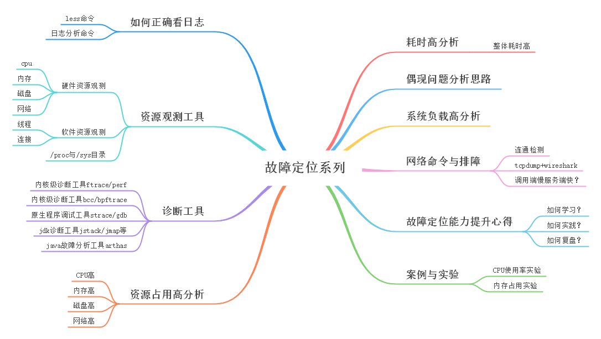

## 02. 如何正确高效的看日志

### 01. 如何正确高效看日志？

### 02. Slide 3

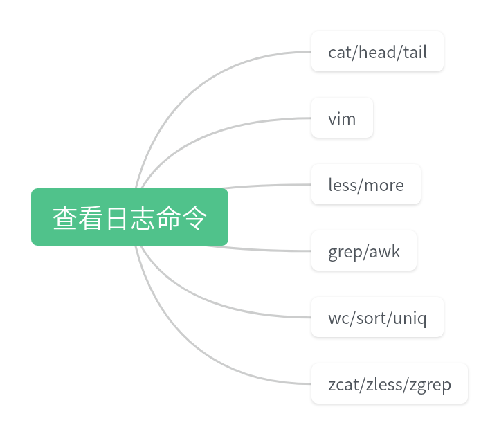

### 03. cat/head/tail命令

cat命令用于将文件内容输出，因此：
- 只适合看小文件，如配置文件。
- 不适合看日志等大文件，容易造成刷屏，也常用于配合其它文本命令在管道中使用。

head命令用于查看文件前几行。
tail命令用于查看文件后几行，-f不断查看新内容。

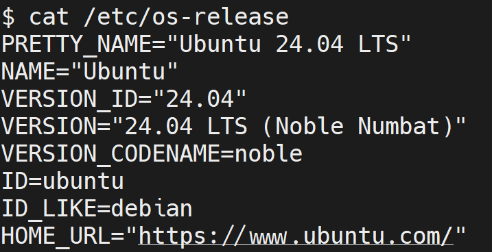

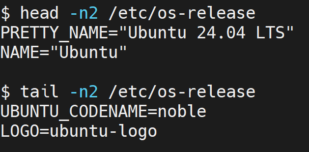

### 04. vim命令

vim是一个文本编辑器，因此：
- 适合编辑小文件，如配置文件。
- 不适合看日志等大文件，因为vim会将文件内容全加载到内存中，容易内存溢出。

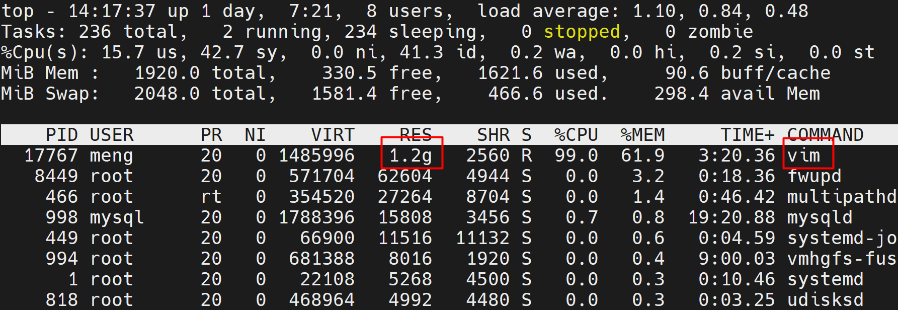

### 05. less/more命令

less或more命令是一个文件分页查看器，因此：
- 由于它可按需加载文件数据到内存，因此它可查看大日志文件，不会内存溢出。
- 一般推荐用less，相比more做了许多功能增强，如可查看压缩包等。

less基本操作与vim类似
| 操作 | 描述 |
| --- | --- |
| f | 向后翻页(forward) |
| b | 向前翻页(backward) |
| g | 跳转到首行 |
| G | 跳转到尾行，同时按Shift+g |
| /abc | 向后搜索abc 再按n继续搜索下一个abc，再按N搜索上一个abc |
| ?abc | 向前搜索abc 再按n继续搜索上一个abc，再按N搜索下一个abc |

### 06. less其它常用选项

| 操作 | 描述 |
| --- | --- |
| F | 不断显示文件新内容，同时按Shift + f |
| -N | 显示行号 (先按-，再按Shift + n，回车) |
| -i | 忽略大小写搜索 (先按-，再按i，回车) |
| -S | 不换行查看 (先按-，再按Shift + s，回车) |
| -R | 保留颜色 (先按-，再按Shift + r，回车) |
| q | 退出less程序 |

### 07. less命令

less可直接查看压缩包，常用于检查jar打包是否正常。
less xxx.jar

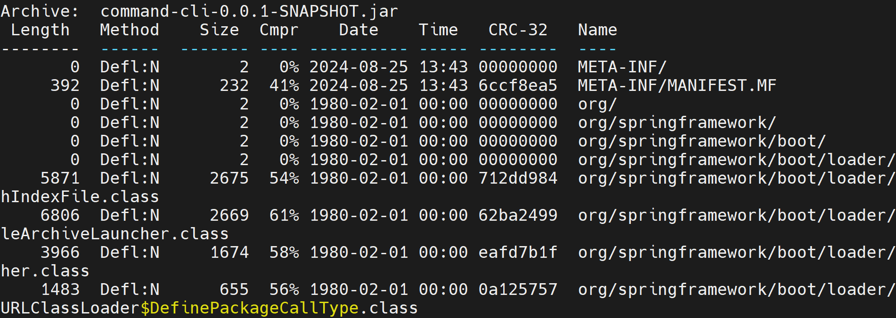

### 08. less命令过滤显示

less过滤显示内容，如内核日志中经常有一些可忽略的错误，less查看时可过滤掉。

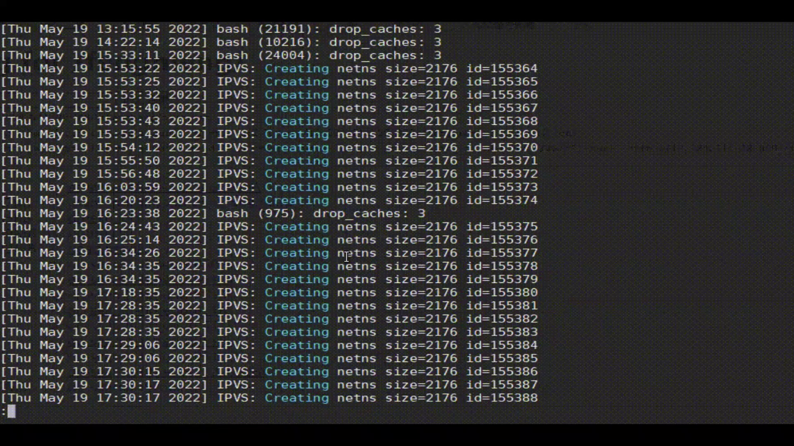

### 09. grep命令

简单的，通过指定搜索关键字，即可从日志中搜索出包含关键字的日志。其中-i表示忽略大小写。

grep -i error app.log

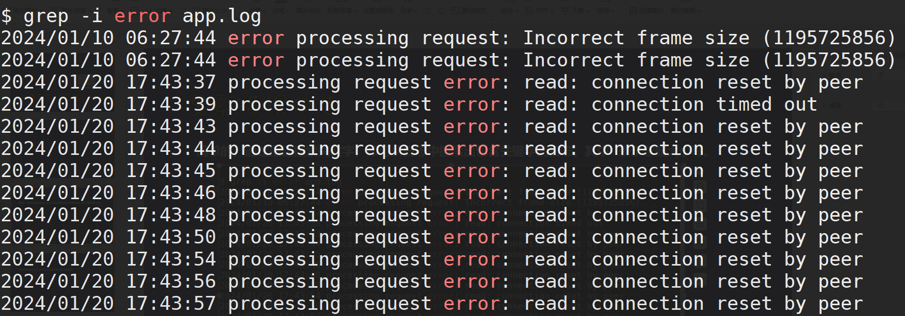

### 10. grep命令（续）

如果我们配合tail命令，还可以实时查看日志中正在产生的错误。

tail -f app.log | grep -i error

如果想忽略掉某个错误，则可以使用-v来忽略，忽略多个使用多个-e即可。

tail -f app.log | grep --line-buffered -i error | grep -v -e reset

### 11. grep命令（续）

对于Java来说，一般异常日志的下面还有异常栈，这可以通过-A 9来指定输出匹配行后的9行。

tail -f app.log | grep -A 9 -i error

-A 9：匹配行后的9行也输出。
-B 9：匹配行前的9行也输出。
-C 9：匹配行前后的9行都输出。

### 12. grep命令（续）

tac命令可实现文件倒序输出，结合grep可实现倒序搜索最近的日志。

tac app.log | grep -m 10 -i error

tac：文件倒序读取输出。
-m 10：查询到10条匹配结果就结束。

### 13. awk命令

awk是为文本处理而生的脚本语言，与grep/sed的区别是，awk会将行拆分为列，语法如下：

awk 'BEGIN{action} pattern1{action} pattern2{action} END{action}' app.log

awk先执行BEGIN中的代码，然后每一行都会检查是否匹配pattern，若匹配则执行相应action，待所有行处理完后，再执行END中的代码，如下：

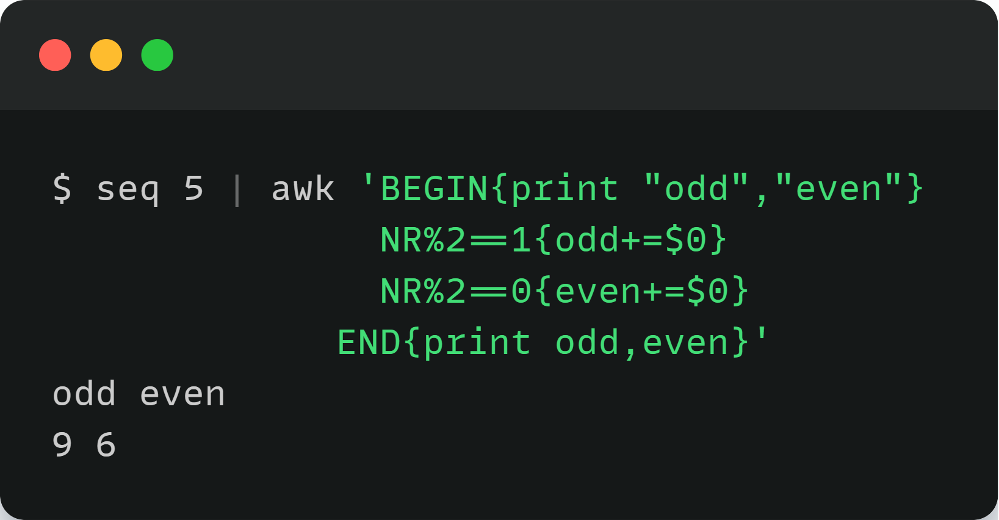

### 14. awk命令（续）

awk语法其实与c、java等类似，也支持if、while、for等。

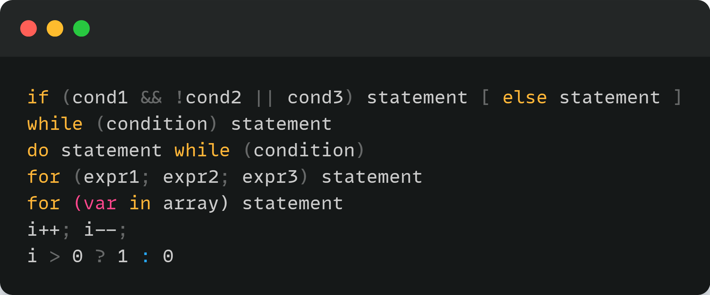

### 15. awk命令（续）

特殊case，当RS等于空时，表示按段分隔记录，常用于搜索异常栈，如下：

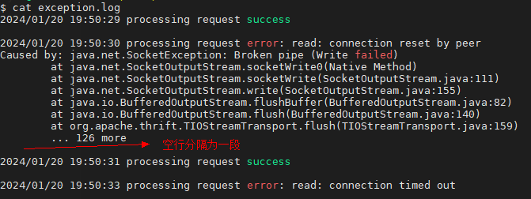

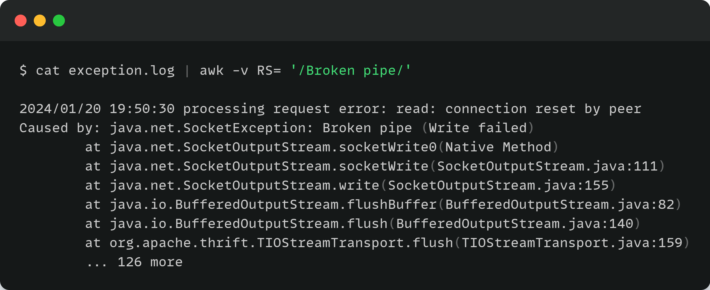

cat app.log | awk -v RS= '/Broken pipe/'

- -v RS=：指定RS变量值，空表示按段分隔。
- /Broken pipe/:简写形式，等价于$0~/Broken pipe/，判断当前记录是否正则匹配Broken pipe

### 16. awk命令（续）

awk支持与sed类似的范围匹配，过滤某时间段的日志数据，如下：

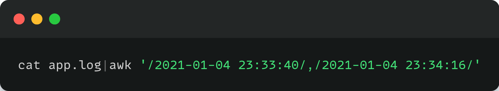

### 17. wc命令

wc命令用于对文本文件进行统计，如下：

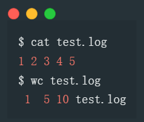

- 默认情况下，wc命令显示行数、词数与字节数。

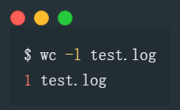

- 最常用的是-l选项，只显示行数，一般用于统计数量。

### 18. sort命令

-k2指定以空白为分隔符的第2个字段排序

sort默认以整行按字母序排序
sort命令用于对文本行进行排序，如下：

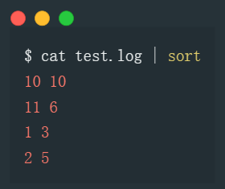

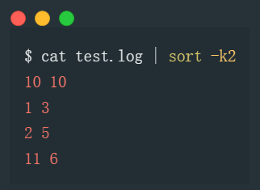

### 19. sort命令（续）

-r选项用于倒序
-n选项指定按数值大小排查
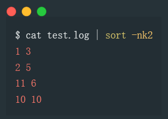

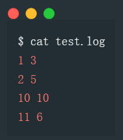

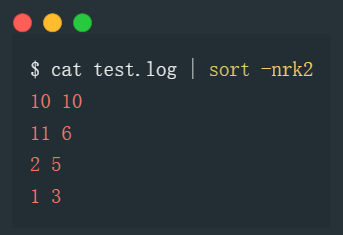

sort还有一些其它选项，但一般来说，最常用的选项就是-nrk

### 20. uniq命令

-c选项用于统计各项数量，常用

默认用于去重，不常用

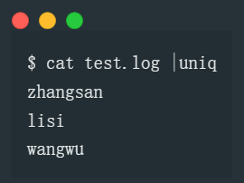

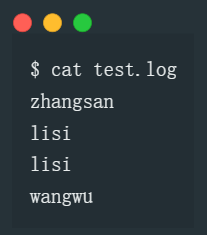

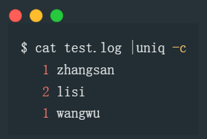

uniq命令需要文件事先排好序，不然无法去重统计，因此一般跟在sort后面
如 sort -nrk2 | uniq -c

### 21. zcat/zless/zgrep

有时，为节省空间，会将日志进行gzip压缩，这时可使用zcat/zless/zgrep查看日志。

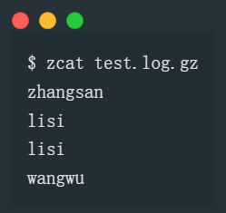

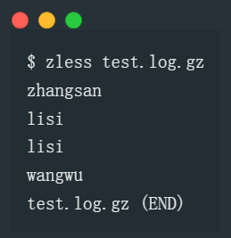

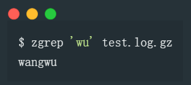

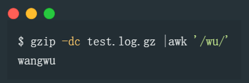

没有zawk命令？也可使用gzip解压后再分析。

### 22. 查看日志一般使用less命令

- 查看日志一般使用less命令，大文件不会内存溢出，还可直接查看jar包。
- grep/awk命令可实现一些常见的搜索场景，如grep -A、时间范围搜索、异常栈搜索。
- wc/sort/uniq可实现一些简单的统计需求。
- zcat/zless/zgrep可直接查看搜索*.gz压缩文件。

Linux的文本命令，实际有非常多的技巧与组合用法，这里只是给大家介绍了最常见的用法，实际应用中肯定会有更多的细节需求，可以通过man xxx学习，如果要成为Linux高手，一定要多练多实践。

## 03. 硬件资源观测

### 01. 硬件资源观测

### 02. 何为硬件资源，如何观测？

### 03. 何为硬件资源？

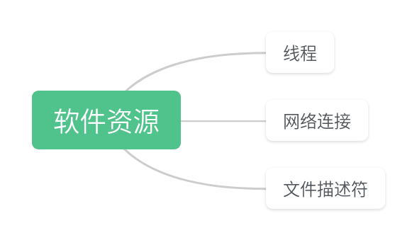

### 04. CPU/内存资源观测

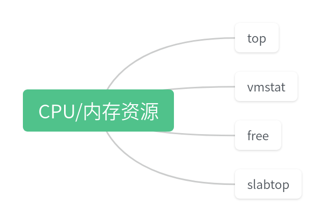

### 05. top命令

总任务数，正在运行/睡眠/暂停/僵尸任务数

系统负载1min/5min/15min

各种CPU使用率
内存使用情况
us：非niced进程花费的cpu时间占比
sy：内核进程花费的cpu时间占比
ni：niced进程花费的cpu时间占比
id：内核空闲进程花费的cpu时间占比
wa：等待磁盘io完成花费的cpu时间占比
hi：处理硬件中断花费的cpu时间占比
si：处理软件中断花费的cpu时间占比
st：被其它虚拟机偷取的cpu时间占比

total：总swap文件大小
free：swap空闲大小
used：swap使用大小
avail Mem：可用内存大小，和swap无关，约等于上一行中free+buff/cache

total：总内存大小(MB)
free：空闲内存大小(MB)
used：使用中的内存大小(MB)
buff/cache：用于文件缓存与系统缓存的内存大小(MB)

进程情况

### 06. top命令（续）

top是一个交互式命令，常用交互指令如下：

| 交互命令 | 描述 |
| --- | --- |
| 1 | 查看1号cpu各核的cpu使用情况 |
| M | 进程按内存使用率倒序，同时按shift + m |
| P | 进程按cpu使用率倒序，同时按shift + p |
| H | 查看线程情况，同时按shift + h |
| c | 查看进程的完整命令行 |
| <，>,R | 调整排序列，默认%CPU倒序，<使用前一列排序，>使用后一列排序，R改为升序 |
| o，= | o添加过滤条件，如COMMAND=java，=清除过滤条件 |
| q | 退出top |

### 07. vmstat命令

si：磁盘换入到内存的当前速度，单位kB/s
so：内存换出到磁盘的当前速度，单位kB/s
bi：每秒读取的磁盘块数量，单位blocks/s
bo：每秒写入的磁盘块数量，单位blocks/s
in：每秒中断数量
cs：每秒线程上下文切换次数
us：cpu用户态使用率
sy：cpu内核态使用率
id：cpu空闲率
wa：等待I/O，线程被阻塞等待磁盘I/O时的CPU空闲时间占总时间的比例
st：steal偷取，CPU在虚拟化环境下在其他租户上的开销

r：cpu运行队列长度，即有多少线程等待操作系统调度运行，这可看做是cpu的饱和度指标，长时间处于高值一般都有问题。
b: 不可中断阻塞的线程数量，一般就是阻塞于io访问的线程数量。
swpd: 内存交换到磁盘的内存大小，单位kB
free：剩余内存大小，单位kB
buff: 用于buff的内存大小，单位kB
cache：用于文件页面缓存的内存大小，单位kB

1s显示一次，第一行是系统启动以来的统计信息，一般可忽略不看，从第二行开始看即可。

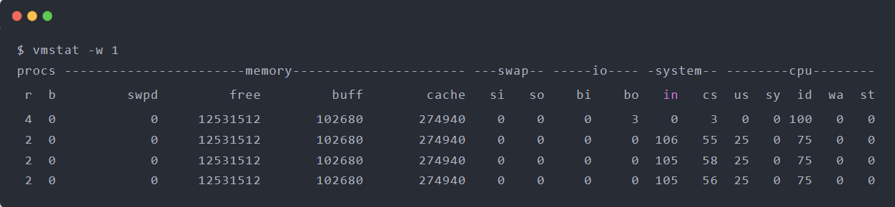

### 08. free命令

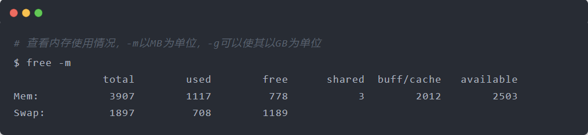

和top中内存部分类似，有一个经验知识：
- free：Linux中，随着使用时间越来越长，free会越来越小，原因是Linux会把访问的文件数据尽可能地缓存在内存中，以便下次读取时能快速返回
- available：系统真正的可用内存，约等于free+buff/cache，因为buff/cache是可以回收后重复利用的。

### 09. slabtop命令

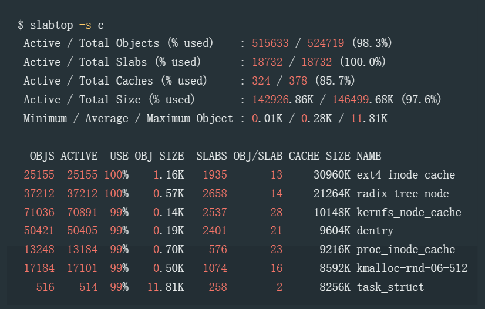

slab是Linux基于对象的一种内存分配机制，类似于对象池的概念，当Linux需要一个内核对象时，如果slab(对象池)中有，就可以直接获取对象，而不用申请内存块。

slab包含在buff/cache中，所以buff/cache大时，除检查文件缓存外，还可以看看slab占用情况。

### 10. 磁盘资源观测

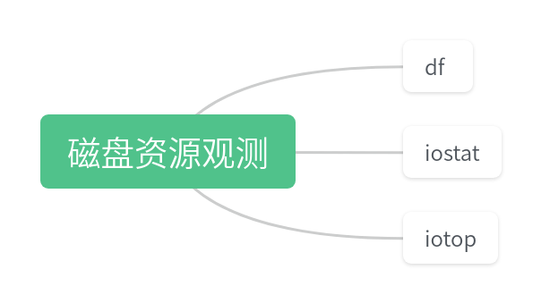

### 11. df命令

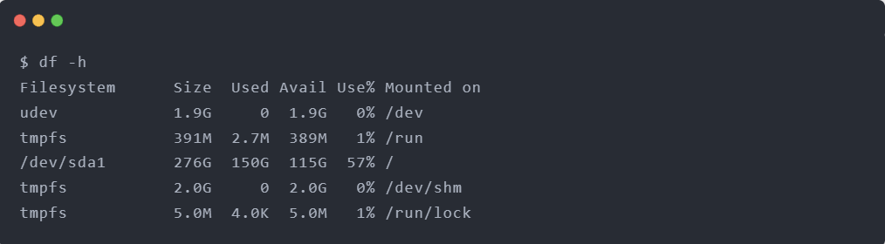

/dev/sda1的Use%这一列可以看到磁盘使用了57%了。

注：df后面也可以跟文件或目录，表示查看当前文件或目录对应文件系统的占用情况。

### 12. iostat命令

%util ：磁盘使用率，Linux认为磁盘只能处理一个并发，但SSD或raid实际可以超过一个，所以100%也不一定代表满载。
avgqu-sz：磁盘任务队列长度，大于磁盘的并发任务数则磁盘处于饱和状态。
svctm：平均服务时间，不包括在磁盘队列中的等待时间。
r_await,w_await：读写延迟时间(ms)，磁盘队列等待时间+svctm，太大则磁盘饱和。
r/s + w/s： 就是当前的IOPS。
avgrq-sz：就是当前每秒平均吞吐量 单位是扇区（512b)。

和vmstat一样，第一次的输出结果是历史以来的统计值，一般可以忽略不计

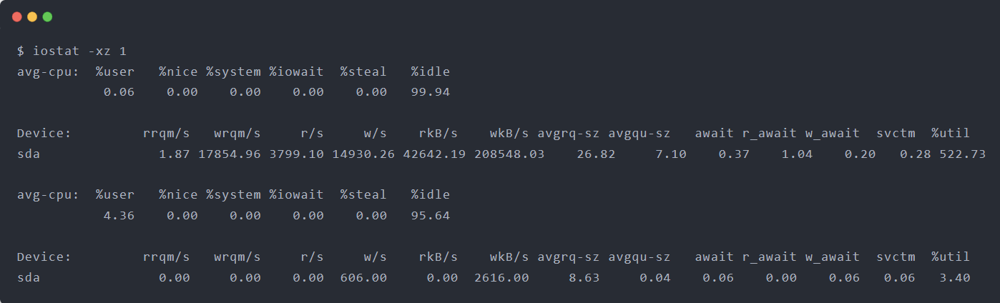

### 13. iotop命令

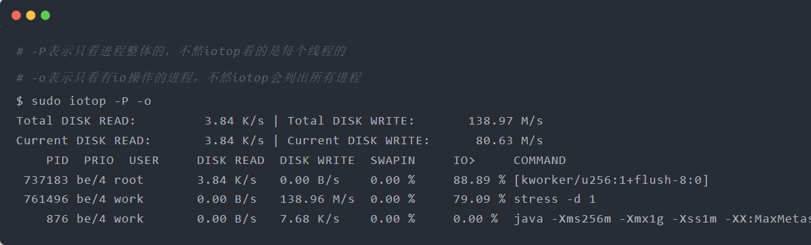

和iostat的区别是，iotop能看到进程/线程维度的io情况。

### 14. 网络资源观测

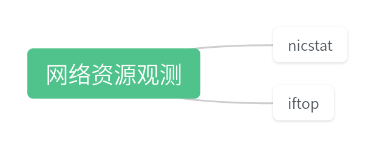

### 15. nicstat命令

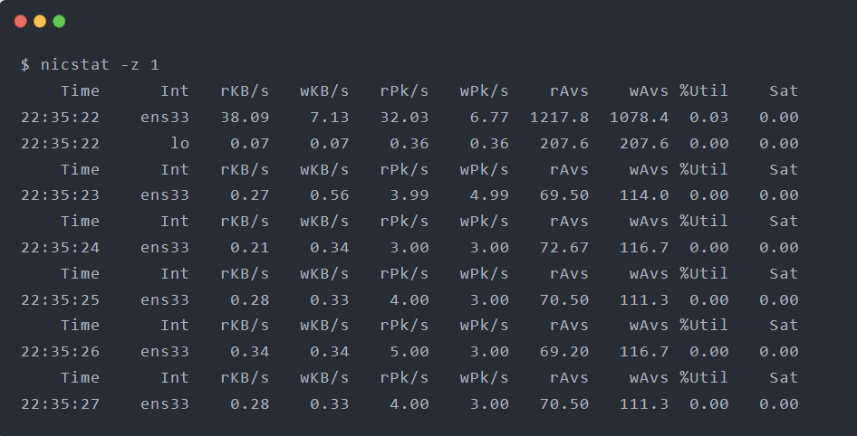

nicstat可以查看各个网卡的使用情况，其中%Util就是网卡带宽的使用率

### 16. iftop命令

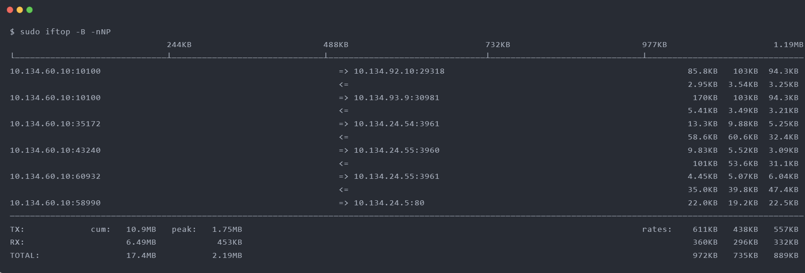

iftop可以查看各个网络连接的当前网速。

### 17. 全能观测命令

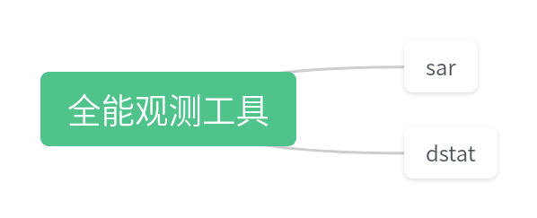

### 18. sar命令

sar是一个全方位的观测命令，如果这个命令背熟了，可以代替前面的命令。

| 分类 | 用法 | 描述 |
| --- | --- | --- |
| CPU | sar -u ALL 1 | cpu使用率 |
|  | sar -q 1 | 运行队列与负载 |
|  | sar -I SUM 1 | 中断次数 |
|  | sar -w 1 | 进程创建次数与线程上下文切换次数 |
| 内存 | sar -r ALL 1 | 内存使用、脏页与slab |
|  | sar -B 1 | 缺页与内存页扫描 |
|  | sar -S 1 1 sar -W 1 | 内存swap使用 |

### 19. sar命令（续）

| 分类 | 用法 | 描述 |
| --- | --- | --- |
| 磁盘 | sar -dp 1 | 磁盘IOPS |
|  | sar -v 1 1 | 文件描述符与打开终端数 |
| 网络 | sar -n DEV 1 | 网卡层使用率 |
|  | sar -n TCP,ETCP 1 | tcp层收包发包情况 |
|  | sar -n SOCK 1 | socket使用情况 |

### 20. dstat命令

dstat也是一个全方位观测命令，使用上比sar简单一些。

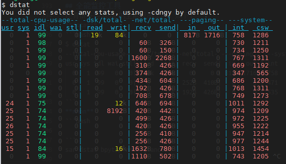

### 21. 这么多命令，看得人眼花缭乱？

### 22. USE观测法

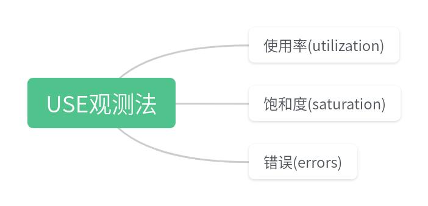

比如Java线程池资源，可以这样理解这3种指标。
- 线程池是一个软件资源。
- 线程池的使用率：目前正在运行任务线程数占线程池总线程数的百分比。
- 线程池的饱和度：目前正在线程池任务队列中排队的任务数量。
- 线程池的错误：触发线程池拒绝策略的次数。

### 23. USE观测法（续）

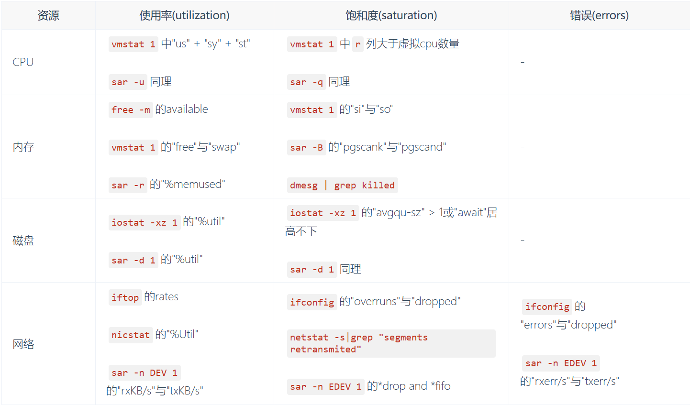

### 24. 系统有CPU、内存、磁盘、网络这4种常见

- 系统有CPU、内存、磁盘、网络这4种常见硬件资源。
- 可通过USE法观测各个资源的 使用率/饱和度/错误 指标。
- 可使用top、free、iostat等各种维度的命令，也可使用sar等全方位观测命令，使用哪些视个人使用习惯与系统预装命令情况而定。
- 资源观测命令很少能直接排查到根因，但能为问题排查提供方向。

## 04. 进程资源观测-pidstat

### 01. pidstat进程资源观测

### 02. pidstat命令

pidstat命令用于查看进程/线程级别的资源使用情况。
使用-u选项(默认)可查看进程的cpu使用率，1秒输出一次，如下：

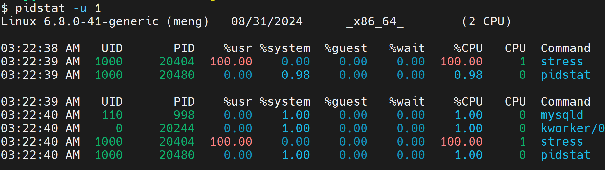

%usr：用户态cpu使用率
%system：内核态cpu使用率
%guest：虚拟机占用的cpu使用率
%wait：空闲cpu使用率
%CPU：总cpu使用率
CPU：进程运行在哪个CPU上。

### 03. pidstat命令（续）

使用-t选项查看线程层面的情况，-G指定进程名称。

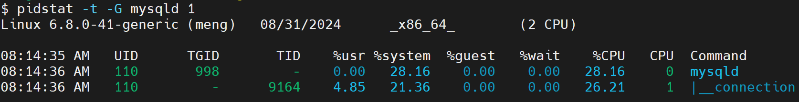

TGID：进程ID，也叫线程组ID。
TID：线程ID，主线程ID等于进程ID。

### 04. pidstat命令（续）

使用-r选项可查看进程的内存使用情况，-p <pid>指定查看的进程id。

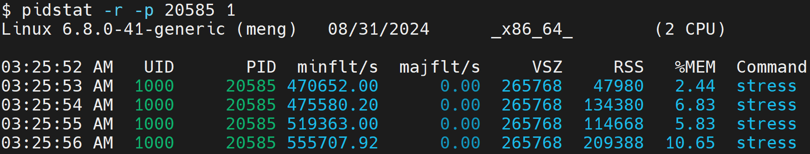

minflt/s：每秒轻微缺页次数，分配物理内存
majflt/s：每秒严重缺页次数，分配内存后需从磁盘加载数据。
VSZ：进程虚拟内存大小(KB)
RSS：进程物理内存大小(KB)
%MEM：进程物理内存使用率

### 05. pidstat命令（续）

使用-d选项查看进程的磁盘io情况。

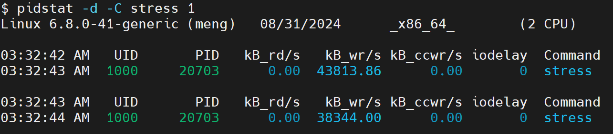

kB_rd/s：每秒从磁盘读取数据量(KB)
kB_wr/s：每秒从磁盘写入数据量(KB)
kB_ccwr/s：每秒被取消写入的数据量，如写入数据页未刷盘时，又被写入新数据，之前的写入请示被取消(KB)
iodelay：进程io操作的延迟时间(单位ticks)

### 06. pidstat命令（续）

使用-w选项查看线程上下文切换情况，-v查看线程数与文件描述符数量，-h选项所有指标一行显示。

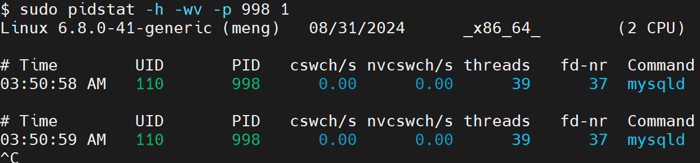

cswch/s：每秒自愿上下文切换次数，如sleep、锁、io等操作都会导致上下文切换。
nvcswch/s：每秒非自愿上下文切换次数。
threads：线程数。
fd-nr：文件描述符数量，包括打开文件与网络连接。

### 07. pidstat可观测进程的CPU、内存、

- pidstat可观测进程的CPU、内存、磁盘使用情况。
- 在云计算的背景下，大量进程被部署在Docker等容器中，这导致top等观测到的指标，一般是宿主机的指标，而非容器，导致这些指标参考意义变小。
- 但pidstat提供的是进程级别的指标，这仍然是准确可用的，所以在容器中，pidstat可能比vmstat等更有用。

## 05. 软件资源观测

### 01. 软件资源观测命令

### 02. 何为软件资源？

### 03. 软件资源观测命令

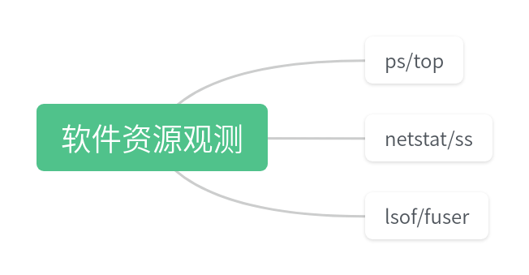

### 04. ps命令

ps可用于查看进程/线程相关信息，如下：

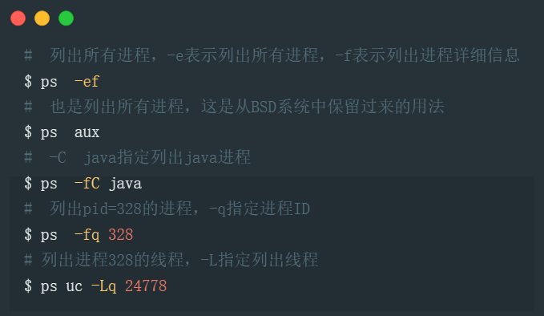

### 05. ps命令（续）

指定查询进程字段、排序字段等。

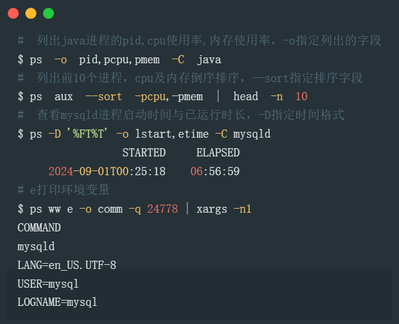

### 06. 查看线程情况 - 查询进程的线程数

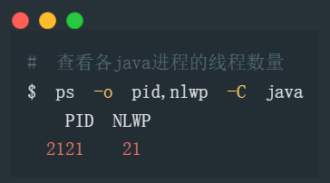

查询进程的线程数
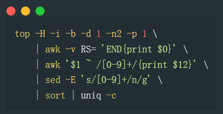

由于后端程序经常使用线程池，流量不大时，池中线程是空闲状态，故活跃线程数量更能准确说明问题。

top添加-H显示线程，-i只显示活跃的

### 07. netstat命令

netstat用于查看网络连接，常见用法如下：

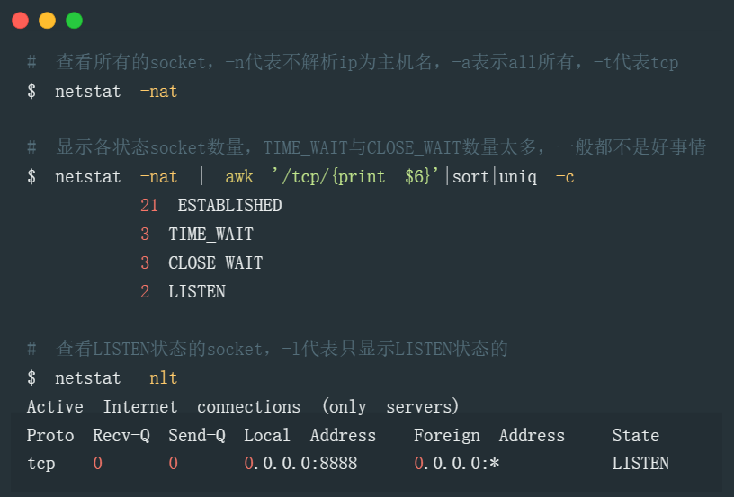

### 08. netstat命令（续）

根据进程ID找网络连接，或根据连接找进程ID。

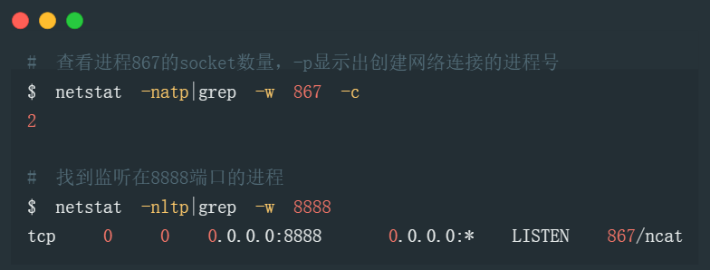

### 09. ss查看活跃连接

ss命令与netstat用法类似，不过它性能更高(基于netlink)，除此之外，-i还提供了一些额外连接信息。

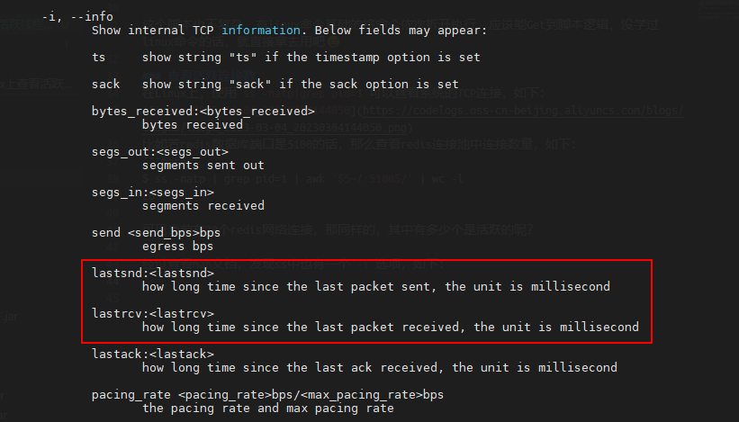

其中lastsnd与lastrcv表示最后一次发收包时间，可用于计算活跃连接。

### 10. ss查看活跃连接（续）

通过与awk结合，计算出lastsnd或lastrcv小于1000毫秒的活跃连接，并按端口号分组计数。

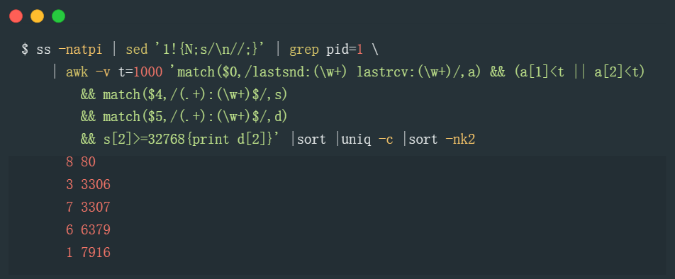

可以看到：
3306端口(mysql)有3个活跃连接。
6379端口(redis)有6个活跃连接。

### 11. lsof命令

Linux中一些皆文件，比如网络连接也抽象成文件读写，而lsof命令则可以用来查询进程打开的文件。

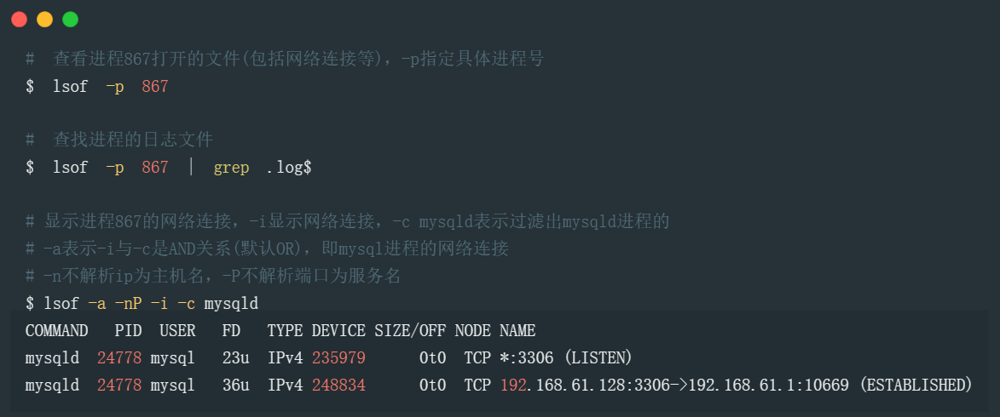

### 12. lsof命令（续）

也可以反过来，根据文件或网络端口查找相应的进程

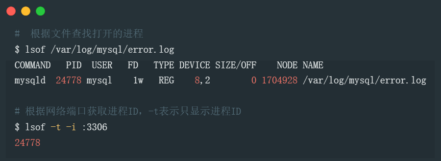

### 13. lsof命令 - 查看进程的工作目录

查看进程的工作目录
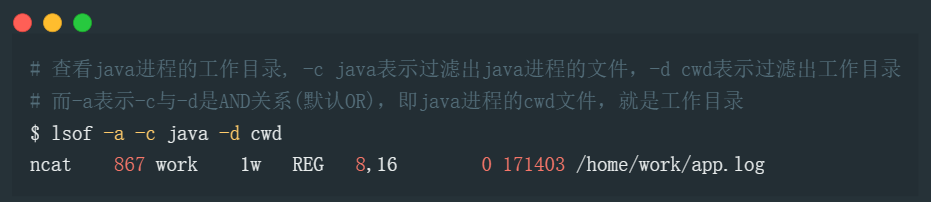

有时候，系统磁盘空间不足了，我们想删掉一些大的日志文件来释放磁盘空间，却发现删除后，磁盘剩余空间没有变多，这是因为有进程引用了这个文件，可以如下确认：

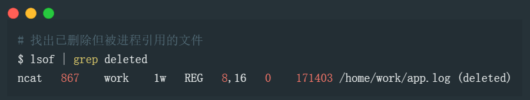

这时我们只需要重启867这个进程，即可真正释放空间。

### 14. fuser命令

fuser可以看做lsof的简版，它也可以根据文件或端口找进程，如下：

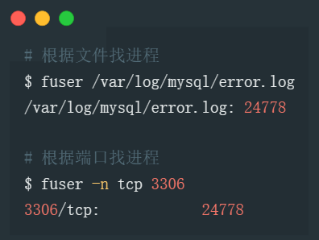

### 15. 案例：查找进程日志

排查问题时，有些机器的部署情况可能不太熟悉，比如知道3306端口有一个服务，但想看其日志文件，可以这样查找。

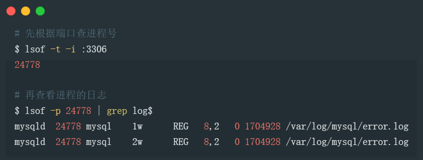

### 16. 其它命令

还有一些其它命令，如pwdx查看进程工作目录，pslog找进程日志，prtstat可查看进程基本信息。

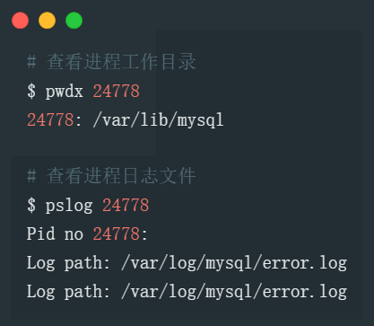

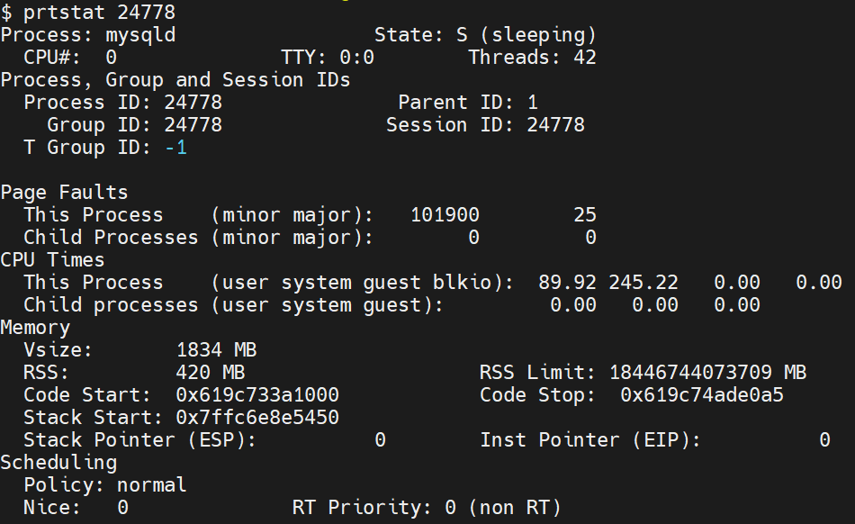

### 17. ps命令可用来观测进程与线程的信息。

- ps命令可用来观测进程与线程的信息。
- netstat命令可用来观测网络连接的信息。
- lsof/fuser命令可用来观测文件描述符(如文件、网络连接)的信息。

## 06. proc与sys目录介绍

### 01. proc与sys目录介绍

### 02. /proc目录

### 03. /proc目录介绍

/proc目录是由Linux虚拟出来的一个目录，Linux通过此目录向外输出内核统计信息，比如通过/proc/meminfo伪文件，可以查看内存情况：

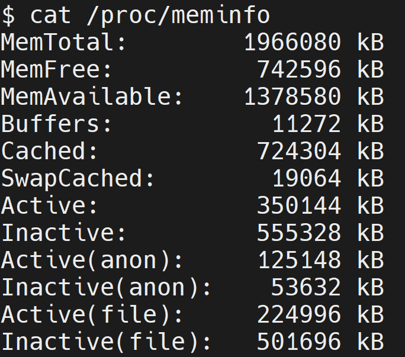

### 04. /proc目录介绍（续）

而且，Linux中很多观测命令，也是从这些文件中获取数据的，如free命令就读取了/proc/meminfo，可通过strace确认。

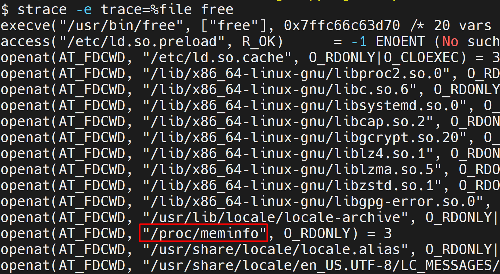

### 05. /proc目录介绍（续）

/proc中常用CPU伪文件，如下：

| 文件名 | 作用 | 相应命令 |
| --- | --- | --- |
| /proc/stat | cpu使用率相关 | vmstat |
| /proc/cpuinfo | cpu信息 | lscpu |
| /proc/loadavg | 系统负载 | uptime |
| /proc/schedstat | 线程调度器运行数据 |  |
| /proc/interrupts | 硬中断信息 | irqtop |
| /proc/softirqs | 软中断信息 | irqtop |

### 06. /proc目录介绍（续）

/proc中常用内存伪文件，如下：

| 文件名 | 作用 | 相应命令 |
| --- | --- | --- |
| /proc/meminfo | 物理内存信息 | free |
| /proc/vmstat | 内存相关统计信息 | vmstat |
| /proc/slabinfo | slab内存使用信息 | slabtop |
| /proc/swaps | swap使用情况 |  |
| /proc/zoneinfo | 内存zone信息 |  |
| /proc/pagetypeinfo | 内存页面类型统计信息 |  |
| /proc/buddyinfo | 内存伙伴分配器统计信息 |  |

### 07. /proc目录介绍（续）

/proc中常用磁盘/网络伪文件，如下：

| 文件名 | 作用 | 相应命令 |
| --- | --- | --- |
| /proc/diskstats | 磁盘使用统计信息 | vmstat |
| /proc/mounts | 文件系统挂载信息 | mount |
| /proc/net/* | 网络相关信息 | netstat |

### 08. /proc目录介绍（续）

/proc中常用其它伪文件，如下：

| 文件名 | 作用 | 相应命令 |
| --- | --- | --- |
| /proc/sys/* | 内核参数，可通过这些文件读写内核参数，如/proc/sys/vm/swappiness对应vm.swappiness内核参数，对应sysctl vm.swappiness命令 | sysctl |
| /proc/uptime | 系统启动时间 | uptime |
| /proc/version | 内核版本信息 | uname |
| /proc/kallsyms | 内核符号 |  |

### 09. /proc目录介绍（续）

/proc有/proc/<pid>/目录中，存放了进程相关信息，如下：

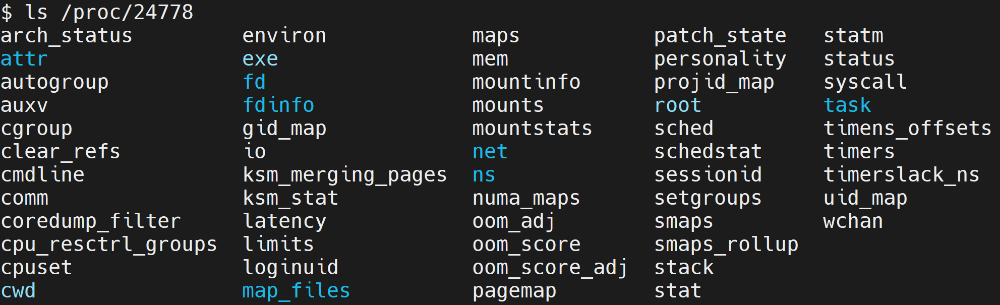

### 10. /proc目录介绍（续）

/proc/<pid>中进程基本信息伪文件，如下：

| 文件名 | 作用 | 相应命令 |
| --- | --- | --- |
| /proc/<pid>/status | 进程基本信息扩展 | pidstat |
| /proc/<pid>/cmdline | 进程启动时的命令行 | ps |
| /proc/<pid>/cwd | 进程工作目录 | pwdx |
| /proc/<pid>/environ | 进程环境变量 |  |
| /proc/<pid>/limits | 进程运行的ulimit资源限制 | prlimit |
| /proc/<pid>/cgroup | 进程运行的cgroup资源限制 |  |

### 11. /proc目录介绍（续）

/proc/<pid>中进程运行信息伪文件，如下：

| 文件名 | 作用 | 相应命令 |
| --- | --- | --- |
| /proc/<pid>/stat | 进程基本信息，如cpu、内存等 | prtstat/ps |
| /proc/<pid>/sched /proc/<pid>/schedstat | 进程调度相关信息 |  |
| /proc/<pid>/task/* | 进程的线程信息 | ps |
| /proc/<pid>/task/<tid>/syscall | 线程当前执行的系统调用 |  |
| /proc/<pid>/task/<tid>/wchan | 线程当前阻塞在什么内核函数上 |  |
| /proc/<pid>/task/<tid>/stack | 线程当前阻塞的内核栈 |  |

### 12. /proc目录介绍（续）

/proc/<pid>/*是进程内存伪文件，如下：

| 文件名 | 作用 | 相应命令 |
| --- | --- | --- |
| /proc/<pid>/mem | 进程虚拟内存伪文件，可使用此文件读写进程内存 |  |
| /proc/<pid>/maps /proc/<pid>/smaps | 进程虚拟内存段信息 | pmap |
| /proc/<pid>/statm | 进程虚拟内存信息，如代码段、栈段 |  |
| /proc/<pid>/oom_score_adj /proc/<pid>/oom_score | 进程oom优先级配置与当前oom得分 | choom |

### 13. /proc目录介绍（续）

/proc/<pid>/*是进程相关伪文件，如下：

| 文件名 | 作用 | 相应命令 |
| --- | --- | --- |
| /proc/<pid>/fd /proc/<pid>/fdinfo | 进程打开的文件描述符信息 | lsof |
| /proc/<pid>/io | 进程的磁盘io情况 | pidstat -d |
| /proc/<pid>/net/* | 进程网络相关信息 |  |

### 14. /proc目录介绍（续）

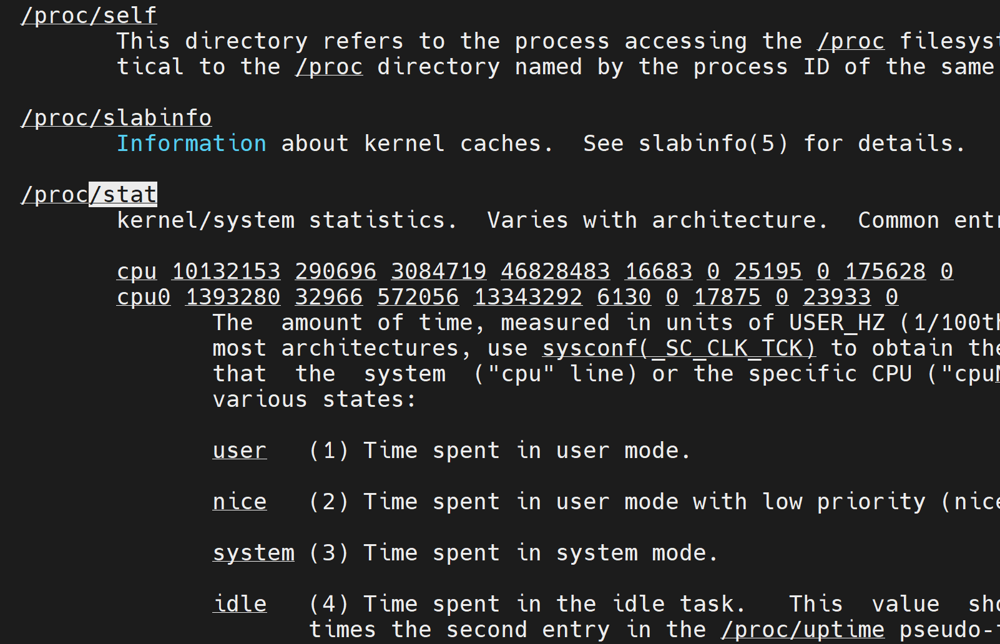

关于/proc目录各个文件的详细说明，可以man proc查看。

实际上，熟悉这些文件后，你可以编写自己的命令，比如我曾经使用python读取/proc/<pid>/schedstat以获取进程调度延迟情况

### 15. /proc案例：替代lsof

有时，我们会遇到没有lsof命令，但又不能安装的情况，这时可以通过/proc目录代替。

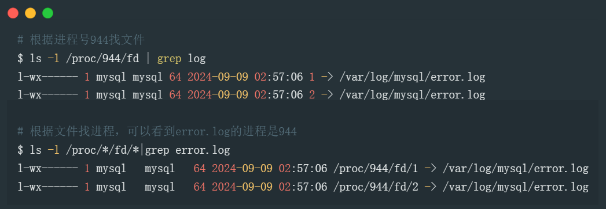

### 16. /sys目录

### 17. /sys目录介绍

/sys目录也是Linux内核虚拟的一个目录，主要存放和设备相关的配置参数，以及统计数据，也包含一些内核参数与统计信息。

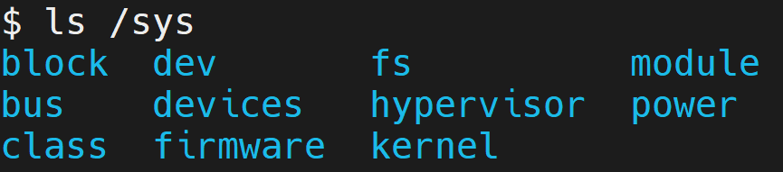

如查看ens33网卡相关配置
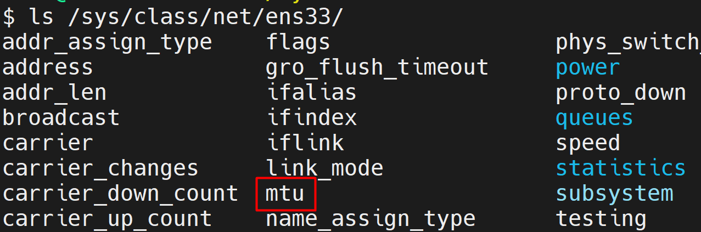

### 18. /sys目录介绍（续）

/sys中设备信息相关子目录如下：

比如iostat命令读取sda磁盘，就是访问的/sys/block/sda/stat文件获取的

| 文件名 | 描述 |
| --- | --- |
| /sys/devices | 系统中的所有设备的配置与统计信息 |
| /sys/class | 也是设备信息，按分类组织，如网络设备放在net子目录，块设备放在block子目录 |
| /sys/block | 也是设备信息，只包含块设备 |
| /sys/bus | 也是设备信息，只是以总线拓扑组织。 |
| /sys/dev | 也是设备信息，只包含块设备与字符设备 |

### 19. /sys目录介绍（续）

/sys中内核信息相关子目录如下：

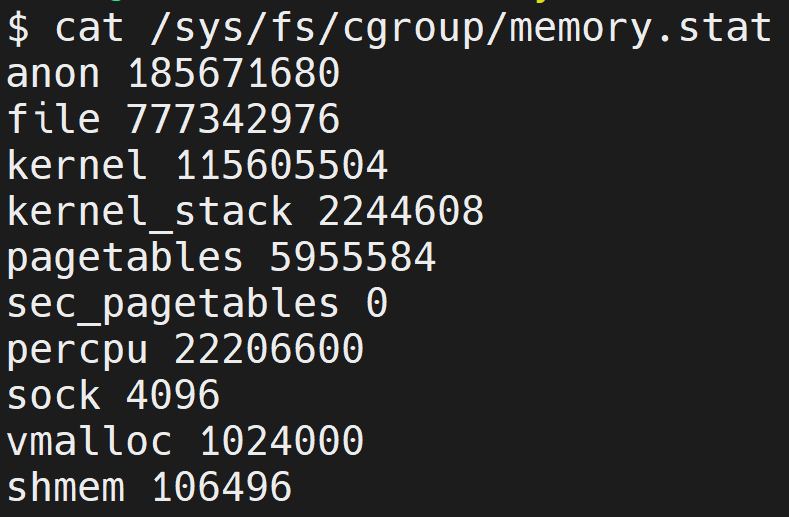

常用的容器相关信息在/sys/fs/cgroup中，如：
/sys/fs/cgroup/cpu.stat包含cpu使用情况，
/sys/fs/cgroup/memory.stat包含内存使用情况。

| 文件名 | 描述 |
| --- | --- |
| /sys/fs | 文件系统相关的配置和状态信息 |
| /sys/fs/cgroup | 控制组（cgroup）的配置，用于资源管理和隔离。 |
| /sys/kernel | 内核的配置与统计信息 |
| /sys/module | 内核模块的配置与统计信息 |

### 20. /sys目录介绍（续）

关于/sys目录各个子目录详细介绍，可以通过man 5 sysfs查看。

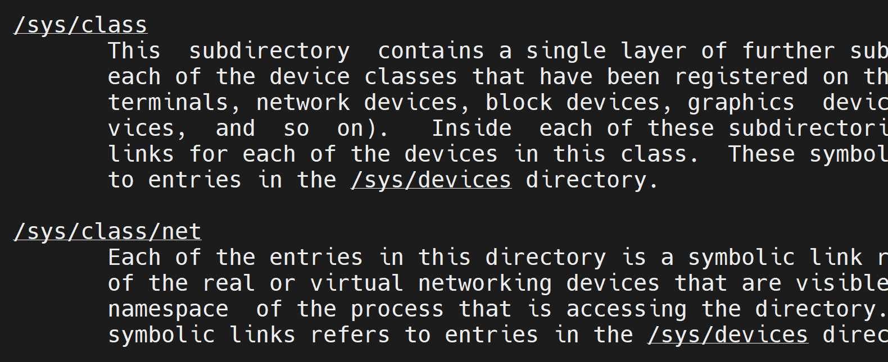

### 21. 用于提供内核相关信息

- /proc与/sys都是内核提供的虚拟目录文件，用于提供内核相关信息。
- /proc主要提供内核及进程运行信息，部分文件可以写入数据，以动态修改内核配置。
- /sys主要提供设备配置与运行信息，同样部分文件可以写入，以动态修改设备配置。
- free、iostat等命令都是通过读取/proc或/sys相关文件实现的，如有必要，也可基于它们实现自己的观测命令。

## 07. 内核级诊断工具-ftrace、perf

### 01. 内核级诊断工具

### 02. Linux追踪机制

### 03. 观测事件源介绍

Linux内置了多种类型的事件源，用于追踪系统及软件的执行情况。

- tracepoint：Linux在内核关键函数上硬编码的静态追踪点，用于观测系统运行情况。
- kprobe：Linux的内核态动态追踪机制，可追踪任意内核函数，不需要事先在内核代码中埋点。
- uprobe：Linux的用户态动态追踪机制，可追踪任意用户态程序函数。
- usdt：用户级静态追踪，是用户空间版本的traceport，但需要应用程序在代码中加入usdt探针代码，如java、mysql、libc已有内置。
- PMC硬件事件：由CPU的性能监控计数器PMC产生，包含了各种硬件性能情况。
- 软件事件：与硬件事件有关，一些内核运行机制触发，如缺页中断、上下文切换。

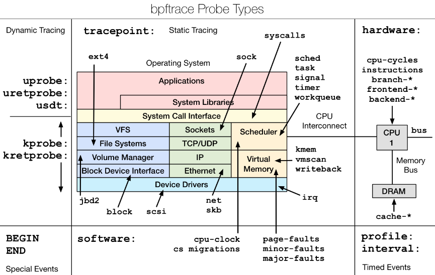

### 04. 追踪机制介绍

基于前面的tracepoint/kprobe等事件源，Linux开发了一些追踪机制，如下：

- ftrace：Linux早期tracepoint函数追踪机制，后不断扩展支持了kprobe、uprobe等，与/proc类似，通过tracefs向用户空间提供使用接口。
- perf_events：基于事件的性能分析机制，用于跟踪与分析系统性能，通过perf_event_open系统调用对用户空间开放接口。
- eBPF：在BPF的基础上扩展而来事件追踪机制，通过在内核eBPF虚拟机上执行自定义的BPF字节码，以实现各种各样的诊断工具。

实际上，Linux有这么多动态追踪机制，是因为Linux还在高速演化。

### 05. 内核级诊断工具

基于前面的ftrace/perf_events/eBPF等机制，Linux生态演化出了多种诊断工具，如下：

| 前端命令行工具 | 描述 | 追踪机制 | 观测事件源 |
| --- | --- | --- | --- |
| trace-cmd | 基于ftrace机制封装的诊断工具，默认使用ftrace需要手动操作/sys/kernel/debug/tracing目录，此工具大大简化了对ftrace机制的使用。 | ftrace | tracepoint kprobe uprobe pmc |
| perf-tools | 与trace-cmd类似，也是对ftrace操作的封装，同时也封装了部分perf命令的功能。 | ftrace、perf_events |  |
| perf | 最初是对perf_events机制的命令封装，后来又逐步支持了ftrace(perf ftrace子命令)与eBPF | perf_events、ftrace、eBPF |  |
| bcc | 对eBPF机制封装的各种场景的诊断命令工具，如syscount统计系统调用、biolatency统计磁盘延时等。 | eBPF |  |
| bpftrace | 也是对eBPF机制封装的工具，提供一种新的脚本语法(类似AWK)，以快速自定义新的eBPF诊断工具。 | eBPF |  |

### 06. ftrace使用

### 07. ftrace使用（续）

默认ftrace的使用，基于tracefs，在/sys/kernel/debug/tracing目录中进行操作，如下：

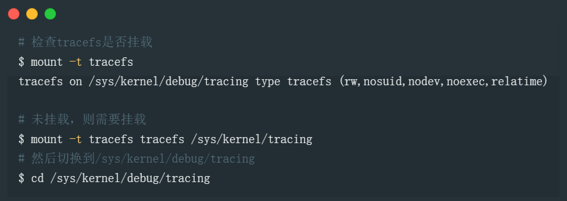

### 08. ftrace使用（续）

挂载后，/sys/kernel/debug/tracing目录下有很多文件，通过读写这些文件，以使用ftrace功能。

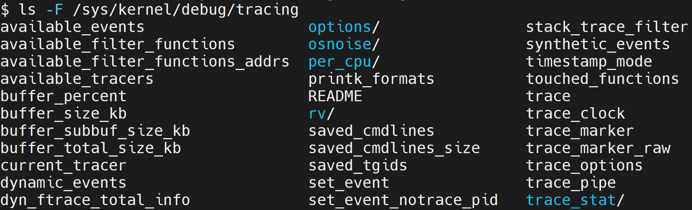

### 09. ftrace使用（续）

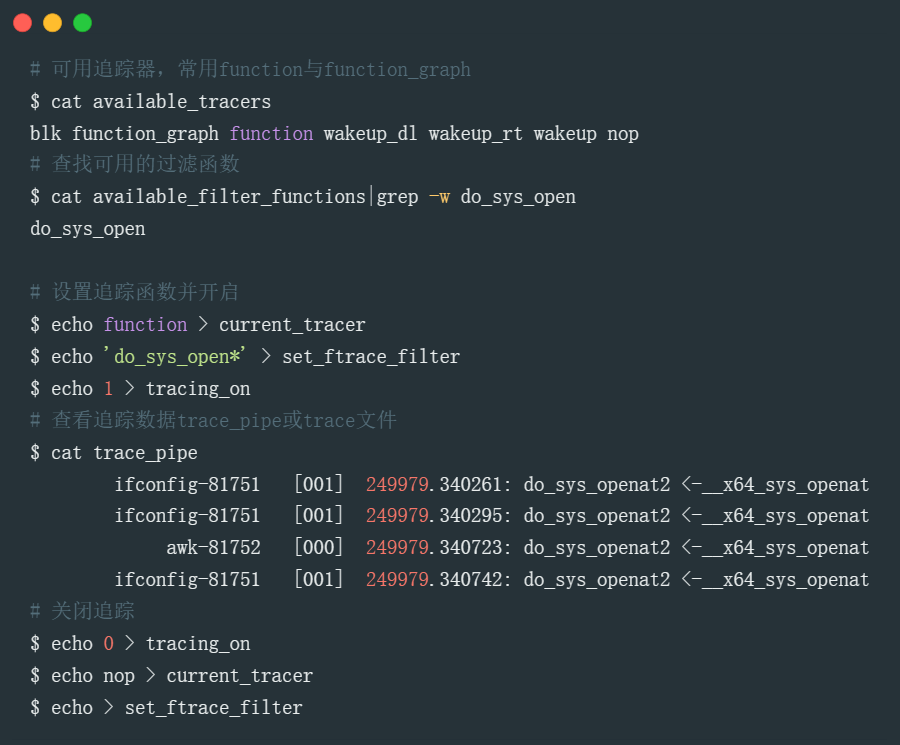

函数追踪：
以追踪do_sys_open函数为例

### 10. ftrace使用（续）

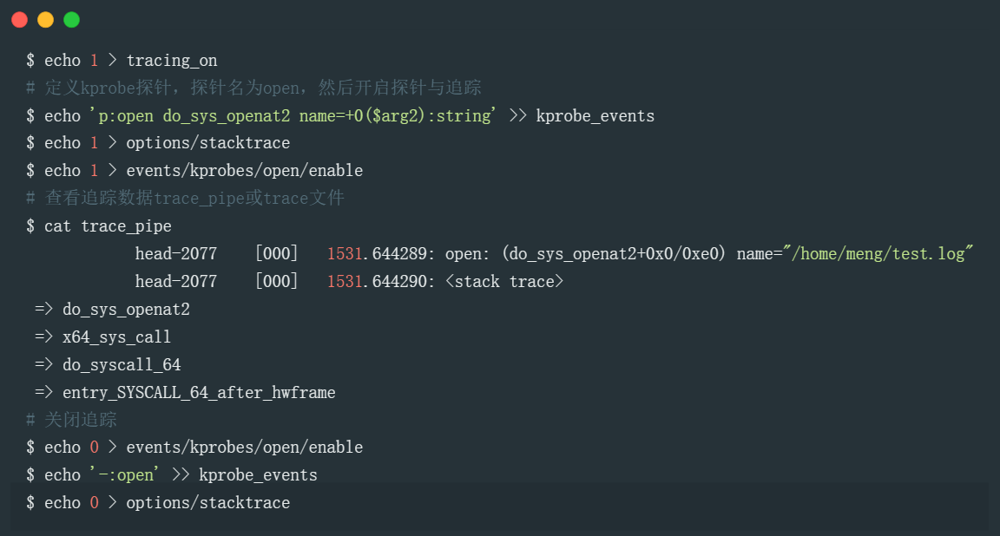

kprobe追踪：以追踪do_sys_openat2函数为例

### 11. trace-cmd命令

### 12. trace-cmd命令（续）

从前面可以看到，ftrace使用挺麻烦的，而trace-cmd封装了ftrace操作，以简化ftrace使用。
使用trace-cmd做函数追踪，如下：

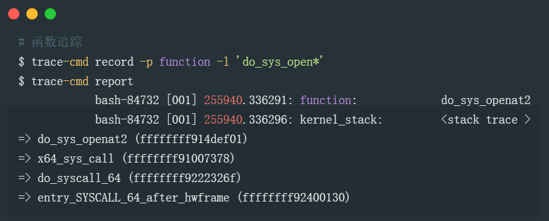

### 13. trace-cmd命令（续）

使用trace-cmd追踪tracepoint，如下：

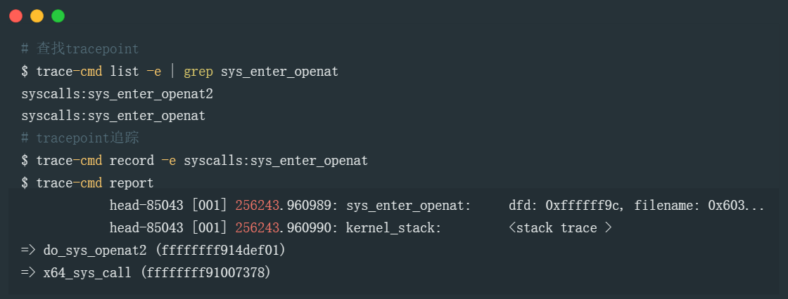

### 14. perf-tools工具集

### 15. perf-tools工具

perf-tools也是基于ftrace开发的工具集，提供了各种场景化的诊断工具。

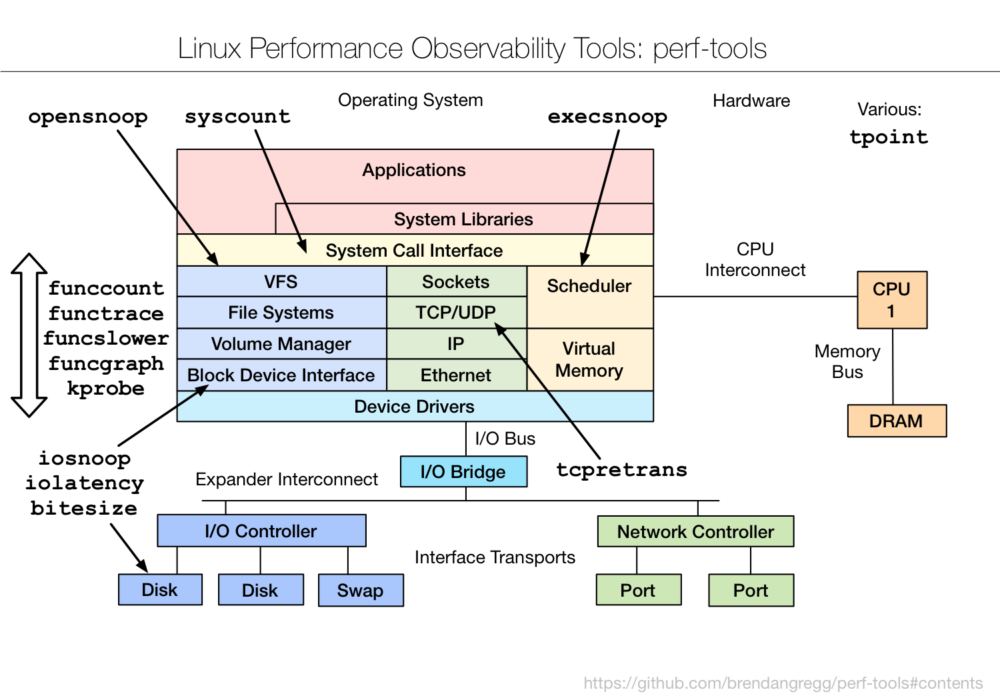

### 16. perf-tools工具（续）

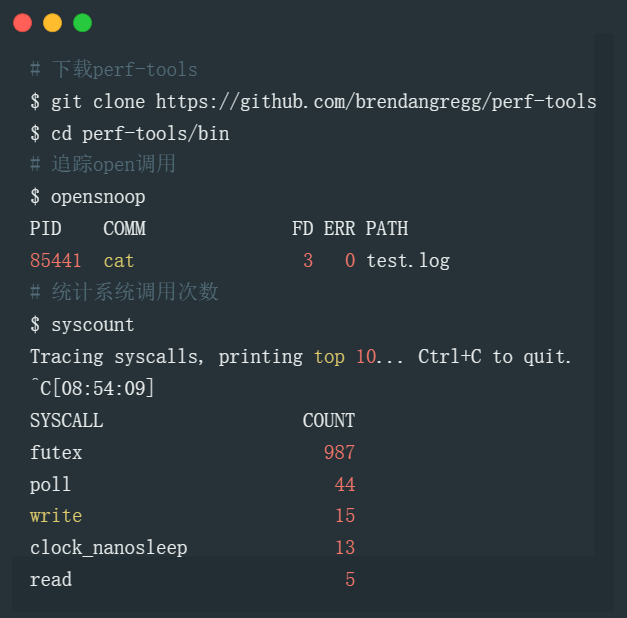

perf-tools封装了一些工具，如：
opensnoop：可追踪文件打开的调用。
syscount：可统计系统调用次数。

其它工具，可到perf-tools的github页面查看。

### 17. perf命令

### 18. perf命令（续）

perf命令是Linux主推的性能分析工具，它提供了CPU采样分析、PMC硬件性能分析等功能，也支持ftrace和少量eBPF支持。

perf record子命令用于剖析采样分析，采样数据保存在perf.data，如下：

### 19. perf命令（续）

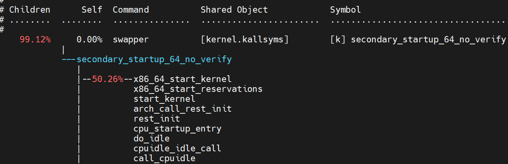

perf report --stdio：查看性能数据。

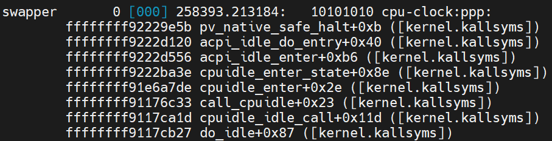

perf script：文本输出数据，以方便其它工具处理

### 20. perf火焰图

可以发现perf输出的文本看起来并不直观，好在性能优化大师Brendan Gregg发明了火焰图，并开发了一套火焰图生成工具。

工具下载地址：https://github.com/brendangregg/FlameGraph

### 21. perf火焰图（续）

用浏览器打开svg文件，在火焰图中，它将多次采集的相同线程栈聚合在一起显示，因此，图中越宽的栈表示此栈在运行过程中，被抓取到的次数越多，也就是占用CPU较多的代码。

### 22. perf命令

perf list子命令用于查询事件，如下：

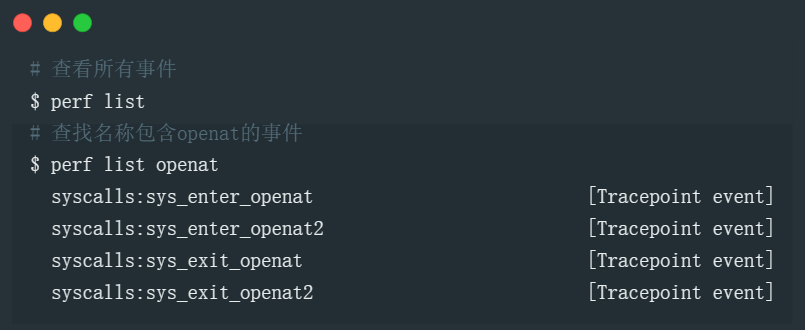

### 23. perf命令（续）

perf stat子命令用于统计事件数量，如下：

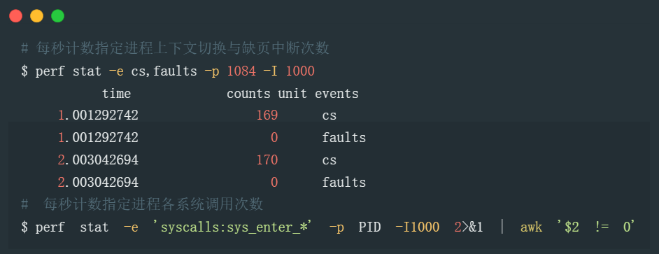

### 24. perf命令（续）

perf record也可用于静态追踪与动态追踪，如下：

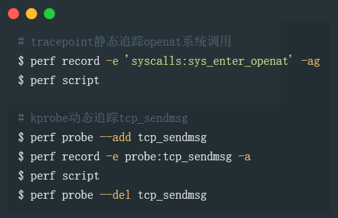

### 25. perf命令（续）

perf trace用于跟踪系统调用，perf ftrace对ftrace封装，用于函数追踪，如下：

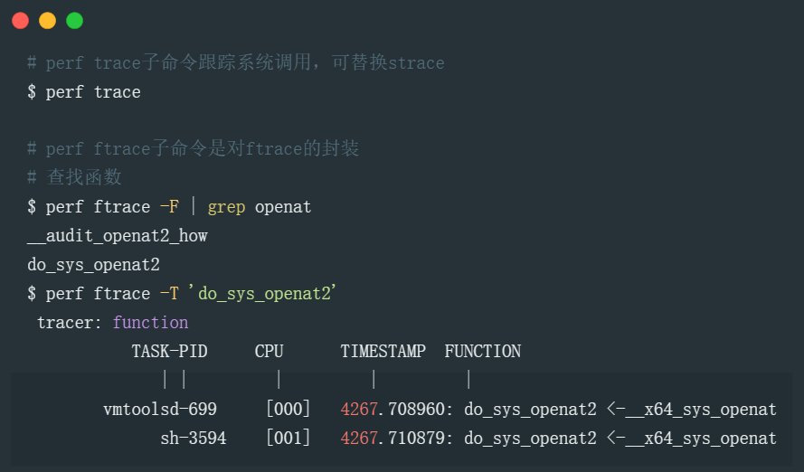

### 26. 用于提供观测数据来源

- Linux内核提供了tracepoint、kprobe、uprobe等观测事件源，用于提供观测数据来源。
- 基于这些事件源，Linux内核提供了ftrace、perf_events、eBPF等观测机制，以实现问题诊断、性能分析等需求。
- 基于ftrace、perf_events、eBPF等机制，Linux生态又演化出了trace-cmd、perf、bcc等命令行前端观测工具。
- perf相比ftrace系工具(trace-cmd、perf-tools)，额外提供了CPU采样、事件统计能力。
- 可以发现，ftrace、perf_events的追踪功能，自定义能力不足，只能提供调用时间、进程、函数名、参数等固定观测形式，而下篇的eBPF则在自定义能力上更灵活强大。

## 08. 内核级诊断工具-bcc、bpftrace

### 01. 内核级诊断工具

### 02. eBPF介绍

### 03. eBPF介绍（续）

BPF早期是为高效捕获网络包而开发，后期扩展成一个通用的执行引擎，实际类似于在内核中运行的虚拟机，执行eBPF字节码以处理tracepoint、kprobe等事件，并将事件数据存储在eBPF maps中然后输出，以提供强大的可编程观测能力。

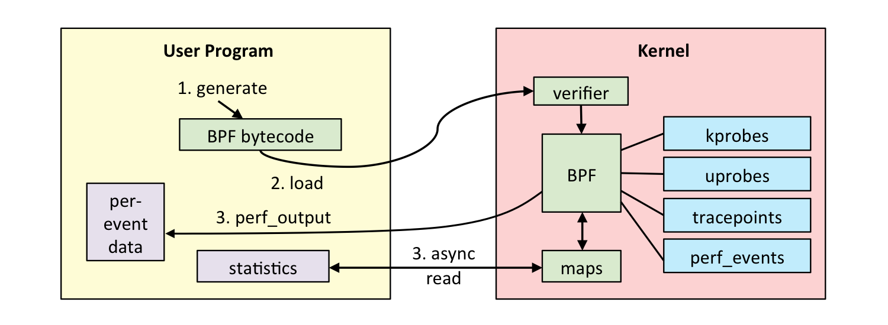

### 04. eBPF介绍（续）

基于Linux的eBPF机制，Linux社区演化出了多种观测工具，如bcc、bpftrace，其中：
bcc：主要偏向于提供场景化的诊断工具，如runqslower追踪线程调度延迟，memleak追踪内存泄露。
bpftrace：提供类似awk的脚本语言，用于快速编写新的诊断工具。

### 05. bcc工具集

### 06. bcc工具集（续）

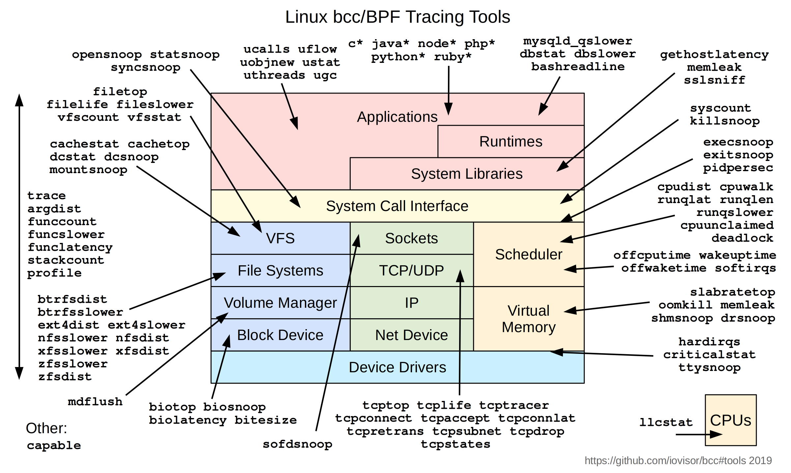

bcc工具集提供了大量开箱即用的诊断工具，包括从应用程序、CPU、内存、磁盘、网络层面的各种工具，可视情况从右图查找。

### 07. bcc工具集（续）

关键词：请求、java服务器、网络、mysql服务器、磁盘、线程调度
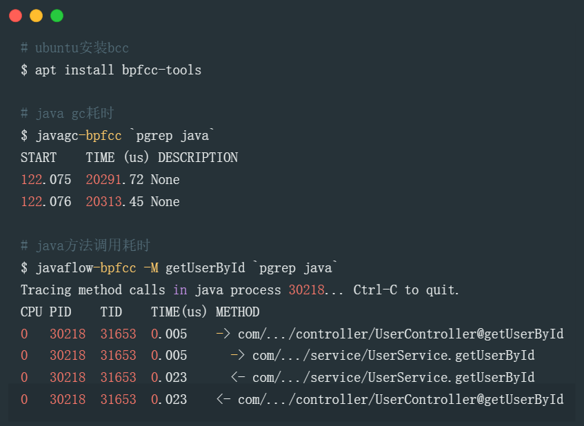

### 08. bcc工具集（续）

关键词：请求、java服务器、网络、mysql服务器、磁盘、线程调度
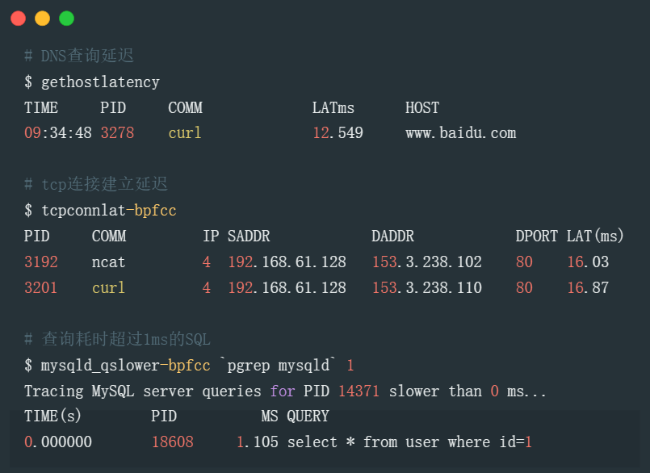

### 09. bcc工具集（续）

关键词：请求、java服务器、网络、mysql服务器、磁盘、线程调度
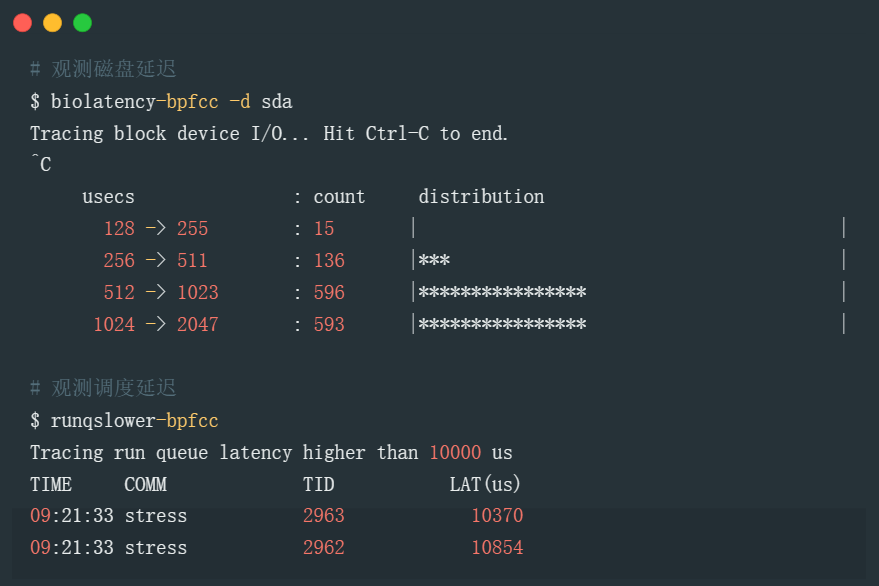

### 10. oncpu分析 vs offcpu分析

线程在运行的过程中，
- 要么在CPU上执行，称其为oncpu，
- 要么被锁或io操作阻塞，从而离开CPU进去睡眠状态，称其为offcpu，待被解锁或io操作完成，线程会被唤醒而变成运行态。

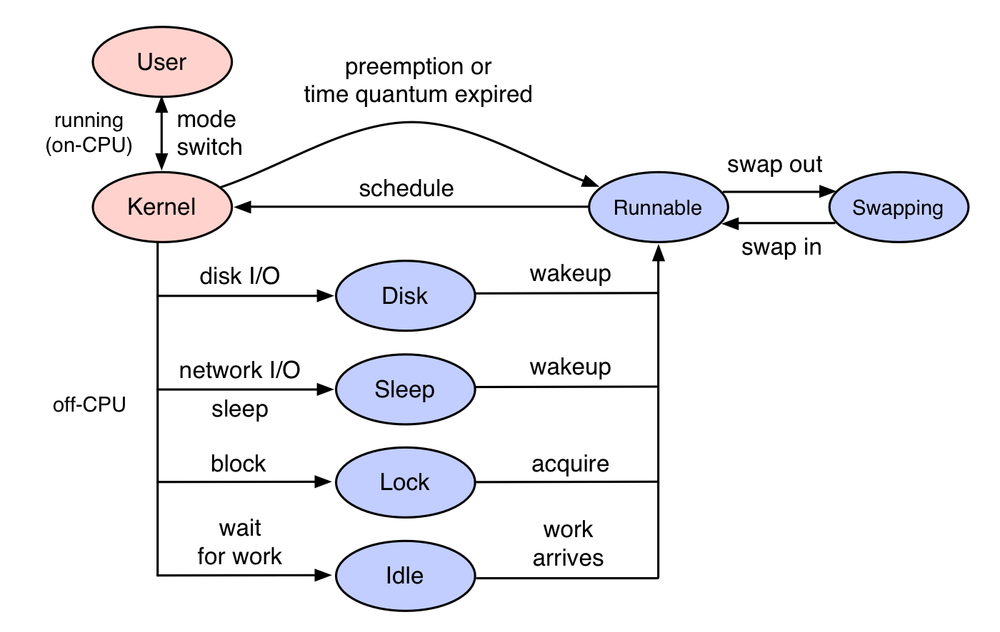

### 11. bcc剖析工具

profile和之前perf record一样，用于oncpu分析，以发现CPU占用多的代码。

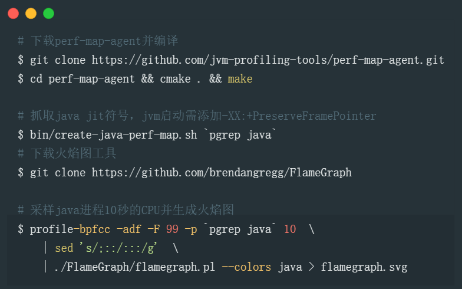

### 12. bcc - oncpu火焰图

从CPU栈寄存器出发，定时采样线程栈，然后相同栈在火焰图中合并，故越宽的线程栈，表示其耗费CPU越多。

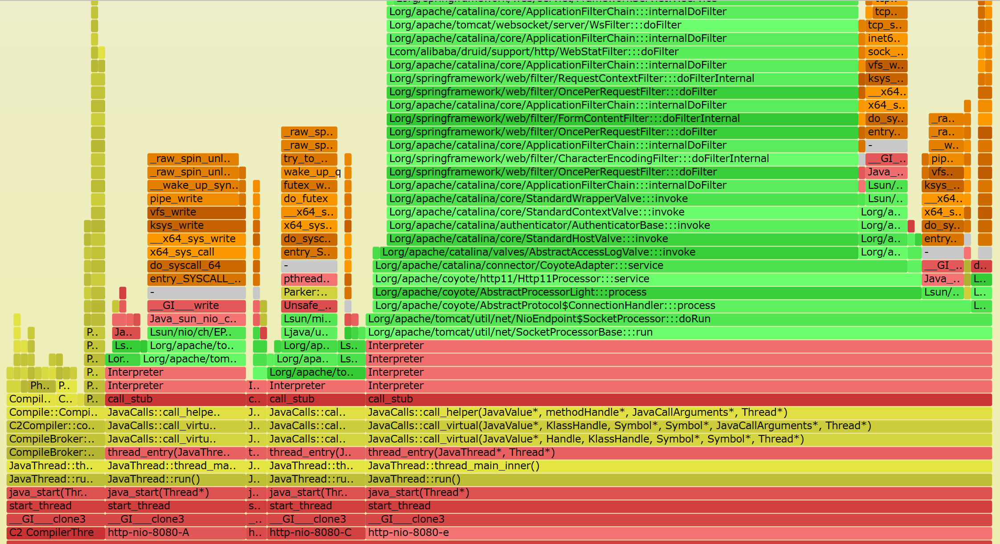

### 13. bcc剖析工具

offcputime工具提供了offcpu分析功能，用于发现关键的耗时代码。

### 14. bcc - offcpu火焰图

offcputime通过追踪Linux上下文切换函数finish_task_switch，以实现对线程睡眠时间的测量，故offcpu的栈宽代表的是线程睡眠时间。

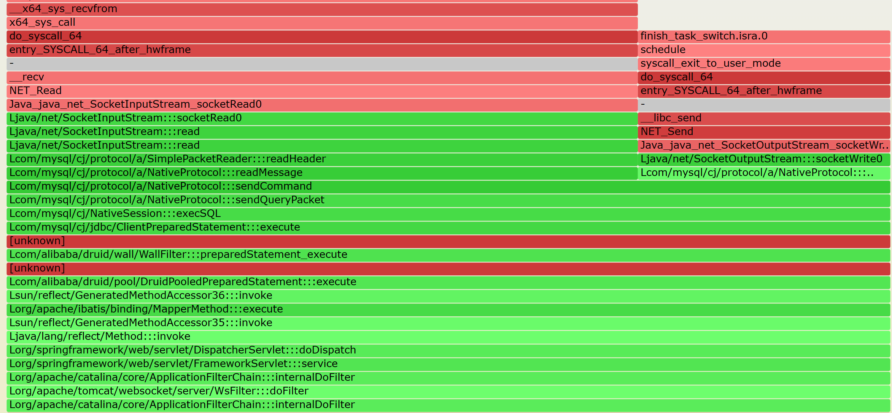

### 15. BPF CO-RE

bcc工具本身是一个脚本(python、lua)，然后内嵌C/C++的BPF代码，然后在运行时通过LLVM动态编译后运行，这使得bcc工具有如下问题：
- 启动时，会占用一些CPU、内存资源，
- 由于运行时才编译，故需要依赖于内核头文件包的安装。
为了解决这些问题，BPF CO-RE出现了，它直接编译成小型的二进制执行程序，以提升性能并去掉不必要的依赖。

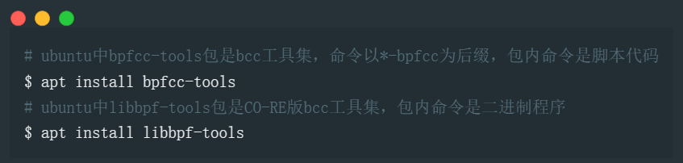

### 16. BPF CO-RE（续）

BPF CO-RE版的bcc命令，性能高于原始脚本版bcc命令，如有条件，尽量选择CO-RE版bcc工具，对比如下：

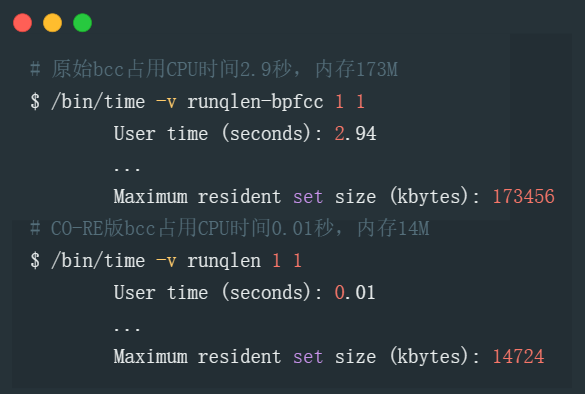

### 17. bpftrace工具集

### 18. bpftrace工具集（续）

bpftrace对eBPF技术进行封装，实现了一种类似awk的脚本语言，封装了常见语句块，并提供了内置变量与内置函数，使用它们可以很简单的编写自己的诊断工具，而不用学习复杂的bpf开发技术。

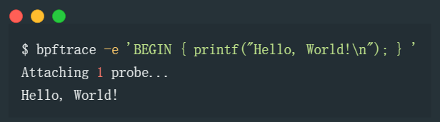

### 19. bpftrace实例1

java的mysql驱动，它使用sendto与recvfrom系统调用来与mysql服务器通信，因此，我们在sendto调用时，计下时间点，然后在recvfrom结束时，计算时间之差，就可以得到相应SQL的耗时了，如下：

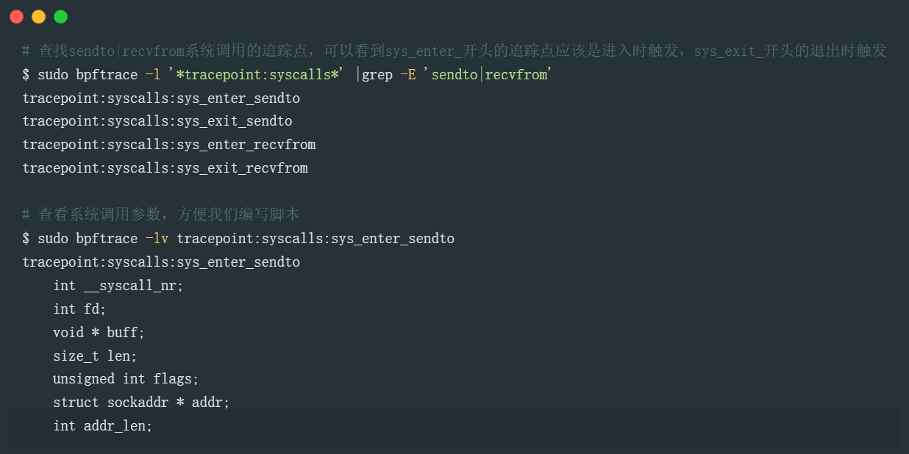

### 20. bpftrace实例1（续）

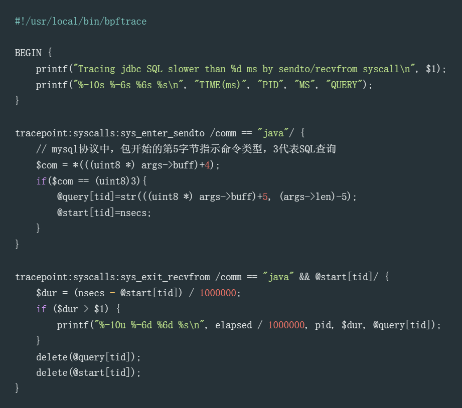

编写追踪脚本trace_slowsql_from_syscall.bt，其中：
comm表示进程名称，
tid表示线程号，
@query[tid]与@start[tid]类似map，以tid为key的话，这个变量就像一个线程本地变量了。

### 21. bpftrace实例1（续）

调用上面的脚本，可以看到各SQL执行耗时，如下：

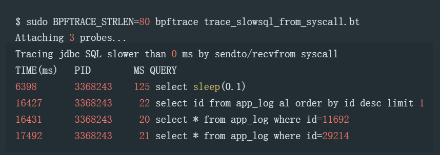

### 22. bpftrace实例2

从调用端来追踪SQL耗时，会包含网络往返时间，为了得到更精确的SQL耗时，我们可以写一个追踪服务端mysql的脚本，来观测SQL耗时。
先找到mysqld服务进程的可执行文件与入口函数dispatch_command，如下：

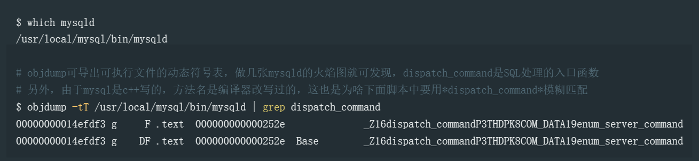

### 23. bpftrace实例2（续）

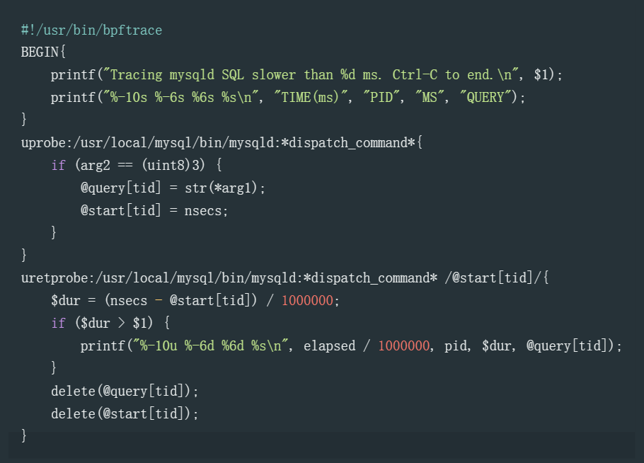

追踪脚本整体上与之前系统调用版本的类似，不过追踪点换成了uprobe。

### 24. bpftrace实例3

众所周知，SQL执行时需要扫描数据，并且扫描的数据越多，SQL性能就会越差。
但对于一些中间情况，SQL扫描行数不多也不少，如2w条。且这2w条数据都在缓存中的话，SQL执行时间不会很长，导致没有记录在慢查询日志中，但如果这样的SQL并发量大起来的话，会非常耗费CPU。
对于mysql的话，扫描行的函数是row_search_mvcc（如果你经常抓取mysql栈的话，很容易发现这个函数），每扫一行调用一次，如果在追踪脚本中追踪此函数，记录下调用次数，就可以观测SQL的扫描行数了，如下：

### 25. bpftrace实例3（续）

### 26. bpftrace实例3（续）

脚本执行效果，如下，可以发现，只要扫描行数变大，耗时就会变长。

注：id列是主键，seq列没有索引。

### 27. bpftrace工具集

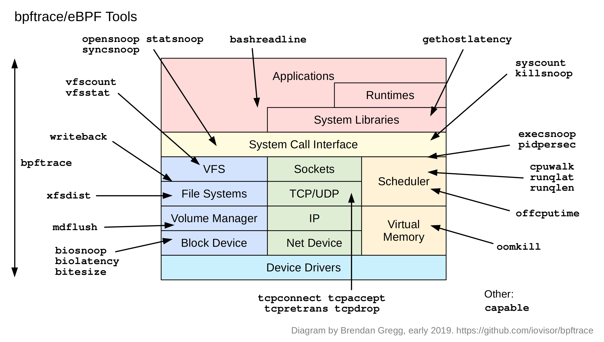

基于此脚本语言，又演化出了一套类似bcc的场景化的诊断命令，目前还在快速演化中。

### 28. 方便诊断各种场景的问题

- bcc是使用eBPF技术写好的场景化的诊断工具集，方便诊断各种场景的问题。
- bcc提供了profile与offcputime以支持oncpu与offcpu分析方法，以方便诊断高CPU和高耗时问题。
- bpftrace基于eBPF实现了一种类似awk脚本语言，基于此可很方便编写自己的诊断脚本。
- bpftrace也基于其语法，开发了一套类似bcc的诊断命令集，方便诊断各种问题。

## 09. 原生程序调试工具-strace、gdb等

### 01. 原生程序调试工具

### 02. 原生程序调试工具（续）

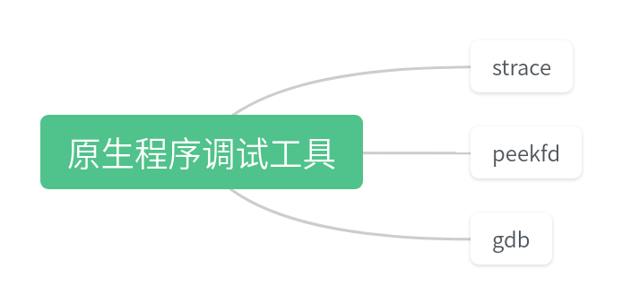

### 03. strace命令

### 04. strace命令（续）

strace是Linux中用来观测系统调用的工具，学过操作系统原理都知道，操作系统向应用程序暴露了一批系统调用接口，应用程序只能通过这些系统调用接口来访问操作系统，比如申请内存、文件或网络io操作等。

strace基础选项如下：

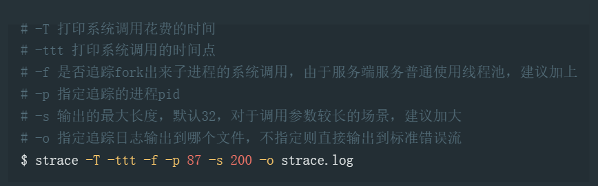

### 05. strace命令（续）

strace过滤指定系统调用(文件%file)，以及文件描述符解码(-yy)，如下：

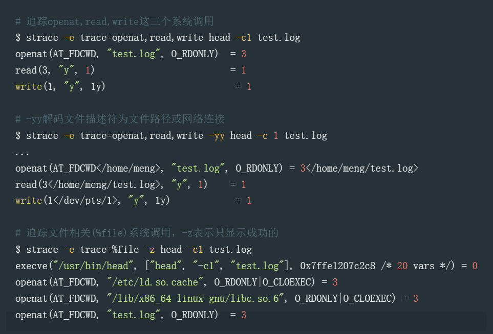

### 06. strace命令（续）

strace过滤指定系统调用(网络)，以及打印从文件描述读写内容，如下：

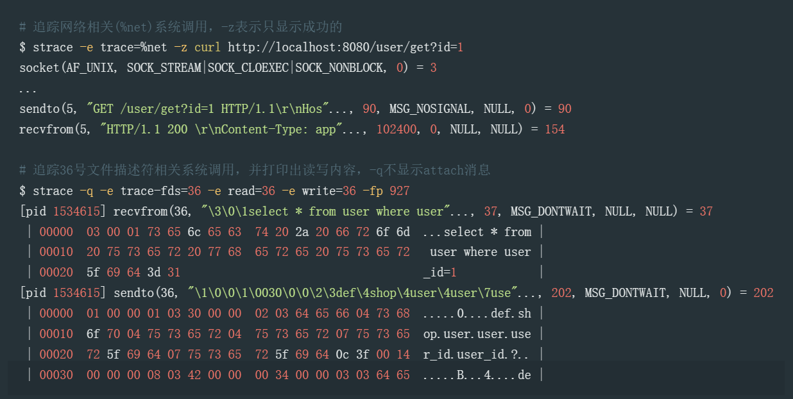

### 07. strace命令（续）

-k选项打印调用栈，如下：

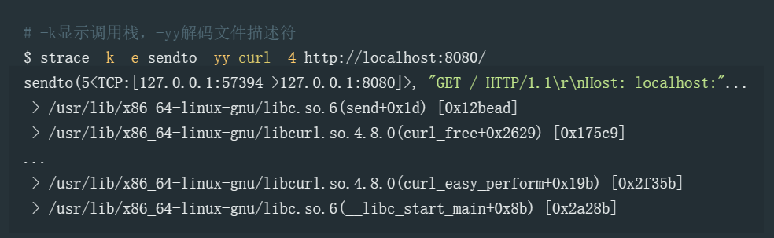

### 08. strace命令（续）

-c选项用于统计系统调用，一般用来判断哪些系统调用较频繁，可能是性能问题点，如下：

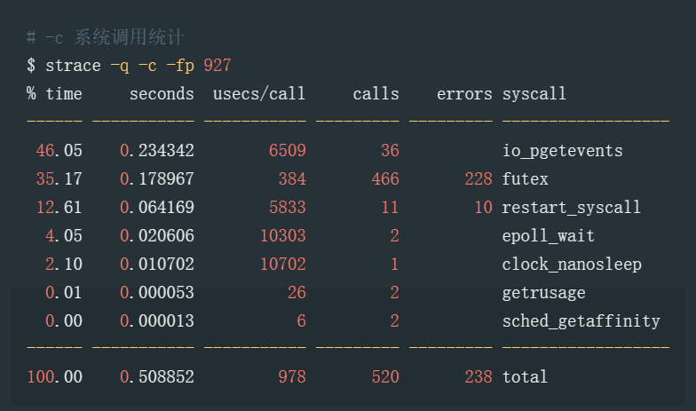

### 09. strace实例：调用端追踪SQL耗时

java通过sendto系统调用发送SQL，recvfrom接收数据，所以只要计算两者之间时间差，则是SQL耗时。

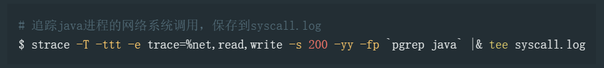

### 10. strace实例：调用端追踪SQL耗时（续）

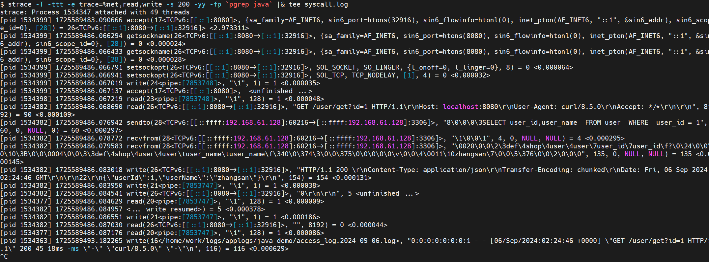

3.收到查询结果

5.写access.log日志

4.返回http响应

2.发送SQL

1.接收到http请求

### 11. strace实例：调用端追踪SQL耗时（续）

使用awk解析系统调用日志，并计算sendto与recvfrom的时间差，得到SQL耗时，如下：

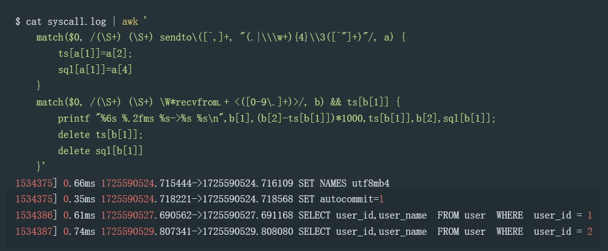

### 12. strace命令

由于程序的关键动作，都要靠系统调用，因此strace也经常被用来研究学习Linux命令的实现，如下：

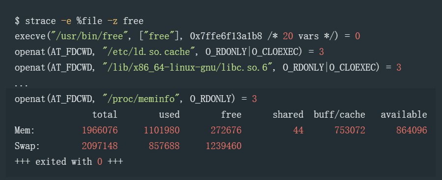

从strace输出可以发现，free命令的数据来自/proc/meminfo文件。

### 13. strace命令（续）

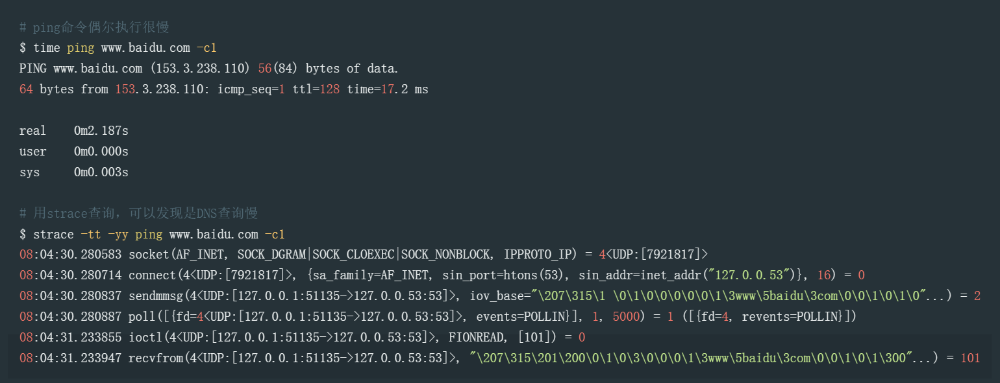

dns查询慢了1秒
strace也经常被用来诊断命令执行问题，如下：

### 14. peekfd命令

### 15. peekfd命令（续）

peekfd命令用于读取进程在指定文件描述符上的读写数据，如下：

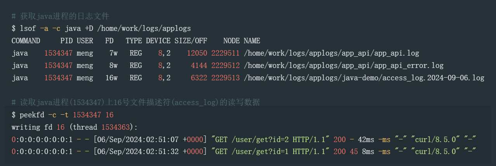

### 16. peekfd命令（续）

这其实和strace的-e read/write类似，不过peekfd命令的输出可读性更强一些。

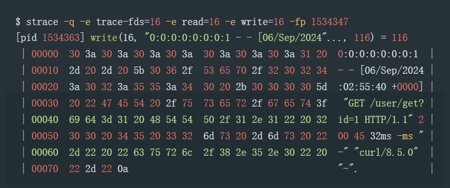

### 17. gdb命令

### 18. gdb命令（续）

gdb命令是c/c++语言的断点调试器debugger，但它不是图形化界面的，而是命令式的，因此，也可以编写调试命令脚本，以实现问题分析。

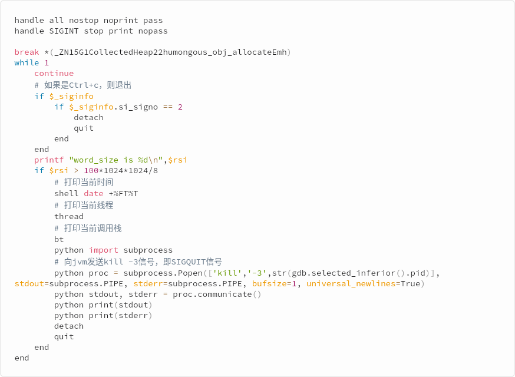

如右图，是我一次定位java大对象分配而写的gdb脚本。

### 19. gdb实例：定位大对象分配

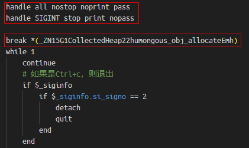

handle指令：设置Linux信号处理方式，由于我们并不需要调试信号问题，所以让gdb都不处理信号，保留SIGINT是为了按Ctrl+c时能退出gdb脚本。
break指令：给G1的大对象分配函数G1CollectedHeap::humongous_obj_allocate加断点。

### 20. gdb实例：定位大对象分配（续）

我们要追踪G1CollectedHeap::humongous_obj_allocate函数，为啥断点设置在_ZN15G1CollectedHeap22humongous_obj_allocateEmh这奇怪的函数上？

因为C++为了兼容C的二进制ABI，编译时函数名会改写(mangle)，可通过nm查询改写后的函数名。

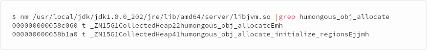

### 21. gdb实例：定位大对象分配（续）

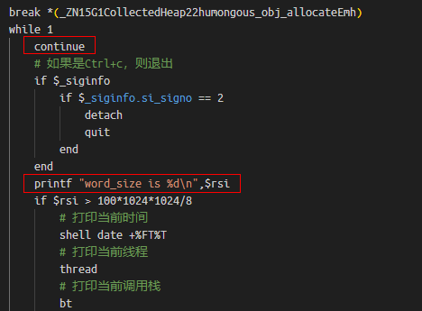

continue指令：表示让程序运行起来，当程序命中断点后，continue才会执行完。
printf指令：格式化打印当前rsi寄存器的值，x86架构中rsi保存第二个参数的值，由于C++中第一个参数是this，故word_size的值在$rsi中。

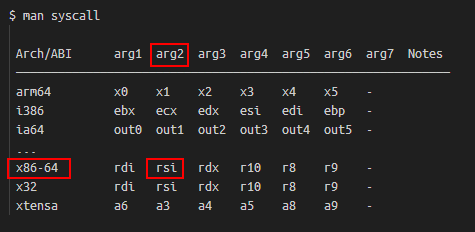

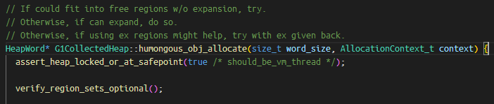

### 22. gdb实例：定位大对象分配（续）

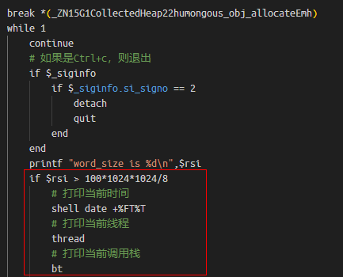

shell指令：执行shell脚本
thread指令：打印当前线程
bt指令：打印当前调用栈，不过由于java的解释执行的，因此bt打印不出java调用栈。

### 23. gdb实例：定位大对象分配（续）

由于JVM在收到SIGQUIT信号时，会在标准输出中打印线程栈信息。
因此，通过gdb内嵌的python扩展，执行kill -3命令，以实现打印java线程栈的需求。

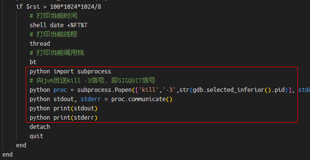

### 24. gdb实例：定位大对象分配（续）

通过gdb命令执行编写的脚本，在JVM的标准输出日志中，我得到了大对象分配的Java线程栈！

线程号转16进制
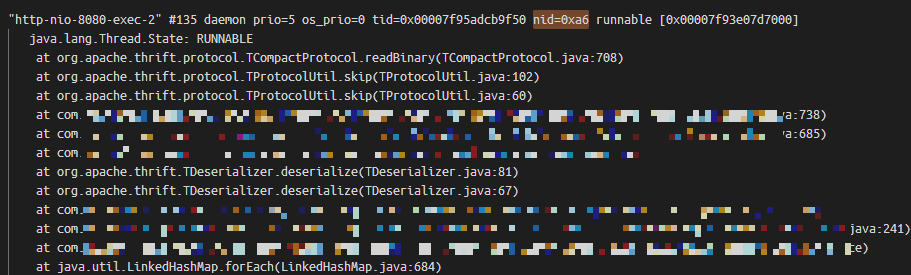

### 25. gdb实例：定位大对象分配（续）

原因是没有限制thrift反序列化的最大长度，异常数据会导致thrift创建非常大的数组，导致了大对象分配。

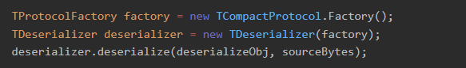

### 26. gdb命令

gdb命令还有两个比较常用的功能，获取原生线程栈，以及原生堆转储。

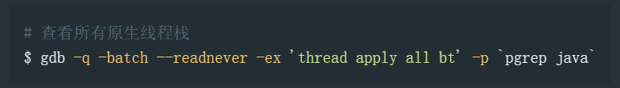

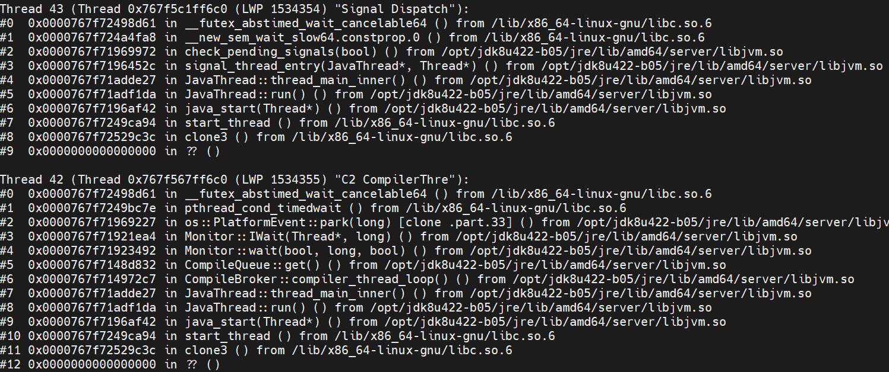

### 27. gdb命令（续）

gdb原生堆转储，用于调试内存段错误等。

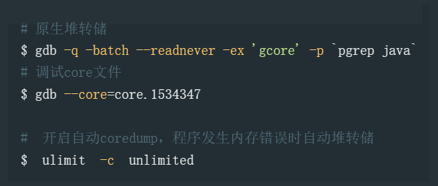

### 28. strace/gdb开销

strace/peekfd/gdb命令都是基本Linux的ptrace机制实现的，ptrace机制是Linux设计用来调试程序的一种机制，所以并没有太考虑性能因素，执行过程中会导致线程上下文切换。
因此，使用上述命令，对性能会有一定的影响，对于大流量系统需谨慎考虑。

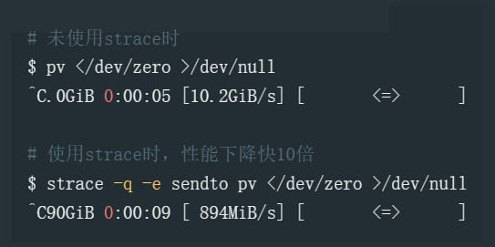

具体的影响和系统调用执行频率有关，频率越高影响越大，因此尽量在没有其它工具可用时，再考虑使用strace、gdb等工具。

### 29. strace命令可用来追踪系统调用情况

- strace命令可用来追踪系统调用情况，结合awk脚本可以实现一些请求追踪功能，如追踪慢SQL。
- strace命令也经常用来学习命令实现，或诊断命令执行问题。
- peekfd命令可以查看进程在文件描述符上的读写数据。
- gdb是c/c++调试器，也可以编写脚本追踪函数调用，gdb也可以实现查看线程栈与堆转储。
- 这个命令都是基于ptrace机制实现，使用时需注意性能影响。

## 10. jdk诊断命令介绍-jstack、jmap等

### 01. jdk诊断命令介绍

### 02. jdk诊断命令

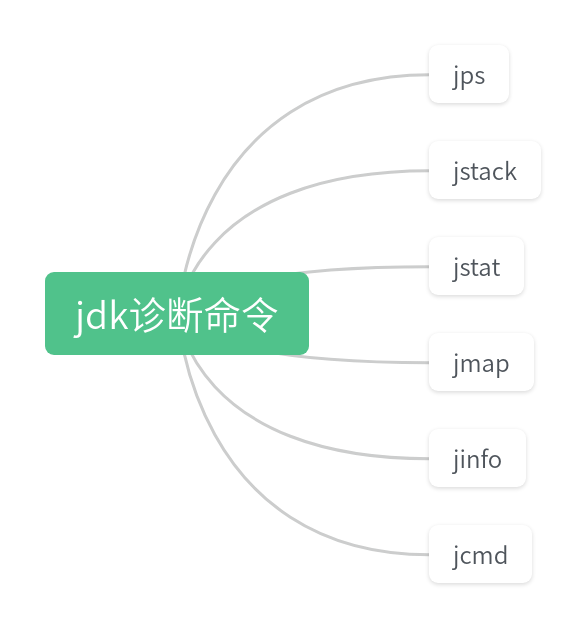

### 03. jps命令

jps用来查询java进程号。

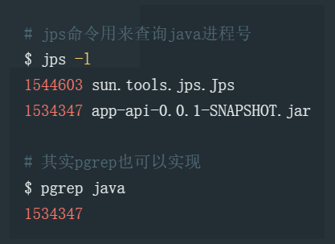

### 04. jstack命令

jstack用来获取java线程栈，这可用于查看当前各个线程都在做什么。

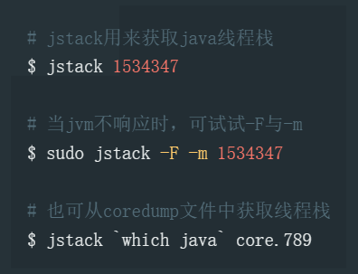

### 05. jstack命令（续）

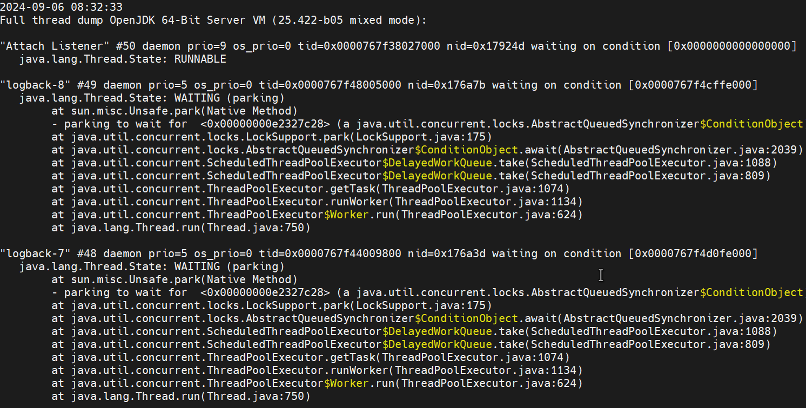

### 06. jstat命令

jstat用来查看jvm gc情况。

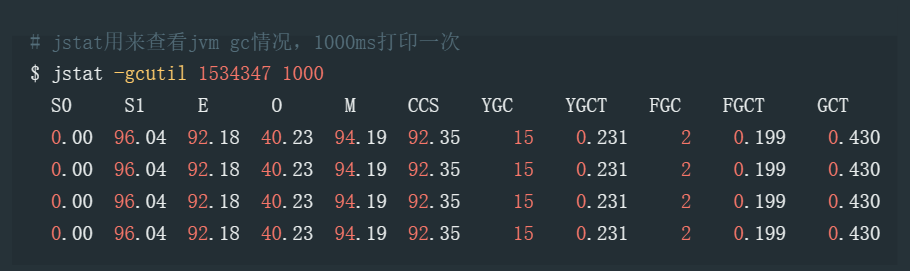

### 07. jstat命令（续）

jstat用来查看jvm gc、类加载、JIT编译情况。

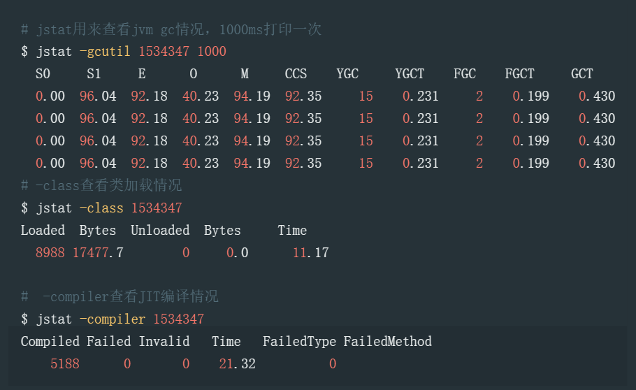

### 08. jmap命令

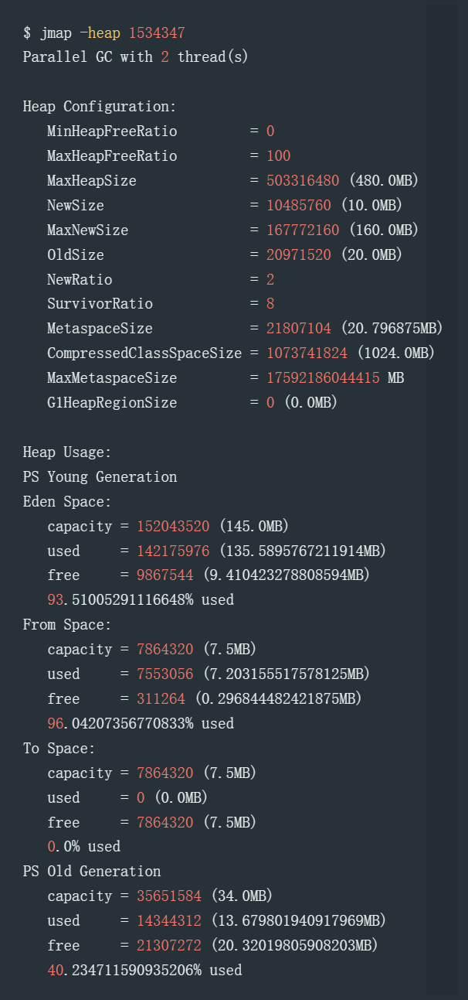

jmap命令可用来查看堆当前使用情况。

### 09. jmap命令（续）

jmap命令用来分析对象占用，如下查看各对象分布。

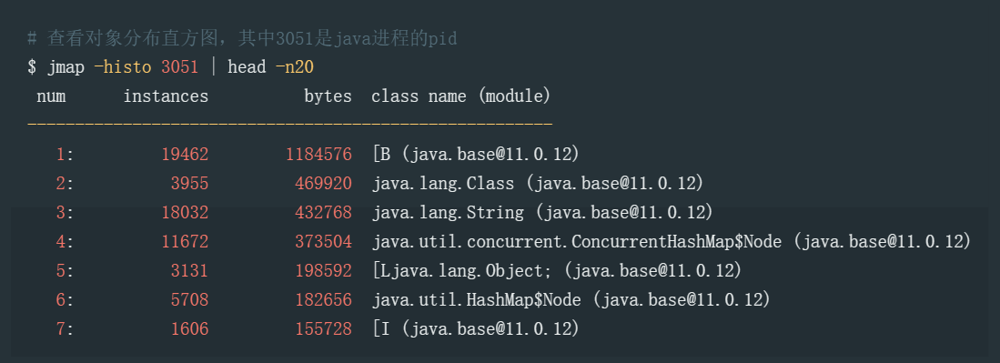

### 10. jmap命令（续）

- jmap命令也可将java堆转储为hprof文件，用于堆内存占用分析
- 也可添加JVM选项-XX:+HeapDumpOnOutOfMemoryError -XX:HeapDumpPath=/home/work/logs/applogs/，使得进程OOM时自动dump堆。
- 生成的hprof文件较大，建议gzip压缩后再下载到本地。

此文件是二进制文件，无法直接查看，一般需要配合mat(Memory Analysis Tool)等堆可视化工具来进行分析。

注：此命令可能会导致jvm长时间暂停，建议摘除流量后，再操作。

### 11. MAT内存分析

第一步：找GC Root

### 12. MAT内存分析（续）

第二步：若GC Root是线程，查看线程栈

### 13. MAT内存分析（续）

第三步：展开线程栈，这个SQL查询了大量数量导致堆占用高！

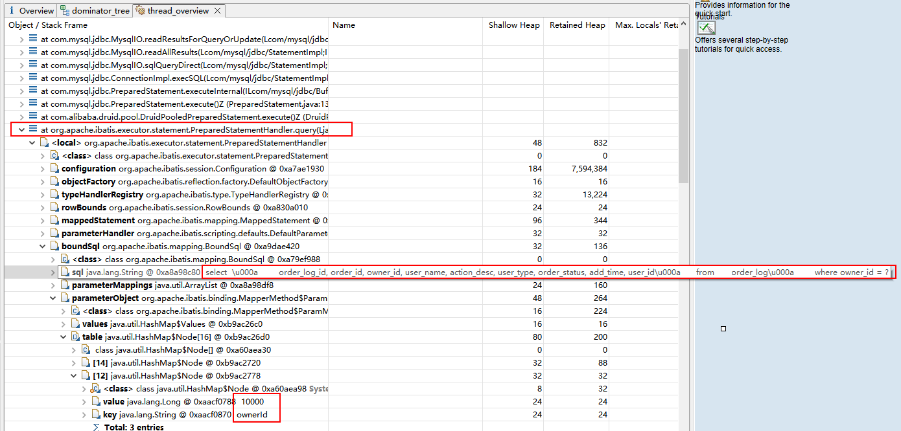

### 14. jinfo命令

jinfo命令用于查看或设置jvm配置项，以及查看系统属性。

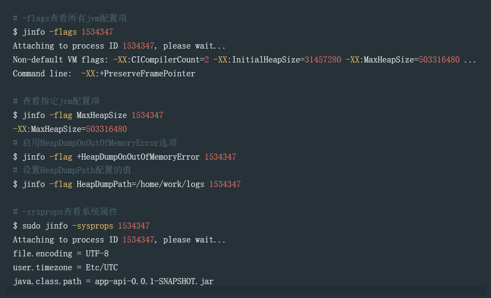

### 15. jcmd命令

从JDK7开始，jdk提供了一个方便扩展的诊断命令jcmd，用来取代之前比较分散的jdk基础命令，如jps、jstack、jmap、jinfo等，并且jdk添加新的诊断功能，也会通过jcmd提供。

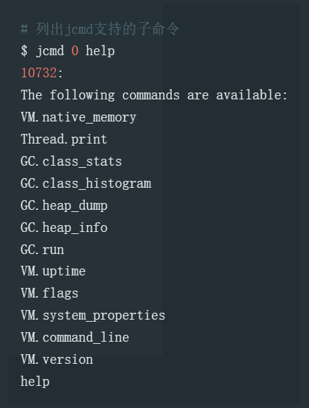

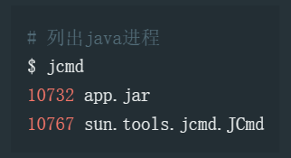

### 16. jcmd命令（续）

从JDK7开始，jdk提供了一个方便扩展的诊断命令jcmd，用来取代之前比较分散的jdk基础命令，如jps、jstack、jmap、jinfo等，并且jdk添加新的诊断功能，也会通过jcmd提供。

传递给jcmd的进程id是0时，jcmd会在本机所有java进程中执行子命令。

### 17. jcmd命令（续）

| jcmd子命令 | 传统命令 | 描述 |
| --- | --- | --- |
| jcmd | jps | 查看java进程 |
| jcmd 0 Thread.print | jstack | 获取java线程栈 |
| jcmd 0 GC.heap_info jcmd 0 GC.class_histogram jcmd 0 GC.heap_dump | jmap -heap jmap -histo jmap -dump | 查看或转储java堆 |
| jcmd 0 VM.flags jcmd 0 VM.system_properties jcmd 0 VM.command_line | jinfo | 查看或设置jvm配置及系统属性 |
| jcmd 0 PerfCounter.print | jstat | 查看gc等数据。 |

### 18. jcmd命令（续）

后面jdk提供的一些新的工具，都是通过jcmd提供的，而不是开发新命令。

| jcmd子命令 | 描述 |
| --- | --- |
| jcmd 0 VM.native_memory | 查看jvm native内存分配。 |
| jcmd 0 GC.run | 触发GC |
| jcmd 0 GC.rotate_log | 强制滚动GC日志。 |
| JFR.configure JFR.stop JFR.start JFR.dump JFR.check | JFR相关配置与操作 |

## 11. java故障分析工具-arthas

### 01. java故障分析工具arthas

### 02. arthas工具

arthas是java下的一款动态追踪工具，可以观测到java方法的调用参数、返回值等，除此之外，还提供了很多实用功能，如反编译、线程剖析、堆内存转储、火焰图等。

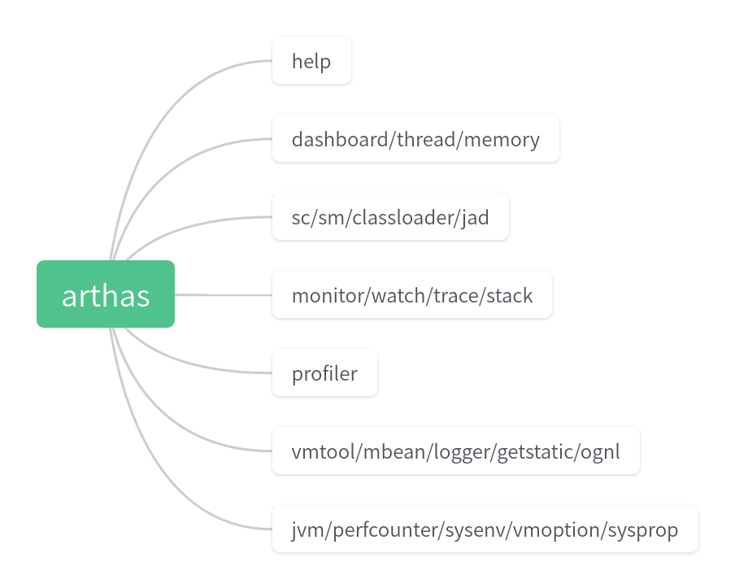

### 03. help命令

help命令，用于查看各命令用法。

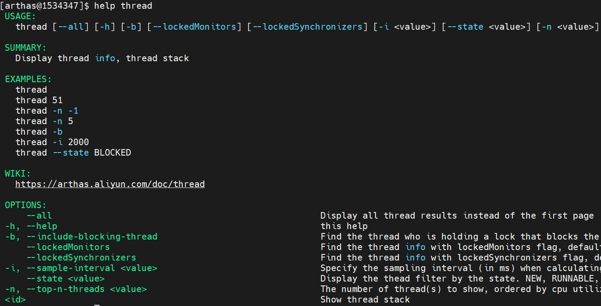

### 04. 查看线程与内存

dashboard/thread/memory命令

### 05. dashboard命令

dashboard命令，提供了类似top的jvm概览信息，如线程、内存及jvm信息。

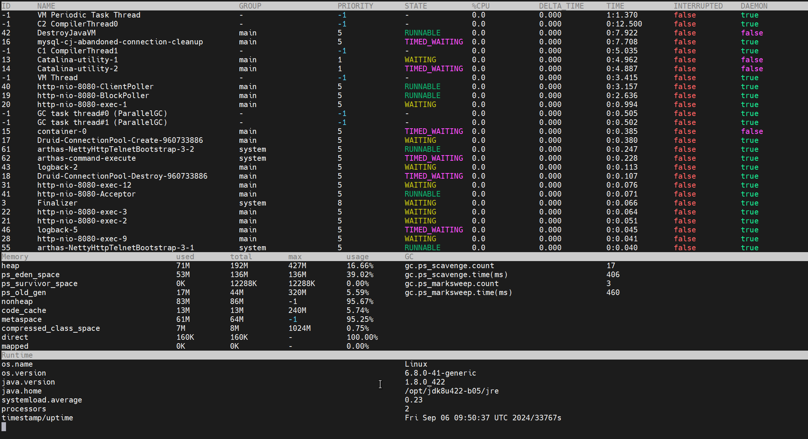

### 06. thread命令

thread命令，用于查看线程信息(常用)。

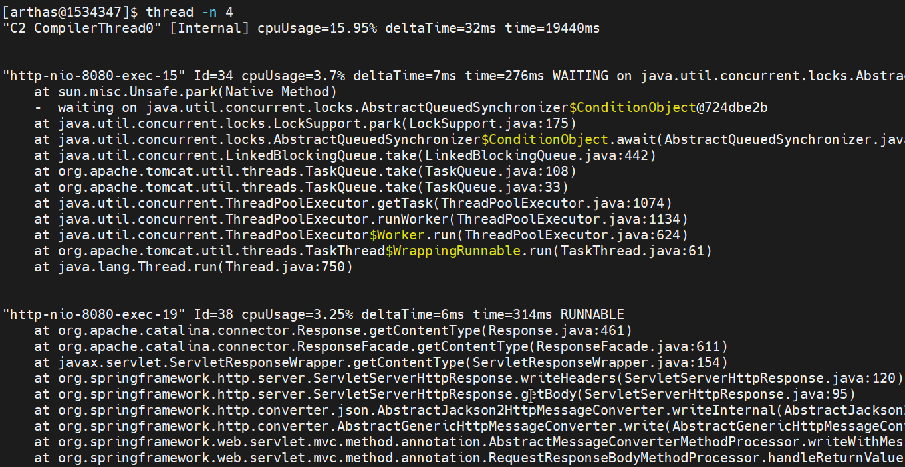

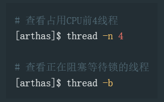

### 07. memory命令

memory命令，用于查看内存占用情况(常用)。

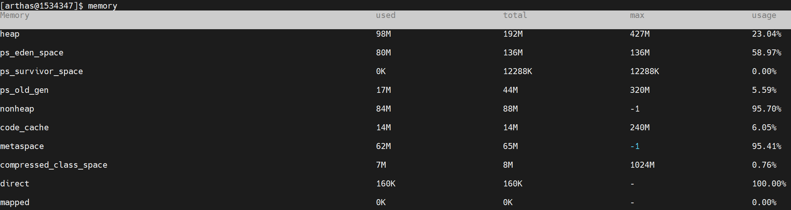

### 08. 类操作命令 - sc/sm/jad命令

sc/sm/jad命令

### 09. sc命令

sc命令，用于查找类，这方便检查是否存在此类。

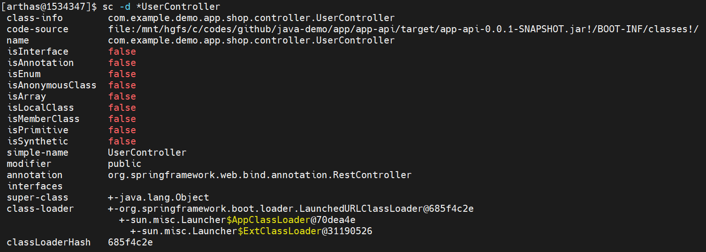

从code-source列可看出类加载自哪里，常用于排查jar包冲突问题。

### 10. sm命令

sm命令用于查找类中的方法。

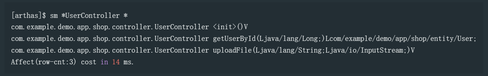

### 11. jad命令

jad命令用于反编译类，常用于确认代码是否最新版本，以及线上查看代码。

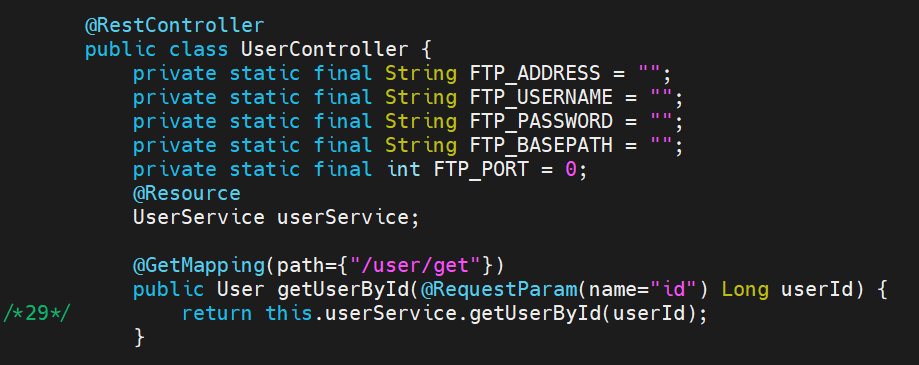

### 12. 方法调用追踪

monitor/watch/trace/stack命令

### 13. monitor命令

monitor命令用于查看方法的整体调用QPS、耗时等，方便对方法执行情况有个整体了解。

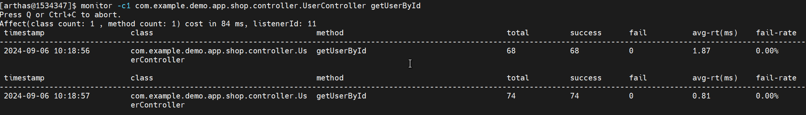

其中-c1表示每秒输出一次，可以看到，qps是70左右，耗时是1ms左右。

### 14. watch命令

watch命令用于查看方法调用时的参数与返回值，如下，观测执行的SQL。

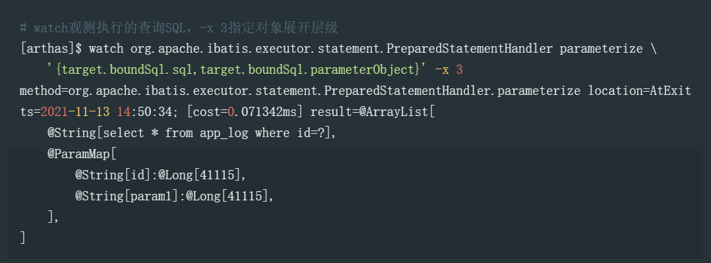

### 15. watch命令（续）

看耗时大于200ms的查询SQL，添加#cost > 200条件即可。

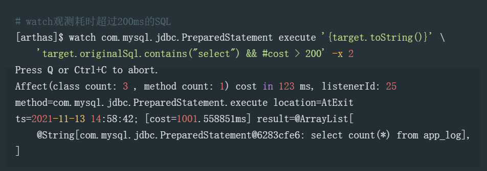

### 16. trace命令

trace命令用于追踪方法耗时，由哪个子方法造成。

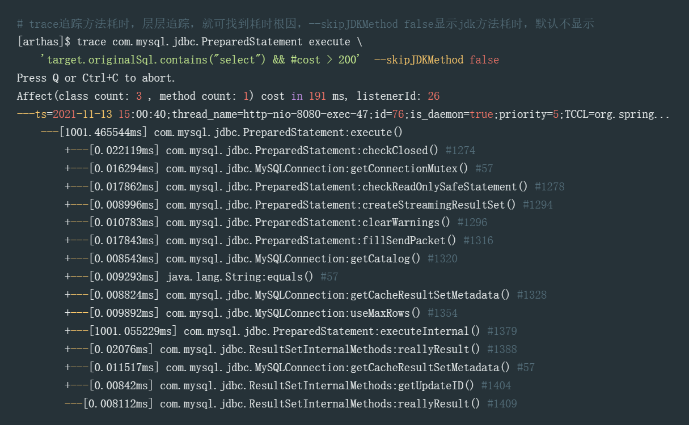

### 17. stack命令

stack命令用于追踪方法的调用栈，找到代码入口。

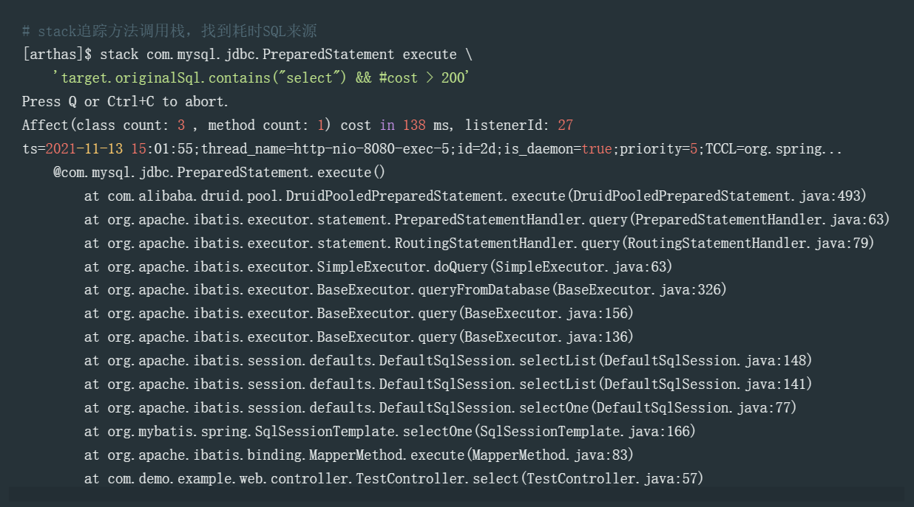

### 18. 函数热点剖析 - profiler命令

profiler命令

### 19. profiler命令-oncpu分析

profiler命令是对java主流剖析工具async-profiler的封装，一般用于剖析函数热点，如oncpu/offcpu分析，火焰图等。

生成oncpu火焰图，如下：

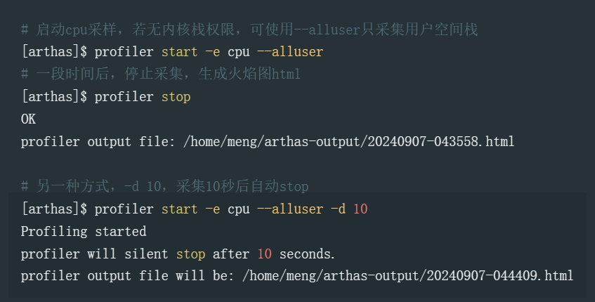

### 20. profiler命令-oncpu分析（续）

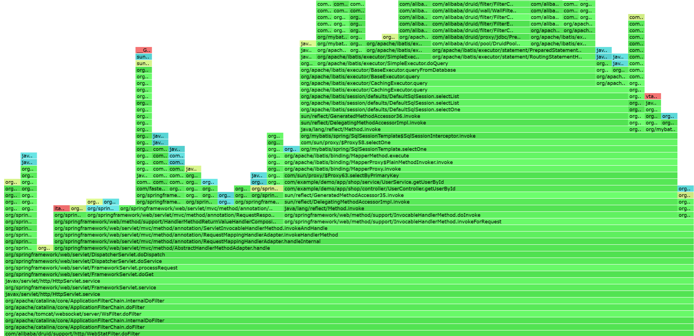

### 21. profiler命令-offcpu分析

profiler的wall采集模式，可以做offcpu分析，wall表示wall clock(墙上挂钟)的含义，这种采集模式将每隔一段时间，采集所有线程调用栈保存下来，然后在stop时生成火焰图。
这种模式适合排查高耗时问题，试想一下，当一段代码执行很慢时，那么多次采集线程栈时，慢调用栈采集数量一定会更多，体现在火焰图上就更宽。

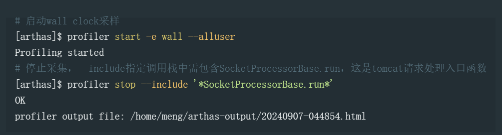

由于wall采集模式，会采集所有线程栈，但一般线程池中大量线程都是等待任务的状态，故wall采集模式一般要过滤一下，过滤出与请求处理有关的线程栈。

### 22. profiler命令-offcpu分析（续）

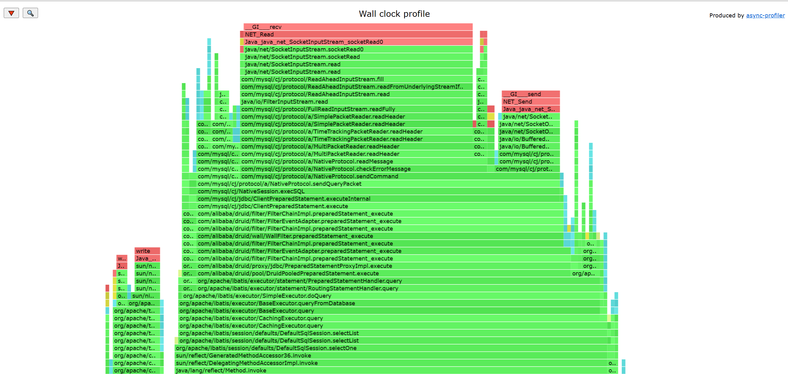

### 23. profiler命令-case by c

profiler支持将采集数据保存为jfr格式，这适合需要做case by case分析的场景，如请求偶尔慢一下这种问题，常用于优化p99长耗时。
常规的html格式是火焰图，火焰图本质上是对栈的统计分析，相同栈会折叠，故火焰图一般适合分析整体情况，而不是单个case。

### 24. profiler命令-case by c（续）

由于profiler并不适合单次执行太长时间，对于一些非常偶现的case，比如1天才出现一次，可以使用shell脚本来循环采集，直到case出现后，停止脚本即可。

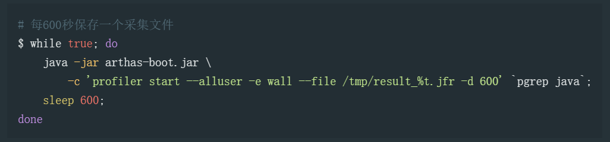

jfr文件可以通过jmc工具来分析。

### 25. profiler命令-case by c（续）

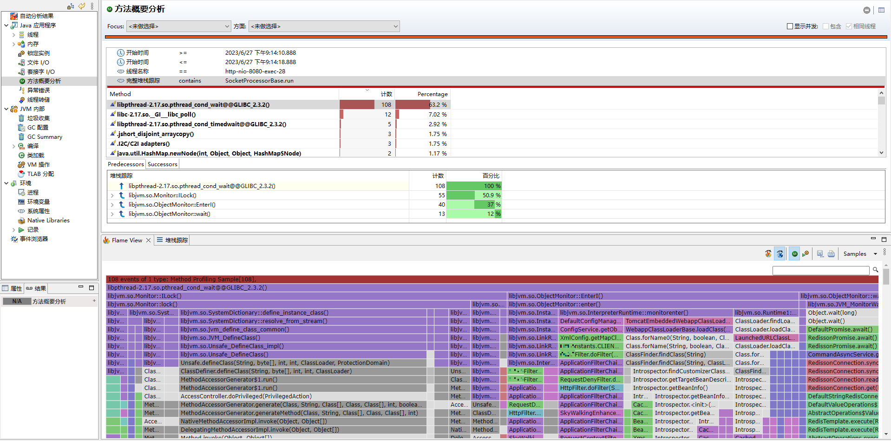

比如通过日志系统发现，http-nio-8080-exec-28线程在21:14:10到21:14:18时间段是一次耗时近8s的慢调用，使用jmc打开jfr，在jmc中找到此线程此时段的调用栈，如下：

### 26. profiler命令-采集native方

profiler还可以采集native方法的调用栈，如libc里面的malloc方法，这常用于分析jvm堆外内存分配问题。

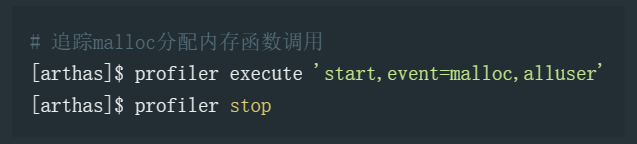

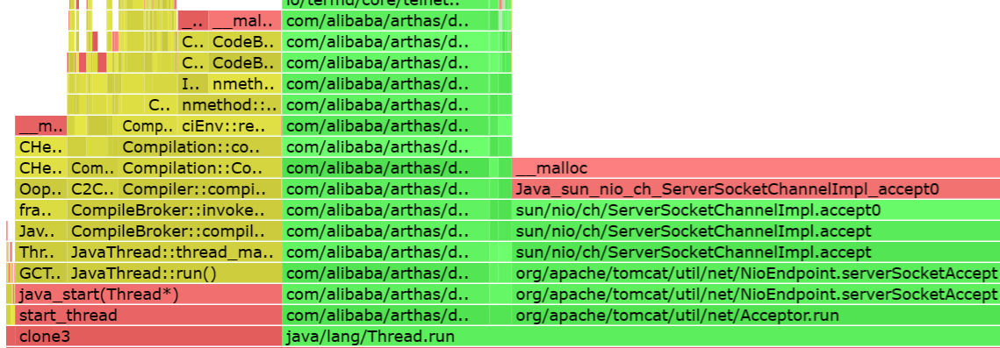

### 27. profiler命令

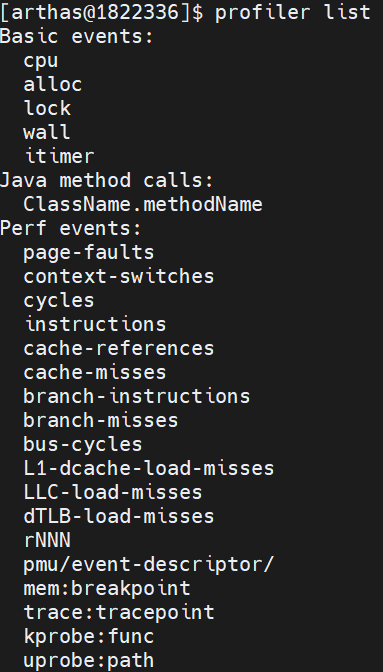

profiler还可以剖析一些其它事件，如堆内存分配、lock等，还可以采集一些perf_events支持的事件，这可以通过profiler list查看，如下：

### 28. 查看或管理java对象

vmtool/mbean/logger/getstatic/ognl命令

### 29. vmtool命令

vmtool命令通过JVMTI技术，以实现java对象查询、GC等操作。

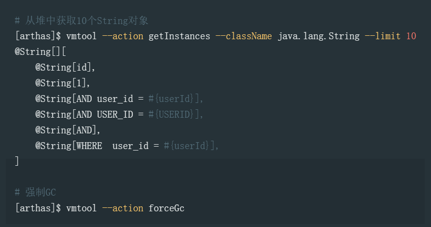

### 30. vmtool命令（续）

基于vmtool查询对象功能，可以方便的获取一些软件资源(如线程池、连接池)的使用情况。

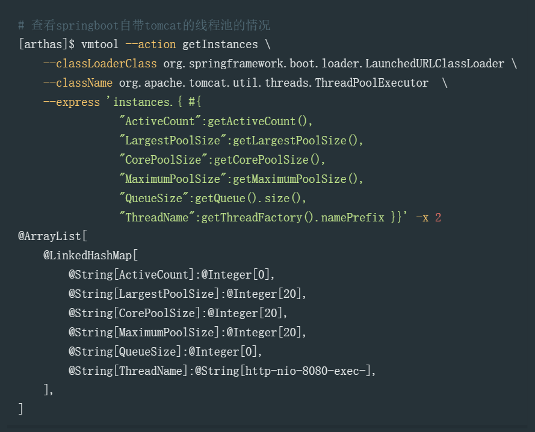

tomcat线程池使用情况，instances表示查到的对象列表

### 31. vmtool命令 - Druid连接池使用情况

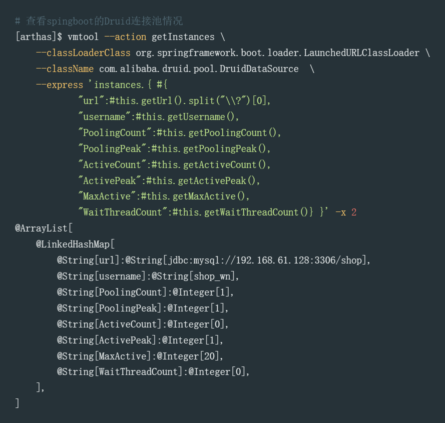

Druid连接池使用情况

### 32. vmtool命令

查看apache的httpClient连接池情况，如下：

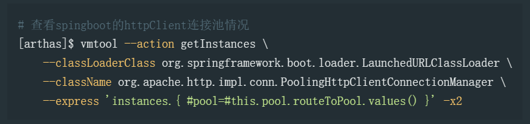

### 33. mbean命令

java的一些组件，可能会将其内部状态暴露成mbean，以方便对其做jmx监控，如Druid连接池。
mbean命令则可以查看这些组件的信息，如下：

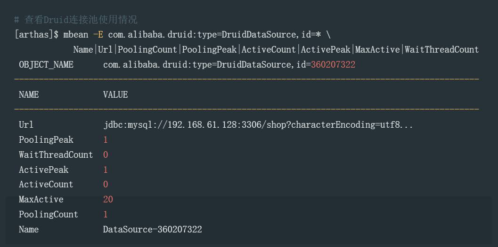

### 34. logger命令

logger命令可以查看logger，以及设置logger级别，如下：

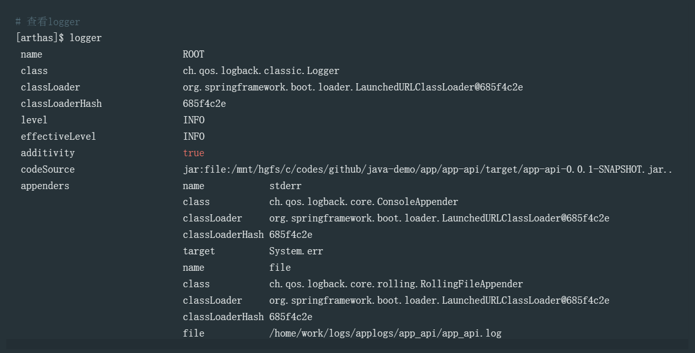

### 35. logger命令（续）

logger命令可以查看logger，以及调整logger级别，如下：

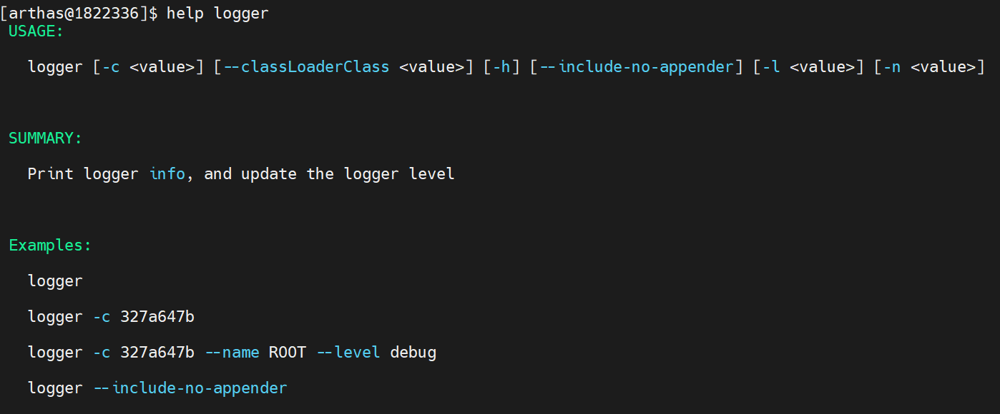

### 36. getstatic命令

getstatic命令用于获取静态变量的值。

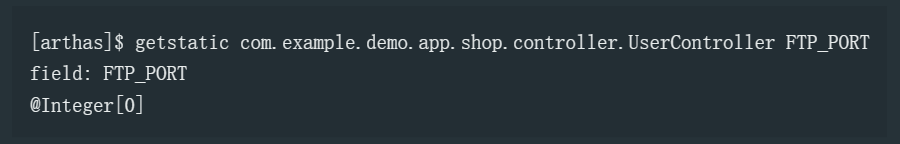

可以看到，FTP_PORT静态变量的值是0。

### 37. ognl命令

ognl命令用于在jvm进程中执行ognl表达式，可用来调用方法、修改变量等。

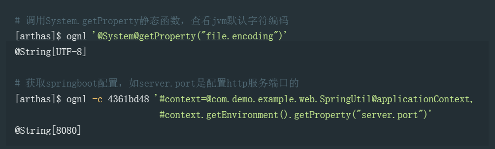

-c指定类加载器，这可以通过classloader -t获取。

### 38. ognl命令（续）

ognl命令用于在jvm进程中执行ognl表达式，可用来调用方法、修改变量等。

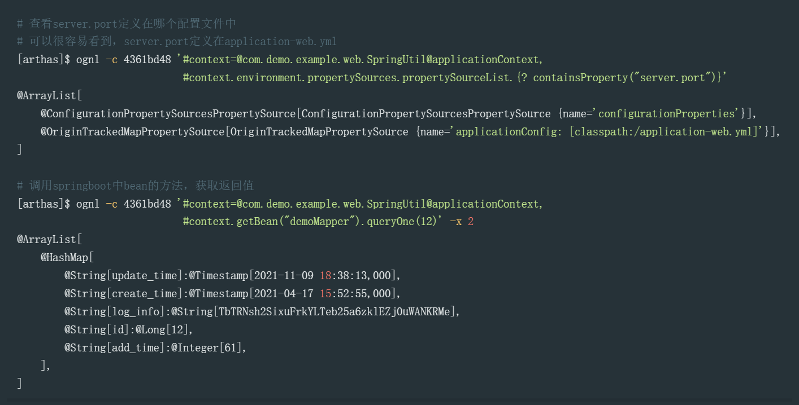

### 39. ognl语法

前面的watch/vmtool/ognl等命令中都是使用的ognl表达式，它是一个对象查询语言，因此了解其常用语法是很有必要的。

| 分类 | 示例 |
| --- | --- |
| 内置变量 | watch/trace/stack命令中内置了params,target,returnObj,throwExp,#cost，分别表示参数,调用对象自身，返回值，异常，执行耗时。 |
| 属性获取 | 通过.user获取对象user属性值，.user.userId获取对象中user属性中的userId属性。 |
| 数组、集合或Map元素获取 | 通过.orders[0]获取数组或集合中第一个元素，通过.userMap["lisi"]获取Map中对应key值 |
| 对象方法调用 | 通过.getUser()可直接调用对象的方法 |
| 静态变量与方法访问 | 静态变量访问@class@member， 静态方法调用@class@method(args) |
| 条件判断 | 数值可使用> >= ==等比较，字符串可直接通过== !=比较，如.name=="zhangsan" |
| 逻辑运算 | 通过&& || !实现条件与或非功能 |

### 40. ognl语法（续）

与java明显不同的是，ognl是用，号分隔语句的，且返回表达式中最后一个对象，如右边表达式，返回6。

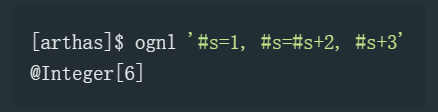

ognl文档：https://commons.apache.org/dormant/commons-ognl/language-guide.html

| 分类 | 示例 |
| --- | --- |
| 数组包含 | 对于数组/List/Set，可以使用in,not in判断元素是否存在，如"zhangsan" in .names |
| 变量赋值 | 当前时间赋值到变量obj，#obj=new java.util.Date(), #obj.toString() |
| List、Map构造 | List构造{"green", "red", "blue"}， Map构造#{"id" : 1, "name" : "lisi", "birthday" : new java.util.Date()} |
| 列表转换 | 提取userList中的birthday，.userList.{birthday.getYear()} .{}迭代子表达式中，可以用#this表示迭代对象 |
| 列表过滤 | 过滤出userList中的id<2的元素，.userList.{? id<2 } |

### 41. jvm信息查看

jvm/sysenv/vmoption/sysprop/perfcounter命令

### 42. jvm命令

jvm命令查看类加载、GC、内存、线程、文件描述符相关信息。

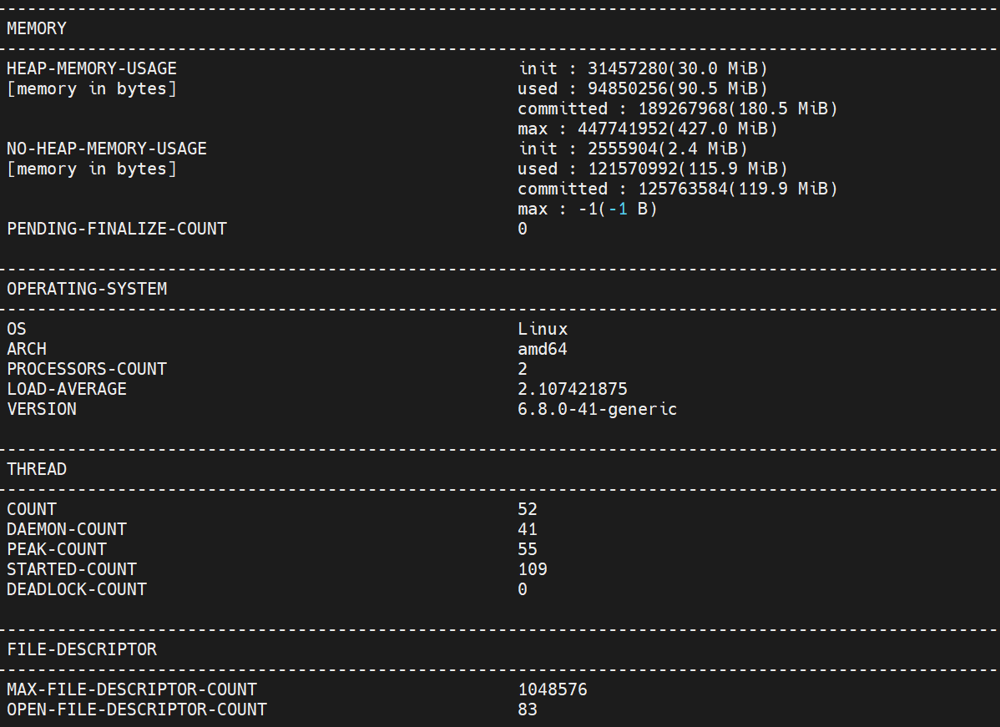

### 43. sysenv/vmoption/sysp

sysenv命令查看环境变量，vmoption查看jvm配置，sysprop查看系统属性。

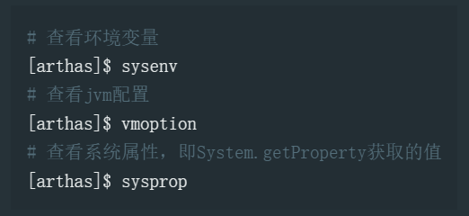

### 44. perfcounter命令

perfcounter命令查看jvm运行中的一些性能指标数据。

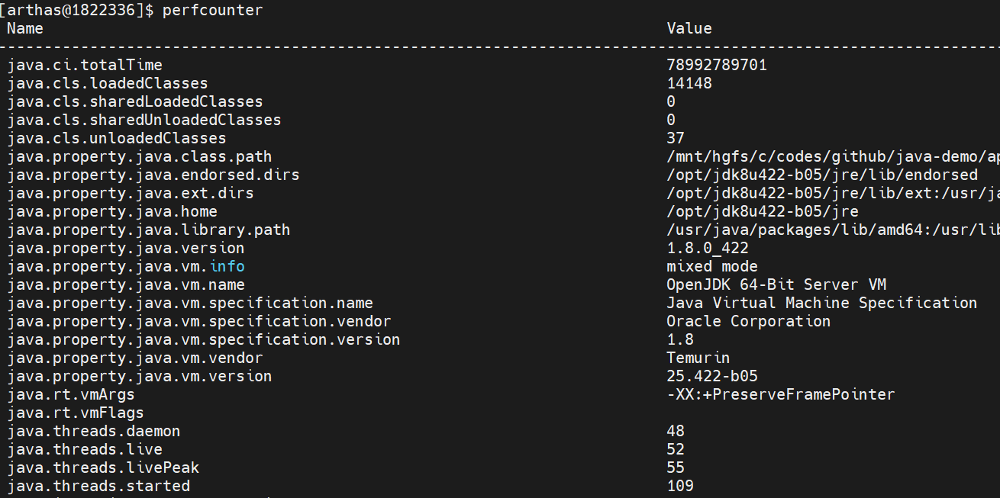

### 45. arthas有非常多的子命令

arthas有非常多的子命令，是诊断java问题的常用工具，总结如下：
- dashboard/thread/memory命令：
常用于排查高cpu、高内存占用问题。
- sc/sm/jad命令：
用于查找类，常用于检查线上代码、jar包冲突类问题。
- monitor/watch/trace/stack命令：
用于追踪具体方法的调用情况。
- profiler命令：
用于做oncpu/offcpu分析，也可采集native函数调用，以及case by case分析场景。
- vmtool/mbean/logger/getstatic/ognl命令：
用于查看或管理java对象，甚至触发方法执行。
- jvm/sysenv/vmoption/sysprop/perfcounter命令：
用于查看jvm相关信息。

## 12. CPU占用高分析

### 01. 高CPU占用分析

### 02. 资源占用高分析思路

### 03. 分析视角

资源分析视角
自底向上分析，逐步细分资源占用，找到问题根因，如CPU高问题，如下：
- 用户态还是内核态高？
- 什么进程占用CPU多？
- 什么线程占用CPU多？
- 什么调用栈占用CPU多？
- 什么请求占用CPU多？

资源占用高适合使用自底向上的资源视角来分析。

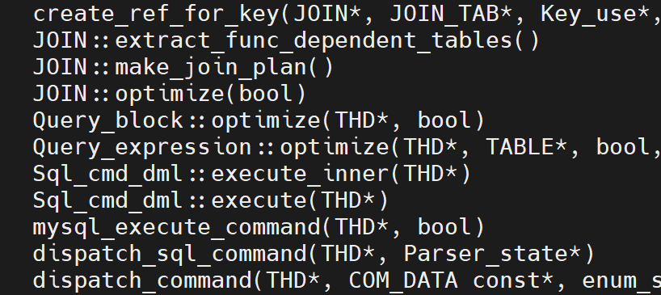

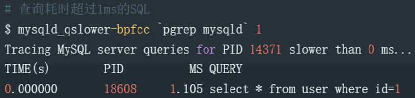

关键词：调用栈、请求数据、内核线程、flush线程、gc、线程、业务、sql、中断、系统调用、mysql进程、java进程、用户态、系统态、操作系统、内存、CPU、磁盘、网络、硬件资源

### 04. 资源占用高分析思路

资源分析视角
- 用户态还是内核态高？
- 什么进程占用CPU多？
- 什么线程占用CPU多？
- 什么调用栈占用CPU多？
- 什么请求占用CPU多？

- 对于业务系统，一般找到了具体的调用栈，问题就排查出来了，但对于类似mysql、nginx这样的系统，由于各种请求的调用栈大致相同，因此还需要深入排查到是什么请求数据(SQL、URL)占用资源多。
- 也可以直接一步细分到调用栈，比如perf、bcc等内核级工具，它采集的调用栈，即包含用户进程的，也包含内核态的中断处理与内核线程的。

### 05. CPU使用率解释

### 06. CPU使用率解释（续）

各种CPU使用率
us：非niced进程花费的cpu时间占比
sy：内核进程花费的cpu时间占比
ni：niced进程花费的cpu时间占比
id：内核空闲进程花费的cpu时间占比
wa：等待磁盘io完成花费的cpu时间占比
hi：处理硬件中断花费的cpu时间占比
si：处理软件中断花费的cpu时间占比
st：被其它虚拟机偷取的cpu时间占比

### 07. CPU使用率解释 - 用户态

用户态CPU使用率解释：
us：非niced进程花费的cpu时间占比
ni：niced进程花费的cpu时间占比

Linux进程的优先级：
初始优先级(NI列)：表示进程的初始优先级，值越小优先级越高，可通过renice调整。
当前优先级(PR列)：表示进程的当前优先级，默认PR=NI+20，但如果Linux调度器觉得有必要，也可能会动态调整进程的当前优先级。

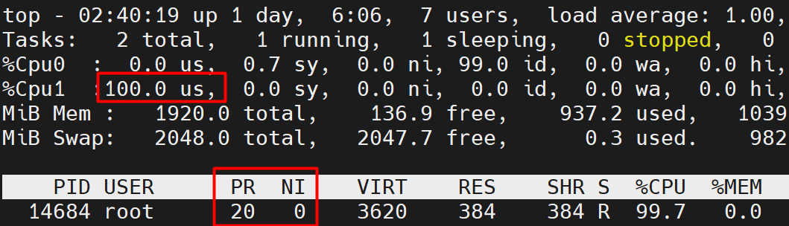

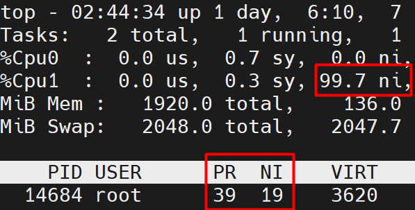

### 08. CPU使用率解释 - 内核态

系统调用：
是操作系统提供给用户空间程序的一种接口，允许程序请求操作系统的服务，比如访问磁盘(open/read/write)、网络(socket/recvfrom/sendto)等，内核收到系统调用请求后，会先切换到内核态，然后执行相应处理逻辑。
中断：
是指计算机系统在执行程序的过程中，由于某些紧急事件或外部设备的请求，暂时中止当前程序的执行，转而去处理更为紧急的任务。处理完这个紧急任务后，计算机系统会返回到被中断的地方，继续执行原来的程序，比如磁盘中断、网络中断。
在Linux中，中断分为2个部分处理，硬中断与软中断，
- 硬中断：由硬件直接触发，由于硬中断执行过程中一般需要禁用中断后再处理，因此硬中断需要能快速执行完以避免其它中断信号丢失。
- 软中断：为了尽可能快执行完硬中断，减少禁用中断时间，Linux设计了出现了软中断，用于处理中断中可以延迟处理的部分。

### 09. CPU使用率解释 - 内核态（续）

内核线程：
Linux内核管理着一批内核线程，用来执行一些特定的任务，如kswapd处理内存回收、ksoftirqd处理软中断等。

其实可以将Linux内核看成一个服务器，这个服务器主要接收两种类型的请求，一个是系统调用，一个是中断，然后运行着一些异步任务，即内核线程。

### 10. CPU使用率解释 - 内核态（续）

内核态CPU使用率解释：
sy：内核态花费的cpu时间占比，一般由系统调用、缺页异常、内核线程占用。
hi：处理硬中断花费的cpu时间占比
si：处理软中断花费的cpu时间占比
st：被其它虚拟机偷取的cpu时间占比

注：实际上，hi、si、st也是内核态CPU占用，只是由于这三个比较典型，Linux将它们单独列出来了。

### 11. CPU使用率解释 - 空闲

空闲CPU使用率解释：
id：空闲时花费的cpu时间占比(不包含wa)
wa：等待磁盘io完成花费的cpu时间占比

id与wa实际都是空闲CPU使用率，区别是当CPU空闲时，是否有正在等待磁盘io的线程存在，若存在，这部分时间单独记到wa中。
因此，Linux设计wa指标，就是为了方便判断，当CPU空闲较多时，是否是磁盘阻塞导致的。

### 12. CPU使用率解释 - 小结

通过top命令，就可以识别出是进程占用高(用户态)，还是内核态占用高！

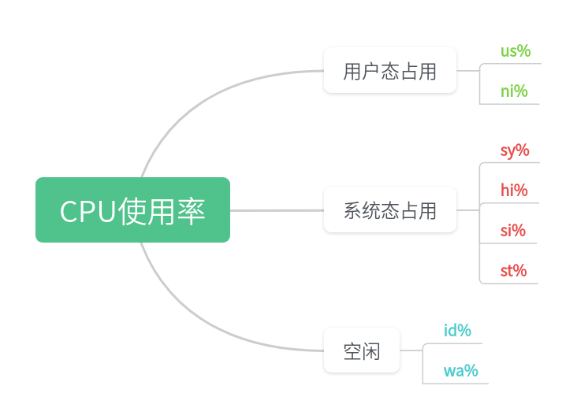

### 13. 进程CPU高分析

### 14. 进程CPU使用率高

什么进程占用高？
什么线程占用高？
哪个调用栈占用高？
哪个请求数据占用高？
以java为例，排查进程导致的CPU使用率高，如下：

用top即可发现什么进程占用高，如下：

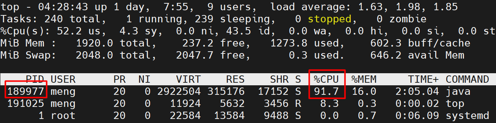

发现是189977进程占用高！

### 15. 进程CPU使用率高（续）

什么进程占用高？
什么线程占用高？
哪个调用栈占用高？
哪个请求数据占用高？
用top -H -p 189977即可发现什么线程占用高，如下：

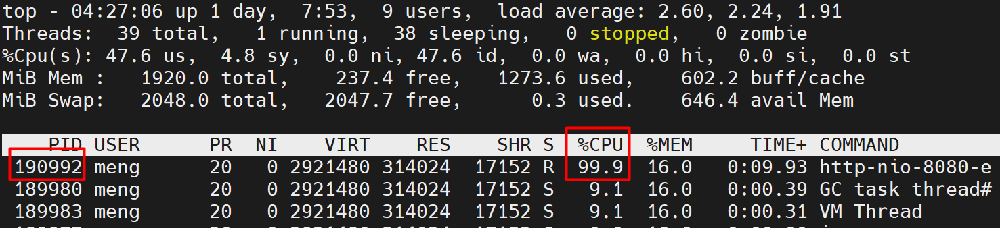

发现是190992线程占用高！

### 16. 进程CPU使用率高（续）

什么进程占用高？
什么线程占用高？
哪个调用栈占用高？
哪个请求数据占用高？
用jstack获取所有线程栈，用awk过滤出高cpu的线程栈，如下：

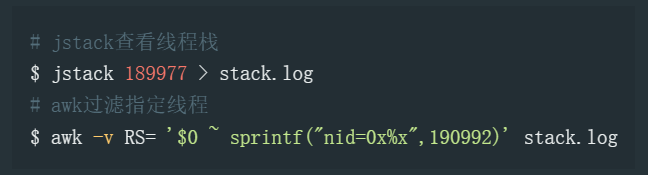

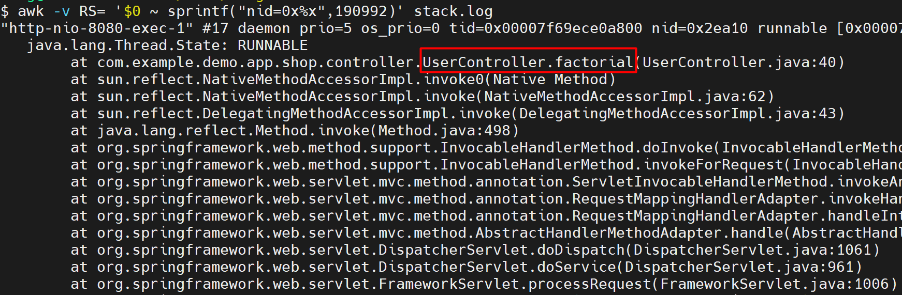

### 17. 进程CPU使用率高（续）

什么进程占用高？
什么线程占用高？
哪个调用栈占用高？
哪个请求数据占用高？
可用发现我们找线程与找调用栈是分两步进行的，这里场景是我故意构造了一个100w次的超大循环，请求需要执行好长时间，导致我们能找到问题代码。
但如果是那种有点慢，但又不是特别慢的代码，比如循环2w次只需要280ms这种，由于手速来不及，当我们做完找线程后，再做找调用栈时，会发现问题代码早已执行完了，这样会导致获取的线程栈不准确。
这种情况，可以使用arthas的thread -n命令，它将两步合并起来，使得线程栈尽量准确。

### 18. 进程CPU使用率高（续）

arthas的thread -n 4，表示获取CPU占用前4个线程的调用栈。

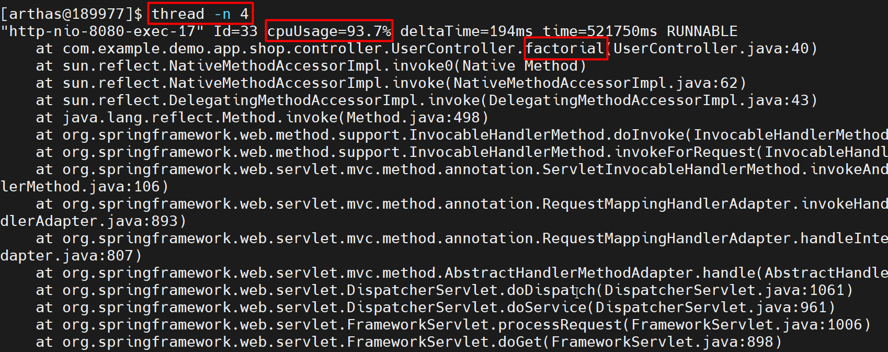

### 19. 进程CPU使用率高 - java火焰图

通过arthas的profiler火焰图，也可以跳过找线程，一步到位到具体调用栈，它一般适合于做性能优化。

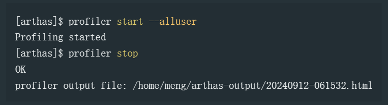

### 20. 进程CPU使用率高 - java火焰图（续）

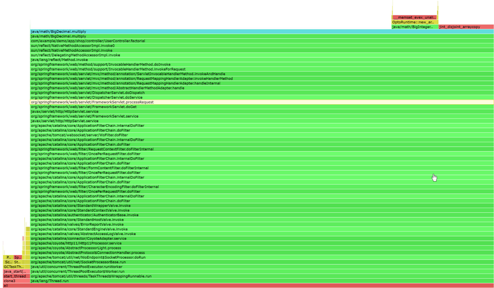

### 21. 进程CPU使用率高 - java火焰图（续）

arthas的profiler命令，定时从CPU的栈寄存器出发，采集正在CPU上运行的线程栈，可以想像，越占用CPU的调用栈，一定被采集到的次数越多，如右图就是采集的线程栈统计数据。

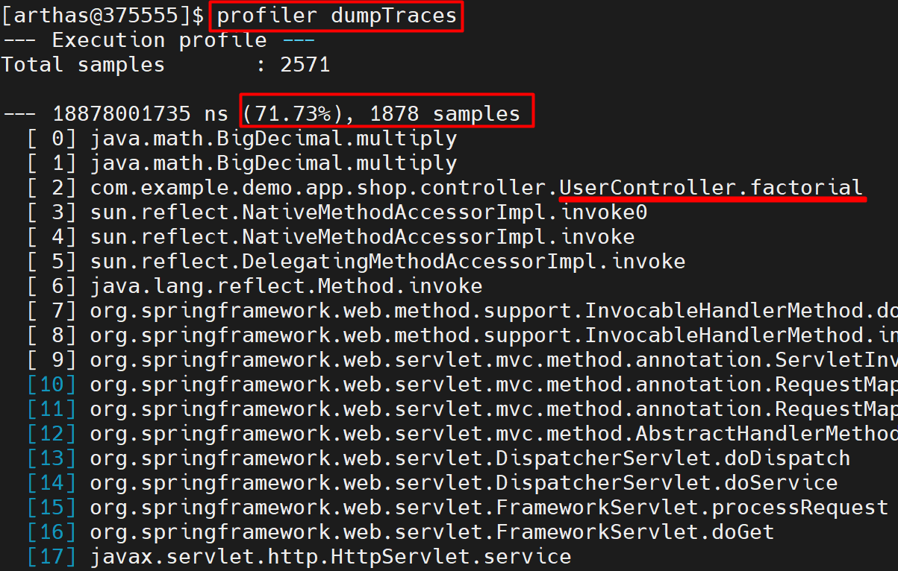

可以发现，直接看栈统计，数据量大，且非常的不直观，因此就有了火焰图，在火焰图中表现得越宽的栈，它执行得越慢，需要重点关注。

### 22. 进程CPU使用率高 - 非java进程

arthas是用于java的，对于非java进程，可以使用perf record或bcc中的profile命令，以perf举例，如下：

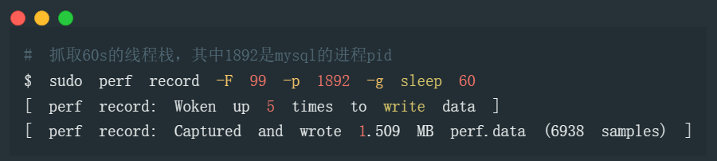

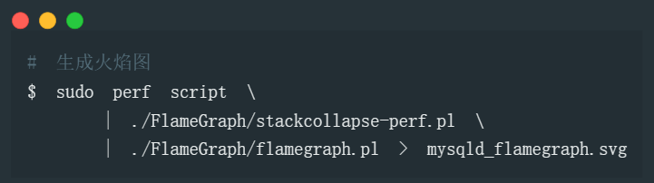

FlameGraph下载地址：https://github.com/brendangregg/FlameGraph

### 23. 进程CPU使用率高 - 非java进程（续）

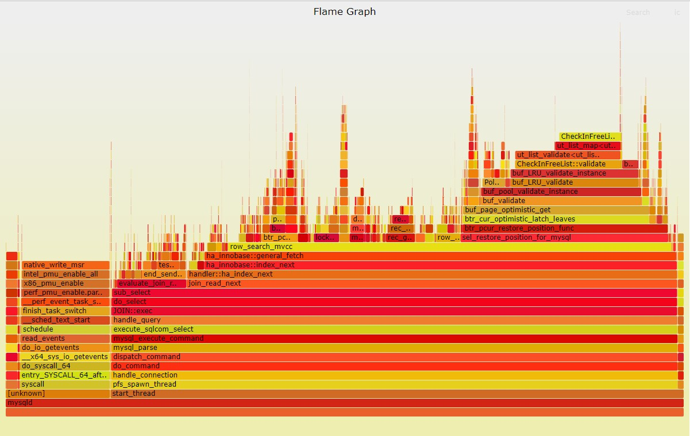

### 24. 进程CPU使用率高

什么进程占用高？
什么线程占用高？
哪个调用栈占用高？
哪个请求数据占用高？
可以从mysql火焰图看到，row_search_mvcc函数栈挺宽的，从网上搜索得知，此函数用于扫描SQL的行数据，因此从调用栈上看不出具体问题，还要将函数调用再一次细分到SQL上。
当然，对于MySQL，我们可以去查看慢查询日志，大概率可以找到问题SQL，但对于一些扫描了几万数据但单个执行起来不慢的SQL，慢查询日志可能会漏记，但这种SQL量大时，也会导致CPU高。
因此，我们有时要做最后一步，找出哪个请求数据占用CPU高，这一般需要用到函数追踪工具，如bpftrace。

### 25. bpftrace实例

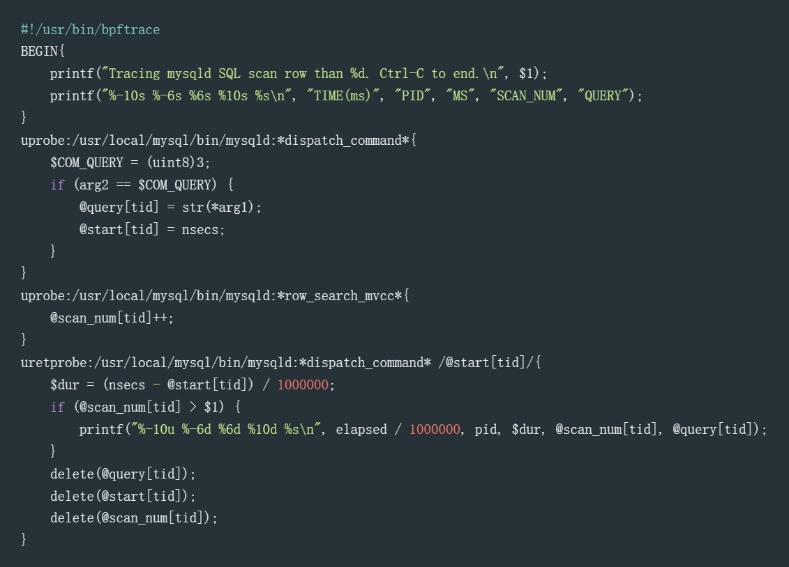

### 26. bpftrace实例（续）

脚本执行效果，如下，可以发现，只要扫描行数变大，耗时就会变长。

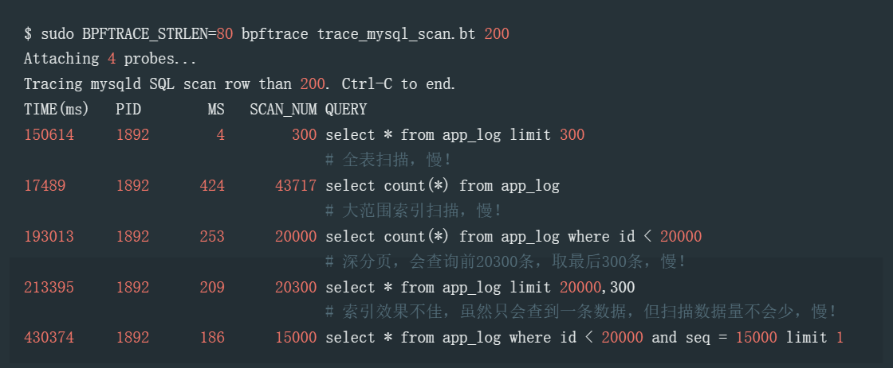

注：id列是主键，seq列没有索引。

### 27. 系统态CPU高分析

### 28. 系统态CPU使用率高 - 系统调用

内核线程
中断
系统调用
系统态
系统态CPU占用，大致由系统调用、中断、内核线程这3个部分组成。

系统调用：
由于系统调用由用户进程触发，可通过bcc的syscount命令检查系统调用情况，以及哪些进程系统调用较多。

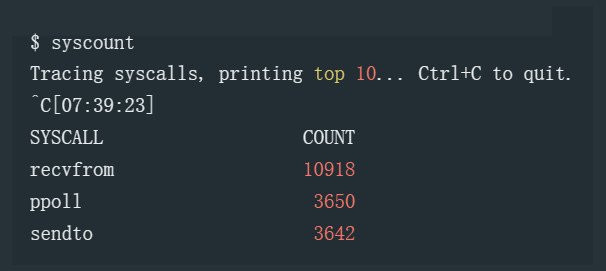

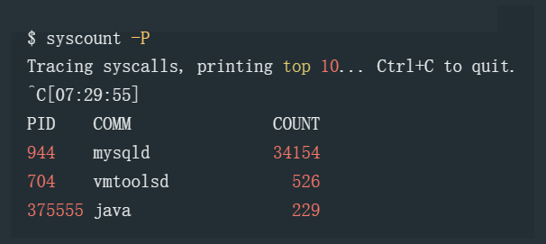

可以看到，mysqld的系统调用最多。

### 29. 系统态CPU使用率高 - 中断

中断占用CPU情况，可以通过top的hi与si确认。

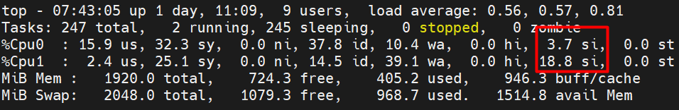

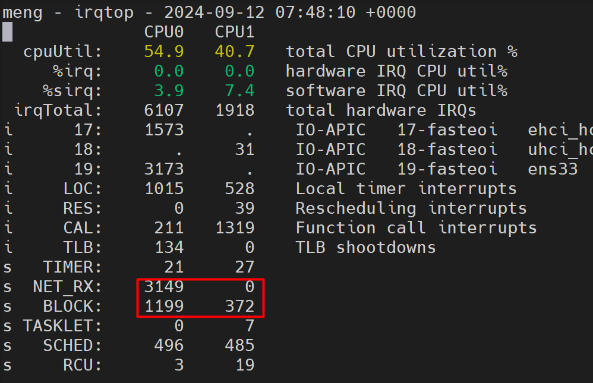

具体是什么中断占用高，可以查看/proc/interrupts(硬中断)或/proc/softirqs(软中断)文件，用watch命令找出哪些中断次数增长最快。
或使用irqtop命令，它解析了上面两个文件数据，可看出，软中断CPU占用主要由磁盘与网络引起。

### 30. 系统态CPU使用率高 - 中断（续）

中断也可以使用bcc工具hardirqs(硬中断)和softirqs(软中断)来诊断。

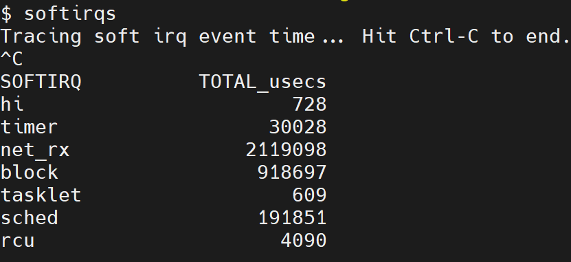

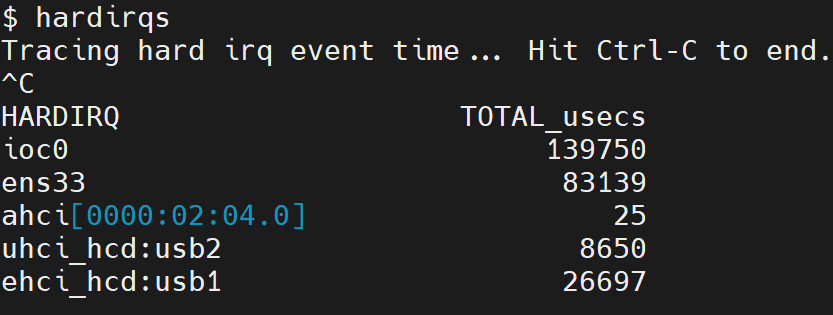

### 31. 系统态CPU使用率高 - 内核线程

内核线程的CPU使用率，可以通过pidstat的%system来确认，内核线程一般以k开头。

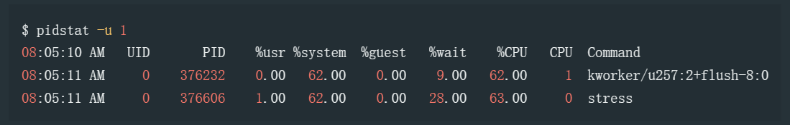

其中，kworker/u257:0+flush-8:0就是一个内核线程，用于将文件系统脏页保存到磁盘。

### 32. 系统态CPU使用率高

内核线程占用%system
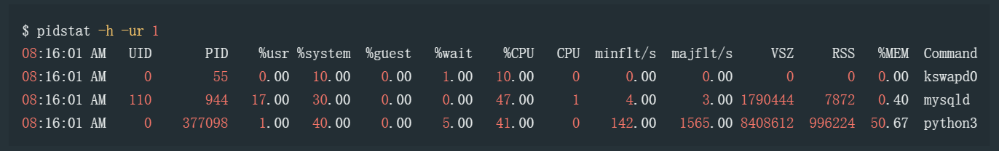

缺页异常占用%system
系统调用占用%system
其实pidstat的%system，大多来自系统调用、缺页异常、内核线程这3个方面，而缺页中断通过-r选项可以看到。

### 33. 系统态CPU使用率高 - 火焰图

也可以用perf record或bcc的profile，直接采集整个系统的调用栈，绘制一张oncpu火焰图，以查看系统态CPU占用在哪。

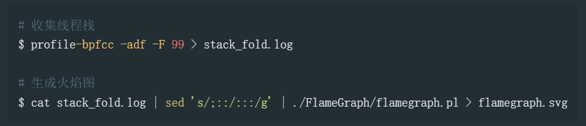

### 34. 系统态CPU使用率高 - 火焰图 - 系统调用

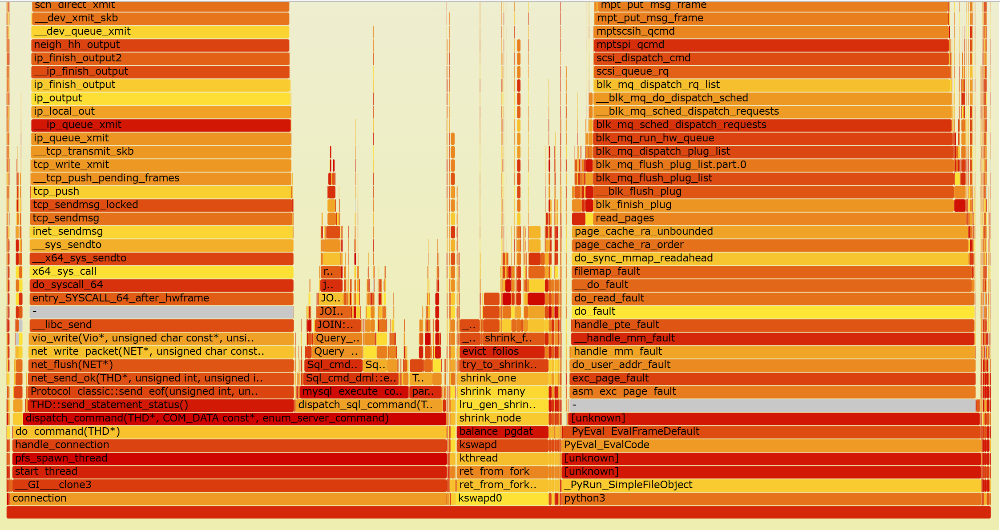

系统调用
缺页中断
内核线程

### 35. 空闲CPU高分析

### 36. 空闲CPU使用率高

情况1：id%使用率高
这种是空闲CPU使用率，有两种可能：
- 系统负载不大，可能是没有业务流量，或由于网络丢包导致流量未进系统，如tcp连接队列或socket接收缓存配置过小，导致丢包。
- 线程都被阻塞住了，无线程占用CPU资源，这时请求的耗时会明显增大，这种问题的诊断会在《耗时高分析》那一篇再讲。
情况2：wa%使用率高
这种也是空闲CPU使用率，有两种可能：
- 线程阻塞在磁盘访问上，一般需要检查磁盘性能指标，可以用iostat或ioping命令，检查磁盘是否有明显的性能退化。
- 使用了NFS之类的网络存储，由于网络较慢，wa%高可能也是正常的。

### 37. CPU调优

### 38. CPU调优 - 调优工具

CPU相关的Linux调优项，如下：

| 调优参数 | 作用 |
| --- | --- |
| echo off > /sys/devices/system/cpu/smt/control echo on > /sys/devices/system/cpu/smt/control | 关闭或开启超线程 查看超线程状态， cat /sys/devices/system/cpu/smt/active，1表示已开启 |
| cpupower | 调整CPU能耗状态 |
| taskset -pc 1-2 13333 | 进程绑核，这样可以提升CPU缓存的命中率，进而提升IPC(每周期指令数)，进而提升性能。 |
| renice | 调整进程的优先级 |
| irqbalance | 将中断均衡到各CPU上。 |

### 39. CPU调优 - JVM JIT

JVM JIT将Java字节码即时编译成可直接执行的二进制指令，以加快代码执行，因此可通过调优JIT JVM参数，实现CPU优化，如下：

| 调优参数 | 作用 |
| --- | --- |
| -XX:+TieredCompilation | 启用分层编译(JDK8+默认开启)，启动时用C1编译器，热点代码用C2编译器。 |
| -XX:InitialCodeCacheSize -XX:ReservedCodeCacheSize | JIT编译的代码放在code cache中，满时会关闭JIT编译，故可视情况调整大小。 |
| -XX:+UseCodeCacheFlushing | code cache满关闭JIT编译前，是否回收code cache |
| -XX:CICompilerCount | 编译线程数，CPU核充足时，可考虑增大 |
| -XX:+PreserveFramePointer | 保留帧指针（frame pointer），以便perf、bcc可遍历调用栈。 |

### 40. CPU调优 - 代码优化

优化进程的CPU占用，本质上还是需要调整代码，使用更低时间复杂度的算法。
算法优化，不一定非要手动创建新算法，比如：
- 合适数据结构，将List.contains优化为HashMap.containsKey，实际就从O(n)优化到了O(1)，指定List初始大小等。
- 使用缓存，缓存计算结果，避免重复计算。
- 正则优化，如id:.*,name:.*优化为id:[^,]*,name:[^,]*就可以减少正则的回溯次数。
- 计算优化，如long替代BigDecimal，使用高性能序列化库，使用零拷贝，使用SIMD指令等。
- SQL优化，将全表扫描优化为索引扫描，本质上就是从穷举算法优化成了树搜索算法。
- 提升CPU缓存命中率，使用数组或ArrayList，相比LinkedList，对CPU缓存更友好。

### 41. 总结

### 42. 资源占用高问题

- 资源占用高问题，适合使用自下而上的资源分析视角，逐步细化资源使用。
- 高CPU占用分析，用户态还是内核态？可通过top命令确认。
- 若是用户态，可进一步通过top查看进程及线程的CPU占用，通过arthas的thread -n或profiler可细化到调用栈，若有需要，可通过bpftrace进一步细化到请求数据(如SQL)
- 若是内核态，可进一步细化为是系统调用、中断还是内核线程占用导致，可通过bcc或pidstat做判断，也可直接绘制一张整体系统的火焰图。
- 若是空闲，则一般是系统流量过小，或线程被长时间阻塞了导致的。

## 13. 内存占用高分析

### 01. 高内存占用分析

### 02. Linux物理内存划分

### 03. Linux内存划分 - node划分

关键词：node0、node1、操作系统、内存、CPU、磁盘、网络、硬件资源
现在多CPU机器(非单CPU多核)一般是NUMA架构，如下，每一组CPU都有自己配套的内存，当CPU访问自己本地内存时速度较快，而访问其它CPU的内存，则速度较慢。

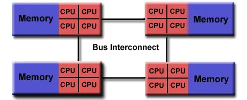

每一组CPU+内存被称为一个节点node，因此，Linux上内存首先按照node划分。

### 04. Linux内存划分 - zone划分

关键词：DMA32、DMA、Normal、node0、操作系统、内存、CPU、磁盘、网络、硬件资源
每个Node，又会划分为多个Zone(区域)。
- DMA：地址段最低的一块内存区域，供IO设备DMA访问。
- DMA32：用于支持32位地址总线的DMA设备，64位系统里才有效。
- NORMAL：DMA与DMA32之外的内存，全部在NORMAL中。

Linux中，zone划分情况可通过/proc/zoneinfo查看。

### 05. Linux内存划分 - 分页

关键词：dirty、空闲、anon、file、DMA、Normal、DMA32、node0、操作系统、内存、CPU、磁盘、网络、硬件资源
最后，Linux将区域中的内存划分成各种类型的页面管理，俗称分页(page)，页面之间通过多种链表连接。
- 空闲页面(free)：未分配出去的页面。
- 匿名页面(anon)：已分配出去的内存页面，无关联文件，若开启了swap，内存不足时可swapout以释放。
- 文件页面(file)：已分配的文件关联的内存页面，比如文件缓存Cache与块缓存Buffers，如果页面被修改，称为脏(dirty)页面。

Linux中，各个页面情况，也可通过/proc/pagetypeinfo查看，/proc/meminfo则是各个区域的汇总。

### 06. Linux内存划分 - Buffer与Cache

关键词：Cache、Buffer、空闲、anon、file、DMA、Normal、DMA32、node0、操作系统、内存、CPU、磁盘、网络、硬件资源
Linux中有两种类型的磁盘数据缓存，文件缓存Cache与块缓存Buffer。
- 文件缓存Cache：用于缓存文件数据的内存页面。
- 块缓存Buffer：用于直接缓存块设备(磁盘)数据的内存页面。
例如文件系统的超级块、inode索引块等，都是辅助文件存储的元数据，不属于文件数据，故不在文件缓存Cache中，单独计入块缓存Buffer中。

网上有一种说法，Buffer是写缓冲，Cache是读缓存，这是说法是错误的，Buffer与Cache都涵盖了读和写操作。

### 07. Linux内存划分 - slab

关键词：Cache、Buffer、obj、slab、空闲、anon、file、DMA、Normal、DMA32、node0、操作系统、内存、CPU、磁盘、网络、硬件资源
slab是Linux基于对象的一种内存分配机制，类似于对象池的概念，当Linux需要一个内核对象时，如果slab(对象池)中有，就可以直接获取对象，而不用申请内存块。

Linux中，slab占用情况可通过/proc/slabinfo或slabtop查看，有些slab可回收，有些不能回收。

### 08. free内存指标解释

关键词：Cache、Buffer、obj、slab、空闲、anon、file、DMA、Normal、DMA32、node0、操作系统、内存、CPU、磁盘、网络、硬件资源
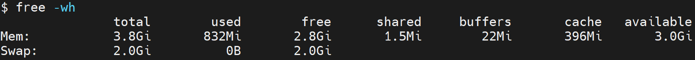

Mem行：
total：总内存大小
used：使用中的anon内存大小
free：空闲内存大小
shared：共享使用的内存大小
buffers：用于块设备缓存Buffer的内存大小
cache：用于文件缓存Cache与slab的内存大小
available：可用内存大小，约等于free+buffers+cache
Swap行：
total：总swap文件大小
used：swap使用大小，anon页swapout
free：swap空闲大小

### 09. Linux虚拟内存划分

### 10. Linux虚拟内存划分（续）

Linux为隔离各个进程的内存空间，实现了虚拟内存机制，使得每个进程都有单独的虚拟内存空间，同时，为了方便管理，将虚拟内存空间划分成了多个区域(段)。

虚拟内存区域划分：
栈(Stack)：存储线程运行的栈数据，向下生长。
内存映射段：提供给进程mmap动态申请内存的区域。
堆(Heap)：进程堆内存区域，通过brk向上扩展大小。
数据段(.data)：存储C等程序中的常量等。
代码段(.text)：存储C等程序中的程序指令。

### 11. Linux虚拟内存划分（续）

通过pmap命令，就可以查看进程的虚拟内存布局，它的输出样例如下：

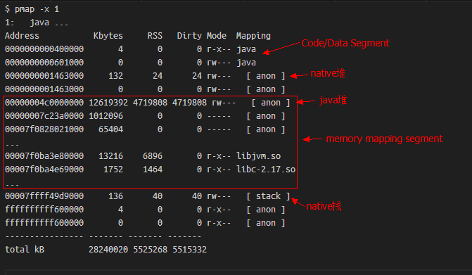

各字段含义解释：
Address：表示此内存段的起始地址。
Kbytes：表示此虚拟内存段的大小。
RSS：表示此内存段被读写时Linux实际分配的物理内存大小。
Dirty：此内存段中被修改过的脏内存大小。
Mode：内存段是否可读(r)可写(w)可执行(x)
Mapping：内存段映射的文件，匿名内存段显示为anon，非匿名内存段显示文件名(加-p可显示全路径)。

### 12. Java内存区域划分

### 13. Java内存区域划分（续）

关键词：Java进程、Java非堆、native分配、Java堆、Thread、Meta、Space、Code Cache、JNI malloc、Direct ByteBuffer、GC、IO malloc、Mapped ByteBuffer
...

关键词：libc内存分配器、Cached Memory、数据/代码、堆、mmap、栈、内存分配、空闲、anon、file、DMA、Normal、DMA32、node0、操作系统、Slab、Cache、Buffer、内存、CPU、磁盘、网络、硬件资源
Java进程在申请虚拟内存后，又按照自己的虚拟机特性，对申请的虚拟内存又进行了进一步的划分，如右图：
- Java堆区域：
用于Java对象的分配与存储，GC的主战场。
- Java非堆区域：
MetaSpace：元空间，主要用于存储Java类与常量。
Code Cache：JIT编译的代码缓存。
Direct ByteBuffer：Java直接内存机制分配的内存。
Mapped ByteBuffer：Java文件映射机制分配的内存。
Thread：Java线程占用的内存。
GC：Java GC占用的内存。
- native分配：
JNI malloc：使用Java的JNI机制中调用malloc分配的内存。
IO malloc：Java做IO操作时申请的内存。

### 14. Linux内存分配原理

### 15. Linux虚拟内存分配

JVM等原生应用程序调用的malloc、free函数，实际是由基础C库libc提供的，而linux系统则提供了brk、mmap等系统调用来分配虚拟内存，所以libc的malloc、free函数实际是基于这些系统调用实现的。

为减小系统调用开销，libc实现了一个类似内存池的机制，在free函数调用时将内存块缓存起来不归还给linux，缓存达到一定阈值才会实际执行归还内存的系统调用。

由于libc会缓存一定量内存，所以进程占用内存一般比理论上会稍大些。

### 16. Linux物理内存分配 - 缺页中断

关键词：Java进程、数据/代码、堆、mmap、栈、空闲、anon、file、DMA、Normal、DMA32、node0、操作系统、内存、CPU、磁盘、网络、硬件资源
进程通过brk/mmap申请虚拟内存时，Linux并未给其实际分配物理内存，直到进程实际读写虚拟内存块时，会触发Linux的缺页中断机制，为进程分配实际的物理内存页。
minor faults：轻微缺页，缺页中断分配物理内存页面后，不需要从磁盘或swap中加载数据到内存页。
major faults：严重缺页，缺页中断分配物理内存页面后，还需要从磁盘或swap中加载数据到内存页。

缺页中断

### 17. Linux物理内存分配 - 内存回收

缺页中断会在空闲内存页链表中查找可分配的物理内存页，若空闲内存不足，可能会触发Linux的内存回收机制，Linux为空闲内存设置了high、low、min这3个水位，以确定内存回收的时机，如下：
- high水位：安全水位，直接分配内存。
- low水位：当空闲内存低于low时，说明内存开始不足了，分配内存后，会唤醒kswapd内核线程异步回收内存，直到内存回收到high水位。
- min水位：当空闲内存低于min时，说明内存严重不足了，这时会同步等待回收内存完成，然后再分配内存，这种叫direct reclaim。
通过vm.watermark_scale_factor内核参数，可调整内存水位之间的差值，通过grep -E 'pageoutrun|allocstall' /proc/vmstat可观察kswapd和direct reclaim运行次数。

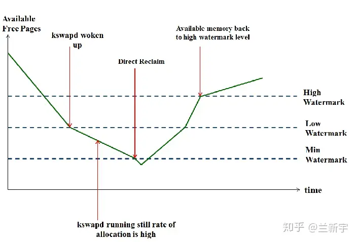

### 18. Linux物理内存分配 - 内存回收（续）

关键词：空闲、anon、file、DMA、Normal、DMA32、node0、操作系统、内存、CPU、磁盘、网络、硬件资源
Linux会根据配置和页面类型，去已分配的页面链表中找到合适的可回收页面，各种页面的回收动作如下：
- anon page：若开启了swap，会将其swap到磁盘后，物理内存页放入到空闲链表。
- file page(clean)：直接回收，然后放入空闲链表。
- file page(dirty)：先将内存数据同步到磁盘后，然后放入空闲链表。
Linux通过vm.swappiness内核配置，决定回收多少anon page和file page，值越大，回收anon page比例越大，swappiness=1表示尽量不回收anon page，swappiness=100时，回收一样多的anon page与file page。

kswaped or direct reclaim

### 19. Linux物理内存分配 - 内存回收（续）

关键词：空闲、anon、file、DMA、Normal、DMA32、node0、操作系统、内存、CPU、磁盘、网络、硬件资源
若内存回收过程中，没有anon page或file page可以回收了，这时会启用OOM Killer来杀进程来释放内存，OOM killer会根据各进程的内存占用情况、进程优先级来对进程打分，找出打分高的bad process来kill。
可通过choom命令来调整进程OOM优先级配置，以避免重要进程被kill。

XX进程
无可回收内存页，kill进程

kswaped or direct reclaim

### 20. Linux物理内存分配 - 内存回收（续）

关键词：内存回收、加载数据、anon page、file page、dirty page
问题：关闭了swap，是否意味着缺页中断不会有磁盘io？
不一定，如果内存分配时，空闲内存不足，这时会触发内存回收，这种情况下，如果回收了脏页(dirty page)，需要先将脏页数据同步到磁盘，然后才能回收。
对于开启swap场景的内存分配，最坏情况可能会有3种磁盘io产生。
- anon page被回收，内存数据swap out到磁盘。
- dirty page被回收，内存数据sync到磁盘。
- 访问虚拟内存页之前被swap out，或是mmap到文件的虚拟内存页，会产生major faults，需要swap in或load磁盘数据到分配的内存页。

关键词：缺页中断、swap out、sync、OOM killer、load、swap in

### 21. 高内存占用分析

### 22. 高内存占用分析（续）

关键词：Java进程、Java非堆、native分配、Java堆、Thread、MetaSpace、Code Cache、JNI malloc、Direct ByteBuffer、GC、IO malloc、Mapped ByteBuffer
...

关键词：libc内存分配器、Cached Memory、数据/代码、堆、mmap、栈、内存分配、空闲、anon、file、DMA、Normal、DMA32、node0、操作系统、Slab、Cache、Buffer、内存、CPU、磁盘、网络、硬件资源
和CPU高分析一样，使用资源分析视角，逐步细分资源占用，找到问题根因，以Java为例，如下：
- 进程占用多，还是内核占用多？
- 什么进程占用内存多？
- Java堆、非堆、native分配、libc缓存哪个区域内存多？
- 什么GcRoot引用对象较多？
- 这些内存分配的调用栈是？

### 23. 高内存占用分析（续）

进程占用多，还是内核占用多？

一般来说，通过top命令就可以大致判断出来是进程占用多，还是内核占用多。
如top中未明显看到占用内存大的进程，也可通过ps命令测算进程内存占用总和，以进一步确认内存占用在进程，还是内核，如下：

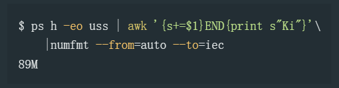

一般来说，内存问题不会是由内核导致的，除非内核或驱动出现Bug，这可考虑使用bcc的memleak命令排查。

### 24. 高内存占用分析 - 找进程 - 哪个进程占用多？

哪个进程占用多？
通过top，然后输入M(Shift + m)按内存倒序，就可以找出内存占用大的进程，如下：

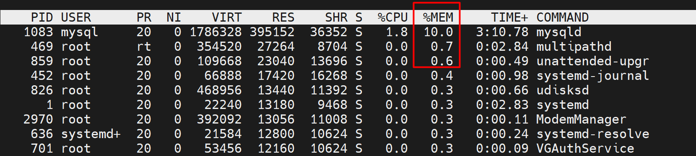

### 25. 高内存占用分析 - 找内存区域

进程中哪个内存区域，占用内存多？
通过jcmd可观察JVM堆和MetaSpace的使用情况。

jcmd 1 GC.heap_info

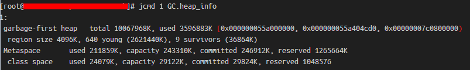

### 26. 高内存占用分析 - 找内存区域（续）

通过arthas的memory命令，可以观察metaspace、direct等非堆内存区域占用情况。

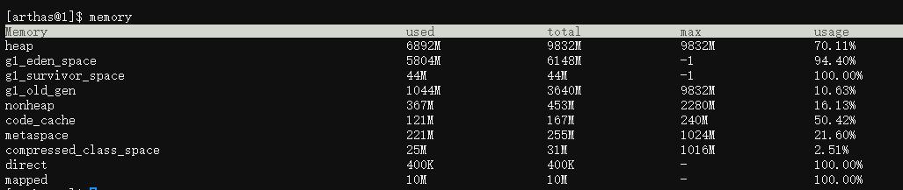

### 27. 高内存占用分析-找内存区域

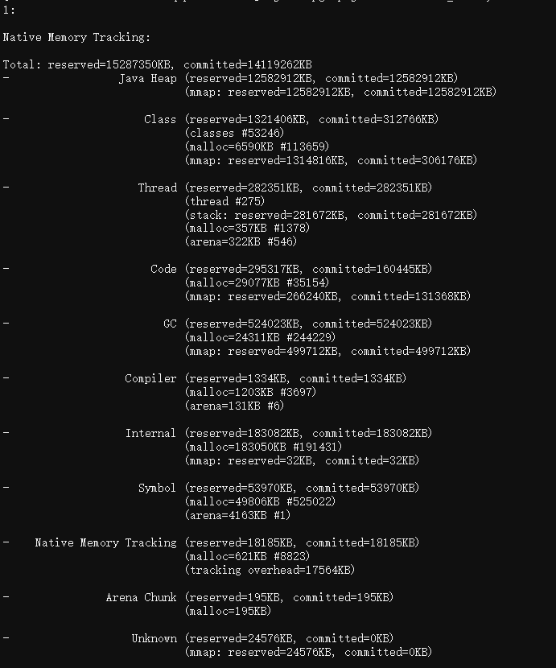

JVM原生内存追踪功能NMT，可通过参数
-XX:NativeMemoryTracking=detail开启。

然后可使用jcmd查看内存分配情况。

NMT相比arthas的memory可查看更多内存区域占用情况，不过需要添加配置开启。

注：NMT只能观察到JVM管理的内存，像通过JNI机制直接调用malloc分配的内存，则感知不到。

### 28. 高内存占用分析-glibc缓存的内存

glibc提供了malloc_stats函数，可用于检查glibc缓存的内存情况。

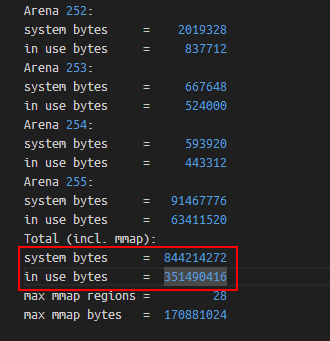

Total (incl. mmap)：表示glibc分配的总体情况(包含mmap分配的部分)
system bytes：表示glibc从操作系统中申请的虚拟内存总大小，
in use bytes：表示JVM正在使用的内存总大小(即调用glibc的malloc函数后且没有free的内存)。

可以发现，glibc缓存了约500m的内存！

### 29. 高内存占用分析-glibc缓存的内存（续）

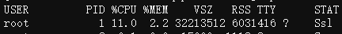

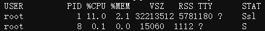

glibc提供malloc_trim函数，可用于回收缓存的内存。

可以发现，执行malloc_trim后，RSS减少了约250m内存。

注：通过gdb调用C函数，会有一定概率造成jvm进程崩溃，需谨慎执行。

### 30. 高内存占用分析-native分配的内存

通过pmap命令，就可以查看进程的整个虚拟内存空间，它也包含了native分配的内存块。
一般，我们分析进程虚拟内存空间中，物理内存占用比较大的内存块，如下：

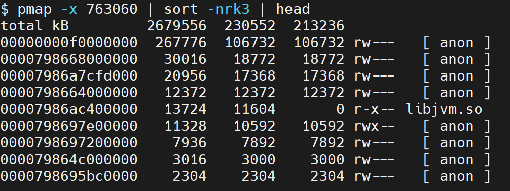

我们可以保存前后两个时间点的pmap数据，然后进行比对，看看哪些内存块是新增的或变大了，然后可以在/proc/$pid/mem中读取相应内存块数据，用strings检查，看有没有可疑的字符串。

### 31. 高内存占用分析-找内存区域 / 小结

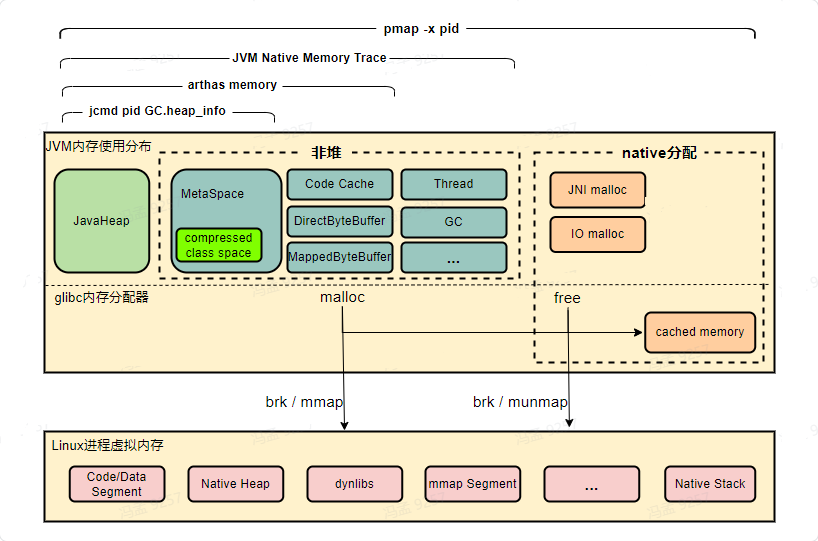

### 32. 高内存占用分析-找内存区域 / 小结（续）

由于内存是代码运行的必需品，因此，我们很难解释清楚程序内存占用的每一分一毫的作用，只能确认占用大头的内存区域。
而要确认是否有内存泄露，一般需要持续观察一段时间，看各区域内存占用增长情况，如果某区域增长很大，那它就很有可能存在内存泄露。

### 33. 高内存占用分析 - 文件缓存

有时可能想检查文件缓存的内存占用情况，这可通过free -wh知道，Buffer=块缓存、Cache=文件缓存+Slab，单独的Slab占用可以通过slabtop查看。

有时可能想要知道哪些文件占用缓存较多，可通过find + vmtouch来查看，如下：

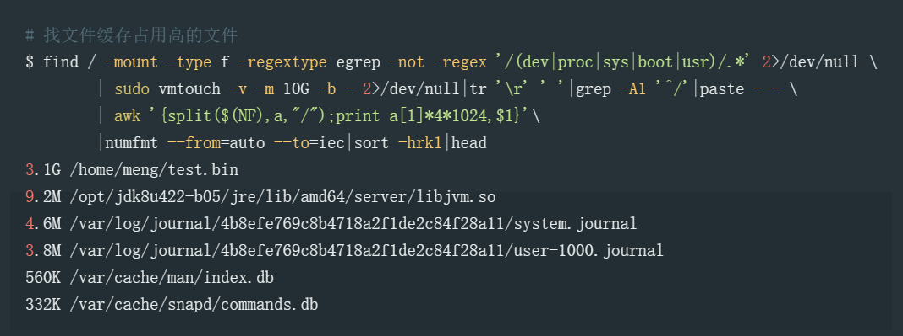

### 34. Java堆占用高-找调用栈

情况1：Java堆内存区域占用高！
先使用jmap看类直方图，若看不出问题，再使用jmap生成堆转储文件，然后使用MAT分析。

### 35. Java堆占用高-找调用栈（续）

- 使用jmap命令将java堆转储为hprof文件，用于堆内存占用分析。
- 也可添加JVM选项-XX:+HeapDumpOnOutOfMemoryError -XX:HeapDumpPath=/home/work/logs/applogs/，使得进程OOM时自动dump堆。
- 生成的hprof文件较大，建议gzip压缩后再下载到本地。

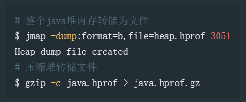

注：此命令可能会导致jvm长时间暂停，建议摘除流量后，再操作。

### 36. Java堆占用高-MAT内存分析

第一步：找GC Root

### 37. Java堆占用高-MAT内存分析（续）

第二步：若GC Root是线程，查看线程栈

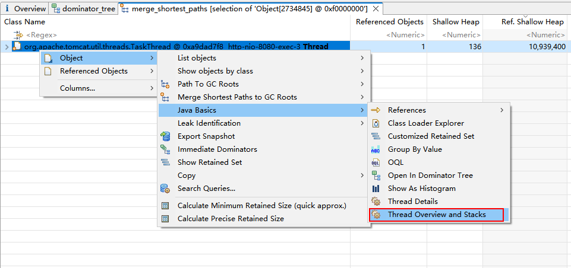

### 38. Java堆占用高-MAT内存分析（续）

第三步：展开线程栈，这个SQL查询了大量数量导致堆占用高！

### 39. Java MetaSpace占用高-找调

情况2：Java MetaSpace内存区域占用高！
一般是加载了太多的类，可通过jcmd 0 VM.classloader_stats查看类加载情况。

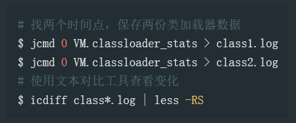

或通过arthas的classloader命令

### 40. Java MetaSpace占用高-找调（续）

可以看到很多fastjson的类加载器，加载了新的类。

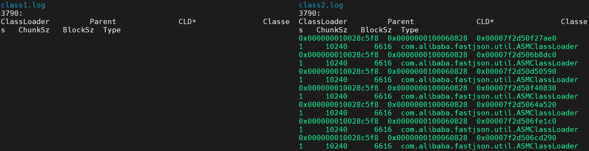

### 41. Java MetaSpace占用高-找调（续）

如果jcmd 0 VM.classloader_stats不可用，也可比对arthas的classloader命令的前后输出结果，如下：

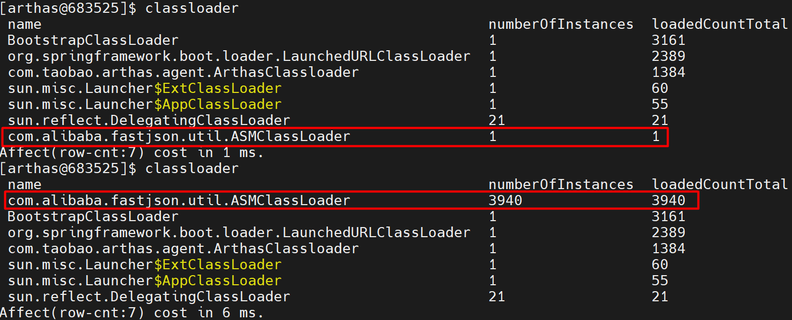

然后，使用arthas的profiler命令，可以找到类加载的调用栈。

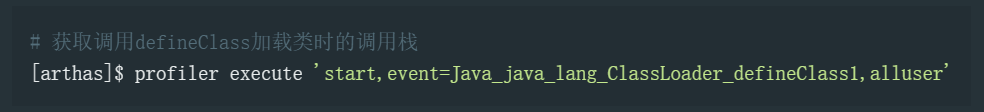

### 42. Java MetaSpace占用高-找调（续）

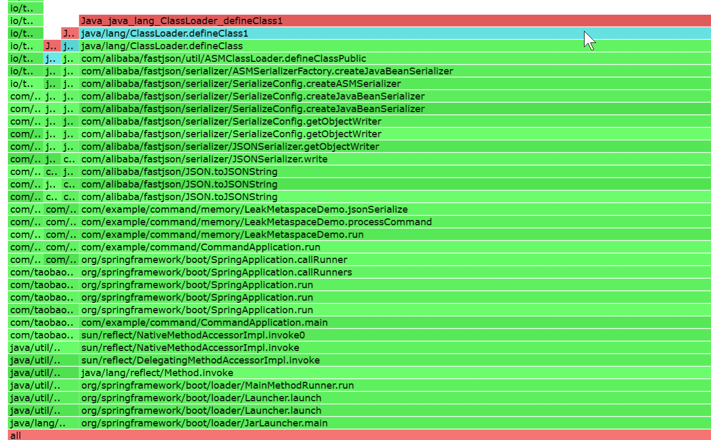

类加载泄露的调用栈

### 43. Java MetaSpace占用高-找调（续）

fastjson的SerialzeConfig，应该是静态变量复用，而不应该每次都创建一个，这会导致fastjson每次创建新的ClassLoader加载类，导致类不断被加载，进而使得metaspace占用高。

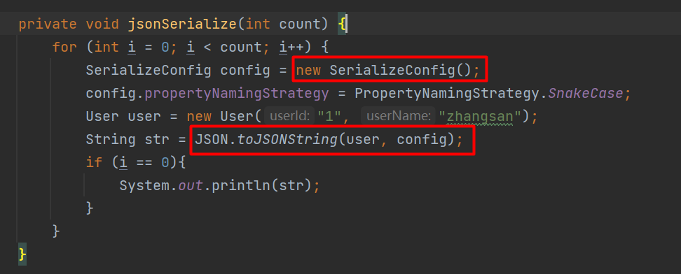

### 44. Java堆外内存占用高-找调用栈

情况3：Java堆外(native)内存区域占用高！

使用Linux的LD_PRELOAD机制，可将glibc的内存分配器更换为tcmalloc或jemalloc，它们提供了内存泄露检测的功能，通过hook进程的malloc、free函数调用，然后找到调用了malloc后一直没有free的地方，那么这些地方就可能是内存泄露点。

tcmalloc使用方法与效果：

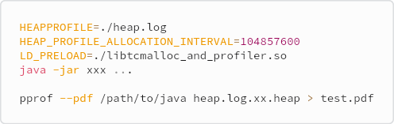

### 45. Java堆外内存占用高-找调用栈（续）

可以发现，大多数native内存分配在Java_java_util_zip_Inflater_inflateBytes相关的函数中，且没有Java调用栈！

### 46. Java堆外内存占用高-找调用栈（续）

使用tcmalloc/jemalloc诊断堆外内存泄露，本质是将glibc默认内存分配器ptmalloc2，替换成了tcmalloc/jemalloc，实施这种方案有一定风险，需要做回归测试。
而ptmalloc2提供了mtrace机制，也可用于内存泄露，如下：

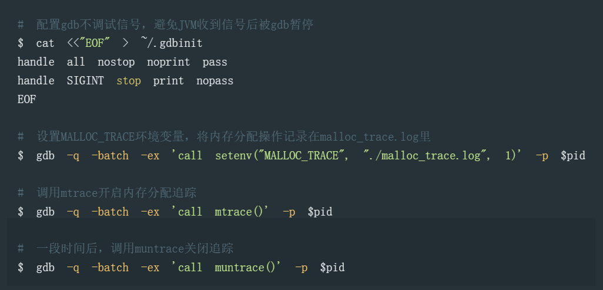

### 47. Java堆外内存占用高-找调用栈（续）

一段时间后关闭mtrace，并查看malloc_trace.log，内容如下：

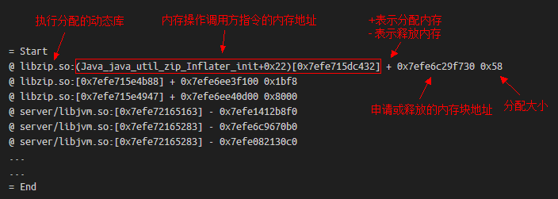

在开启mtrace后，glibc将所有malloc、free操作都记录了下来，通过从日志中找出哪些地方执行了malloc后没有free，即是内存泄露点。

### 48. Java堆外内存占用高-找调用栈（续）

glibc提供了mtrace命令，可找出malloc后未free的记录，然后按Caller统计一下，如果数值比较大，就基本可以确认是内存泄露了。
如下，0x7efe715e4b88这个指令地址，泄露了1010次！

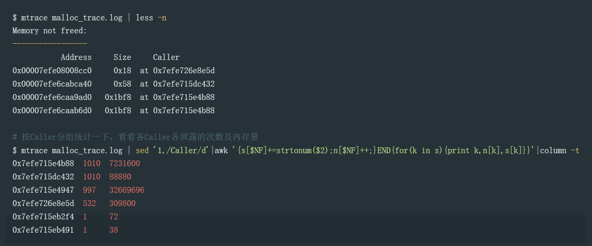

### 49. Java堆外内存占用高-找调用栈（续）

可以发现，不管是tcmalloc，还是mtrace，都只能找到泄露的native函数名或地址，而通过arthas的profiler命令可以获取Java调用栈，只需将上一步获取到的native函数名或地址，写到profiler命令中即可。

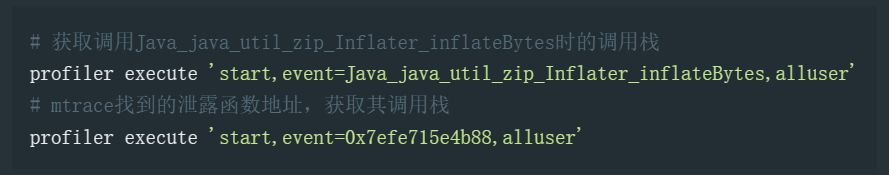

### 50. Java堆外内存占用高-找调用栈（续）

更多情况下，其实可以通过profiler直接追踪malloc内存分配函数，采集到的就是内存分配的调用栈。
当然，这里面不一定有泄露，但我们可以找到相应的代码栈，然后逐一检查代码，确认是否有内存泄露的可能。

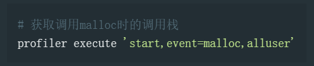

### 51. Java堆外内存占用高-找调用栈 - native内存泄露的java调用栈

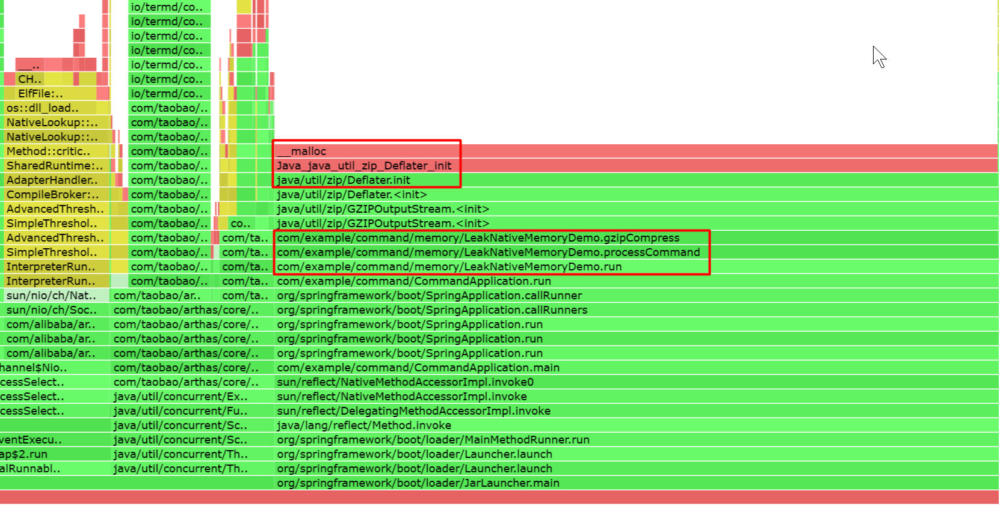

native内存泄露的java调用栈

### 52. Java堆外内存占用高-找调用栈

GZIPInputStream通过jni实现，会申请堆外内存，但其用完后没有close，导致堆外内存泄露，这也是Java中常见的堆外内存泄露点！

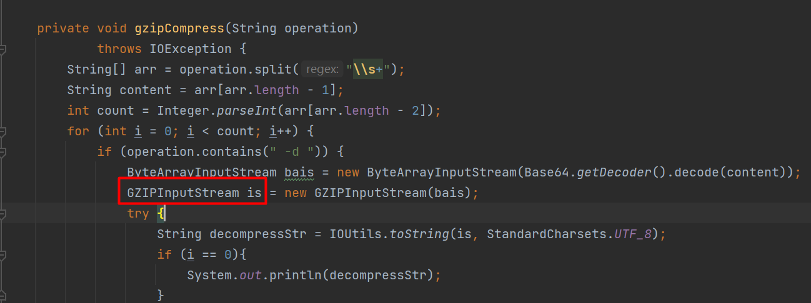

### 53. 内存占用高被OOM Kill

情况4：进程莫名其妙挂掉了！

进程莫名其妙挂掉，除了程序bug之外，进程被OOM Killer杀死也是原因之一，这可以通过dmesg内核日志来确认，如下：

### 54. 内存调优

### 55. 内存调优 - 内核参数

内存管理相关的Linux内核参数，如下：

| 调优参数 | 作用 |
| --- | --- |
| numactl --interleave=all命令 | NUMA架构中，node可以访问所有节点的内存，而非本地node的。 |
| vm.zone_reclaim_mode | 内存区域内回收，值为1时线程去回收自己 zone 的 page cache 而不去使用其它 zone 的 free pages |
| vm.watermark_scale_factor | 调整Linux空闲内存水位的差值 |
| vm.swappiness | 内存回收时，决定回收多少anon page和file page，值越大，回收anon page比例越大 |
| swapoff --all命令 | 禁用swap |
| vm.overcommit_memory | 是否允许Linux申请超过物理内存大小的虚拟内存 |
| choom命令 | 配置进程oom优先级，避免进程被OOM Killer杀掉 |

### 56. 内存调优 - 内核参数（续）

缓存管理相关的Linux内核参数，如下：

| 调优参数 | 作用 |
| --- | --- |
| vm.dirty_background_bytes | 触发fdflush后台回写脏内存量 |
| vm.dirty_background_ratio | 触发fdflush后台回写脏内存比例 |
| vm.dirty_bytes | 触发写入进程强制回写的脏内存量 |
| vm.dirty_ratio | 触发写入进程强制回写的脏内存比例 |
| echo 3 > /proc/sys/vm/drop_caches | 手动清除page cache与slab |
| vm.vfs_cache_pressure | 回收slab中目录(dentry)与inode缓存(*_inode_cache)的程度，值越大，回收越积极。 |

### 57. 内存调优 - 原生程序

- glibc自带的用户态内存分配器ptmalloc2，某些情况下，可能产生大量的内存碎片，可以更换成jemalloc或tcmalloc，它们在大多数场景下，对内存碎片控制的效果更好，性能也更高，如下：

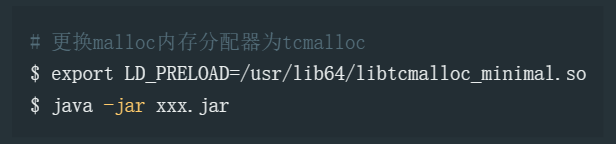

- 开启进程崩溃时自动coredump，方便排查崩溃原因。

ulimit -c unlimited

- 若想避免内存被swap，可使用mlock(c函数)来锁定内存，锁定文件缓存，可使用vmtouch命令。

### 58. 内存调优 - JVM

通过调优JVM内存与GC参数，也可以优化系统的整体性能，如下：

| 调优参数 | 作用 |
| --- | --- |
| -XX:InitialRAMPercentage=65.0 | 按物理内存比例分配堆内存(初始值) |
| -XX:MinRAMPercentage=65.0 -Xms10g | 按物理内存比例分配堆内存(最小值) -Xms是配置最小堆内存的绝对值 |
| -XX:MaxRAMPercentage=65.0 -Xmx10g | 按物理内存比例分配堆内存(最大值) -Xmx是配置最大堆内存的绝对值 |
| -XX:MaxDirectMemorySize=128m | 限制直接内存，避免直接内存占满内存 |
| -XX:+AlwaysPreTouch | 预touch堆内存，启动时就分配物理内存，而不是使用到才分配 |
| -XX:+HeapDumpOnOutOfMemoryError | 发生OOM异常时，自动dump堆 |
| -XX:HeapDumpPath=/home/logs/ | dump文件路径，要保证目录存在 |

### 59. 内存调优 - JVM（续）

通过调优JVM内存与GC参数，也可以优化系统的整体性能，如下：

| 调优参数 | 作用 |
| --- | --- |
| -XX:+UseParallelGC -XX:+UseParallelOldGC | 新生代与老年代使用并行Parallel Scavenge收集器 |
| -XX:+UseParNewGC -XX:+UseConcMarkSweepGC | 新生代使用ParNew并行垃圾回收器 老年代使用CMS垃圾回收器，堆内存4G以上且JDK9以下可考虑使用，以上可用G1 |
| -XX:+UseG1GC | 使用G1垃圾回收器，内存4G以上且JDK8以上可考虑使用。 |
| -XX:+UseZGC | 使用ZGC垃圾回收器，JDK17以上，需要低延时可考虑使用。 |

### 60. 内存调优 - 编码

优化进程的内存占用，可尽量避免产生大量对象。
- 流式处理，尽量使用类似InputStream的流式处理，而不要一次性读取后再处理。
- 数量限制，使用有界队列和限制最大数量的线程池。
- 分页查询，分多次分页查询处理数据，而不是一次性查询所有。
- 避免大对象，大对象对GC有很大挑战，必要时可避免创建大对象，如使用LinkedList代替ArrayList(内含数组，数量多时是大对象)，使用jackson流式序列化大对象等。
- 缓存优化，内存不足对系统危害极大，非性能要求极高的缓存场景，建议使用redis远程缓存替代本地缓存。

### 61. 总结

### 62. Linux物理内存划分为node

- Linux物理内存划分为node(节点)、zone(区域)、page(页面)这3个层面。
- Linux虚拟内存划分为栈、内存映射段、堆、数据段、代码段等。
- Java内存划分为Java堆、非堆(metaspace、code cache、thread等)、native分配等。
- Linux虚拟内存通过brk/mmap分配，glibc作为malloc函数与brk/mmap系统调用的桥梁，可能会缓存一定量的内存块。
- Linux通过缺页中断分配物理内存，当系统空闲内存不足时，会启动内存回收机制。
- 通过jcmd、arthas、NMT、pmap等命令，可以观察Java进程各内存区域的占用情况。
- 若堆内存占用高，可使用jmap+MAT诊断，若mataspace占用高，可使用arthas classloader+profiler诊断，若native分配占用高，可使用tcmalloc/mtrace+arthas profiler诊断。
- 可通过dmesg确认进程是否被OOM killer干掉了。
- 内存调优可以调整内核参数、用户态内存分配器或JVM参数。

## 14. 磁盘io高分析

### 01. 磁盘io占用高分析

### 02. 磁盘io占用分析

### 03. 高磁盘io占用 - 整体情况

高磁盘io占用，分析方法也是逐步细分资源占用情况，分3步：
找磁盘 -> 找进程或文件 -> 找调用栈

iostat -dxz 1可以查看磁盘整体占用情况

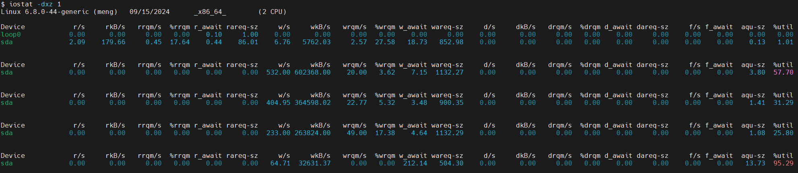

### 04. 高磁盘io占用 - 找进程

pidstat -d 1可以查看哪个进程占用磁盘高。

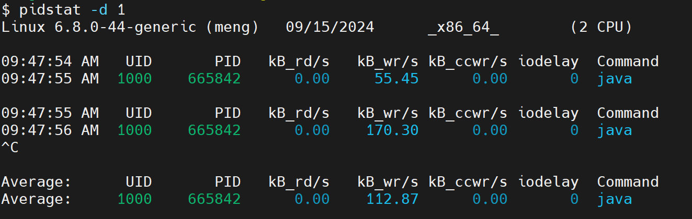

可以发现是java进程占用高，主要是写操作！

### 05. 高磁盘io占用 - 找文件

通过bcc的filetop -p `pgrep java`可以查看在读写哪个文件。

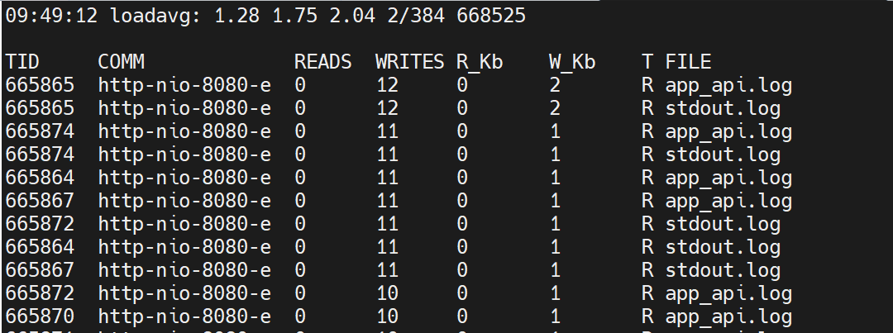

### 06. 高磁盘io占用 - 找调用栈

通过arthas的profiler可以找到调用栈，如下：

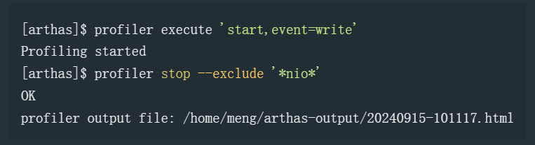

如果是非Java程序，可以通过bcc的stackcount命令来采集调用栈，如下：
$ stackcount-bpfcc -f vfs_write

### 07. 高磁盘io占用 - 找调用栈（续）

可以看到，都是logback在写日志！

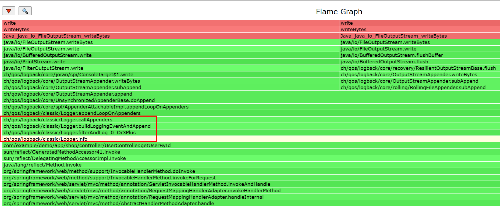

### 08. 高磁盘io占用 - 性能确认

磁盘占用高也可能是磁盘性能严重退化了，可通过ioping确认磁盘耗时是否正常，如下：

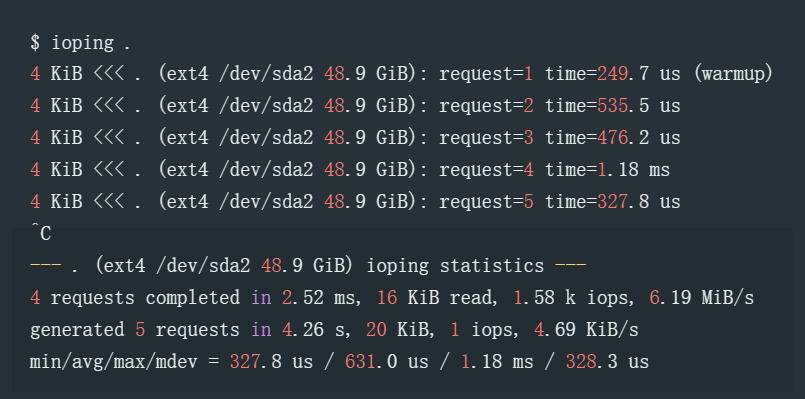

### 09. 调优

### 10. 磁盘io调优

磁盘io相关的调优选项，如下：

| 调优参数 | 作用 |
| --- | --- |
| ionice命令 | 调整进程的io优先级 |
| /sys/block/*/queue/scheduler | IO调度策略 |
| /sys/block/*/queue/read_ahead_kb | 文件系统请求的最大预读KB数 |

### 11. 磁盘io调优 - 编码优化

由于大多数程序员都是crud开发，涉及到存储系统研发的很少，写的代码与磁盘最密切的就是写日志而已，因此在磁盘方面遇到的问题非常少。
说几点通用优化策略，如下：
数据缓存：将读写缓存起来，避免直接读写磁盘。
增大缓冲：比如使用更大Buffer的BufferReader。
尽量避免随机io：不管是HDD还是SDD，随机io的性能都比顺序io差得多，故应该尽量避免随机io，比如数据库中，随机io写缓存，同时在redo log中使用顺序io备份更新记录(避免断电)，然后使用异步线程同步缓存数据到磁盘。
数据索引：不管是文件系统，还是数据库，都对数据做了索引，以避免全盘扫描数据。

### 12. 总结

### 13. 通过iostat -dxz 1观测磁盘整

- 通过iostat -dxz 1观测磁盘整体io情况。
- 通过pidstat -d 1找磁盘占用高的进程，通过bcc的filetop找读写的文件。
- 通过arthas的profiler，采集对write的调用栈，找到读写的代码位置。
- 通过ioping可简单确认磁盘的性能情况。

## 15. 网络io高分析

### 01. 网络io高占用分析

### 02. 网络io高占用分析（续）

### 03. 高网络io占用 - 整体情况

高网络io占用，分析方法也是逐步细分资源占用情况，分3步：
找连接 -> 找进程 -> 找调用栈
通过iftop -nN可以查看网络使用情况，如下：

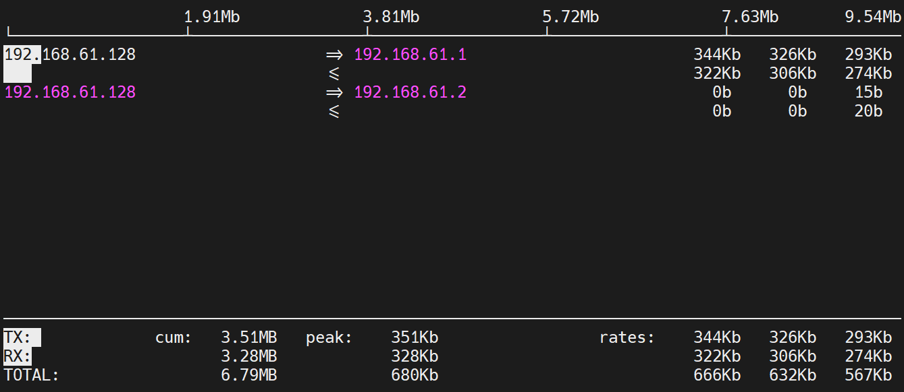

### 04. 高网络io占用 - 找连接

在iftop中，按S(Shift+s)可以按源端口查看网络使用情况

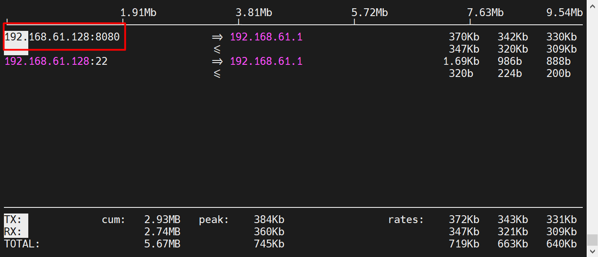

可以看到8080网络流量最大！

### 05. 高网络io占用 - 找进程

8080端口网络流量最大，再通过lsof找进程。

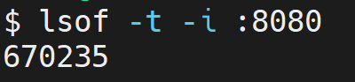

找进程，也可以通过nethogs命令找。

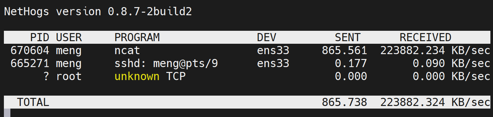

### 06. 高网络io占用 - 找调用栈

通过arthas的profiler，采集recv或send方法，可以找到调用栈，如下：

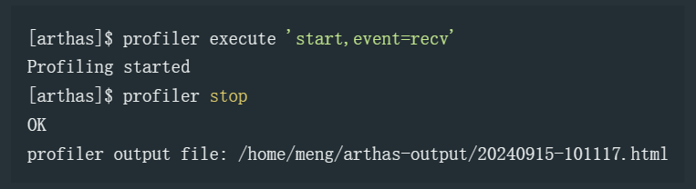

如果是非Java程序，可以通过bcc的stackcount命令来采集调用栈，如下：
$ stackcount-bpfcc -f ip_output

### 07. 高网络io占用 - 找调用栈（续）

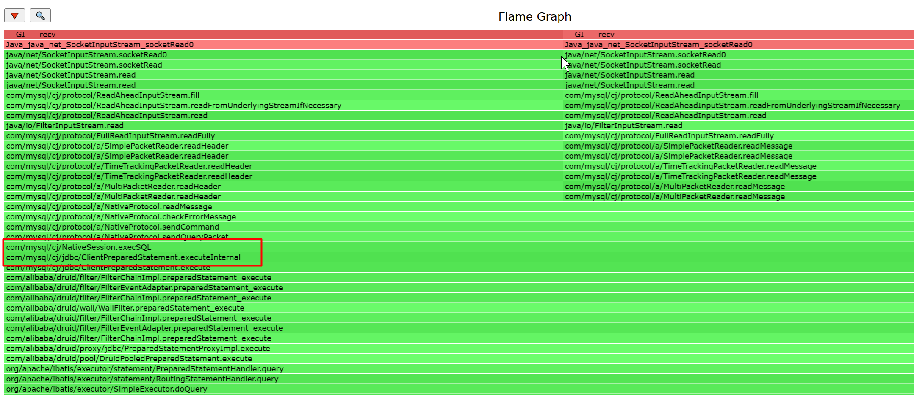

### 08. 调优

### 09. 网络调优 - 内核参数

网络调优相关的Linux内核参数，如下：

| 调优参数 | 作用 |
| --- | --- |
| net.ipv4.tcp_max_syn_backlog | tcp半连接队列最大长度 |
| net.core.somaxconn | tcp全连接队列最大长度 |
| net.core.netdev_max_backlog | 网络设备积压队列最大长度 |
| net.ipv4.ip_local_port_range | 本地端口范围 |
| net.netfilter.nf_conntrack_max net.nf_conntrack_max | 连接跟踪表最大数量 |
| net.ipv4.neigh.default.unres_qlen | 用于设置网络层对每个未知地址可以排队的最大数据包数量 当一个数据包到达但目的 MAC 地址尚未解析时，它会在队列中等待直到 ARP 请求得到响应。如果队列满了，新的数据包将被丢弃。 |

### 10. 网络调优 - 网络编程调优选项

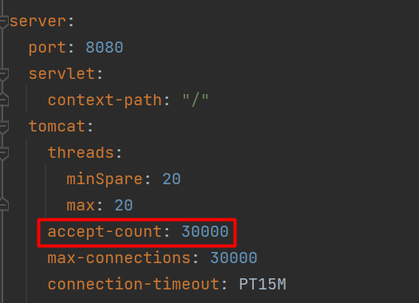

网络编程相关的调优选项，如下：

ServerSocket的accept()方法，可以传入acceptCount，它和net.core.somaxconn共同决定全连接队列的大小，比如springboot的tomcat如下配置：

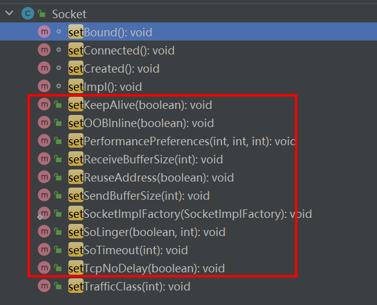

socket有一系列方法，可以配置选项，如setTcpNoDelay，禁用Nagle，尽快发送数据，数据包更快发送，但由于不会合并包，可能导致发包更多。

### 11. 网络调优 - 编码优化

几个常见的优化策略，如下：
批量查询：将多个单个查询，合并为批量查询，提升性能。
连接池：使用连接池复用连接，消除TLS握手、TCP握手与拥塞控制耗时。
数据压缩：使用压缩算法压缩数据，减少网络交互数据量。
io多路复用或零拷贝：使用io多路复用技术，减少线程与上下文切换开销，或使用零拷贝，减少数据复制开销。
高效网络协议：比如使用更高效率的http2、grpc等网络协议。

### 12. 总结

### 13. 通过iftop -nN观测网络整体情况

- 通过iftop -nN观测网络整体情况，按S可查看连接情况。
- 通过lsof或nethogs找相关的进程。
- 通过arthas的profiler，采集对recv或send的调用栈，找到网络io的代码位置。

## 16. 整体耗时高分析

### 01. 整体耗时高分析

### 02. 耗时高分析思路

### 03. 耗时高分析思路（续）

其实如果将时间也看成一种资源的话，耗时问题分析思路和资源占用分析思路一样，也是逐步细分时间资源，不同的是，耗时问题适合使用自上而下的负载视角，因为耗时问题最终都反映在用户侧的UI或接口上。
分析思路如下：
- 哪个接口耗时高？
- 接口下哪个子方法耗时高？逐步深入耗时子方法。
- 整体哪个调用栈耗时高？

### 04. 哪个接口耗时高？

一般各个服务都有接口监控，可以通过监控确定哪个接口耗时高。

如果没有接口监控的话，可以试着找找有没有接口访问日志，它记录了接口调用日志，然后通过Linux命令找出耗时高接口，如下：

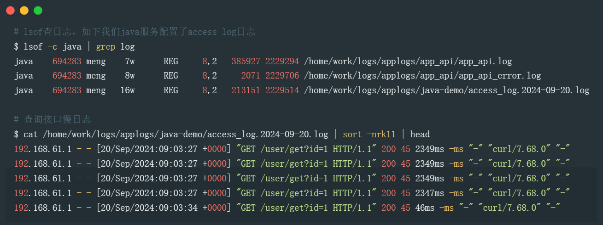

### 05. 哪个接口耗时高？（续）

如果接口监控与接口访问日志都没有，也可通过arthas的watch命令找接口，如下：

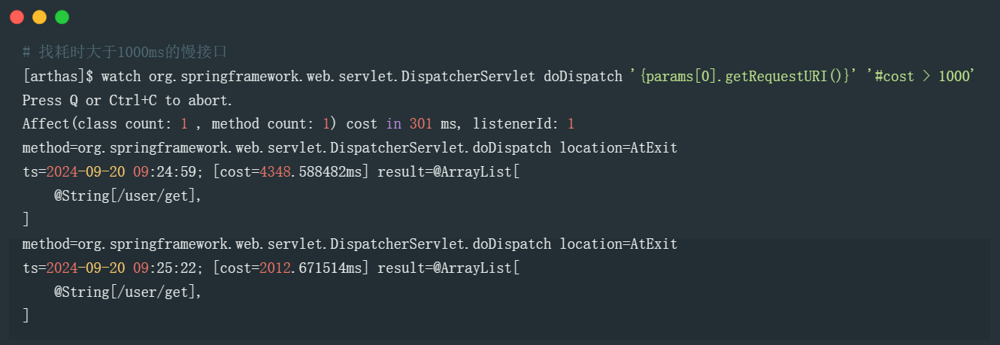

### 06. 哪个子方法耗时高

找到耗时高接口后，可使用arthas的trace命令，继续追踪子方法耗时来源。

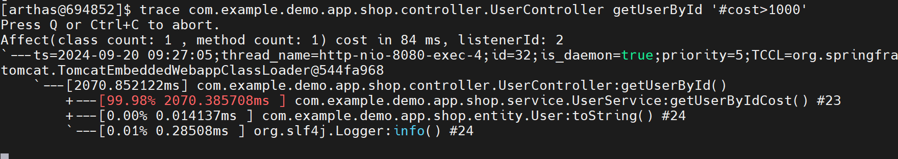

可以发现UserService.getUserByIdCost方法慢，然后可以再trace这个方法。

### 07. 哪个子方法耗时高（续）

也可以开一个新的arthas窗口，通过listenerId在之前的trace上追加子方法的调用。

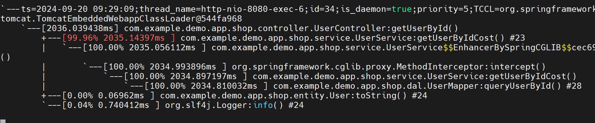

如果耗时代码，在比较深的调用栈中，可以发现这种逐层深入的方式，效率会比较低！
因此，我们可以使用offcpu方法，以更快找到调用栈。

### 08. oncpu分析 vs offcpu分析

线程在运行的过程中，
- 要么在CPU上执行，称其为oncpu，
- 要么被锁或io操作阻塞，从而离开CPU进去睡眠状态，称其为offcpu，待被解锁或io操作完成，线程会被唤醒而变成运行态。

如果是接口耗时高问题，这适合使用offcpu分析法！

### 09. 哪个调用栈耗时高 - bcc/offcpu分析

如果系统接口整体耗时较高，可使用bcc的offcputime命令，绘制一张offcpu火焰图。

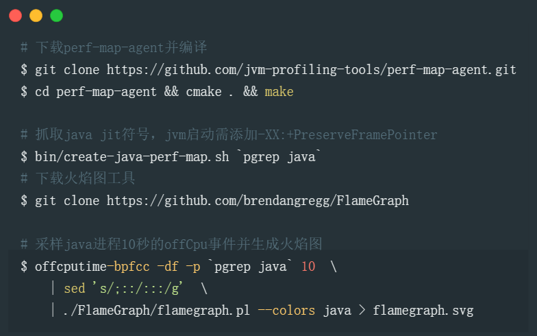

### 10. 哪个调用栈耗时高 - bcc/offcpu火焰图

offcputime通过追踪Linux上下文切换函数finish_task_switch，以实现对线程睡眠时间的测量，故offcpu的栈宽代表的是线程睡眠时间。

### 11. 哪个调用栈耗时高 - profiler/offcpu分析

有时因为权限原因，无法使用bcc的offcputime，这时可以通过profiler的wall采集模式，也可做offcpu分析，wall表示wall clock(墙上挂钟)的含义，这种采集模式将每隔一段时间，采集所有线程调用栈保存下来。
试想一下，当一段代码执行很慢时，那么多次采集线程栈时，慢调用栈采集数量一定会更多，体现在火焰图上就更宽。

由于wall采集模式，会采集所有线程栈，但一般线程池中大量线程都是等待任务的状态，故wall采集模式一般要过滤一下，过滤出与请求处理有关的线程栈。

### 12. 哪个调用栈耗时高 - profiler/offcpu火焰图

### 13. 哪个调用栈耗时高 - jstack/offcpu分析

由于jdk的jstack命令可以采集java线程栈，因此通过不断运行它，就可以类似wall模式采集线程栈数据，然后生成火焰图，如下：

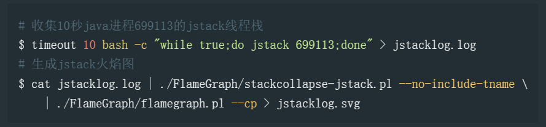

注：jstack相比arthas profiler来说，会有一定的safepoint开销，高流量系统需谨慎使用。

### 14. 哪个调用栈耗时高 - jstack/offcpu火焰图

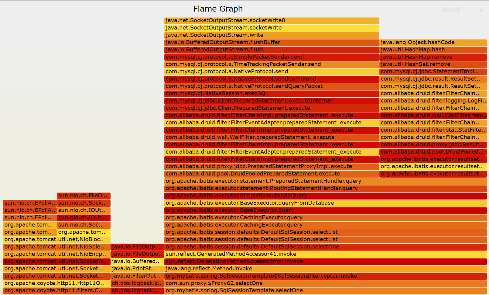

### 15. 哪个调用栈耗时高 - stack伪文件/offcpu分析

/proc目录中，在/proc/$pid/tack/$tid/stack伪文件，记录着线程阻塞时的内核调用栈，如下：

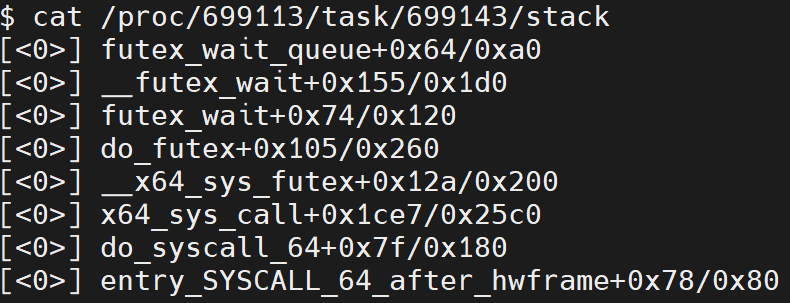

因此，其它方法不可用时，也可考虑使用此文件采集调用栈，如下：

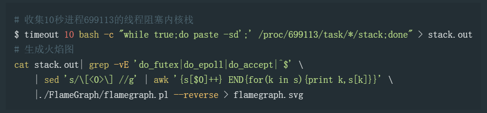

### 16. 哪个调用栈耗时高 - stack伪文件/offcpu火焰图

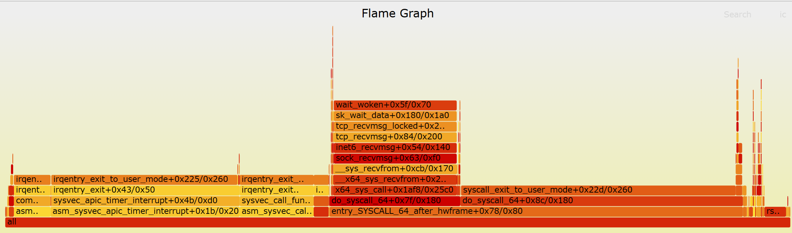

### 17. 总结

### 18. 高耗时的分析思路与资源分析类似

- 高耗时的分析思路与资源分析类似，逐步细分时间资源，接口、方法、调用栈，最终找到耗时根源。
- 耗时接口可以通过接口监控、访问日志或arthas watch获取。
- 慢方法可以通过arthas trace逐步细分，一步步深入子方法，定位耗时根源，但如果耗时根源较深，会比较费时间。
- 通过offcpu方法，可以快速找到耗时调用栈，一种是通过bcc的offcputime命令，它直接采集线程上下文切换函数的调用栈，另一种是通过arthas profiler的wall采集模式，它定期采集所有线程栈，运行慢的线程栈一定会更宽。
- 其实只要能获取到线程栈，就能做wall模式的offcpu分析，比如使用jstack或/proc/$pid/tack/$tid/stack伪文件。

## 17. 偶现问题分析思路

### 01. 偶现问题分析思路

### 02. 偶现问题分析思路（续）

### 03. 偶现问题分析思路（续）

相信大家也一定遇到过这种场景，一些接口平均耗时挺小的，但偶尔耗时会抖动一下，耗时很高，体现在耗时监控上，就是p99指标会很高，还有些时候，CPU或内存占用偶尔会很高。
这种偶现问题，诊断难度取决于问题出现频率，毕竟不可能一直盯着系统，所以需要一些不一样的分析思路。
分析这种问题，可考虑如下思路：
- 使用带有事件过滤的诊断工具，等待问题出现
- 采集每一个事件，问题出现后停止，然后做case by case分析
- 挂诊断脚本，检测到问题出现后运行诊断工具
- 其它方式，如压测尝试重现、添加更详细的日志等

### 04. 事件过滤的诊断工具

arthas的watch、trace、stack命令，都可以添加耗时过滤条件，以实现只监测高耗时问题。
如果耗时高问题很偶现，为避免等待，可添加&让其后台运行，将输出记录在日志中，如下：

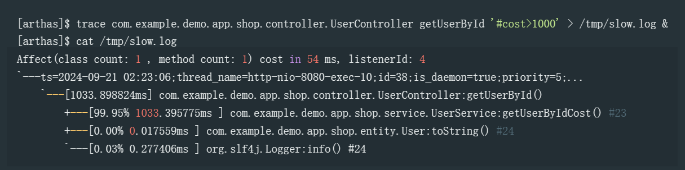

### 05. 事件过滤的诊断工具（续）

但由于arthas trace只能观察下一层子方法耗时，如果每次都手动追踪下一耗时方法，这会导致分析过程很慢。
解决办法是，可以通过挂shell脚本，检测日志输出，当发现耗时case产生时，自动通过listenerId添加下一层子方法的trace。

### 06. 事件过滤的诊断工具（续）

bcc的offcputime工具，采集offcpu调用栈时，也可以通过-m选项过滤离开cpu的时间，用此可找到那些耗时极高的调用栈，如下：

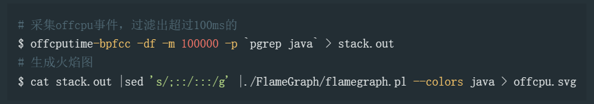

### 07. 事件过滤的诊断工具 - 高耗时offcpu火焰图

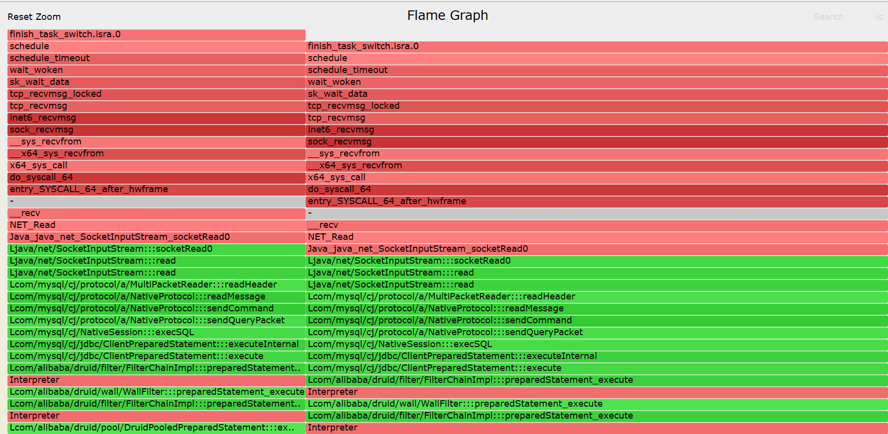

### 08. 采集每一个事件 - case by case分析

偶现的问题，也可以通过采集每一个事件，然后再分析case出现时间段的事件数据，以找到问题原因。
举例：偶现的高耗时问题
可以使用arthas profiler的wall模式采集，并将采集数据保存为jfr格式，它会将每次采集的线程快照保存起来，适合诊断偶尔耗时高问题，以及优化p99长耗时。

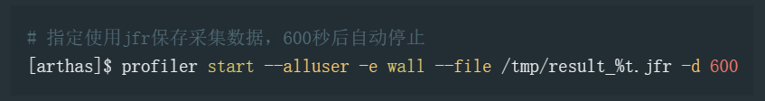

### 09. 采集每一个事件 - case by case分析（续）

由于profiler并不适合单次执行太长时间，对于一些非常偶现的case，比如1天才出现一次，可以使用shell脚本来循环采集，直到case出现后，停止脚本即可。

jfr文件可以通过jmc工具来分析。

### 10. 采集每一个事件 - case by case分析（续）

比如通过日志系统发现，http-nio-8080-exec-28线程在21:14:10到21:14:18时间段是一次耗时近8s的慢调用，使用jmc打开jfr，在jmc中找到此线程此时段的调用栈，如下：

### 11. 采集每一个事件 - case by case分析（续）

再比如排查耗时问题，最终发现是查数据库慢，但又是很简单的SQL，想看看是不是网络抖动导致的，这时就又可以通过tcpdump采集每一个网络包，直到问题出现。
网络流量一般较大，为避免抓包文件占满磁盘，一般需要滚动保留最近几个抓包文件，如下：

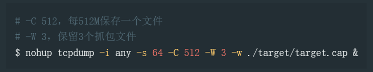

### 12. 挂诊断脚本

比如像偶尔CPU或内存高的问题，我们可以通过挂shell脚本的方式进一步诊断，比如当检测到CPU高后，自动开启arthas profiler绘制火焰图，如下：

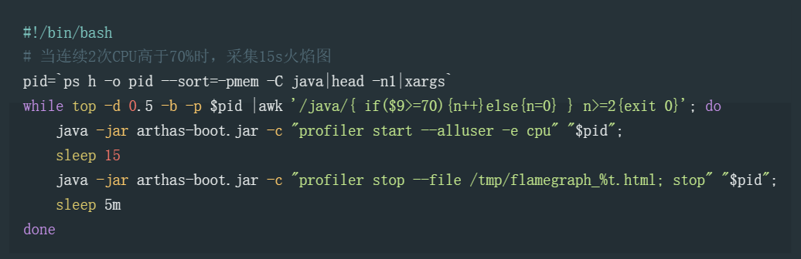

### 13. 其它方式

除上述方法外，还有如下一些常见手段：
- 尝试重现问题，偶现问题可能在高流量压力下才出现，可以压测看看是否能稳定重现。
- 添加更详细日志，有时可能无法使用诊断工具，如果这个问题有必要找出原因，可以添加更详细日志看看。
- 放平心态，偶现问题是最难诊断的一类问题，但大多都不会明显影响线上，所以需要放平心态，有些问题查不出来很正常，甚至可能是偶尔有人踩了一下网线！

### 14. 总结

### 15. 偶现问题一般排查难度都较大

- 偶现问题一般排查难度都较大，可尝试使用事件过滤、记录所有事件case by case分析、挂shell脚本等方法。
- arthas的trace可通过耗时过滤，过滤出高耗时调用。
- 可通过arthas profiler的jfr模式记录所有线程栈采集数据，以及tcpdump命令抓包，然后再分析问题时间段的数据。
- 偶现高CPU或内存占用，可通过挂后台shell检测脚本方式排查。

## 18. 系统负载高分析

### 01. 系统负载高分析

### 02. 原理

### 03. 系统负载是什么？

运行中
系统负载
可运行
阻塞等待
在Linux上，uptime与top命令，都可以看到系统的平均负载(load average)，如下：

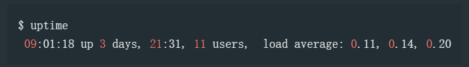

关注load average后的3个值，分别代表1分钟、5分钟、15分钟的系统平均负载，如果1分钟值>5分钟值>15分钟值，则代表近15分钟内系统压力越来越大，反之亦然。

在传统unix系统上（如BSD），系统负载由正在运行及可运行这2个状态的线程数量组成。 它能很好的反映CPU的饱和情况，比如4核的CPU，如果负载一直高于4，那说明CPU资源饱和了。

### 04. 系统负载是什么？（续）

关键词：运行中、系统负载、可运行、不可中断睡眠、其它阻塞
在Linux里面，线程有如下常见状态：
- R: 正在运行或可运行状态
- S: 睡眠状态，被阻塞等待唤醒
- D: 不可中断(uninterruptible)睡眠状态，一般是等待磁盘io完成

而Linux扩大了负载的定义，如下：
Linux负载由正在运行、可运行及D状态这3个部分的线程数量组成。

### 05. Linux线程状态

因为Linux认为，虽然D状态的线程并不消耗CPU资源，但是它会消耗磁盘等资源，因此它也应该被用来计算系统负载，想想也合理，毕竟系统负载是用来描述整个系统的繁忙程度的，而不仅仅是CPU的。

R与D状态的线程会影响系统负载，因此，当系统负载较高时，可以通过如下命令了解是哪些线程导致的：

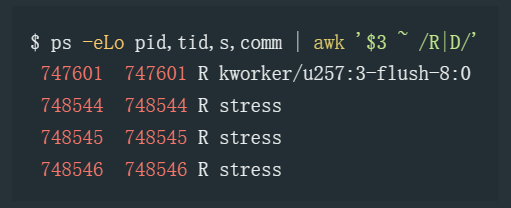

### 06. 负载实验

### 07. 负载实验（续）

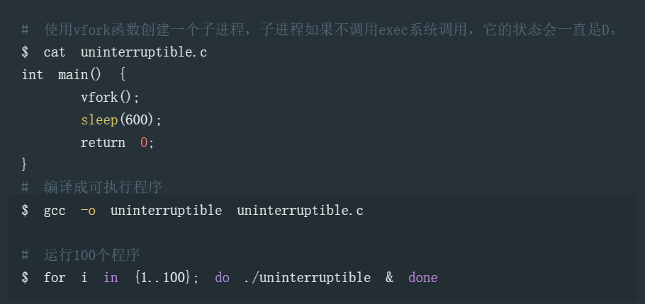

等待1分钟，就会发现系统负载升到了快100，如下：

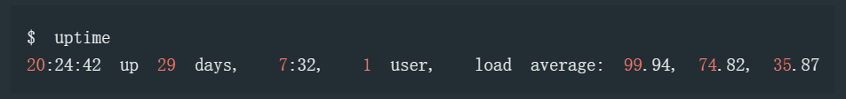

### 08. 负载实验（续）

通过ps命令可以看到线程状态，还有一个wchan字段，它显示的是线程当前被阻塞在什么内核函数上，这能看出一些蛛丝马迹。

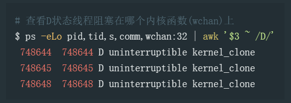

可以发现，D状态线程阻塞在kernel_clone内核函数上。

### 09. 负载实验（续）

也可以借助/proc/$pid/task/$tid/stack伪文件查看，它记录着线程阻塞时的内核栈，如下：

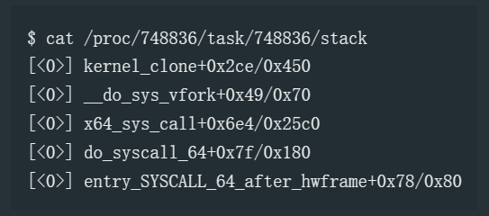

可发现D状态线程由vfork系统调用发起，阻塞在kernel_clone内核函数上，如果要看所有D线程的内核栈，可通过shell命令聚合后查看，如下：

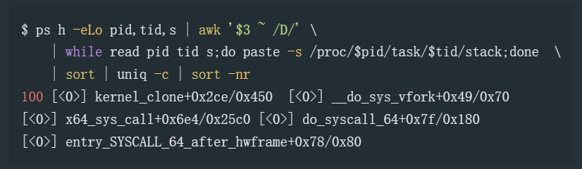

### 10. 负载实验（续）

bcc的offcputime命令，可通过--state 2过滤出只包含D状态线程的offcpu栈。

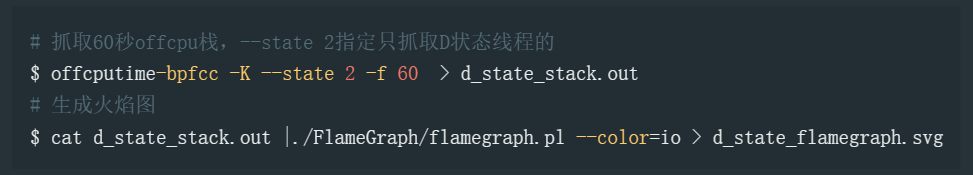

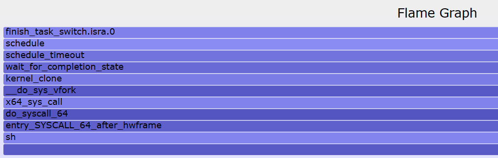

在D状态线程的offcpu栈中，也可发现是由vfork系统调用导致的负载升高。

### 11. 总结

### 12. Linux扩充了系统负载定义

- Linux扩充了系统负载定义，它反映的是一段时间内运行中、可运行(R)及不可中断(D)线程的平均数量。
- 可通过ps查看线程的wchan字段，了解D状态线程阻塞在什么内核函数上。
- /proc/$pid/task/$tid/stack反映线程当前的内核栈，它可用来查看D状态线程当前在做什么。
- bcc的offcputime命令，可通过--state 2过滤出只包含D状态线程的offcpu栈。

## 19. 网络命令与排障

### 01. 网络命令与排障

### 02. 网络命令与排障（续）

互联网普及的今天，网络变得越来越重要，相对的，工程师面对的网络问题也越来越多，做为一名程序员，相信都遇到过如下这些场景。
- RPC调远程接口失败了，网络不通？
- RPC调远程接口超时了，是网络导致的？
- RPC调远程接口，调用端很慢，但服务端说它很快，如何界定问题在哪？

因此，本篇文章，带大家了解如何应对上面问题，如下：
- 学习如何检测网络连通性，以及其它常用网络命令。
- 学习如何使用抓包工具抓取并分析数据包。
- 学习如何使用抓包工具判别RPC调用问题，在调用端、还是服务端，还是网络侧。

### 03. 检测网络连通性

### 04. 检测网络连通性 - DNS检测

众所周知，网络分多层，因此我们需要检测各层网络的连通性情况。

dig使用示例：

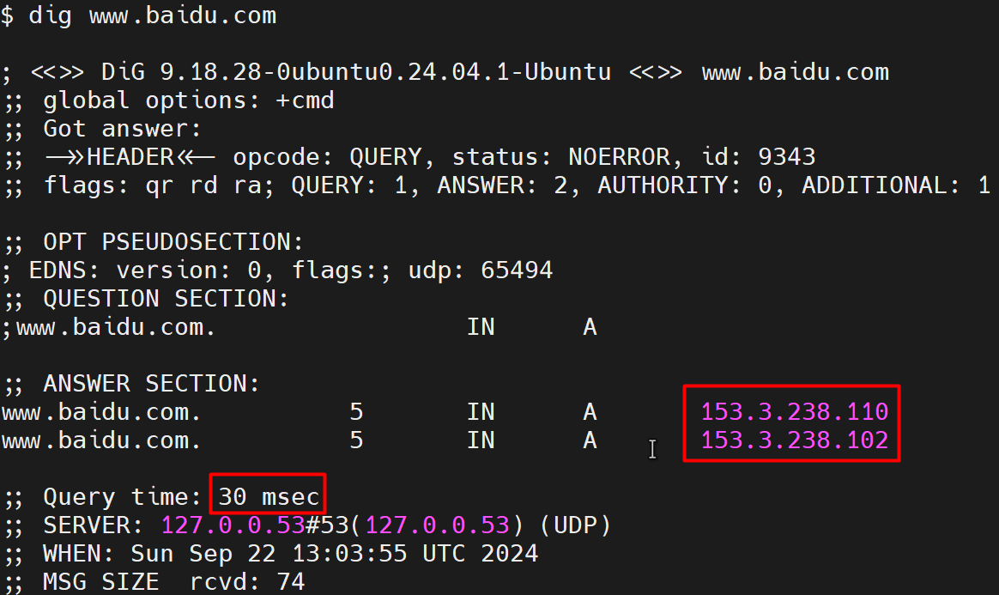

DNS连通性检测

可以看到根据DNS查询到的IP，以及耗时情况！

### 05. 检测网络连通性 - IP连通性检测

IP网络层连通情况，可以通过ping命令检测，如下：

ping使用示例：

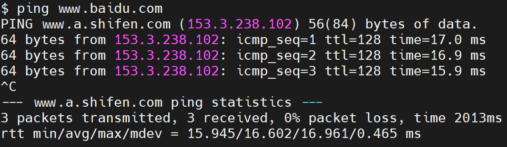

IP连通性检测

可以看到icmp网络包往返耗时(rtt)情况！

### 06. 检测网络连通性 - 路由情况检测

IP包是通过路由器逐步路由转发后，到达目标主机的，因此当网络慢时，可能需要检测路由情况，做为反馈给网络运营商的证据，如下：

mtr使用示例：

路由检测
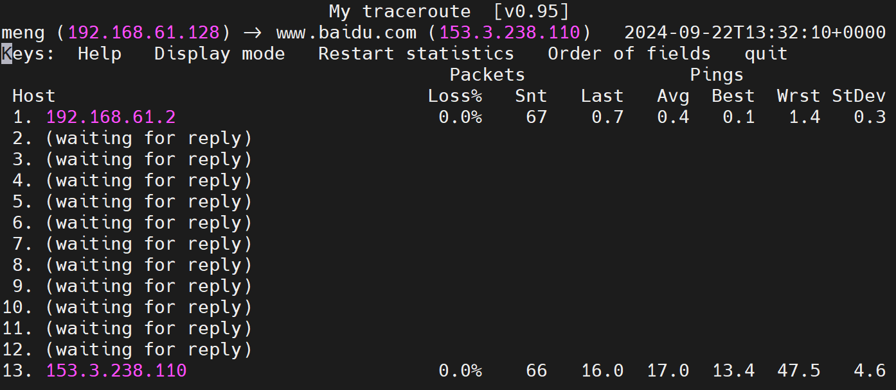

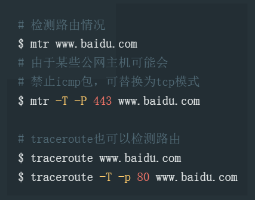

### 07. 检测网络连通性 - tcp层端口检测

检测tcp层端口连通性，常用于检测后端进程是否存活，如下：

hping3使用示例：

端口检测
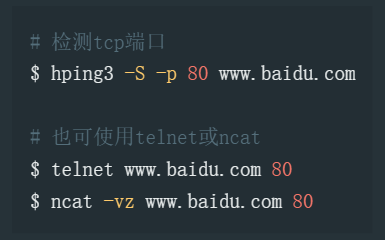

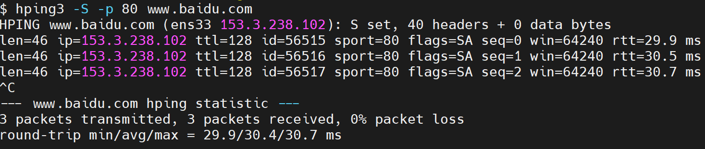

注：常规端口检测使用的是tcp握手包，而这个过程由操作系统完成，进程还没参与进来，因此端口检测的rtt与进程运行性能无关！

### 08. 检测网络连通性 - http接口检测

接口层面，http协议可能直接通过curl命令检测，如下：

http协议接口检测
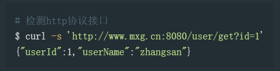

注：其它协议接口，如grpc、thrift接口测试，目前还没有比较流行的工具，实在需要，可以去github上找找看。

### 09. 检测网络连通性 - 一键检测

实际上，由于curl做为一个网络命令，也一定会经过DNS解析、IP层、TCP层、接口层，因此，通过curl就可以一键检测所有层连通性。

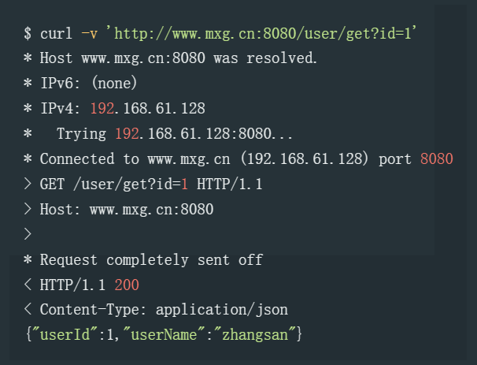

### 10. 检测网络连通性 - 一键检测（续）

使用curl也可以一键检测各阶段耗时，如下：

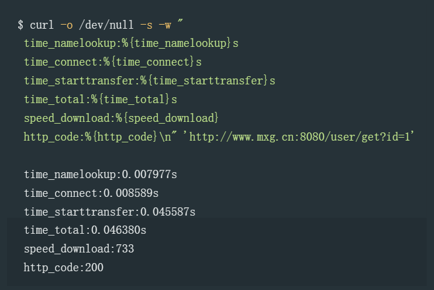

time_namelookup：DNS查询完成时间
time_connect：tcp连接建立完成时间
time_starttransfer：接收到第一个响应数据包时间。
time_total：响应数据全部接收完成的时间。

### 11. 常用网络命令

### 12. netstat - 统计tcp连接情况

通过netstat配合一些文本命令，可统计出各状态socket的数量，这有助于了解当前系统连接现状。

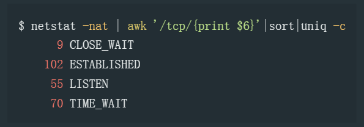

需格外关注TIME_WAIT与CLOSE_WAIT状态：
- 如果TIME_WAIT过多，可考虑优化内核网络参数或使用连接池
- 如果CLOSE_WAIT过多，就需要检查程序代码中哪里出现了连接泄露，导致未关闭连接

### 13. netstat - 统计tcp连接情况（续）

有时，需要看看连接的主要来源或去向，也可通过netstat配合文本命令统计，如下：

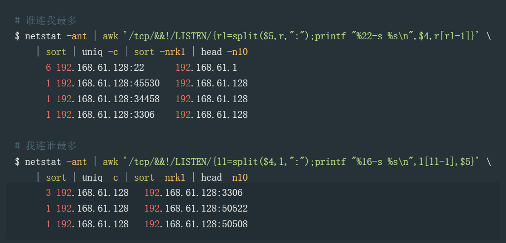

### 14. 查看丢包情况 - 网卡层

ifconfig可查看网卡层丢包情况，如下：

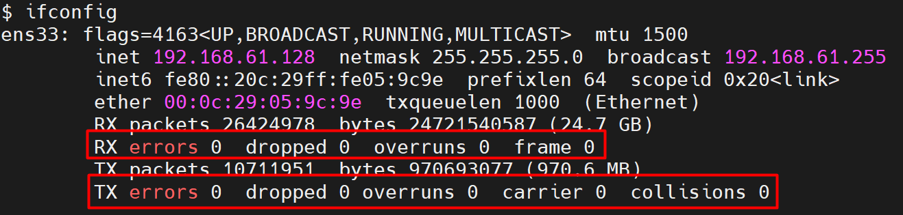

网卡详细统计数据，可通过ethtool -S ens33查看。

### 15. 查看丢包情况 - ip/tcp层

netstat可查看ip/tcp层丢包重传等情况，如下：

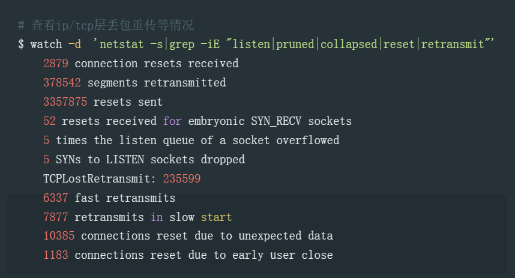

详细统计数据，可通过nstat -a查看。

### 16. 查看丢包情况 - 内核丢包位置

在Linux内核中，有很多种原因会导致丢包，如网卡缓冲区不够、tcp连接队列满等，因此，很多时候，需要找到内核丢包的调用栈，才能确定具体的丢包原因。
通过bcc的stackcount追踪内核丢包函数kfree_skb即可，如下：

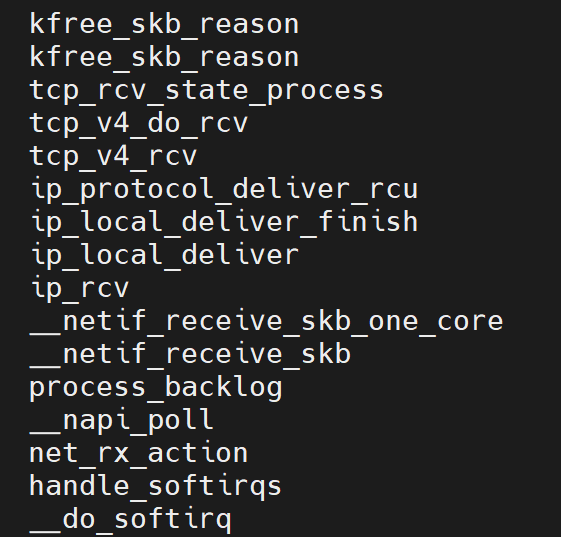

注：Linux还有一个工具dropwatch，也常用于跟踪丢包。

### 17. 网络抓包工具

### 18. 网络抓包工具 - tcpdump

关键词：下载、线上环境、本机、tcpdump抓包、wireshark分析
对于线上环境的抓包，一般流程是使用tcpdump抓取网络包，然后下载后本地，使用wireshark来分析。

tcpdump的抓包的最常用选项，抓包文件若太大，可考虑压缩后再下载，如下：

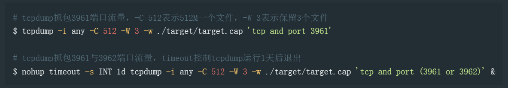

### 19. 网络抓包工具 - wireshark

wireshark是一个流量分析工具，它支持大量的网络协议，如HTTP、MySQL协议，它的主界面如下：

查找包
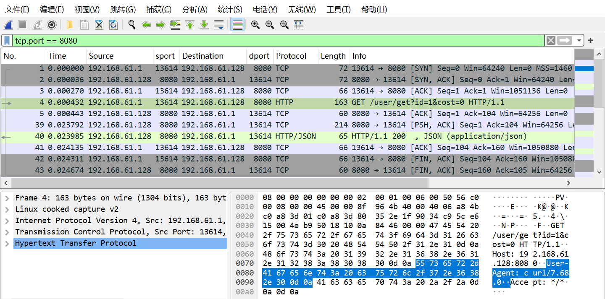

关键词：显示、过滤器、包列表显示字段与排序、包列表、包详情

### 20. 网络抓包工具 - wireshark（续）

wireshark支持大量的用法，本篇主要介绍如下内容：
- 如何指定网络包解析协议
- 如何过滤网络包
- 如何查找网络包
- 如何添加自定义列及排序
- 调用端慢、服务端快的分析案例
- 简单的统计分析功能

### 21. wireshark - 指定解析协议

wireshark默认将80/8080端口包解析为HTTP协议，将3306端口包解析为MySQL协议，但我们mysql使用的3961端口，因此需要告诉wireshark使用mysql协议解析3961端口流量，如下：

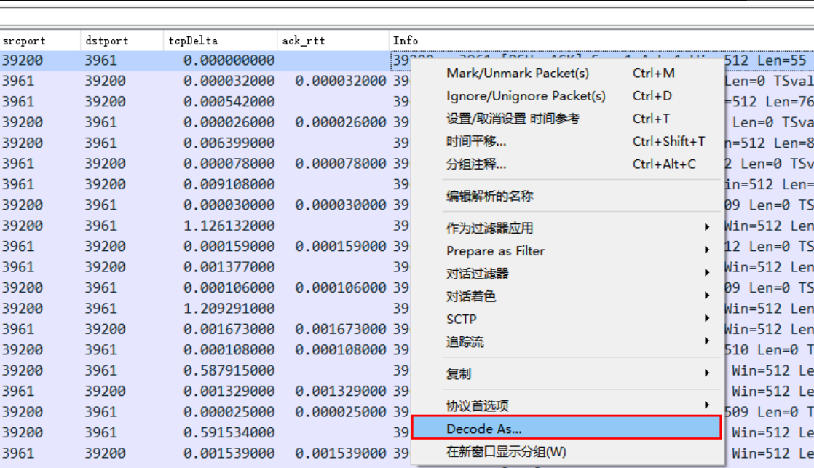

### 22. wireshark - 指定解析协议（续）

3961端口的网络包，选择使用MySQL协议解析，如下：

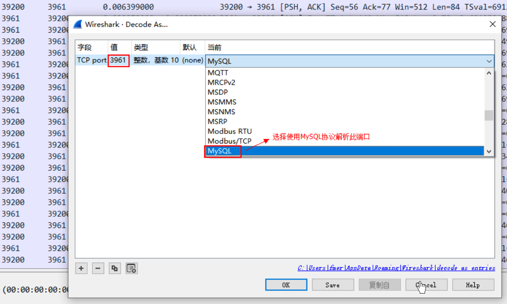

注：如果分析HTTP流量，不是使用80端口的话，就需要选择端口以及HTTP协议。

### 23. wireshark - 过滤包

选择完协议后，在显示过滤器中，就可以使用协议特定的字段来过滤数据包了。

使用mysql.query contains "id=24218"，可过滤出SQL中包含id=24218的包，如下：

使用mysql.query ~ "^select"，可正则过滤出查询类型的SQL包，如下：

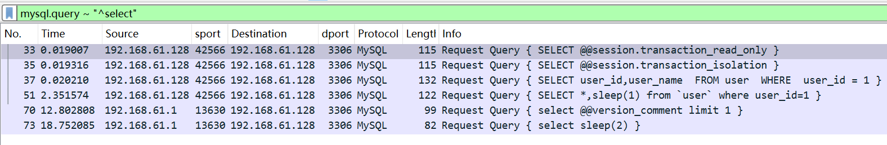

### 24. wireshark - 过滤包（续）

对于wireshark不支持解析的网络协议，我们也可以通过tcp.payload的过滤包，如下：

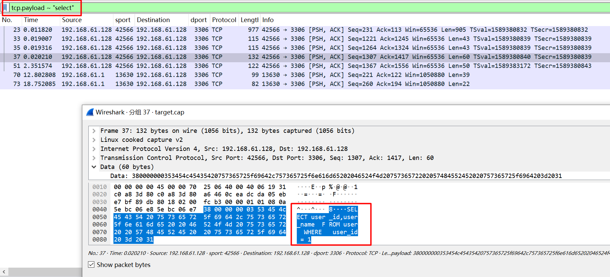

### 25. wireshark - 过滤包（续）

wireshark的显示过滤器，还支持很多其它语法，常用如下：

- tcp：过滤出tcp协议的包
- tcp.port == 80：过滤出80端口的包
- ip.addr == 192.168.61.1 and (tcp.port == 8080 or tcp.port == 3306)：过滤出ip地址是192.168.61.1，且端口是8080或3306的包。
- mysql.query contains "id=24218"：过滤出包含id=24218的SQL的包。
- tcp.payload ~ "select"：正则过滤出tcp包中包含select字符串的包。

### 26. wireshark - 查找包

wireshark除了过滤包外，还可以查找包。使用显示过滤器查找包，如下：

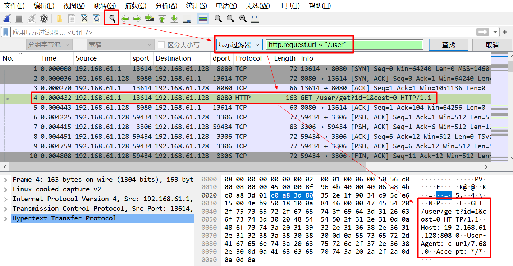

### 27. wireshark - 查找包（续）

也可以在包数据体中，使用正则表达式查找包，如下：

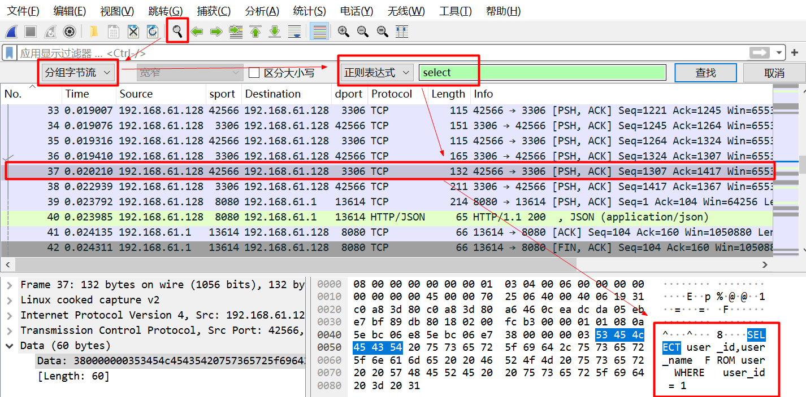

查找包与显示过滤器区别是，查找包只会定位到目标数据包，但不会过滤包列表。

### 28. wireshark - 添加列

wireshark中默认列表头，显示了IP、协议等信息，但有时为了方便分析，需要添加一些列，如下：

### 29. wireshark - 添加列（续）

分析tcp流量，经常会添加tcp.time_delta、tcp.analysis.ack_rtt这两列，如下：

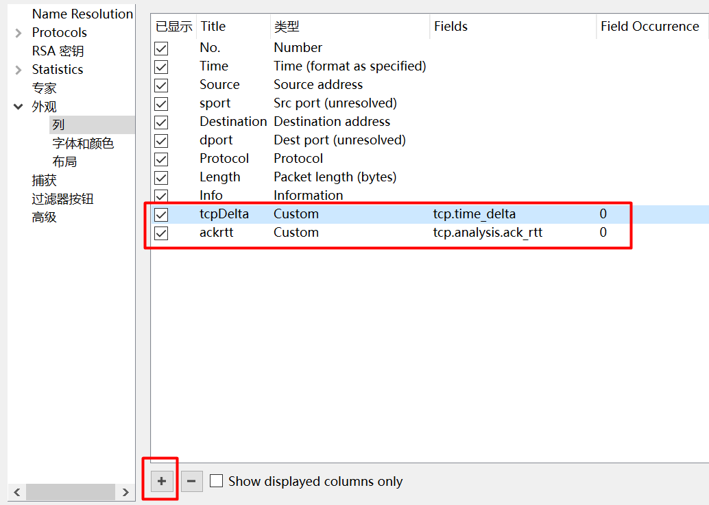

tcp.time_delta：当前包与同连接中上一个tcp包的时间间隔。
tcp.analysis.ack_rtt：ack确认包与其被确认包的时间间隔。

### 30. wireshark - 包列表排序

在表头点击列，即可按此列排序包，如下，按包大小倒序排列：

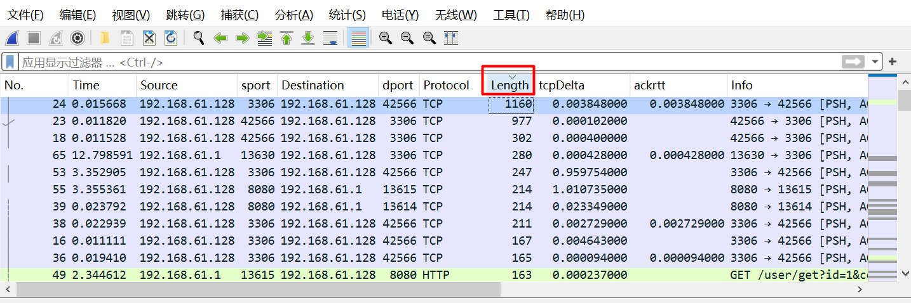

这一般用来看最大值与最小值。

### 31. 调用端慢，服务端快？

### 32. 案例：调用端慢，服务端快

有时会遇到这种情况，在全链路调用日志中发现，调用端接口时耗时很高，但服务端处理的耗时又很短，该如何分辨这个问题呢？是调用端问题、网络问题、还是服务端问题？
其实全链路调用日志，记录的耗时有盲区，如下：
- 在调用端，请求耗时慢，可能会包含等待连接池、锁、GC等的耗时，不一定是服务端处理慢。
- 在服务端，处理耗时快，可能会缺失请求已到达，但无空闲线程处理的耗时，不一定是服务端处理快。
因此，其实通过网络抓包来分析耗时，是最准确的，因为抓到请求发送的数据包，说明所有发请求的阻塞代码已执行完，请求在此刻发出去了，收包同理。

### 33. 案例：调用端慢，服务端快（续）

响应数据包由进程处理完请求后回复，而请求的ACK包由操作系统内核回复，因此：
- 若是网络慢，则回复ACK与回复响应包都会慢。
- 若是网络快处理慢，则回复ACK会很快，回复响应包会慢。

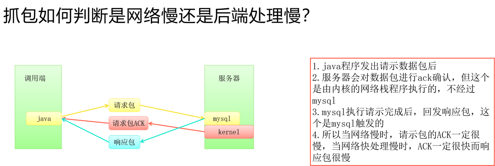

### 34. 案例：调用端慢，服务端快（续）

其中ACK回复时间，对应着tcp.analysis.ack_rtt，而响应包回复时间，对应着tcp.time_delta，因此我们在调用端抓包，然后分析如下：
- 过滤出响应包，然后按tcp.time_delta倒序排序，则排在最前面的就是响应最慢的包。

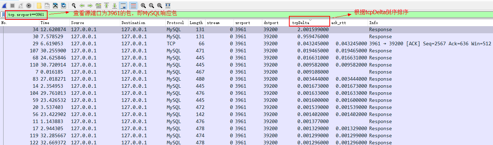

### 35. 案例：调用端慢，服务端快（续）

- 然后选中慢包，清除掉显示过滤器，再将排序恢复为No升序，如下：

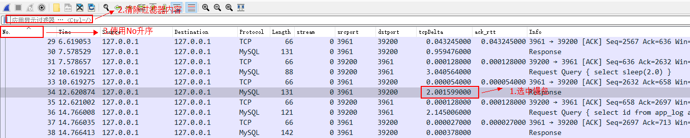

### 36. 案例：调用端慢，服务端快（续）

- 然后选中慢包，右键选择对话过滤器 -> TCP，以只看此TCP连接的数据包，如下：

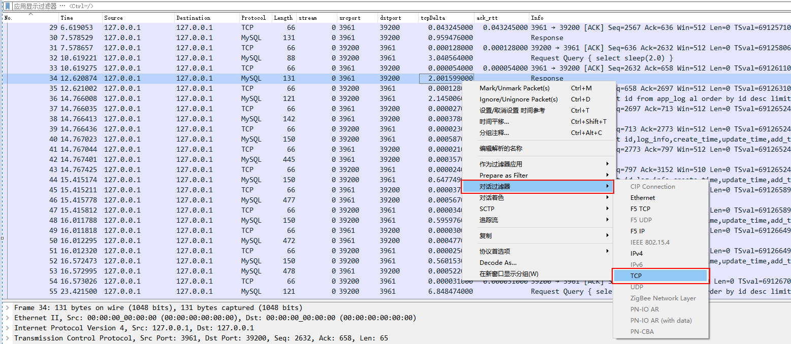

### 37. 案例：调用端慢，服务端快（续）

- 对比tcpDelta与ack_rtt的值，发现ack_rtt很小，而tcpDelta很大，而说明是服务端慢，而不是网络慢！

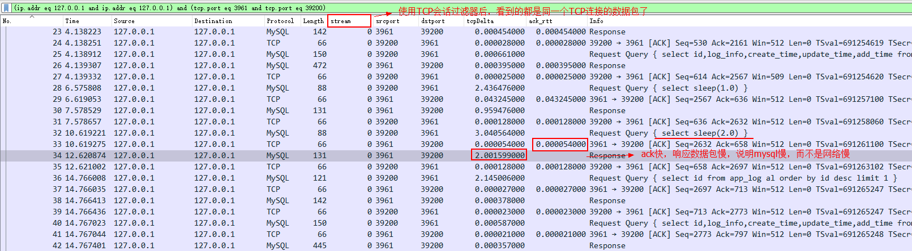

而如果ack_rtt与tcpDelta都很小，则说明是调用端慢！

### 38. 流量统计分析

### 39. 流量统计分析（续）

wireshark也可以对网络包做一些统计分析，它预设了一些统计图表，如按会话、端点、分组长度等统计，不过最常用的是I/O图表，它可以做一些自定义的统计分析，如下：

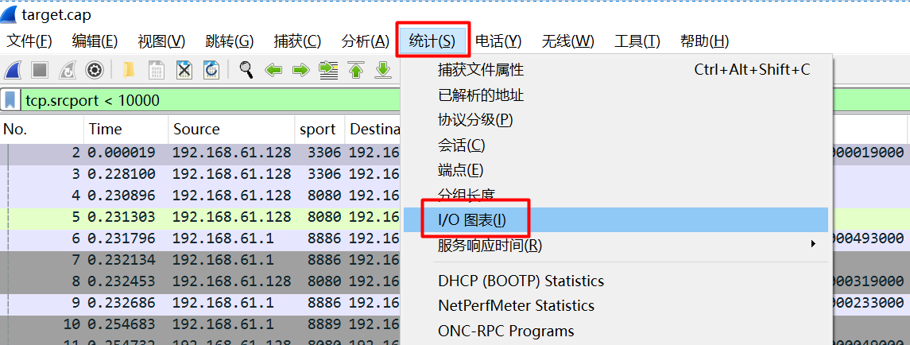

### 40. IO图表：统计每秒tcp收发包数量

如下，新建了一个图表，名称为QPS，显示过滤器为tcp，Y轴(Y Axis)为Packets(包数量)，如下：

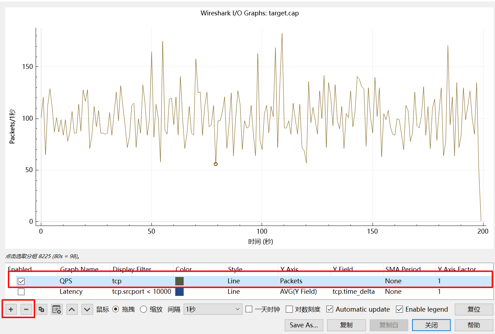

### 41. IO图表：统计平均响应时间

如下，新建了一个图表，名称为Latency，显示过滤器为tcp.srcport < 10000，这表示响应包，Y轴(Y Axis)为AVG(Y Field)，Y Field为tcp.time_delta，这表示响应包平均耗时，如下：

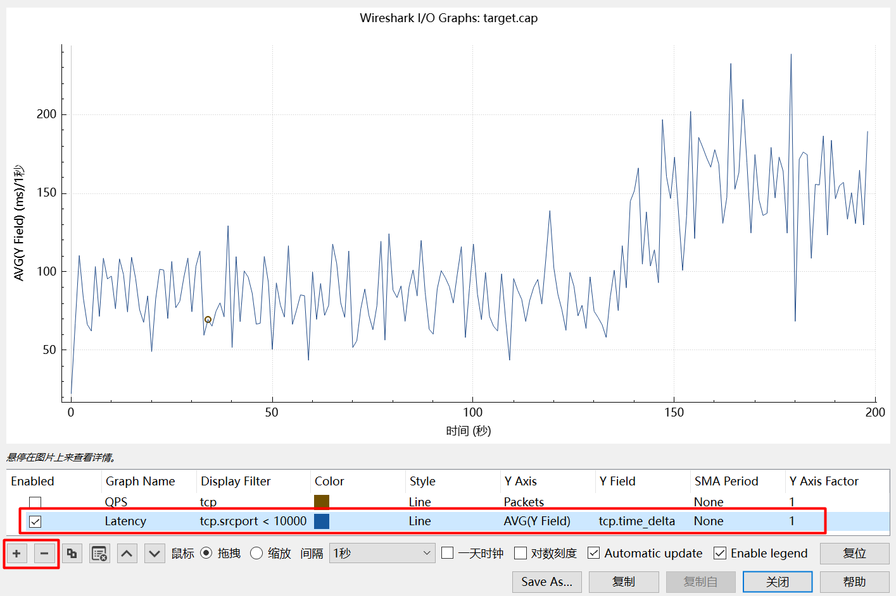

### 42. 其它抓包命令

### 43. 文本抓包命令 - ngrep

ngrep是一个文本化的抓包命令，常用于包中有字符串的场景，如HTTP、MySQL等，如下：

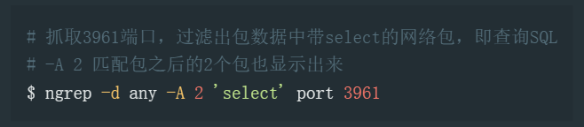

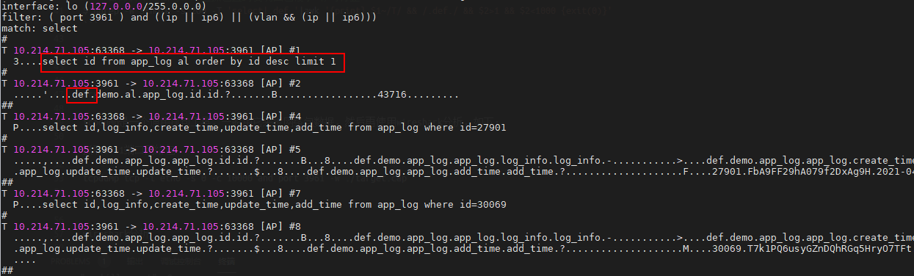

ngrep常用于确认请求数据的正确性，比如当代码中SQL查不到数据时，可用此确认发送给MySQL的最终SQL是否一致，避免系统中有未知的SQL改写代码，ngrep不可用时，可使用tcpdump -A代替。

### 44. 文本抓包命令 - tshark

tshark是wireshark的命令行版本，常见用法如下：

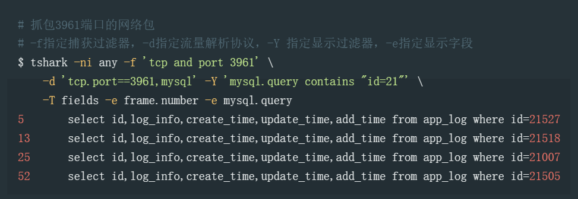

tcpdump+wireshark是离线分析场景，tshark一般用于一些需要实时分析的场景。

### 45. 总结

### 46. 以及测试网络耗时

- ping、mtr、hping3、curl可以用于检测各层网络连通性，以及测试网络耗时。
- 基于netstat配合文本命令可统计网络socket分布情况，ifconfig、netstat则可以查看网络丢包情况，bcc的stackcount可用于定位内核丢包调用栈。
- tcpdump可用于抓包，wireshark用于分析流量，借助tcp.analysis.ack_rtt与tcp.time_delta可用于判断是网络慢、调用端慢、还是服务端慢。
- wireshark也可对流量做统计分析，比如包吞吐量、响应时间等。
- 其它抓包命令，如ngrep常用于文本抓包，tshark是wireshark的命令行版本等等。

## 20. Java高效debug排错技巧

### 01. java高效debug排错技巧

### 02. 调试思路

关键词：调入请求、tomcat、spring mvc、业务代码、mybatis、httpclient、jdbc、socket、调出请求、SQL
之前讲的更多是线上故障的定位技巧，但程序员有时也会在本机遇到一些问题，需要调试排查，一般有两种调试思路，如下：
- 自上而下调试代码，适合比较熟悉的代码，一步步调试代码，找到bug原因。
- 自底向上调试代码，适合不太熟悉的代码（如框架代码），常用于熟悉框架代码主体逻辑，以找到调试入口。

### 03. 自上而下调试

### 04. 自上而下调试（续）

以IDEA调试为例，在启动程序时，需要以调试模式启动程序，如下：

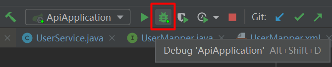

然后在需要调试的代码区左侧，单击鼠标左键添加断点，如下：

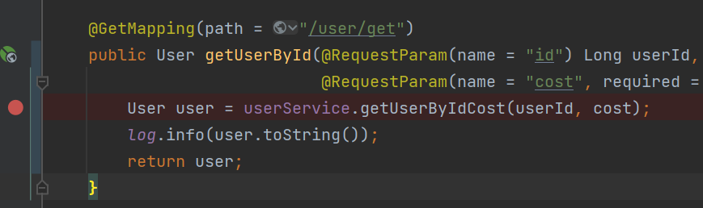

### 05. 自上而下调试（续）

在断点上，单击右键，可以为断点设置条件，通常称为条件断点。
如下，只有当userId==1时才命中断点：

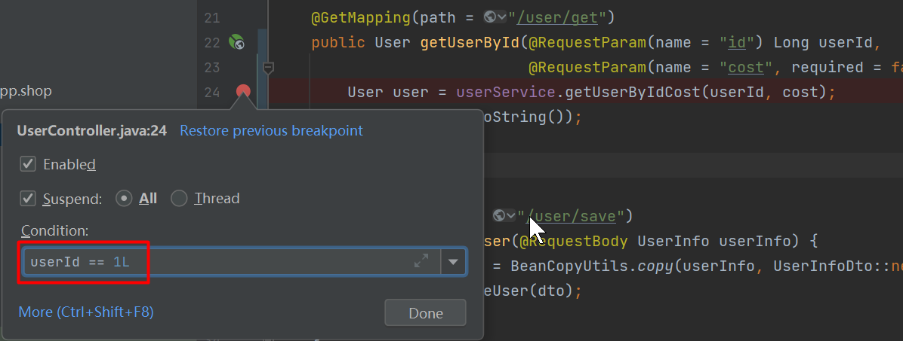

### 06. 自上而下调试（续）

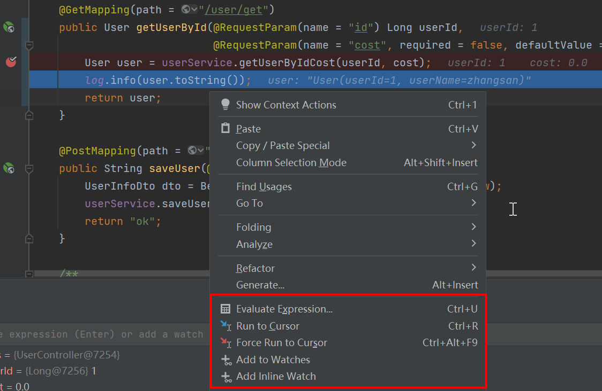

执行表达式
运行到光标
监视变量
断点命中后，鼠标右键菜单也会出现几个简单的调试选项，这在后面的Debug视图中也有，如下：

### 07. 自上而下调试（续）

单步调试、调试入函数、调试出函数、调试到光标

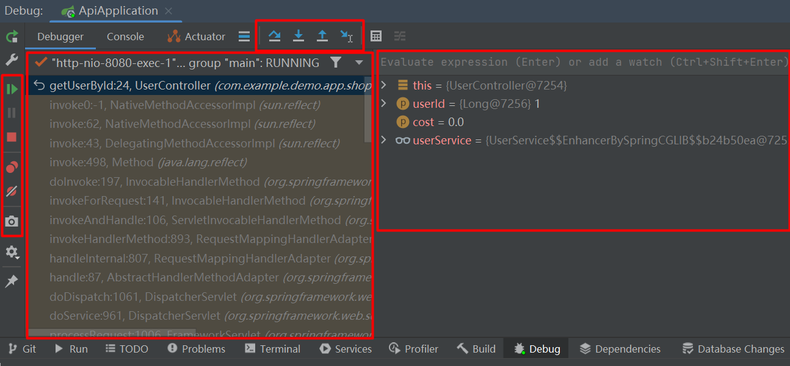

关键词：继续运行、查看变量、停止运行、查看断点与断点失效、查看线程栈、调用栈
然后，在IDEA下方的Debug视图中，可以看到如下调试界面，主要用来控制调试行为，查看变量与调用栈等。

### 08. 自上而下调试（续）

一定要牢记这几个按钮的快捷键，不同设置下快捷键不同，调试代码时，使用快捷键比鼠标点击这些按钮，要高效得多！

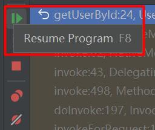

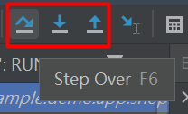

我这使用的Eclipse的快捷键，分别是
单步调试(F6)：控制调试进程，向后运行一行代码。
调试入函数(F5)：控制调试进程，进入当前函数内部。
调试出函数(F7)：控制调试进程，运行完当前函数后退出到上一层。
继续运行(F8)：控制调试进程，继续运行，直到下一次断点命中。

### 09. 自上而下调试（续）

在Debug视图的调用栈上右键，可以有如下菜单：

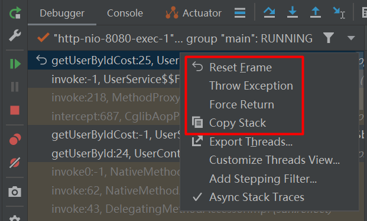

Reset Frame：用于调试回退，回退到上一个函数进入处，常用于回退后重新调试代码。
Throw Exception：抛异常，常用于中止当前调试。
Force Return：强制返回，常用于调试的某函数，期望它返回一个特定值。

### 10. 自上而下调试（续）

在变量区，除了可以查看变量外，还可以右键修改变量的值。

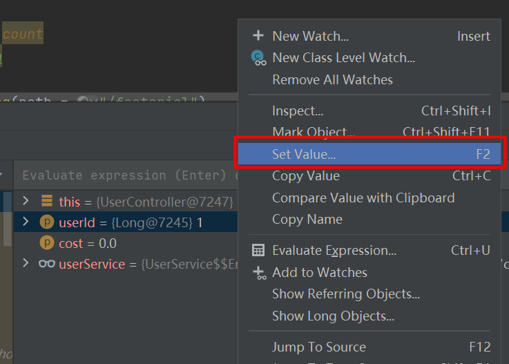

### 11. 自上而下调试（续）

有时，需要在程序抛出某种异常时命中断点，这时可以设置异常断点。
如下，设置了一个SQLException的异常断点，当SQL执行异常时，断点就会命中：

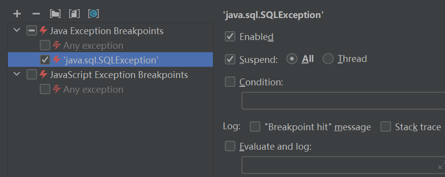

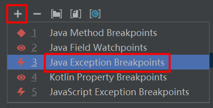

### 12. 自上而下调试（续）

这些调试过程，大家一定要都实践一下才能理解，另外，这里演示的是IDEA，如果你用的其它开发工具，如vscode、eclipse等，它们也是有类似功能的，思路基本是一致的。
这种调试过程，我称为自上而下的调试，适合调试比较熟悉的代码，如业务代码，然后一步一步的调试，以找到问题关键。
但如果是我们不太熟悉的代码，常常会不知从哪里开始调试，这就需要自底向上的调试方法，以找到一个合适的调试起点。

### 13. 自底向上调试

### 14. 自底向上调试（续）

关键词：调入请求、tomcat、spring mvc、业务代码、mybatis、httpclient、jdbc、socket、调出请求、SQL
自底向上调试，一般思路是在代码栈底层打条件断点，待断点命中后，从调用栈逐层往上看，直到找到合适的调试入口后，再使用向上而下调试法。
这种方法，一般适用于不熟悉的代码，比如框架代码。

### 15. 自底向上调试（续）

获取连接
DataSource.getConnection()

发送SQL模板
Connection.prepareStatement()

执行SQL
PreparedStatement.execute()

获取结果
Statement.getResultSet()

遍历结果
ResultSet.next()

比如，在Java中，所有的SQL执行，都需要经过JDBC那一层，下面是JDBC核心流程，以及会涉及到的核心方法。

比如在Connection.prepareStatement打断点，看看从收到请求后，到执行SQL，会经过了哪些关键代码。

### 16. 自底向上调试（续）

mysql驱动处理代码
mybatis处理代码
druid连接池处理代码
如下，断点命中后的调用栈，从包名中可以看到mysql、druid、mybatis的处理代码！

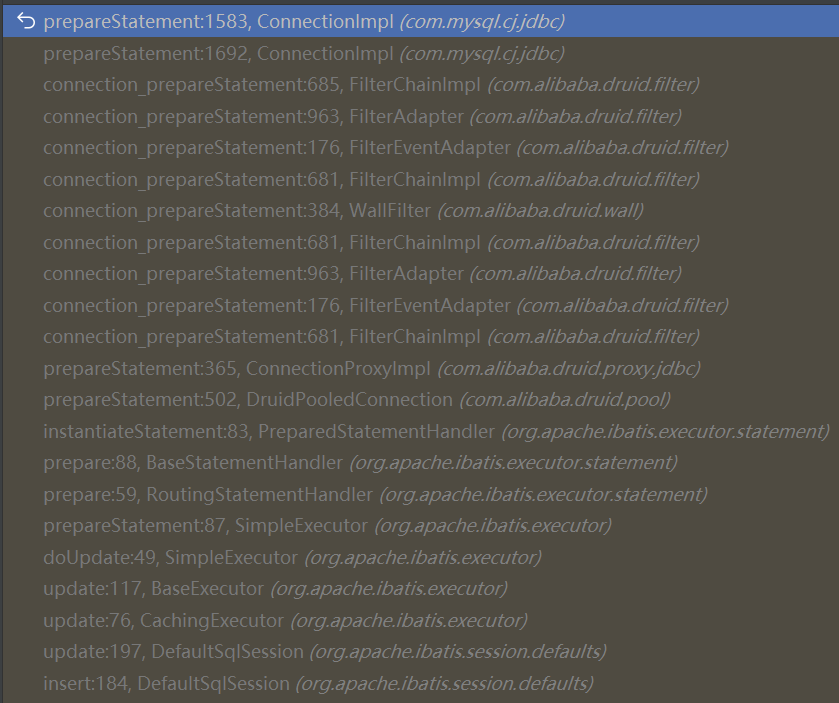

### 17. 自底向上调试（续）

service层处理代码
spring事务处理代码
controller层处理代码
继续往调用栈上层看，可以发现service层、spring事务、controller层相关处理代码！

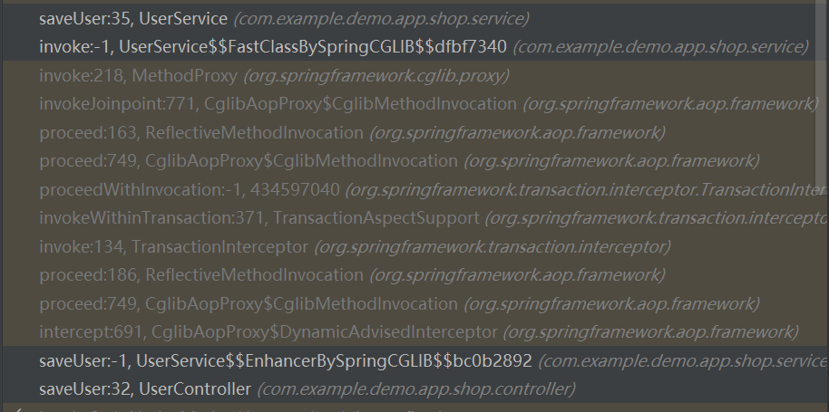

### 18. 自底向上调试（续）

spring mvc处理代码
继续往调用栈上层看，可以发现spring mvc相关处理代码！

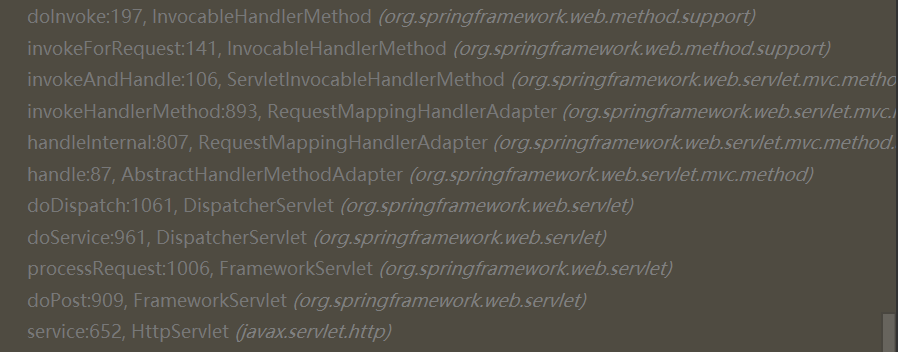

### 19. 自底向上调试（续）

tomcat处理代码
继续往调用栈上层看，可以发现tomcat相关处理代码！

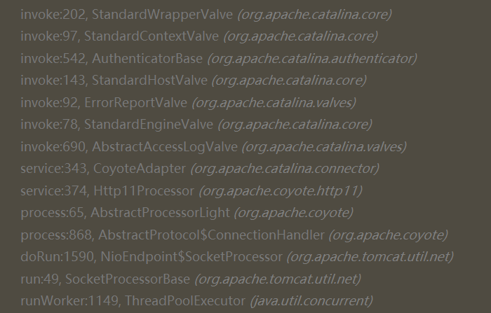

### 20. 自底向上调试（续）

关键词：调入请求、tomcat、spring mvc、业务代码、mybatis、httpclient、jdbc、socket、调出请求、SQL
可以发现，在jdbc层打断点，就可以看到从tomcat -> spring mvc -> 业务代码 -> mybatis -> druid连接池 -> mysql驱动的所有关键处理逻辑。
比如孟小哥之前遇到的一个bug案例：
SQL查不到数据，但拿到数据库中查询，是有数据的！
当时在抓包确认发送给数据库的SQL没有问题后，怀疑是mybatis的问题，但mybatis框架代码大而杂，不知道从哪个入口开始调试。

### 21. 案例：mybatis查不到数据

由于是查不到数据，而JDBC的ResultSet.next()方法就是遍历数据的核心方法，于是在此方法打断点，看看断点命中后，mybatis层是在哪个函数处理查询结果的。

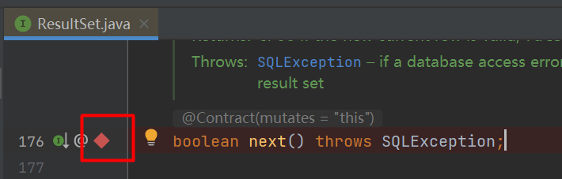

断点命中后，很容易就知道了，mybatis在handleRowValuesForSimpleResultMap中处理查询结果。

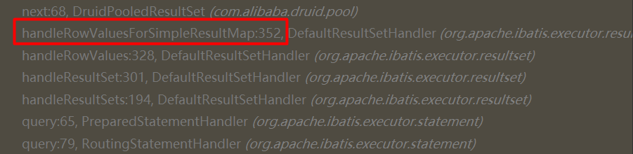

### 22. 案例：mybatis查不到数据（续）

然后很明显，下面的getRowValue就是mybatis读结果数据的函数，于是再选择在这个入口打断点，使用自上而下的调试法。

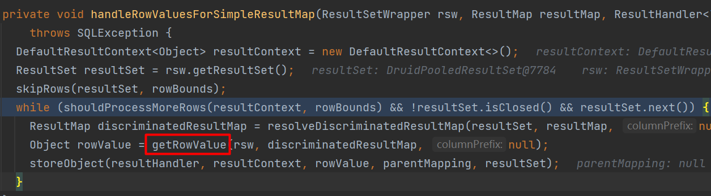

### 23. 案例：mybatis查不到数据（续）

然后一步步调试，经过applyAutomaticMappings -> createAutomaticMappings -> MetaObject.findProperty方法后，就发现根据user_id字段，在User对象中找不到相应属性。

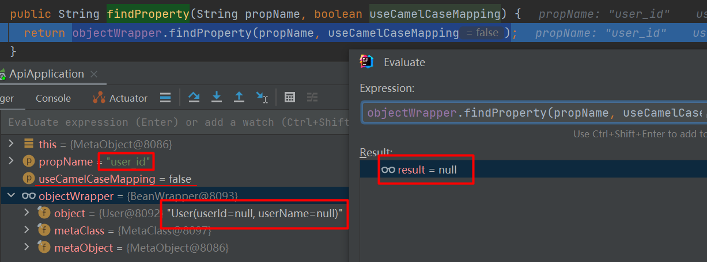

然后发现参数useCamelCaseMapping=false，表示未开启下划线与驼峰字段的匹配。

### 24. 案例：mybatis查不到数据（续）

网上稍微搜索一下，就会发现是mybatis配置中，缺少下划线转驼峰的配置，导致mybatis查不到数据！

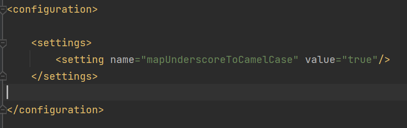

可以发现，这个问题调试过程中，”自底向上”与”自上而下”这两种调试思路都用到了，其中：
- ”自底向上”调试用于在不熟悉的mybatis中快速找到调试入口，
- ”自上而下”调试则从调试入口继续调试过程，直到找到根因。

## 21. 故障定位能力提升心得

### 01. 故障定位能力提升心得

### 02. 故障定位能力提升心得（续）

学习
复盘
实践
学习：不断补充新的知识与原理，完善计算机基础知识与结构。
实践：在各种实际场景中，实践所学的知识点，检验知识是否有遗漏，以及理解是否正确。
复盘：复盘每一次实践的效果，反思哪里了解有缺失或理解不够，并进入下一轮学习中完善。

### 03. 故障定位能力提升 - 学习

- 主动了解常见Linux命令的选项及用法
比如孟小哥之前大概有3个月时间，每天都会主动去探索一个Linux命令，以了解各个命令的主要用法与能力特点。
- 了解命令本身的运行原理
Linux中许多命令的实现，本身就可以学到大量的知识，比如了解strace命令，就会了解到系统调用与ptrace相关知识，深究exec命令，就会了解到execve系统调用。
- 知识梳理与结构化
分治法是人类解复杂问题的算法框架，而结构化是人类记忆理解复杂事物的数据结构，人类社会到处都有结构化的应用，如一个国家，会通过结构化为省市区的行政单位来管理，而人类知识又会结构化为数理化等各种学科来方便学习理解。大家可以尝试一下对命令进行结构化。

### 04. 故障定位能力提升 - 实践

- 不仅要学命令，还要在实践中检验
计算机知识多而杂，如果只是学习而不实践，很快就会忘掉，因此需要在具体场景中实践，避免真正到用时，发现与想的不一样，比如连命令都安装不上。
- 不要只学理论知识，还要能观测程序是否按理论运行
操作系统、JVM、数据库等，不要只学习相关的理论知识，还需要能观测它们的运行情况，比如按QPS预测，理论上连接池足够，但如果不能观测活跃线程数，那就没有事实依据。
- 用实验来补充实践
有些时候，工作中遇不到那么多样的场景去实践，比如各种内存泄露，这种情况下，我们可以自己构造一些case然后去排查实践，以检验所学是否符合预期。

### 05. 故障定位能力提升 - 复盘

- 反思排查过程，哪里有运气成分
如果你经常看网上一些故障定位的文章，会发现不少文章，中间突然有一步，要么是硬看代码、要么是猜测，然后找到问题根因，这种排查过程其实有不少运气成分，而我希望问题是通过多年理论基础的积累和对诊断工具的熟练使用，而有章法的一步步查出来的。
- 如果没有运气，有没有更好的排查方法
比如我之前排查一次OOM问题，分析堆转储hprof文件，没有找到触发OOM的代码，然后偶然看到一些慢接口日志，找到了问题代码，但经过反思，我发现这是有运气成分的，因为OOM时所有接口都会变慢。
为避免下次没这么好运气时，我开始思考有没有更好的排查方法，然后我发现在hprof文件中，是有线程堆栈的，只是之前对MAT掌握不全面而已。

### 06. 故障定位能力提升 - 小结

关键词：学习、实践、复盘、知识、智慧、技能
经过学习、实践、复盘后，知识会如下转化：
- 首先通过学习获取知识，或者说信息，它们未经检验，可能是零散、不完善、理解有错误的。
- 然后通过实践后，将知识转变为技能，也即有用的知识。
- 最后通过复盘，使得技能不断迭代完善，融汇贯通，从而形成前人所说的“智慧”。

## 22. 案例与实验

### 01. 案例与实验

### 02. CPU使用率实验

### 03. CPU使用率实验（续）

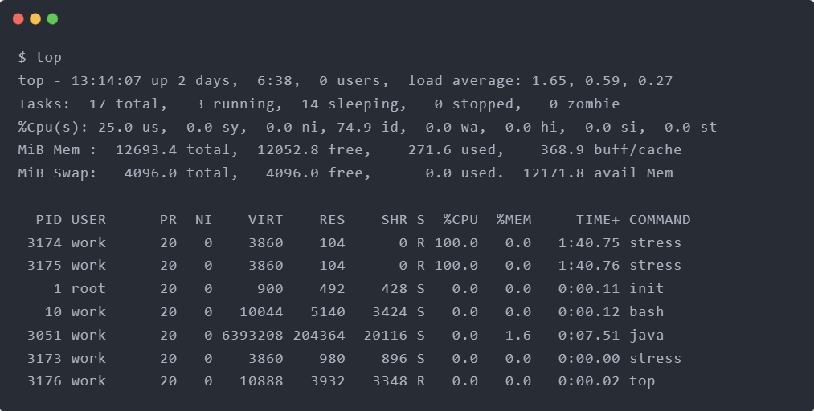

通过所学知识，让各种CPU使用率升高，检验对这些指标的理解是否正确！

### 04. CPU使用率实验 - us

us为用户态CPU使用率，可以使用stress命令的-c选项来对CPU做压测，它开启一个stress进程，运行一个死循环以使得CPU满载。

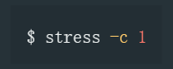

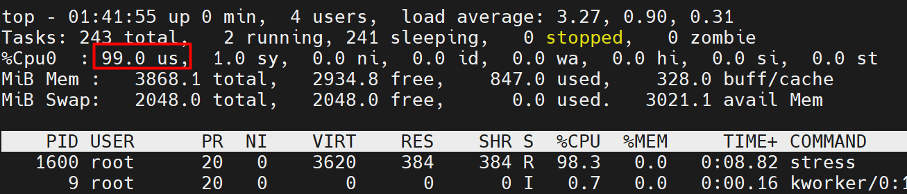

### 05. CPU使用率实验 - ni

ni为调整过nice优先级进程的用户态CPU使用率，可以使用renice命令调整刚启动stress进程的nice值，以使得ni使用率高。

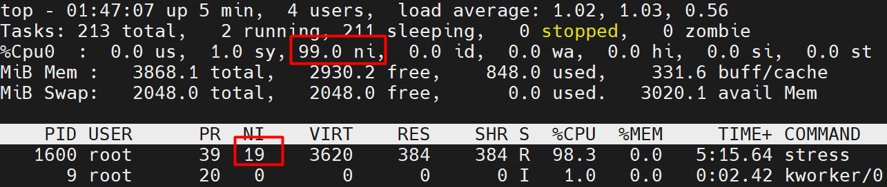

### 06. CPU使用率实验 - sy

sy为内核态CPU使用率，主要由系统调用、缺页异常、内核线程等活动组成，通过stress的-m选项，可实现不断申请内存，并读写内存造成大量缺页中断，从而使得sy使用率高。

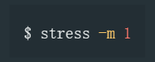

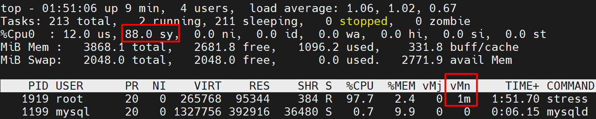

### 07. CPU使用率实验 - wa

wa为存在磁盘等待线程时的空闲CPU使用率，通过dd命令来读磁盘，及使用directIO模式不过缓存直接读磁盘，从而使得wa使用率高。

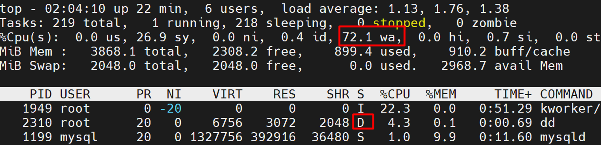

### 08. CPU使用率实验 - si

si为软中断占用的CPU使用率，从另一台机器上，通过hping3命令来疯狂发网络包，从而使得si使用率高。

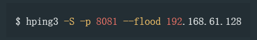

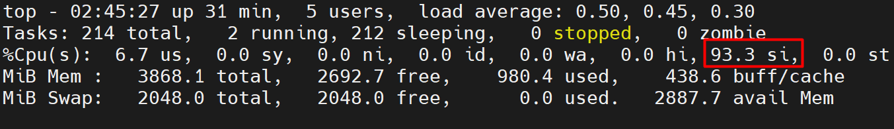

### 09. 内存回收实验

### 10. 内存回收实验（续）

Linux在空闲内存不足时，会运行kswapd进行内存回收，回收文件缓存或swap内存，本次实验将vm.swappiness设置为1，这表示当内存不足时，尽量先回收文件缓存，然后才使用swap回收内存。

首先，生成一个4G大文件，然后用cat读取它，使得其被缓存到内存中。
如下，4G的大文件有3G被缓存，buff/cache合计占用3.4G，swap使用268K：

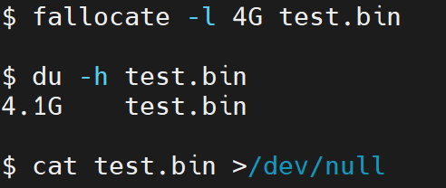

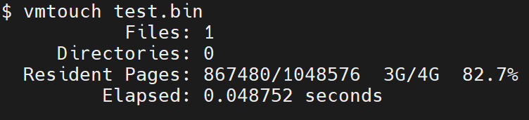

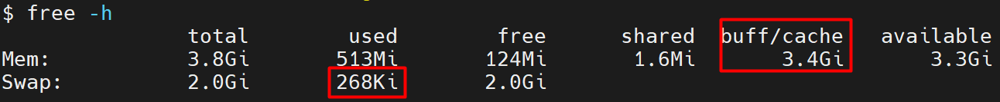

### 11. 内存回收实验（续）

然后使用stress -m分配3G内存，如下：

再次用free查看内存，发现buff/cache从3.4G变成了389M，说明分配3G内存时，触发了Linux内存回收，导致文件缓存被回收了，也使用了10M的swap。

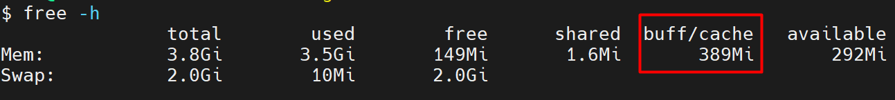

### 12. 内存回收实验（续）

文件缓存基本被回收完后，再使用stress -m分配2G内存，如下：

再次用free查看内存，发现此次回收大量使用了swap，swap用量从10M变成1.8G，之前3G的stress进程，被swap了1.7G内存出去。

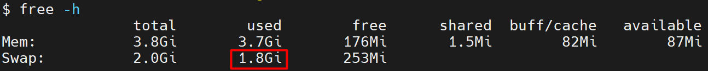

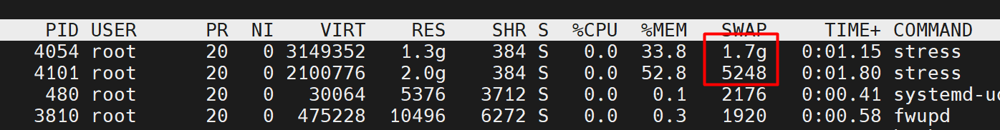

### 13. 内存回收实验（续）

swap空间也大量被占用后，再使用stress -m分配2G内存，如下：

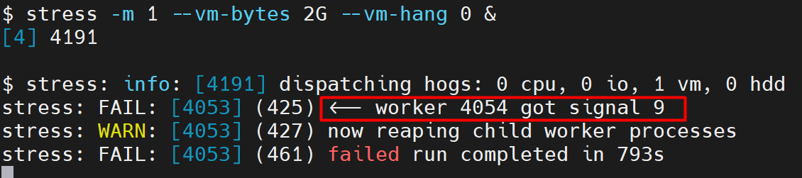

发现最开始分配的3G stress进程被kill了，通过dmesg -T | grep -i kill发现，由于内存不足，调用了oom-killer，导致最开始分配的3G stress进程被kill。

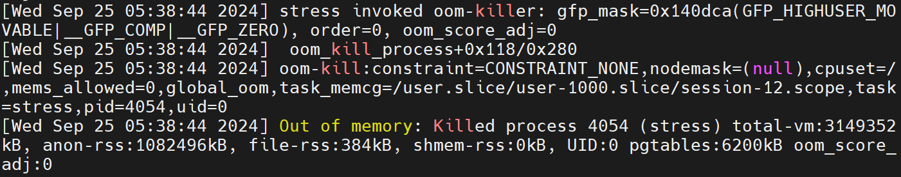

### 14. 内存回收实验（续）

内存回收过程符合预期，当vm.swappiness=1时，当内存回收时，先回收文件缓存，然后再使用swap，当swap也不够后，调用oom-killer释放内存！

关键词：回收、文件缓存、使用swap、调用、oom-killer
