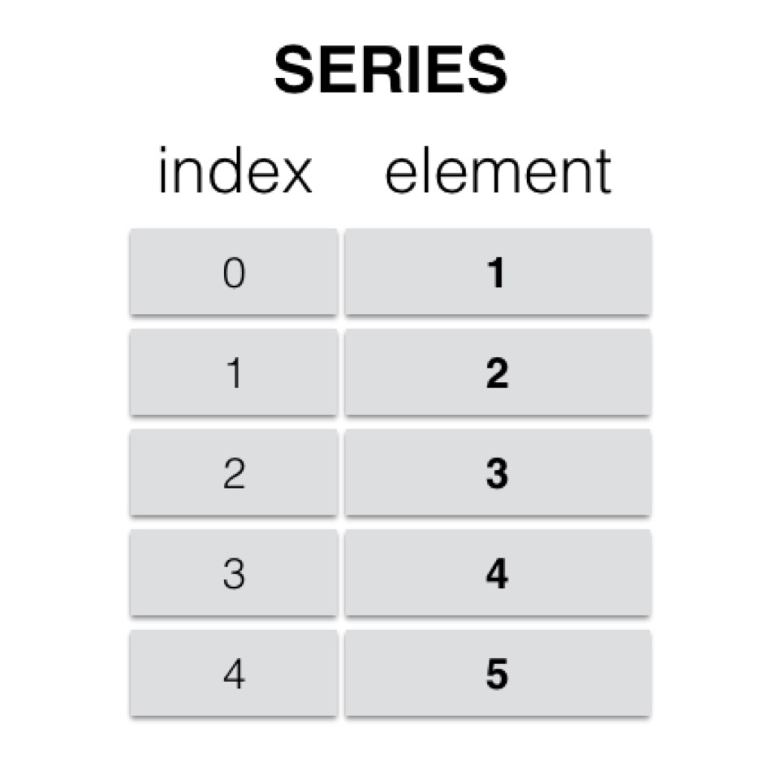
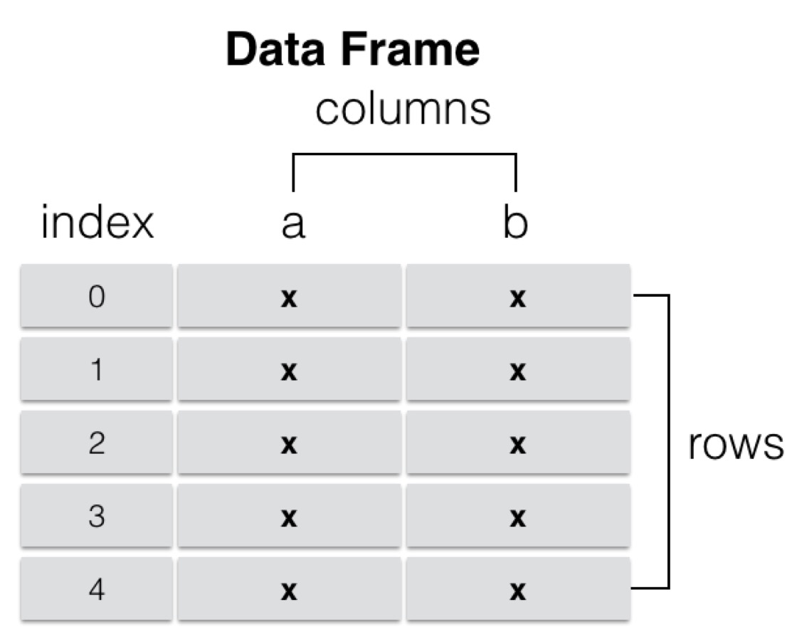

# 第2节　pandas数据结构

<!-- 来源：http://www.zlkt.net/book/detail/11/373 -->

> 出自《Python数据分析到项目实战》第3章 Pandas库

---

## Pandas常用数据结构

### 一、Series类型

在Pandas中，有两个基本的数据类型，使得在处理数据的时候变得非常高效，分别是Series和DataFrame，其中DataFrame是由多个Series组成的，因此要先学好Series，才能对DataFrame的使用更加得心应手。

Series是一种类似于列表的对象，由一列数据以及一列与之对应的索引组成。如下图所示。


#### 1. 创建Series对象：

在实际开发中，可能需要经常创建Series对象，而创建Series对象有多重方式，下面进行讲解。

##### 1.1. 通过列表或ndarray数组创建：

```python
import pandas as pd

persons = ['张三','李四','王五']
series = pd.Series(persons)

print(series)
print(type(series))
```

上述代码可以看到输出以上代码输出为：

```
0    张三
1    李四
2    王五
dtype: object

<class 'pandas.core.series.Series'>
```

##### 1.2. 通过字典创建：

```python
persons = {"张三":18, "李四": 25, "王五": 19}
series = pd.Series(persons)

print(series)
print(type(series))
```

上述代码的输出结果为：

```
张三    18
李四    25
王五    19
dtype: int64

<class 'pandas.core.series.Series'>
```

#### 2. Series对象相关操作：

##### 2.1. 获取数据和索引：

通过`series.index`和`series.values`能分别获取到`Series`对象的索引和值。示例代码如下：

```python
persons = ['张三','李四','王五']
series = pd.Series(persons)

print(series.index)
print(series.values)
```

输出结果为：

```
RangeIndex(start=0, stop=3, step=1)
['张三' '李四' '王五']
```

##### 2.2. 通过索引获取对应的值：

我们经常会通过索引来获取对应的值，语法为：`series[索引]`。示例代码如下：

```python
persons = ['张三','李四','王五']
series = pd.Series(persons)

print(series[0])
```

输出结果为：`'张三'`。

### 二、DataFrame对象：

`DataFrame`由多行多列组成，是一个表格型的数据结构。可以认为一个DataFrame是由多个Series对象组成，这些Series共用同一个行索引，每个Series的数据类型可以不同。结构图如下。


#### 1. 创建DataFrame对象：

##### 1.1. 通过ndarray创建DataFrame对象：

二维数组天然具有行和列的概念，因此可以非常方便的使用二维数组创建DataFrame对象。示例代码如下：

```python
import numpy as np

# 通过ndarray创建DataFrame
array = np.random.randn(5,4)
print(array)

df_obj = pd.DataFrame(array)
print(df_obj.head())
```

运行结果如下：

```
[[ 1.70457214  0.53100369  0.37360947  0.93320688]
 [-0.56648031 -0.32116357 -0.3837961  -1.80175888]
 [ 2.12109864  0.83919019 -0.43187152  0.80611653]
 [-0.66275038  0.90984602  0.11596098  0.41519099]
 [-1.62119184  2.40474293  0.96915745 -0.28995527]]
          0         1         2         3
0  1.704572  0.531004  0.373609  0.933207
1 -0.566480 -0.321164 -0.383796 -1.801759
2  2.121099  0.839190 -0.431872  0.806117
3 -0.662750  0.909846  0.115961  0.415191
4 -1.621192  2.404743  0.969157 -0.289955
```

同理，用二维列表，也同样可以达到效果。可以在创建`DataFrame`的时候，指定行索引和列索引。示例代码如下：

```python
df = pd.DataFrame(array, index=[1,2,3,4,5], columns=['星期一','星期二','星期三','星期四']
```

输出结果如下：

```
     星期一     星期二     星期三    星期四
1  1.704572  0.531004  0.373609  0.933207
2 -0.566480 -0.321164 -0.383796 -1.801759
3  2.121099  0.839190 -0.431872  0.806117
4 -0.662750  0.909846  0.115961  0.415191
5 -1.621192  2.404743  0.969157 -0.289955
```

##### 1.2. 通过字典创建DataFrame：

```python
persons = [{"username":"张三","age": 18, "height": 180},{"username":"李四","age": 20, "height": 170}]
df = pd.DataFrame(persons)
print(df)
```

运行结果如下：

```
    username	age	height
0	张三	18	180
1	李四	20	170
```

上述是把多个字典存放到列表中，也可以直接使用字典创建，示例代码如下：

```python
persons = {"username":["张三","李四"],"age": [18, 20], "height": [180, 170]}
df = pd.DataFrame(persons)
print(df)
```

#### 2. DataFrame基本操作：

##### 2.1. 获取列的数据：

通过`df.列名`或者`df['列名']`都可以获取到该列的所有数据。示例代码如下：

```python
# 1. df.列名
print(df.username）
# 2. df['列名']
print(df['username'])
```

以上获取到的数据类型，实际上就是一个Series对象。

##### 2.2. 获取行的数据：

行的数据是通过索引来获取，在`DataFrame`中索引操作功能非常强大，这里我们讲解一个简单的示例。关于索引更多操作读者请参考下一节。

```python
# 获取下标为0的索引的那一行的值
print(df.iloc[0])
```

输出结果如下：

```
username     张三
age          18
height      180
Name: 0, dtype: object
```

##### 2.3. 增加列的数据：

可以通过类似字典操作的方式，给`DataFrame`添加新的列。示例代码如下：

```python
# 添加weight列
df['weight'] = [80, 60]
print(df)
```

输出结果如下：

```
	username    age    height	weight
0	张三	18	180	80
1	李四	20	170	60
```

##### 2.4. 删除列：

通过`del`关键字即可删除某一列的数据。示例代码如下：

```python
del df['weight']
print(df)
```

输出结果如下：

```
    username	age	height
0	张三	18	180
1	李四	20	170
```

#### 3. 查看数据：

##### 3.1. head

如果`DataFrame`数据行数特别多，我们只想看前面部分的数据，那么可以使用`df.head`来查看。示例代码如下：

```python
# 默认查看前面5条数据
df.head()

# 查看前面10条数据
df.head(10)
```

##### 3.2. tail：

与`head`相反，`tail`是用于查看`DataFrame`末尾的数据，默认是5条。示例代码如下：

```python
# 默认查看末尾5调数据
df.tail()

# 查看末尾10条数据
df.tail(10)
```

##### 3.3. describe：

查看`DataFrame`的描述。会把所有数字类型的列进行运算，比如获取总的个数，平均值，中位数等。

```python
import pandas as pd
persons = [{"username":"张三","age": 18, "height": 180},{"username":"李四","age": 20, "height": 170}]
df = pd.DataFrame(persons)
df.describe()
```

输出结果为：

```
        age	        height
count	2.000000	2.000000
mean	19.000000	175.000000
std	1.414214	7.071068
min	18.000000	170.000000
25%	18.500000	172.500000
50%	19.000000	175.000000
75%	19.500000	177.500000
max	20.000000	180.000000
```

##### 3.4. shape：

查看当前`DataFrame`的形状。示例代码如下：

```python
df.shape
```

##### 3.5. index和columns：

`df.index`用于查看当前的行索引。`df.columns`用于查看当前的列索引。示例代码如下：

```python
# 查看行索引
print(df.index)
# 查看列索引
print(df.columns)
```

##### 3.6. T：

`df.T`用于转置数组，可以将行变为列，列变为行。示例代码如下：

```python
print(df.T)
```

##### 3.7. info：

查看数据相关信息，比如列数、每列的类型等。

##### 3.8. dtypes：

查看`DataFrame`的所有列的数据类型。
